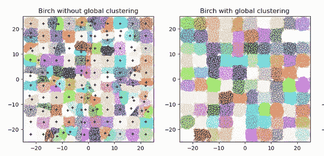
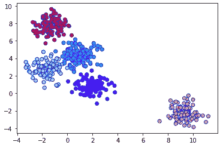

# 用 Python 对异常值进行 BIRCH 聚类的完整解释

> 原文：<https://pub.towardsai.net/fully-explained-birch-clustering-for-outliers-with-python-2ad6243f126b?source=collection_archive---------0----------------------->

## [机器学习](https://towardsai.net/p/category/machine-learning)

## 聚类中的无监督学习为数据建立树



一张来自 [Sklearn](https://scikit-learn.org/stable/modules/clustering.html#birch) 的照片

该系列的另一篇文章全面解释了机器学习算法，即无监督学习中的 BIRCH 聚类。

## 介绍

该算法用于执行基于树的层次聚类。这些树被称为 CFT，即聚类特征树。桦树的完整形式是用 **H** 层次平衡 **B** 平衡 **I** 平衡 **R** 导出 **C** 光泽。BIRCH 集群的使用情形如下:

*   大型数据集
*   离群点检测
*   数据简化。

在这个群集中用于测量距离的度量是欧几里得距离测量。

## 优势

有几点 BIRCH 在聚类算法中非常有用，如下所示:

*   处理数据集中的噪声非常有用。
*   发现聚类和子聚类的良好质量是有用的。
*   需要较少的数据集扫描过程以降低 I/O 成本，这是存储器有效的。
*   它远远优于 DBSCAN 聚类算法。

## 不足之处

每种算法都有优点，但也有缺点，需要研究人员进一步研究，如下所示:

*   用 SS 值进行距离计算的数值问题会得到较差的精度。

[](/fully-explained-svm-classification-with-python-eda124997bcd) [## 用 Python 全面解释了 SVM 分类

### 如何用一个真实的例子解决分类问题。

pub.towardsai.net](/fully-explained-svm-classification-with-python-eda124997bcd) [](/step-by-step-basic-understanding-of-neural-networks-with-keras-in-python-94f4afd026e5) [## 使用 Python 中的 Keras 逐步基本了解神经网络

### 具有定义的神经网络的学习

pub.towardsai.net](/step-by-step-basic-understanding-of-neural-networks-with-keras-in-python-94f4afd026e5) 

## 什么是 MiniBatchKMeans？

当我们得到一个大规模数据集，而 BIRCH 由于使用整个数据集的内存限制而无法满足要求时，我们应该考虑从数据集中提取固定大小的小批量数据，以减少运行时间。

通过在每一次迭代中获得学习率来降低计算成本，但是它也影响聚类质量。

## 桦树聚类的步骤

BIRCH 算法由下面讨论的 4 个主要步骤组成:

*   **第一步:**从输入数据建立 CF 树，CF 由三个值组成。第一个是输入(N)，第二个是线性和(LS)，第三个是数据的平方和(SS)。
*   **第二步:**为了重建更小的 CF 树，它在初始 CF 树中搜索叶条目。在此过程中，它将离群值和子聚类组移至主聚类。
*   **第三步:**在这一步中，用户可以用一个阈值参数定义多个聚类。在叶条目上使用凝聚聚类来从 CF 向量中产生聚类。
*   **在第四步:**在步骤 3 中引入质心或种子，以将聚类重新排列成新的聚类，同时减少离群值。

## 桦木参数

BIRCH 聚类的主要参数如下所示:

*   **阈值:**新样本所在子簇的半径。阈值的默认值为 0.5，在启动时应该尽可能低。
*   **分支因子:**用于统计每个节点的子簇总数。如果新样本在上述值之后进入，则子集群在该节点处进一步分裂。默认值是 50 个分支。
*   **N_clusters:** 就是聚类的个数。

## python 的例子

python 示例将生成五个包含 500 个随机数据点的聚类。

```
# Import the libraries
import matplotlib.pyplot as plt
from sklearn.cluster import Birchfrom sklearn.datasets.samples_generator import make_blobs

# Randomly generating 500 samples using make_blobs
data, clusters = make_blobs(n_samples = 500, centers = 5, cluster_std = 0.75, random_state = 0)

# BIRCHModel algorithm
model = Birch(branching_factor = 50, n_clusters = None, threshold = 1.5)

# Fitting the training data
model.fit(data)

# Predict the same data
pred = model.predict(data)
```

借助 Matplotlib 库可视化聚类

```
plt.scatter(dataset[:, 0], dataset[:, 1], c = pred, cmap =
            'rainbow', alpha = 0.9, edgecolors = 'b')
plt.show()
```



集群。作者的照片

## 结论:

BIRCH 聚类优于另一种聚类算法，尤其是 K-Means 聚类。这有利于剔除异常值和提高内存效率。虽然，SS 的数值问题可以通过具有均值和偏差方法的桦树聚类特征来解决。

[](/become-a-data-scientist-in-2021-with-these-following-steps-5bf70a0fe0a1) [## 按照以下步骤，在 2021 年成为一名数据科学家

### 走上数据科学家之路需要具备的基本点

pub.towardsai.net](/become-a-data-scientist-in-2021-with-these-following-steps-5bf70a0fe0a1) 

我希望你喜欢这篇文章。通过我的 [LinkedIn](https://www.linkedin.com/in/data-scientist-95040a1ab/) 和 [twitter](https://twitter.com/amitprius) 联系我。

# 推荐文章

[1。NLP —零到英雄与 Python](https://medium.com/towards-artificial-intelligence/nlp-zero-to-hero-with-python-2df6fcebff6e?sk=2231d868766e96b13d1e9d7db6064df1)
2。 [Python 数据结构数据类型和对象](https://medium.com/towards-artificial-intelligence/python-data-structures-data-types-and-objects-244d0a86c3cf?sk=42f4b462499f3fc3a160b21e2c94dba6)3 .[数据预处理概念同 Python](/data-preprocessing-concepts-with-python-b93c63f14bb6?source=friends_link&sk=5cc4ac66c6c02a6f02077fd43df9681a)
4。[用 Python 进行主成分分析降维](/principal-component-analysis-in-dimensionality-reduction-with-python-1a613006d531?source=friends_link&sk=3ed0671fdc04ba395dd36478bcea8a55)
5。[用 Python 全面讲解 K-means 聚类](https://medium.com/towards-artificial-intelligence/fully-explained-k-means-clustering-with-python-e7caa573176a?source=friends_link&sk=9c5c613ceb10f2d203712634f3b6fb28)
6。[用 Python](https://medium.com/towards-artificial-intelligence/fully-explained-linear-regression-with-python-fe2b313f32f3?source=friends_link&sk=53c91a2a51347ec2d93f8222c0e06402)
7 全面讲解了线性回归。[用 Python](https://medium.com/towards-artificial-intelligence/fully-explained-logistic-regression-with-python-f4a16413ddcd?source=friends_link&sk=528181f15a44e48ea38fdd9579241a78)
充分解释了 Logistic 回归 8。[用 Python 实现时间序列的基础知识](https://medium.com/towards-artificial-intelligence/basic-of-time-series-with-python-a2f7cb451a76?source=friends_link&sk=09d77be2d6b8779973e41ab54ebcf6c5)
9。[与 Python 的数据角力—第一部分](/data-wrangling-with-python-part-1-969e3cc81d69?source=friends_link&sk=9c3649cf20f31a5c9ead51c50c89ba0b)
10。[机器学习中的混淆矩阵](https://medium.com/analytics-vidhya/confusion-matrix-in-machine-learning-91b6e2b3f9af?source=friends_link&sk=11c6531da0bab7b504d518d02746d4cc)