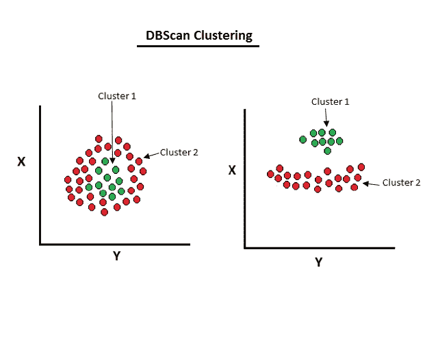
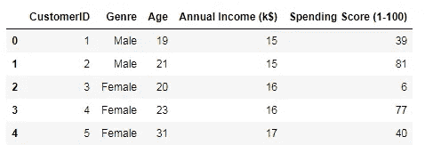
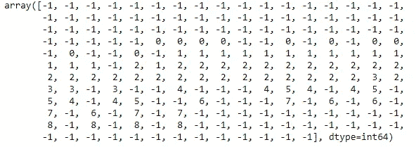

# 用 Python 全面解释 DBScan 聚类算法

> 原文：<https://pub.towardsai.net/fully-explained-dbscan-clustering-algorithm-with-python-a568139ebff5?source=collection_archive---------0----------------------->

## [机器学习](https://towardsai.net/p/category/machine-learning)

## 基于密度聚类的机器学习中的无监督学习



无监督学习中的聚类。作者的照片

在本文中，我们将讨论基于机器学习的聚类算法，即 DBScan 聚类。该聚类算法中方法是基于密度的，而不是另一种基于距离的方法。另一个基于距离的聚类寻找数据点中的接近度，但是如果该点属于另一个类，也会分类错误。因此，基于密度的聚类适合这种情况。聚类算法来自无监督学习，在这种学习中，我们不依赖于目标变量来形成聚类。

在集群中，主要关注的是最大密集连接点。基于密度的聚类可以用于任意形状，即使有噪声。

> ***基于密度的集群的工作函数如下所示:***

*   我们选择一个随机的数据点。
*   然后需要两个参数来检查该点周围的密度。首先，它将围绕该点创建一个半径，其次，它将检查该半径中的最小点。
*   如果该点确实用最小点进行了检查，那么它将对该点进行聚类，并向前移动到其他点，如果不是，那么它将把它视为异常值。
*   DBSCAN 方法有两个参数，即***【EPS(epsilon)***用于确定半径，以及 ***min_samples*** 用于检查最小点。
*   这些参数的默认值分别为 0.5 和 5。

寻找邻居的距离测量是非常重要的步骤和距离函数。

还有另一个度量来选择距离函数。此指标的默认值是欧几里得，但它可以是字符串或可调用的。如果我们选择 string 或 callable，那么我们应该考虑公制中的成对距离方法。

还有一个参数叫做 ***算法*** ，用于机器学习中的邻居搜索，如下图所示:

*   **强力搜索:**它适用于小数据集，并提供对邻居的快速搜索，但在数据集增长时不可行。
*   **K-D 和球树:**一级以上蛮搜。这种搜索是基于关联的，并且是在结构化树类型中完成的。而球树在高维特征中是有用的。

叶大小参数用于 KD 和球树方案，默认值为 30。但这并不太可行，因为它会降低速度，并且需要内存来保存一棵树。

为了节省内存，内存受限的研究人员选择了基于光学的聚类。

让我们用 python 做一个 DBSCAN 集群

导入必要的库

```
# DBSCAN Clustering# Importing the libraries
import numpy as np
import pandas as pd
```

用熊猫的读取方法读取数据集。

```
# Importing the dataset
dataset = pd.read_csv('Mall_Customers.csv')
X = dataset.iloc[:, [3, 4]].values
```

数据集的视图。



商场顾客的数据集。作者的照片

从 sklearn 导入聚类算法

```
# Using the elbow method to find the optimal number of clusters
from sklearn.cluster import DBSCAN
dbscan=DBSCAN(eps=3,min_samples=4)
```

现在，拟合模型。

```
# Fitting the modelmodel=dbscan.fit(X)labels=model.labels_print(labels)
```



标签组成不同的集群。作者的照片

我们看到标签也显示了“-1”值，这意味着它是一个异常值，即不属于任何聚类。提出核心观点。

```
#identifying the points which makes up our core points
sample_cores=np.zeros_like(labels,dtype=bool)sample_cores[dbscan.core_sample_indices_]=True
```

为了找到集群的数量

```
#Calculating the number of clustersn_clusters=len(set(labels))- (1 if -1 in labels else 0)
print(n_clusters)#output:
9
```

上面的代码显示了集群的总数。要打印分类的分数

```
print(metrics.silhouette_score(X,labels))#output:
-0.1908319132560097
```

度量分数变为负值，这意味着样本被分配到错误的聚类。分数介于“1”到“-1”之间，其中“1”表示好的值，“-1”表示最差的值。

> ***结论:***

DBSCAN 聚类适用于任意形状的聚类。它在异常值的情况下也是稳健的。该算法在异常检测和卫星图像中是有用的。

我希望你喜欢这篇文章。通过我的 [LinkedIn](https://www.linkedin.com/in/data-scientist-95040a1ab/) 和 [twitter](https://twitter.com/amitprius) 联系我。

# 推荐文章

1.  [NLP —用 Python 从零到英雄](https://medium.com/towards-artificial-intelligence/nlp-zero-to-hero-with-python-2df6fcebff6e?sk=2231d868766e96b13d1e9d7db6064df1)

2. [Python 数据结构数据类型和对象](https://medium.com/towards-artificial-intelligence/python-data-structures-data-types-and-objects-244d0a86c3cf?sk=42f4b462499f3fc3a160b21e2c94dba6)

3. [Python:零到英雄带实例](https://medium.com/towards-artificial-intelligence/python-zero-to-hero-with-examples-c7a5dedb968b?source=friends_link&sk=186aff630c2241aca16522241333e3e0)

4.[用 Python 全面讲解 SVM 分类](https://medium.com/towards-artificial-intelligence/fully-explained-svm-classification-with-python-eda124997bcd?source=friends_link&sk=da300d557992d67808746ee706269b2f)

5.[用 Python 全面解释 K-means 聚类](https://medium.com/towards-artificial-intelligence/fully-explained-k-means-clustering-with-python-e7caa573176a?source=friends_link&sk=9c5c613ceb10f2d203712634f3b6fb28)

6.[用 Python 全面解释线性回归](https://medium.com/towards-artificial-intelligence/fully-explained-linear-regression-with-python-fe2b313f32f3?source=friends_link&sk=53c91a2a51347ec2d93f8222c0e06402)

7.[用 Python 全面讲解逻辑回归](https://medium.com/towards-artificial-intelligence/fully-explained-logistic-regression-with-python-f4a16413ddcd?source=friends_link&sk=528181f15a44e48ea38fdd9579241a78)

8.[Python 时间序列基础知识](https://medium.com/towards-artificial-intelligence/basic-of-time-series-with-python-a2f7cb451a76?source=friends_link&sk=09d77be2d6b8779973e41ab54ebcf6c5)

9. [NumPy:用 Python 零到英雄](https://medium.com/towards-artificial-intelligence/numpy-zero-to-hero-with-python-d135f57d6082?source=friends_link&sk=45c0921423cdcca2f5772f5a5c1568f1)

10.[机器学习中的混淆矩阵](https://medium.com/analytics-vidhya/confusion-matrix-in-machine-learning-91b6e2b3f9af?source=friends_link&sk=11c6531da0bab7b504d518d02746d4cc)