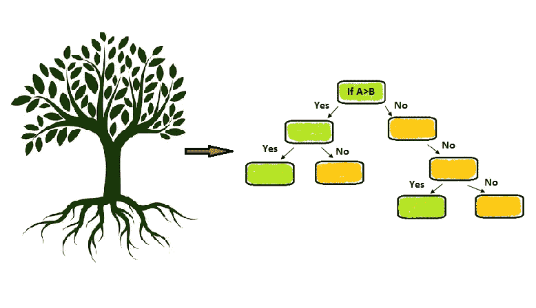
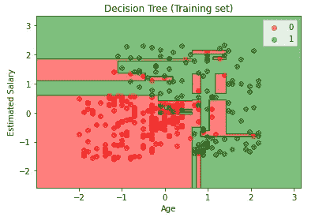
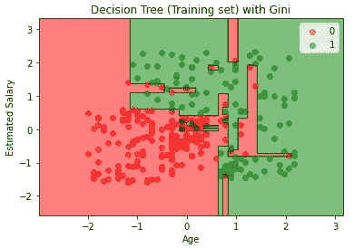

# 用 Python 全面解释决策树分类

> 原文：<https://pub.towardsai.net/fully-explained-decision-tree-classification-with-python-d90d3bd16836?source=collection_archive---------1----------------------->

## [机器学习](https://towardsai.net/p/category/machine-learning)

## 分类问题决策树的深入研究



决策树。作者的照片

在本文中，决策树算法是所有其他树模型的基础模型。决策树来自 CART(分类和回归树)算法，它是 sklearn 中的优化版本。这些是非参数监督学习。非参数意味着数据是无分布的，即变量是名义变量或序数变量。

决策树通过选择根节点并进一步分割成节点来做出决定。这种分割基于决策树中使用的指标。早期的文章是关于回归和分类的度量。但是在决策树的情况下，度量标准有一点不同。

> **决策树中的*指标*中的**

1.  ***基尼杂质和熵***
2.  ***信息增益***
3.  ***方差减少***

> ***决策树有几种从数据集生成决策树的算法如下:***

*   ***ID3(迭代二分法 3):*** 它会生成较小的树，对连续数据没有用，因为它会导致在该属性中查找多个拆分，并且需要较长的时间。在训练集上也是如此。
*   ***C4.5:*** 它是 ID3 的高级版本，也基于阈值处理连续数据。它在缺少值的数据集中也很有用。在创建树之后，它还可以做修剪工作。
*   ***CART:*** 它是一个分类回归树，根据输出变量是分类的还是数值的来生成树。购物车检测到属性中不可能有进一步的增益，并停止拆分。

> ***我们将看到不同的算法如何使用不同的度量来做树的分裂。***

## 基尼系数和熵

*   算法的 CART 版本中使用了 Gini 杂质。它用于查找错误分类观察值的概率，并且使用较少的基尼值进行更好的分割。
*   熵也用于基于错误分类的观察来分割树。由于对数计算，需要的时间稍长。
*   这里的主要区别是，基尼系数的取值范围是从 0 到 0.5。而熵的取值范围是从 0 到 1。
*   算法的 ID3 和 C4.5 版本中使用了熵。

## 信息增益

它与熵值一起使用。从先前状态到信息状态的熵值的差异。

一般来说，分割是基于从目标变量到其他属性的最大增益或信息来完成的。

增益(i) =信息增益(Y)-熵(Ai)

y-因变量

Ai —独立变量的属性(i=1，2…n)

## 方差缩减

它在回归问题中很有用，因为当输出变量是连续数字时，节点的分割是基于方差值的。

[](https://medium.com/towards-artificial-intelligence/fully-explained-svm-classification-with-python-eda124997bcd) [## 用 Python 全面解释了 SVM 分类

### 如何用一个真实的例子解决分类问题。

medium.com](https://medium.com/towards-artificial-intelligence/fully-explained-svm-classification-with-python-eda124997bcd) 

> ***现在是用 python 做分类问题的时候了。***

```
# Importing the libraries
import numpy as np
import matplotlib.pyplot as plt
import pandas as pd
```

导入库后，下一步我们将读取 CSV 文件，并将数据分成特征和目标变量。

```
# Importing the dataset
dataset = pd.read_csv('Social_Network_Ads.csv')
x_set_values = dataset.iloc[:, [2, 3]].values
y_set_values = dataset.iloc[:, 4].values
```

现在将数据分为训练数据和测试数据。

```
# Splitting the dataset into the Training set and Test set
from sklearn.model_selection import train_test_splitX_train, X_test, y_train, y_test = train_test_split(x_set_values,
                y_set_values, test_size = 0.25, random_state = 0)
```

下一步，我们可以进行标准缩放，但我认为在决策树中我们不应该这样做，因为分割应该基于真实值，而不是缩放值。但是如果比例部分如下所示:

```
#Feature Scaling
from sklearn.preprocessing import StandardScaler
sc = StandardScaler()
X_train = sc.fit_transform(X_train)
X_test = sc.transform(X_test)
```

在这个算法中，我们将使用熵。

```
# Fitting the classifier classifier to the Training set
from sklearn.tree import DecisionTreeClassifier
classifier = DecisionTreeClassifier(criterion = 'entropy', random_state= 0)
classifier.fit(X_train, y_train)#output:DecisionTreeClassifier(class_weight=None, criterion='entropy',
            max_depth=None,
            max_features=None, max_leaf_nodes=None,
            min_impurity_decrease=0.0, min_impurity_split=None,
            min_samples_leaf=1, min_samples_split=2,
            min_weight_fraction_leaf=0.0, presort=False,
            random_state=0,splitter='best')
```

现在，我们将预测数据并制作我们的模型。

```
# Predicting the Test set results
y_pred = classifier.predict(X_test)
```

现在，我们计算混淆矩阵。

```
# Making the Confusion Matrix
from sklearn.metrics import confusion_matrix
cm = confusion_matrix(y_test, y_pred) #output:array([[66,  2],
              [ 8, 24]], dtype=int64)
```

用熵可视化训练和测试结果。

```
# Visualising the Training set results
from matplotlib.colors import ListedColormapX_set, y_set = X_train, y_trainX1, X2 = np.meshgrid(np.arange(start = X_set[:, 0].min() - 1, stop =
                     X_set[:, 0].max() + 1, step = 0.01),
                     np.arange(start = X_set[:, 1].min() - 1, stop = 
                     X_set[:, 1].max() + 1, step = 0.01))plt.contourf(X1, X2, classifier.predict(np.array([X1.ravel(), 
             X2.ravel()]).T).reshape(X1.shape),
             alpha = 0.5, cmap = ListedColormap(('red', 'green')))plt.xlim(X1.min(), X1.max())
plt.ylim(X2.min(), X2.max())for i, j in enumerate(np.unique(y_set)):
    plt.scatter(X_set[y_set == j, 0], X_set[y_set == j, 1],
                alpha=0.5,
                c = ListedColormap(('red', 'green'))(i), label = j)plt.title('Decision Tree (Training set)')
plt.xlabel('Age')
plt.ylabel('Estimated Salary')
plt.legend()
plt.show()
```



训练集中的熵准则分类。作者的照片

将标准更改为“基尼”后，混淆矩阵值不会改变。



训练集中的基尼准则分类。作者的照片

这是基于训练集的熵和基尼的树分裂分离准则。我们观察到图中有很好的分类。

[](https://medium.com/towards-artificial-intelligence/scatter-plot-and-line-chart-dashboard-in-plotly-with-python-4e886ea5f3e6) [## 使用 Python 在 Plotly 中实现散点图和折线图仪表板

### 用 Plotly 可视化

medium.com](https://medium.com/towards-artificial-intelligence/scatter-plot-and-line-chart-dashboard-in-plotly-with-python-4e886ea5f3e6) [](https://medium.com/towards-artificial-intelligence/fully-explained-k-means-clustering-with-python-e7caa573176a) [## 充分解释了使用 Python 进行 K-means 聚类

### 群体相似性机器学习中的非监督部分。

medium.com](https://medium.com/towards-artificial-intelligence/fully-explained-k-means-clustering-with-python-e7caa573176a) 

> **结论:**

决策树在分类和回归中非常有用。标准参数给出数据集的不同树分裂。

我希望你喜欢这篇文章。通过我的 [LinkedIn](https://www.linkedin.com/in/data-scientist-95040a1ab/) 和 [twitter](https://twitter.com/amitprius) 联系我。

# 推荐文章

1.  [NLP —用 Python 从零到英雄](https://medium.com/towards-artificial-intelligence/nlp-zero-to-hero-with-python-2df6fcebff6e?sk=2231d868766e96b13d1e9d7db6064df1)

2. [Python 数据结构数据类型和对象](https://medium.com/towards-artificial-intelligence/python-data-structures-data-types-and-objects-244d0a86c3cf?sk=42f4b462499f3fc3a160b21e2c94dba6)

3. [Python:零到英雄附实例](https://medium.com/towards-artificial-intelligence/python-zero-to-hero-with-examples-c7a5dedb968b?source=friends_link&sk=186aff630c2241aca16522241333e3e0)

4. [MySQL:零到英雄](https://medium.com/towards-artificial-intelligence/mysql-zero-to-hero-with-syntax-of-all-topics-92e700762c7b?source=friends_link&sk=35a3f8dc1cf1ebd1c4d5008a5d12d6a3)

5.[Python 时间序列基础](https://medium.com/towards-artificial-intelligence/basic-of-time-series-with-python-a2f7cb451a76?source=friends_link&sk=09d77be2d6b8779973e41ab54ebcf6c5)

6. [NumPy:用 Python 零到英雄](https://medium.com/towards-artificial-intelligence/numpy-zero-to-hero-with-python-d135f57d6082?source=friends_link&sk=45c0921423cdcca2f5772f5a5c1568f1)

7.[用 python 实现熊猫系列和数据帧的基础](https://medium.com/towards-artificial-intelligence/fundamentals-of-series-and-data-frame-in-pandas-with-python-6e0b8a168a0d?source=friends_link&sk=955350bf43c7d1680be6e37b15b6628b)

8.[机器学习中的混淆矩阵](https://medium.com/analytics-vidhya/confusion-matrix-in-machine-learning-91b6e2b3f9af?source=friends_link&sk=11c6531da0bab7b504d518d02746d4cc)