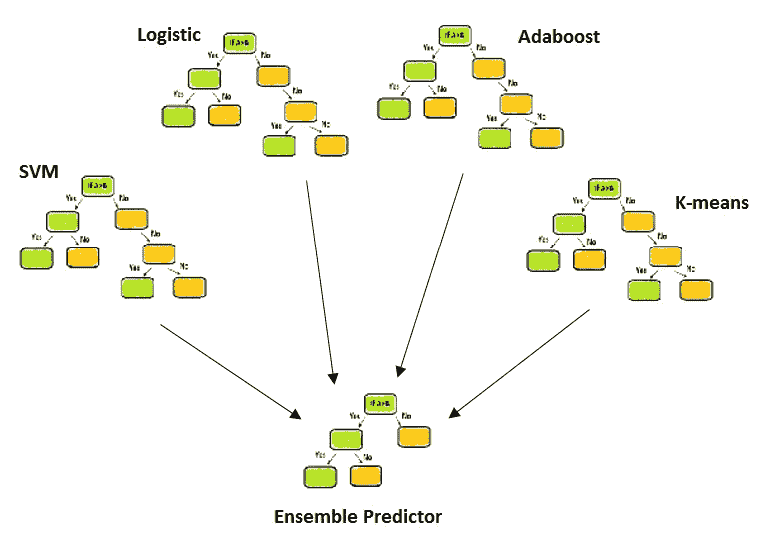
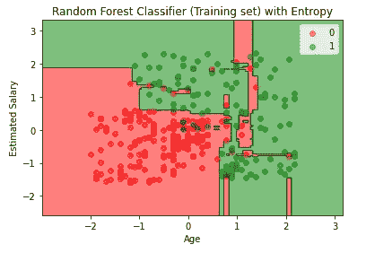
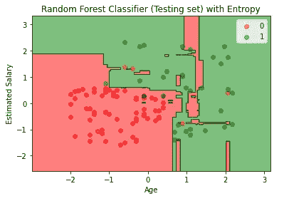
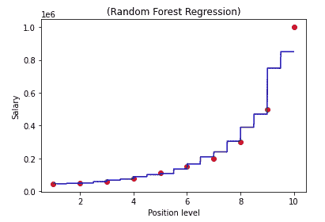

# 用 Python 完整解释了集合随机森林示例

> 原文：<https://pub.towardsai.net/fully-explained-ensemble-techniques-example-with-python-b83e50310841?source=collection_archive---------0----------------------->

## [机器学习](https://towardsai.net/p/category/machine-learning)

## 基于几种决策树的机器学习方法



集合模型。作者的照片

在本文中，集成技术是基于多重决策树的。如果我们只讨论在建模后给出高方差的决策树，这会导致过度拟合。使用集合方法的好处是通过平均(bagging)或增强技术给出方差减少的良好预测。

有各种类型的集成技术，如分类和回归，如下所示:

*   平均法中有套袋、随机林和额外树。
*   Adaboost、梯度增强、CatBoost 等都属于增强方法。

在**平均方法**中，通常用于减少方差，而最终预测是基于所有其他弱学习者或基础学习者的平均值。这里的基础学习者是用来做预测的不同算法。

我们使用与原始形状相同的自举采样数据集来替换所有其他数据集，以便所有模型的预测不会相同。

在 **boosting 方法**中，通常用于在预测基于序列方式时减少偏差，指的是从第一个模型到下一个具有改进预测的模型的误差，以此类推，直到最后一个基础模型。

[](https://medium.com/towards-artificial-intelligence/become-a-data-scientist-in-2021-with-these-following-steps-5bf70a0fe0a1) [## 按照以下步骤，在 2021 年成为一名数据科学家

### 走上数据科学家之路需要具备的基本点

medium.com](https://medium.com/towards-artificial-intelligence/become-a-data-scientist-in-2021-with-these-following-steps-5bf70a0fe0a1) 

## ***在本文中，我们将讨论用 python 实现的随机森林算法，其他的将在以后的文章中讨论。***

sklearn 有两种风格的随机森林，即***RandomForestClassifier***和***RandomForestRegression***

这两种口味具有不同的标准参数，如下所示:

*   **随机分类器**具有`gini`和`entropy`指标，默认为基尼。
*   **随机回归**具有`MSE`和`MAE`指标，即均方误差和平均绝对误差，而这里的默认值是 MSE。

其他参数也很有用，如`n_estimator`和`max_features`。前者的缺省值是 100(即 100 棵决策树),但是越多的估计数越好，直到显著。而后者是最佳分割的随机子集的大小。

如果`max_features`的数量增加，可能会导致更大的偏差，如果数量减少，方差会大大减少。

另一个值得注意的参数是`n_jobs`，这意味着如果我们想要快速处理，那么我们必须将值设为“-1”，而不是默认的`none`。这一过程被称为并行化，在这一过程中，机器将使用所有内核进行多处理。

`bootstrap`的默认值为真。

带回归和分类的 Python 实现如下所示:

[](https://medium.com/towards-artificial-intelligence/concepts-of-bias-and-variance-in-dataset-aa119ccd2118) [## 数据集中偏差和方差的概念

### 对数据科学中使用的定义有基本的理解

medium.com](https://medium.com/towards-artificial-intelligence/concepts-of-bias-and-variance-in-dataset-aa119ccd2118) 

> ***现在我们来做一个用随机森林解决分类问题的练习。***

## 带分类

```
# Importing the libraries
import numpy as np
import matplotlib.pyplot as plt
import pandas as pd
```

导入库后，现在我们将读取 CSV 文件，并将特征分成独立变量和因变量。

```
# Importing the dataset
dataset = pd.read_csv('Social_Network_Ads.csv')
x_set_values = dataset.iloc[:, [2, 3]].values
y_set_values = dataset.iloc[:, 4].values
```

现在将数据集分为训练集和测试集。

```
from sklearn.model_selection import train_test_splitX_train, X_test, y_train, y_test = train_test_split(x_set_values, 
                y_set_values, test_size = 0.25, random_state = 0)
```

在对机器学习算法建模之前，我们应该总是做标准的缩放。

```
# Feature Scaling
from sklearn.preprocessing import StandardScaler
sc = StandardScaler()
X_train = sc.fit_transform(X_train)
X_test = sc.transform(X_test)
```

在这个算法中，我们将使用熵标准。

```
# Fitting the classifier to the Training set
from sklearn.ensemble import RandomForestClassifierclassifier = RandomForestClassifier(n_estimators = 10, criterion = 
                                     'entropy', random_state= 0)classifier.fit(X_train, y_train)#output:RandomForestClassifier(bootstrap=True, class_weight=None,
    criterion='entropy', max_depth=None, max_features='auto',
    max_leaf_nodes=None, min_impurity_decrease=0.0,  
    min_impurity_split=None, min_samples_leaf=1,
    min_samples_split=2, min_weight_fraction_leaf=0.0,
    n_estimators=10, n_jobs=None, oob_score=False, random_state=0,
    verbose=0, warm_start=False)
```

现在，我们将预测数据并制作我们的模型。

```
# Predicting the Test set results
y_pred = classifier.predict(X_test)
```

现在，我们计算混淆矩阵。

```
# Making the Confusion Matrix
from sklearn.metrics import confusion_matrix
cm = confusion_matrix(y_test, y_pred)#output:
array([[63,  5],
       [ 4, 28]], dtype=int64)
```

用熵准则可视化训练和测试结果。

```
# Visualising the Training set results
from matplotlib.colors import ListedColormapX_set, y_set = X_train, y_trainX1, X2 = np.meshgrid(np.arange(start = X_set[:, 0].min() - 1, stop =
                     X_set[:, 0].max() + 1, step = 0.01),
                     np.arange(start = X_set[:, 1].min() - 1, stop =
                     X_set[:, 1].max() + 1, step = 0.01))plt.contourf(X1, X2, classifier.predict(np.array([X1.ravel(), 
            X2.ravel()]).T).reshape(X1.shape),
             alpha = 0.5, cmap = ListedColormap(('red', 'green')))plt.xlim(X1.min(), X1.max())
plt.ylim(X2.min(), X2.max())for i, j in enumerate(np.unique(y_set)):
    plt.scatter(X_set[y_set == j, 0], X_set[y_set == j, 1],
                alpha=0.5, c = ListedColormap(('red', 'green'))(i),
                label = j)plt.title('Random Forest Classifier (Training set) with Entropy')
plt.xlabel('Age')
plt.ylabel('Estimated Salary')
plt.legend()
plt.show()
```

测试集的更改

```
X_set, y_set = X_test, y_testand plt.title('Random Forest Classifier (Testing set) with Entropy')
```



用于训练和测试集的随机森林。作者的照片

[](https://medium.com/towards-artificial-intelligence/z-statistics-t-statistics-p-statistics-are-still-confusing-you-87557047e20a) [## Z-统计量，T-统计量，P-统计量还在迷惑你？

### 机器学习统计学中的定义和概念

medium.com](https://medium.com/towards-artificial-intelligence/z-statistics-t-statistics-p-statistics-are-still-confusing-you-87557047e20a) [](https://medium.com/towards-artificial-intelligence/fully-explained-decision-tree-classification-with-python-d90d3bd16836) [## 用 Python 全面解释决策树分类

### 分类问题决策树的深入研究

medium.com](https://medium.com/towards-artificial-intelligence/fully-explained-decision-tree-classification-with-python-d90d3bd16836) 

## 随机森林回归的变化

*   没有分成训练集和测试集。
*   不需要标准缩放。
*   选择回归

```
#Now applying regression in random forest
from sklearn.ensemble import RandomForestRegressorregressor = RandomForestRegressor(n_estimators=10, random_state = 0)regressor.fit(X, y)#output:RandomForestRegressor(bootstrap=True, criterion='mse',
         max_depth=None, max_features='auto', max_leaf_nodes=None,
         min_impurity_decrease=0.0, min_impurity_split=None,
         min_samples_leaf=1, min_samples_split=2,
         min_weight_fraction_leaf=0.0, n_estimators=10, n_jobs=None,
         oob_score=False, random_state=0, verbose=0, 
         warm_start=False)
```

随机回归的可视化。

```
#Random Forest Regression scatter plot for n_estimator
X_grid = np.arange(min(X), max(X), 0.01)
X_grid = X_grid.reshape((len(X_grid), 1))
plt.scatter(X, y, color = ‘red’)
plt.plot(X_grid, regressor.predict(X_grid), color = ‘blue’)
plt.title(‘(Random Forest Regression)’)
plt.xlabel(‘Position level’)
plt.ylabel(‘Salary’)
plt.show()
```



回归可视化。作者的照片

从该图中可以看出，我们在 n_estimator 中选择的决策树数量是“100 ”,它会计算这些点 100 次，然后计算这些点的平均值，从而得出预测值。

> **结论:**

随机森林算法在分类和回归中非常有用。标准参数给出了分类中数据集的不同树分裂，只有`n_estimator`需要回归。

我希望你喜欢这篇文章。通过我的 [LinkedIn](https://www.linkedin.com/in/data-scientist-95040a1ab/) 和 [twitter](https://twitter.com/amitprius) 联系我。

# 推荐文章

1.  [NLP —用 Python 从零到英雄](https://medium.com/towards-artificial-intelligence/nlp-zero-to-hero-with-python-2df6fcebff6e?sk=2231d868766e96b13d1e9d7db6064df1)

2. [Python 数据结构数据类型和对象](https://medium.com/towards-artificial-intelligence/python-data-structures-data-types-and-objects-244d0a86c3cf?sk=42f4b462499f3fc3a160b21e2c94dba6)

3. [Python:零到英雄附实例](https://medium.com/towards-artificial-intelligence/python-zero-to-hero-with-examples-c7a5dedb968b?source=friends_link&sk=186aff630c2241aca16522241333e3e0)

4.[用 Python 全面讲解 SVM 分类](https://medium.com/towards-artificial-intelligence/fully-explained-svm-classification-with-python-eda124997bcd?source=friends_link&sk=da300d557992d67808746ee706269b2f)

5.[用 Python 全面解释 K-means 聚类](https://medium.com/towards-artificial-intelligence/fully-explained-k-means-clustering-with-python-e7caa573176a?source=friends_link&sk=9c5c613ceb10f2d203712634f3b6fb28)

6.[用 Python 全面解释线性回归](https://medium.com/towards-artificial-intelligence/fully-explained-linear-regression-with-python-fe2b313f32f3?source=friends_link&sk=53c91a2a51347ec2d93f8222c0e06402)

7.[用 Python 全面解释逻辑回归](https://medium.com/towards-artificial-intelligence/fully-explained-logistic-regression-with-python-f4a16413ddcd?source=friends_link&sk=528181f15a44e48ea38fdd9579241a78)

8.[Python 时间序列基础](https://medium.com/towards-artificial-intelligence/basic-of-time-series-with-python-a2f7cb451a76?source=friends_link&sk=09d77be2d6b8779973e41ab54ebcf6c5)

9. [NumPy:用 Python 零到英雄](https://medium.com/towards-artificial-intelligence/numpy-zero-to-hero-with-python-d135f57d6082?source=friends_link&sk=45c0921423cdcca2f5772f5a5c1568f1)

10.[机器学习中的混淆矩阵](https://medium.com/analytics-vidhya/confusion-matrix-in-machine-learning-91b6e2b3f9af?source=friends_link&sk=11c6531da0bab7b504d518d02746d4cc)