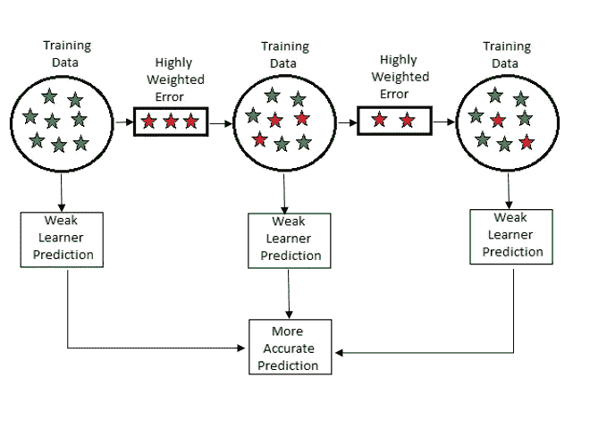
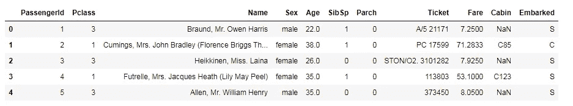
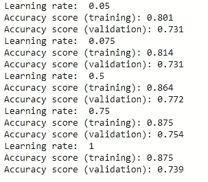

# 监督学习中的梯度推进技术

> 原文：<https://pub.towardsai.net/fully-explained-gradient-boosting-technique-in-supervised-learning-d3e293ca70e1?source=collection_archive---------1----------------------->

## [数据科学](https://towardsai.net/p/category/data-science)，[机器学习](https://towardsai.net/p/category/machine-learning)

## 机器学习中的回归和分类方法



机器学习中的梯度推进。作者的照片

大家好，在这篇文章中，我们将讨论集成提升技术，即梯度提升。在关于 ensemble 的早期文章中，我们讨论了随机森林，这是一种打包技术。在增强弱学习者对训练集的预测时，将误差/残差与其权重一起转发给下一个弱学习者。

[](/fully-explained-ensemble-techniques-example-with-python-b83e50310841) [## 用 Python 完整解释了整体技术示例

### 基于几种决策树的机器学习方法

pub.towardsai.net](/fully-explained-ensemble-techniques-example-with-python-b83e50310841) 

我们在 bagging 技术中看到了基尼系数和熵，但是在 boosting 的情况下，我们将处理损失函数，因为高权重的损失属于下一个基础学习者。因此，最后一个基学习器给出基于较小误差的最佳预测，然后组合预测非常适合该模型。

n **推进方法**，我们试图减少偏差，而预测是基于顺序的。

梯度增强是一种顺序模型，其中借助于梯度下降来减小误差，并且以基本模型的形式来制作模型。

梯度推进的优点如下所示:

*   它减少了偏见。
*   处理数据集中缺失的值。
*   灵活处理超参数调谐。
*   通过梯度下降处理作为损失函数一部分的误差。
*   提升分类处理二元和多类问题。

> ***一些在分类和回归中使用的损失函数借助损失参数如下所示:***

**用于回归:**

*   *LAD -最小绝对偏差*:处理回归中目标值的中值。
*   *LS -最小二乘法*:处理回归中目标值的平均值。
*   *Huber* :它结合了 LAD 和 LS 进行计算。为了控制灵敏度，我们在异常值的情况下使用α参数。

**分类:**

*   *二项式偏差*:这个损失函数基于对数奇比对二元分类起作用。
*   *多项式偏差*:多类分类中使用的损失函数的似然性。当类别增加时，按照 n_class 参数中给定的回归树变得不能有效地生成概率。
*   *指数损失*:仅用于二元分类。这也用于 Adaboost 分类。

> ***重要点要记住:***

*   该模型在随机梯度提升中的子样本上训练，该随机梯度提升将梯度提升与 bagging 平均(自举)相结合。
*   学习率通过收缩用于正则化策略。收缩用于减少迭代次数。
*   梯度推进中的分类类似于回归，因此来自树的值不是类的，而是连续值。因此，对于二分类，我们使用 sigmoid 函数建模，对于多分类，我们使用 softmax。
*   标准参数分类中使用的默认度量是“friedman_mse”。它衡量分割的质量。这个默认度量对于给出比 MSE 和 MAE 更好的近似值非常有用。

[](/fully-explained-k-nearest-neighbors-with-python-ebbe27f93ba9) [## 用 Python 完整解释 K 近邻

### 数据科学中解决真实案例的机器学习分类算法研究。

pub.towardsai.net](/fully-explained-k-nearest-neighbors-with-python-ebbe27f93ba9) 

> ***用 python 制作泰坦尼克号数据集的例子。***

导入库

```
import pandas as pd
from sklearn.preprocessing import MinMaxScaler
from sklearn.model_selection import train_test_split
from sklearn.metrics import classification_report, confusion_matrix
from sklearn.ensemble import GradientBoostingClassifier
```

MinMaxScaler 用于缩放值，这里我们将使用 boosting 分类器。

数据集由两个文件组成。训练和测试 CSV 文件。为了阅读这些文件，我们使用了熊猫。

```
train_data = pd.read_csv("train.csv")
test_data = pd.read_csv("test.csv")
```

训练数据集的视图。



列车组。作者的照片

现在，我们将进行一些预处理，并选择保留在 y_train 变量中的输出列，并将其从 features 数据集中移除。这里，inplace 是真的，因为我们也希望原始数据集中的变化。

```
y_train = train_data["Survived"]
train_data.drop(labels="Survived", axis=1, inplace=True)
```

将测试集添加到训练集。

```
full_data = train_data.append(test_data)
```

作为功能工程的一部分，我们可以删除一些不太有用的列。

```
drop_columns = ["Name", "Age", "SibSp", "Ticket", "Cabin", "Parch", "Embarked"]
full_data.drop(labels=drop_columns, axis=1, inplace=True)
```

现在我们将对分类列进行编码。pandas 提供 get_dummies 方法来将分类值标记为数值。

```
full_data = pd.get_dummies(full_data, columns=["Sex"])
full_data.fillna(value=0.0, inplace=True)
```

预处理后，现在在训练和测试中分离。

```
X_train = full_data.values[0:891]
X_test = full_data.values[891:]
```

在建模之前，缩放是标准化训练集和测试集中的值和划分数据的重要步骤..

```
scaler = MinMaxScaler()
X_train = scaler.fit_transform(X_train)
X_test = scaler.transform(X_test)state = 12  
test_size = 0.30  

X_train, X_val, y_train, y_val = train_test_split(X_train, y_train,  
    test_size=test_size, random_state=state)
```

现在，我们将尝试拟合模型，并评估不同学习率的准确性。

```
lrate_list = [0.05, 0.075, 0.5, 0.75, 1]

for learning_rate in lrate_list:
    gb_clf = GradientBoostingClassifier(n_estimators=20
    , learning_rate=learning_rate, max_features=2, max_depth=2,
     random_state=0) gb_clf.fit(X_train, y_train)

    print("Learning rate: ", learning_rate)
    print("Accuracy score (training):
               {0:.3f}".format(gb_clf.score(X_train, y_train)))
    print("Accuracy score (validation):
               {0:.3f}".format(gb_clf.score(X_val, y_val)))
```



不同学习率的表现。作者的照片

从上面的表现我们可以看到，学习率为“0.5”的验证分数是很好的。现在，我们将用这个值来预测模型。

```
gb_clf2 = GradientBoostingClassifier(n_estimators=20,
     learning_rate=0.5, max_features=2, max_depth=2, random_state=0)gb_clf2.fit(X_train, y_train)
predictions = gb_clf2.predict(X_val)

print("Confusion Matrix:")
print(confusion_matrix(y_val, predictions))

print("Classification Report")
print(classification_report(y_val, predictions))#output:Confusion Matrix:
[[142  19]
 [ 42  65]]
Classification Report
              precision    recall  f1-score   support

           0       0.77      0.88      0.82       161
           1       0.77      0.61      0.68       107

    accuracy                           0.77       268
   macro avg       0.77      0.74      0.75       268
weighted avg       0.77      0.77      0.77       268
```

> **结论:**

梯度推进在分类和回归中给出非常好的结果。

[](/become-a-data-scientist-in-2021-with-these-following-steps-5bf70a0fe0a1) [## 按照以下步骤，在 2021 年成为一名数据科学家

### 走上数据科学家之路需要具备的基本点

pub.towardsai.net](/become-a-data-scientist-in-2021-with-these-following-steps-5bf70a0fe0a1) 

我希望你喜欢这篇文章。通过我的 [LinkedIn](https://www.linkedin.com/in/data-scientist-95040a1ab/) 和 [twitter](https://twitter.com/amitprius) 联系我。

# 推荐文章

1.  [NLP —用 Python 从零到英雄](https://medium.com/towards-artificial-intelligence/nlp-zero-to-hero-with-python-2df6fcebff6e?sk=2231d868766e96b13d1e9d7db6064df1)

2. [Python 数据结构数据类型和对象](https://medium.com/towards-artificial-intelligence/python-data-structures-data-types-and-objects-244d0a86c3cf?sk=42f4b462499f3fc3a160b21e2c94dba6)

3. [Python:零到英雄附实例](https://medium.com/towards-artificial-intelligence/python-zero-to-hero-with-examples-c7a5dedb968b?source=friends_link&sk=186aff630c2241aca16522241333e3e0)

4.[用 Python 全面讲解 SVM 分类](https://medium.com/towards-artificial-intelligence/fully-explained-svm-classification-with-python-eda124997bcd?source=friends_link&sk=da300d557992d67808746ee706269b2f)

5.[用 Python 全面解释 K-means 聚类](https://medium.com/towards-artificial-intelligence/fully-explained-k-means-clustering-with-python-e7caa573176a?source=friends_link&sk=9c5c613ceb10f2d203712634f3b6fb28)

6.[用 Python 全面解释线性回归](https://medium.com/towards-artificial-intelligence/fully-explained-linear-regression-with-python-fe2b313f32f3?source=friends_link&sk=53c91a2a51347ec2d93f8222c0e06402)

7.[用 Python 全面解释逻辑回归](https://medium.com/towards-artificial-intelligence/fully-explained-logistic-regression-with-python-f4a16413ddcd?source=friends_link&sk=528181f15a44e48ea38fdd9579241a78)

8.[Python 时间序列基础](https://medium.com/towards-artificial-intelligence/basic-of-time-series-with-python-a2f7cb451a76?source=friends_link&sk=09d77be2d6b8779973e41ab54ebcf6c5)

9. [NumPy:用 Python 零到英雄](https://medium.com/towards-artificial-intelligence/numpy-zero-to-hero-with-python-d135f57d6082?source=friends_link&sk=45c0921423cdcca2f5772f5a5c1568f1)

10.[机器学习中的混淆矩阵](https://medium.com/analytics-vidhya/confusion-matrix-in-machine-learning-91b6e2b3f9af?source=friends_link&sk=11c6531da0bab7b504d518d02746d4cc)