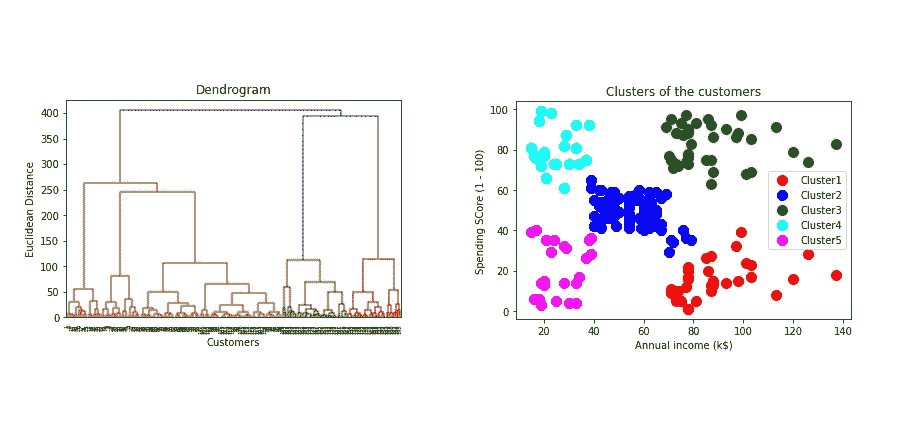
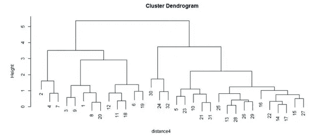
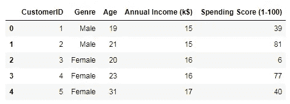
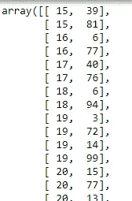
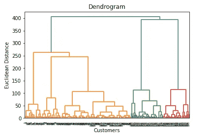
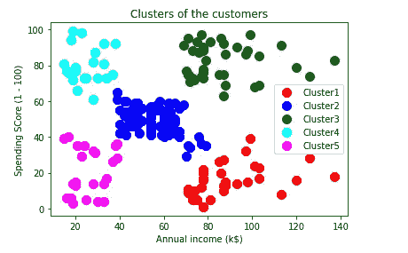

# 用 Python 全面解释了层次聚类

> 原文：<https://pub.towardsai.net/fully-explained-hierarchical-clustering-with-python-ebb256317b50?source=collection_archive---------0----------------------->

## [编程](https://towardsai.net/p/category/programming)

## 无监督机器学习中的凝聚聚类



分层聚类。作者的照片

在本文中，我们将讨论无监督机器学习中的层次聚类算法。该算法基于嵌套聚类的分裂和合并。基于距离度量合并聚类的链接标准如下所示，采用自下而上的方法。

*   ***沃德联动:*** 用分层的方法使数据中的方差最小化。
*   ***最大关联:*** 用于最小化聚类数据点的最大距离。
*   ***平均联动:*** 用于平均聚类的数据点的距离。
*   ***单联动:*** 用于最小化聚类中数据点的最近距离。

树状图将显示层次聚类的可视化



图像[来源](https://www.researchgate.net/post/How_to_interpret_Dendrogram_and_relevance_of_clustering)

链接标准以不同的时间速度给出不同的聚类。单个连锁在有噪声的数据中是不好的，并且 ward 连锁不能给出适当的聚类，因为距离没有变化，因此在适当平衡的聚类中是好的，并且如果我们不考虑欧几里德连锁，那么平均连锁可以用于聚类。

下一个参数是 ***连接*** ，它根据连接矩阵连接或合并集群。

***亲和度*** 参数用于计算集群中的链接。当我们使用沃德连接时，我们只能使用欧几里得距离度量。

用 python 对层次聚类建模

```
#importing the libraries
import numpy as np
import pandas as pd
import matplotlib.pyplot as plt
```

读取记录商场顾客的数据集。

```
#importing the dataset
dataset = pd.read_csv('Mall_Customers.csv')
```

数据集的视图。



作者的照片

列号 3 和 4 将用于聚类，即年收入和支出得分。

```
x = dataset.iloc[:,[3,4]].values
```



作者的照片

现在，我们将生成数据的树状图。

```
#using the dendrogram and determine the number of clustersimport scipy.cluster.hierarchy as schdendrogram = sch.dendrogram(sch.linkage(x, method = 'ward'))plt.title('Dendrogram')
plt.xlabel('Customers')
plt.ylabel('Euclidean Distance')plt.show()
```



树形图。作者的照片

该树状图显示了基于欧几里德距离的行数据点的分层聚类。它还告诉了在树状图中不同颜色的聚类的合适数目。但是聚类的最佳选择可以基于树状图中的水平线，即聚类的数量应该是 5。

```
#create the model to fit the hierarchical means clusteringfrom sklearn.cluster import AgglomerativeClustering
hc = AgglomerativeClustering(n_clusters = 5, affinity = "euclidean",
                             linkage = 'ward')hc_pred = hc.fit_predict(x)
```

现在绘制数据点来可视化集群。

```
#visualizing the clustersplt.scatter(x[hc_pred==0,0], x[hc_pred==0,1], s = 100, c = 'red',
                                              label ='Cluster1')
plt.scatter(x[hc_pred==1,0], x[hc_pred==1,1], s = 100, c = 'blue',
                                              label ='Cluster2')
plt.scatter(x[hc_pred==2,0], x[yhc_pred==2,1], s = 100, c = 'green',
                                            label = 'Cluster3')
plt.scatter(x[hc_pred==3,0], x[hc_pred==3,1], s = 100, c = 'cyan',
                                             label ='Cluster4')
plt.scatter(x[hc_pred==4,0], x[hc_pred==4,1], s = 100, c = 
                                    'magenta',label = 'Cluster5')plt.title('Clusters of the customers')
plt.xlabel('Annual income (k$)')
plt.ylabel('Spending SCore (1 - 100)')
plt.legend()plt.show()
```



聚类数。作者的照片

结论:

这种算法用于数据挖掘和统计中，以产生相似的对象聚类。有时候这个算法会因为 O(n)的时间复杂度而变得很慢，并且需要更多的内存。

我希望你喜欢这篇文章。通过我的 [LinkedIn](https://www.linkedin.com/in/data-scientist-95040a1ab/) 和 [twitter](https://twitter.com/amitprius) 联系我。

# 推荐文章

[1。NLP —零到英雄用 Python](https://medium.com/towards-artificial-intelligence/nlp-zero-to-hero-with-python-2df6fcebff6e?sk=2231d868766e96b13d1e9d7db6064df1)
2。 [Python 数据结构数据类型和对象](https://medium.com/towards-artificial-intelligence/python-data-structures-data-types-and-objects-244d0a86c3cf?sk=42f4b462499f3fc3a160b21e2c94dba6)
3。[Python 中的异常处理概念](/exception-handling-concepts-in-python-4d5116decac3?source=friends_link&sk=a0ed49d9fdeaa67925eac34ecb55ea30)
4。[为什么 LSTM 在深度学习方面比 RNN 更有用？](/deep-learning-88e218b74a14?source=friends_link&sk=540bf9088d31859d50dbddab7524ba35)
5。[神经网络:递归神经网络的兴起](/neural-networks-the-rise-of-recurrent-neural-networks-df740252da88?source=friends_link&sk=6844935e3de14e478ce00f0b22e419eb)
6。[用 Python 充分解释了线性回归](https://medium.com/towards-artificial-intelligence/fully-explained-linear-regression-with-python-fe2b313f32f3?source=friends_link&sk=53c91a2a51347ec2d93f8222c0e06402)
7。[用 Python](https://medium.com/towards-artificial-intelligence/fully-explained-logistic-regression-with-python-f4a16413ddcd?source=friends_link&sk=528181f15a44e48ea38fdd9579241a78)
充分解释了 Logistic 回归 8。[concat()、merge()和 join()与 Python](/differences-between-concat-merge-and-join-with-python-1a6541abc08d?source=friends_link&sk=3b37b694fb90db16275059ea752fc16a)
9 的区别。[与 Python 的数据角力—第一部分](/data-wrangling-with-python-part-1-969e3cc81d69?source=friends_link&sk=9c3649cf20f31a5c9ead51c50c89ba0b)
10。[机器学习中的混淆矩阵](https://medium.com/analytics-vidhya/confusion-matrix-in-machine-learning-91b6e2b3f9af?source=friends_link&sk=11c6531da0bab7b504d518d02746d4cc)