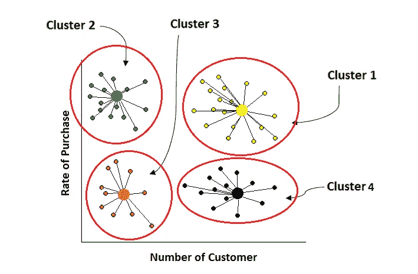
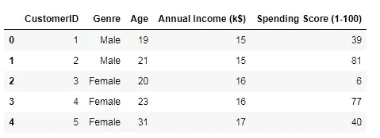
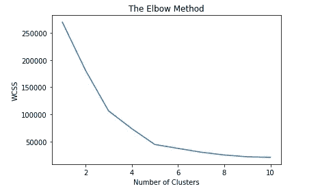
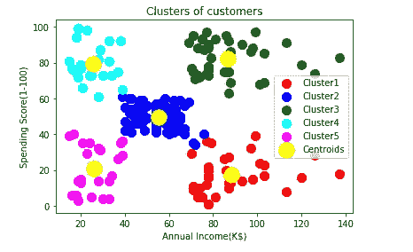

# 充分解释了使用 Python 进行 K-means 聚类

> 原文：<https://pub.towardsai.net/fully-explained-k-means-clustering-with-python-e7caa573176a?source=collection_archive---------0----------------------->

## [机器学习](https://towardsai.net/p/category/machine-learning)

## 群体相似性机器学习中的非监督部分。



k-均值聚类。作者的照片

K-means 聚类是一种非常简单而有见地的方法，可以从分组的聚类的相似性中进行推断。这是一种无监督的学习，我们没有输出标签。如果我们谈论回归、分类和聚类算法，回归主要用于根据事物的增长预测事物，主要根据数值预测天气等。另一方面，学习者有时会对分类和聚类感到困惑，简单的区别是聚类没有标签输出，而是对相似性进行处理，而分类使用已知的输出标签将他们归入组中。

聚类算法没有分类算法复杂。在分类中，我们训练和测试数据，而在聚类中，我们不需要它。聚类分析中不使用训练测试分裂的注意事项。

*   我们根据数据点的相似性进行分析。
*   测试误差将更多地集中在大量的群集上，即每个群集的质心上。
*   K-means 度量以惯性应该较低的方式选择聚类，这里惯性表示聚类内数据点的平方和(WCSS)。

我们不应该急于确定算法中要使用的聚类数。有几点我们必须先观察。

*   惯性思维非常快速且不可靠，即假设群体相似性是各向同性且凸的。各向同性意味着均匀的形状，而凸形意味着数据点更多地位于聚类的中间，而更少地位于聚类的边界。但是，现实世界的数据并不在这些假设上起作用，它们的形状和均匀性发生变化，它可以是不规则的形状，在一边被拉长。
*   数据集值的规范化。这意味着低惯性值是好的。但是在现实世界中，我们为聚类测量的数据点距离(无论是通过欧几里德距离测量还是曼哈顿距离测量)都可能被夸大。对此有一个术语叫做“维数灾难”。如果数据点有很大的变化，我们应该进行 PCA 和数据点的标准化。

K-means 算法的工作流程

*   如有必要，选择特征。
*   用一个数字初始化集群。
*   拟合数据。
*   预测适合的模型。

[](https://medium.com/towards-artificial-intelligence/fully-explained-logistic-regression-with-python-f4a16413ddcd) [## 用 Python 全面解释逻辑回归

### 机器学习算法中的统计非线性方法

medium.com](https://medium.com/towards-artificial-intelligence/fully-explained-logistic-regression-with-python-f4a16413ddcd) 

这些是流程的高端，但是我们将逐步看到 python 的示例，我们还将看到如何选择要采用的正确集群数量。

## 步骤 1:加载必要的库

```
import numpy as np
import pandas as pd
import matplotlib.pyplot as plt
```

## 步骤 2:将数据集载入 jupyter 笔记本

```
dataset=pd.read_csv('Customers.csv')
dataset.head()
```



数据集视图。作者的照片

为了知道数据集的形状

```
dataset.shape#output:
(200, 5)
```

## 步骤 3:拟合弯头方法的数据

```
#elbow method to find the number of clustersfrom sklearn.cluster import KMeanswcss=[]
for i in range(1,11):
    kmeans=KMeans(n_clusters=i, init='k-means++',random_state=0)
    kmeans.fit(X)
    wcss.append(kmeans.inertia_)plt.plot(range(1,11),wcss)
plt.title('The Elbow Method')
plt.xlabel('Number of Clusters')
plt.ylabel('WCSS')
plt.show()
```



肘法图。作者的照片

在上面的肘形图中可以看出，WCSS 在第 5 组之前急剧下降。所以，选择簇的数目是光学数。

## 步骤 4:将数据与适当数量的聚类相匹配

```
#Fitting K-MEans to the dataset
kmeans=KMeans(n_clusters=5,init='k-means++',random_state=0)
y_kmeans=kmeans.fit_predict(X)
```

在上面的代码中，我们在 *init* 参数中选择了*“k-means++”*。k-means++是一个默认设置，它用于将种子(质心)放置到一个合适的位置，这样所有的点都可以正确地收敛到质心。

## 步骤 5:可视化集群

```
#Visualize the clustersplt.scatter(X[y_kmeans==0,0],X[y_kmeans==0,1],s=100,c='red',label=
             'Cluster1')
plt.scatter(X[y_kmeans==1,0],X[y_kmeans==1,1],s=100,c='blue',label=
              'Cluster2')
plt.scatter(X[y_kmeans==2,0],X[y_kmeans==2,1],s=100,c='green',label=
              'Cluster3')
plt.scatter(X[y_kmeans==3,0],X[y_kmeans==3,1],s=100,c='cyan',label=
              'Cluster4')
plt.scatter(X[y_kmeans==4,0],X[y_kmeans==4,1],s=100,c='magenta',
               label='Cluster5')plt.scatter(kmeans.cluster_centers_[:,0],kmeans.cluster_centers_[:,1
             ],s=300,c='yellow',label='Centroids')plt.title('Clusters of customers')
plt.xlabel('Annual Income(K$)')
plt.ylabel('Spending Score(1-100)')
plt.legend()
plt.show()
```



顾客群。作者的照片

从聚类图中我们可以得到有用的见解。

[](https://medium.com/towards-artificial-intelligence/become-a-data-scientist-in-2021-with-these-following-steps-5bf70a0fe0a1) [## 按照以下步骤，在 2021 年成为一名数据科学家

### 走上数据科学家之路需要具备的基本点

medium.com](https://medium.com/towards-artificial-intelligence/become-a-data-scientist-in-2021-with-these-following-steps-5bf70a0fe0a1) 

> ***结论:***

聚类方法是预测有价值见解的非常有用的算法。虽然我遇到了一种算法，可以更好地处理大型数据集上的离群数据，但该算法的名称是聚类中的 BIRCH。

我希望你喜欢这篇文章。通过我的 [LinkedIn](https://www.linkedin.com/in/data-scientist-95040a1ab/) 和 [twitter](https://twitter.com/amitprius) 联系我。

# 推荐文章

1.  [NLP —用 Python 从零到英雄](https://medium.com/towards-artificial-intelligence/nlp-zero-to-hero-with-python-2df6fcebff6e?sk=2231d868766e96b13d1e9d7db6064df1)

2. [Python 数据结构数据类型和对象](https://medium.com/towards-artificial-intelligence/python-data-structures-data-types-and-objects-244d0a86c3cf?sk=42f4b462499f3fc3a160b21e2c94dba6)

3. [MySQL:零到英雄](https://medium.com/towards-artificial-intelligence/mysql-zero-to-hero-with-syntax-of-all-topics-92e700762c7b?source=friends_link&sk=35a3f8dc1cf1ebd1c4d5008a5d12d6a3)

4.[Python 时间序列基础](https://medium.com/towards-artificial-intelligence/basic-of-time-series-with-python-a2f7cb451a76?source=friends_link&sk=09d77be2d6b8779973e41ab54ebcf6c5)

5. [NumPy:用 Python 零到英雄](https://medium.com/towards-artificial-intelligence/numpy-zero-to-hero-with-python-d135f57d6082?source=friends_link&sk=45c0921423cdcca2f5772f5a5c1568f1)

6.[用 python 实现熊猫系列和数据帧的基础](https://medium.com/towards-artificial-intelligence/fundamentals-of-series-and-data-frame-in-pandas-with-python-6e0b8a168a0d?source=friends_link&sk=955350bf43c7d1680be6e37b15b6628b)