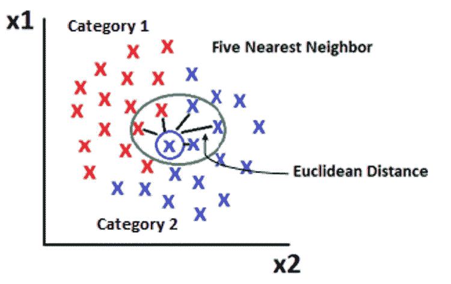
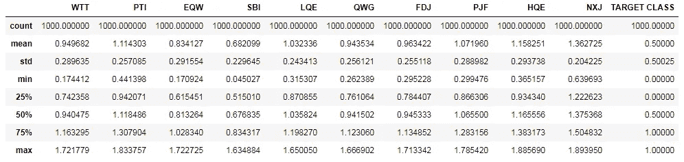
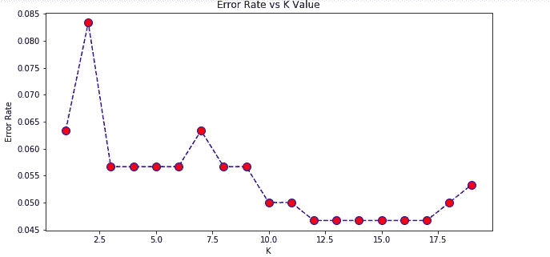

# 用 Python 完整解释 K 近邻

> 原文：<https://pub.towardsai.net/fully-explained-k-nearest-neighbors-with-python-ebbe27f93ba9?source=collection_archive---------2----------------------->

## [机器学习](https://towardsai.net/p/category/machine-learning)

## 数据科学中解决真实案例的机器学习分类算法研究。



KNN 的示例图。作者的照片

大家好，该系列的另一篇文章全面解释了机器学习算法。在本文中，我们将讨论 k 近邻分类问题。一篇好的文章就像故事的流程，读者可以在很短的时间内获得尽可能多的信息。

让我们澄清一些观点

*   在无监督的情况下，最近邻是许多学习技术如聚类的基础。
*   在监督学习的情况下，它分为两类:分类和回归。

因此，我们将讨论监督分类问题学习技术。

主要目标是根据数据点附近的样本预测新的数据点。这些采样点可以基于 k 值或半径。k 值由用户定义，半径基于数据点的密度。

测量新点与其附近样本点之间的距离是基于欧几里德距离或曼哈顿距离，前者是最常用的。嗯，有很多距离度量，用来度量距离，像切比雪夫，闵可夫斯基在向量空间里用实值。

还有许多其他距离度量，如下所示:

*   **哈弗辛:**输入输出上有弧度值时使用。
*   **汉明:**用于计算二进制字符串中的等长。
*   **Jaccard:** 基于两组之间的相似点。

谈论不同的距离，因为它们在分类和聚类的许多学习算法中起着重要作用。一个好的距离度量总是可以加快性能优化的速度。

[](/become-a-data-scientist-in-2021-with-these-following-steps-5bf70a0fe0a1) [## 按照以下步骤，在 2021 年成为一名数据科学家

### 走上数据科学家之路需要具备的基本点

pub.towardsai.net](/become-a-data-scientist-in-2021-with-these-following-steps-5bf70a0fe0a1) 

该算法在机器学习中采用某种类型的搜索，如下所示:

*   **强力搜索:**用于快速搜索最近邻。这是一个很好的小数据集，当数据集增长时不可行。
*   **K-D 树:**说到克服蛮力问题。这是基于树形结构的，距离搜索是基于关联的。如果 X 离 Y 远，Z 离 Y 近，那么 Z 离 X 也远，所以，在这个树中进行快速搜索优化。但是当相邻点在极限值之后增长时，也是不可行的。
*   **球树:**它的开发是为了克服 KD 树中的更多邻居维度问题。它构建了一个嵌套的超球面几何，在高维空间中非常有用。

在 k 近邻回归的情况下，数据应该是连续的形式。权重参数被用来分配为均匀或距离，以形成预测线。

选择正确的 K 值也很重要，它可以通过误差率图来选择，误差较小的值将是优化的 K 值。

[](/regression-and-classification-metrics-in-machine-learning-with-python-6d9fcd8b73aa) [## Python 机器学习中的回归和分类度量

### 使用度量 API 进行回归和分类的模型评估

pub.towardsai.net](/regression-and-classification-metrics-in-machine-learning-with-python-6d9fcd8b73aa) 

用 python 实现 KNN 算法。

导入库

```
import numpy as np 
import pandas as pd 
import matplotlib.pyplot as plt
import seaborn as sns
%matplotlib inline
```

现在，在熊猫的 read 方法的帮助下，读取数据集的 CSV 文件。

```
dataset = pd.read_csv('classified_data.csv')
```

查看前五行

```
dataset.head()
```


数据集的视图。作者的照片

删除建模中无用的未命名列。

```
dataset = dataset.drop("Unnamed: 0", axis=  1)
```

通过描述方法了解数据集的统计信息。

```
dataset.describe()
```



数据集的统计信息。作者的照片

在对模型建模之前，由于低值和高值的变化，我们需要对数据进行缩放。

```
from sklearn.preprocessing import StandardScaler
scaler = StandardScaler()
```

删除 asix=1 的目标变量作为列和独立特征。

```
#fitting the features
scaler.fit(dataset.drop('TARGET CLASS',axis=1))#tranform the data
scaled_features = scaler.transform(dataset.drop('TARGET CLASS',axis=1))
```

现在，制作一个变量来保存其中所有的独立特性。

```
df_feat = pd.DataFrame(scaled_features,columns=dataset.columns[:-1])
```

现在我们将数据分为训练集和测试集。

```
from sklearn.model_selection import train_test_split#drop trget class from frature
X = df_feat  
y = df['TARGET CLASS']#splitting in train and test set
X_train,X_test,y_train,y_test =
            train_test_split(X,y,test_size=0.3,random_state=42)
```

现在通过检查误差率图来选择 K 的合适值。

肘法得到 k 的最佳值。

```
error_rate = []for i in range(1,20):
    knn = KNeighborsClassifier(n_neighbors=i)
    knn.fit(X_train, y_train)
    y_pred_i = knn.predict(X_test)
    error_rate.append(np.mean(y_pred_i != y_test))
```

现在绘制图表

```
plt.figure(figsize=(10,5))
plt.plot(range(1,20),error_rate,color='blue',ls='--' 
              ,marker='o',markerfacecolor='red', markersize=10)
plt.title('Error Rate vs K Value')
plt.xlabel('K')
plt.ylabel('Error Rate')
```



错误率图表。作者的照片

分析图表后，最佳 K 值似乎是 11。因此，对于我们的 n_neighbors 参数，我们将使用这个值。

```
#import knn library
from sklearn.neighbors import KNeighborsClassifierknn = KNeighborsClassifier(n_neighbors=11)#fit the model
knn.fit(X_train, y_train)#output:
KNeighborsClassifier(algorithm='auto', leaf_size=30, metric='minkowski',metric_params=None, n_jobs=None, n_neighbors=11, p=2,weights='uniform')#predict the model
y_pred = knn.predict(X_test)
```

我们观察 KNN 分类器的参数，使用的度量是 Minkowski，P 值是 2，这意味着用于测量点的距离是欧几里得距离。

现在打印混淆度量和分类报告。

```
print(classification_report(y_test,y_pred))
print(confusion_matrix(y_test,y_pred))
```


分类报告和混淆矩阵。作者的照片

因此，对正确的目标列进行分类的准确率接近 95%。

> ***结论:***

在用误差图计算 k 值之后，我们实现了该模型。要了解使用和不使用图表的区别，我们可以将 k 值设为“1 ”,也可以在不缩放要素的情况下检查精度。

KNN 适用于小数据集，并且总是尝试使用不同的度量和算法参数来观察准确性，以获得更好的性能。

我希望你喜欢这篇文章。通过我的 [LinkedIn](https://www.linkedin.com/in/data-scientist-95040a1ab/) 和 [twitter](https://twitter.com/amitprius) 联系我。

# 推荐文章

1.  [NLP —用 Python 从零到英雄](https://medium.com/towards-artificial-intelligence/nlp-zero-to-hero-with-python-2df6fcebff6e?sk=2231d868766e96b13d1e9d7db6064df1)

2. [Python 数据结构数据类型和对象](https://medium.com/towards-artificial-intelligence/python-data-structures-data-types-and-objects-244d0a86c3cf?sk=42f4b462499f3fc3a160b21e2c94dba6)

3. [Python:零到英雄附实例](https://medium.com/towards-artificial-intelligence/python-zero-to-hero-with-examples-c7a5dedb968b?source=friends_link&sk=186aff630c2241aca16522241333e3e0)

4.[用 Python 全面讲解 SVM 分类](https://medium.com/towards-artificial-intelligence/fully-explained-svm-classification-with-python-eda124997bcd?source=friends_link&sk=da300d557992d67808746ee706269b2f)

5.[用 Python 全面解释 K-means 聚类](https://medium.com/towards-artificial-intelligence/fully-explained-k-means-clustering-with-python-e7caa573176a?source=friends_link&sk=9c5c613ceb10f2d203712634f3b6fb28)

6.[用 Python 全面解释线性回归](https://medium.com/towards-artificial-intelligence/fully-explained-linear-regression-with-python-fe2b313f32f3?source=friends_link&sk=53c91a2a51347ec2d93f8222c0e06402)

7.[用 Python 全面解释逻辑回归](https://medium.com/towards-artificial-intelligence/fully-explained-logistic-regression-with-python-f4a16413ddcd?source=friends_link&sk=528181f15a44e48ea38fdd9579241a78)

8.[Python 时间序列基础](https://medium.com/towards-artificial-intelligence/basic-of-time-series-with-python-a2f7cb451a76?source=friends_link&sk=09d77be2d6b8779973e41ab54ebcf6c5)

9. [NumPy:用 Python 零到英雄](https://medium.com/towards-artificial-intelligence/numpy-zero-to-hero-with-python-d135f57d6082?source=friends_link&sk=45c0921423cdcca2f5772f5a5c1568f1)

10.[机器学习中的混淆矩阵](https://medium.com/analytics-vidhya/confusion-matrix-in-machine-learning-91b6e2b3f9af?source=friends_link&sk=11c6531da0bab7b504d518d02746d4cc)