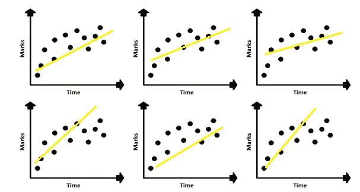
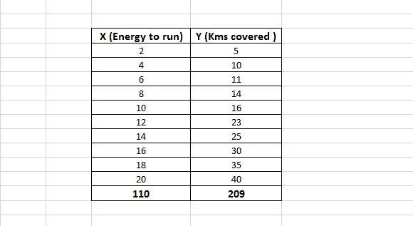
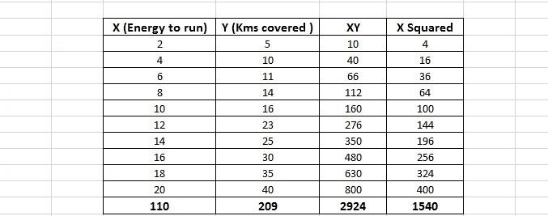
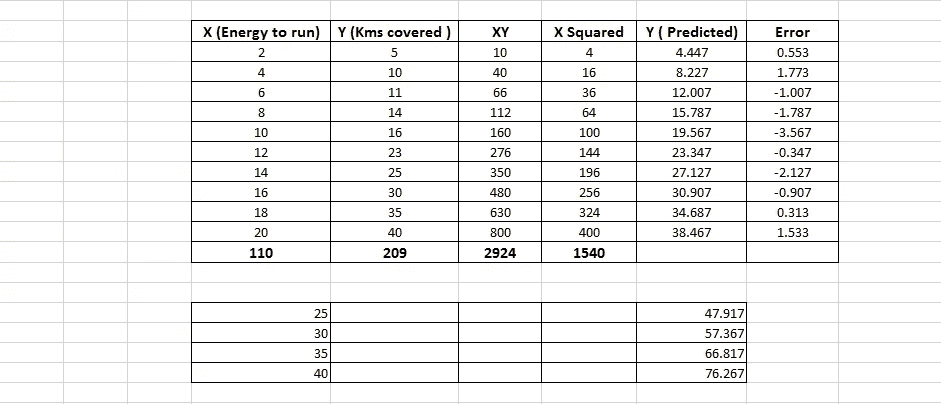
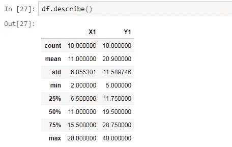
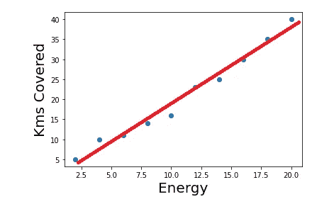

# 用 Python 全面解释线性回归

> 原文：<https://pub.towardsai.net/fully-explained-linear-regression-with-python-fe2b313f32f3?source=collection_archive---------0----------------------->

## [机器学习](https://towardsai.net/p/category/machine-learning)，[编程](https://towardsai.net/p/category/programming)

## 如何用一个真实的例子解决回归问题。



以最小误差拟合到最佳位置。作者图片

简单线性回归用于预测分析和做出推断。在这种类型中，有一个自变量和一个因变量。每当建模中出现因果关系时，我们就会进行回归分析。当我们使用因子分析技术时，性能在实时分析中更精确。监督机器学习中的回归分析基础。这里需要注意三件重要的事情:

*   我们需要数据来进行分析，对于整个人口来说，这是一项非常繁琐的任务，所以我们需要样本数据来进行分析。
*   获得数据后，我们需要设计一个模型，使其适用于所有人群。
*   建模后，我们可以对人口进行预测。

[](https://medium.com/towards-artificial-intelligence/rust-zero-to-hero-basic-introduction-in-a-new-programming-language-part-1-3-d7fe175f190e) [## RUST:新编程语言入门(第 1/3 部分)

### 一种非常适合安全和控制的语言

medium.com](https://medium.com/towards-artificial-intelligence/rust-zero-to-hero-basic-introduction-in-a-new-programming-language-part-1-3-d7fe175f190e) 

前面，我们注意到它是因果型建模。我们得到了线性回归。线性意味着随着原因的增加，结果也在增加，所以两者是平行变化的。我们需要一些数学方法来得到线性预测。所以我们用一条直线的方程来得到一条直线的性质。

直线的方程式是

> y = mx + b

这里，

**Y** 是因变量(结果)或预测变量。

**X** 是一个自变量。

**M** 是一个斜率，或者我们可以说是梯度。

**B** 是 y 轴上的截距值。

Y 是 x 的函数。回归模型是线性近似。为了一个好的预测，我们需要找到 **B** 和 **M.**

示例:

假设我们有能量和公里数的健康数据。



作者图片

我们需要找到 B**和 M**和**T21。下面给出了计算这些值的公式:**

M =样本数* ( XY 总和- X 总和*Y 总和)/样本数* (X 平方和- X 总和的平方)

B = Y 总和- M * X 总和/样本数

图像显示了这些值。



作者图片

算完值，M 得出 1.89，B 得出 0.667。根据这些值，我们可以从公式中得到一个预测值。

> Y = 1.89*X + 0.667

在检查一些 X 值来预测公里数之后。下面显示了一个示例:



基于新 X 值的预测公里数。作者图片

我们得到了我们的模型，但一个简单的技术。让我们用 python 检查一下我们是否得到相同的值。

```
#import all the librariesimport numpy as np 
import pandas as pd
import matplotlib.pyplot as plt
import statsmodels.api as sm
```

读取 excel 文件

```
df = pd.read_excel("fitness.xlsx")
```

使用 describe 函数查看统计数据。



作者图片

把数据分割成 x 和 y。

```
y = df['Y1']
x = df['X1']#plot the scatter plot between themplt.scatter(x,y)
plt.xlabel('Energy', fontsize =20)
plt.ylabel('Kms Covered', fontsize =20)
plt.show()
```

我们几乎得到一个线性相关。


现在根据我们的数据拟合 OLS 模型。

```
x_new = sm.add_constant(x)
output = sm.OLS(y, x_new).fit()
output.summary()#output: coef        
---------------------------------
const          0.667   
x1             1.89
```

在得到摘要之后，我们得到相同的值。这里我们使用 statsmodels，它是一个优秀的统计和推理库。

拟合后，OLS 模型让我们用拟合的线检查散点图。

```
plt.scatter(x1,y)
y_pred = 1.89*X + 0.667
fig = plt.plot(x1, y_pred, lw = 5, c='red', label='regression line' plt.xlabel('Energy', fontsize =20)
plt.ylabel('Kms Covered', fontsize =20)
plt.show()
```

这是最佳直线拟合后的散点图。



结论:

OLS 提供了一个简单的线性回归近似值，而 statsmodel 提供了对数据统计的精彩见解。

我希望你喜欢这篇文章。通过我的 [LinkedIn](https://www.linkedin.com/in/data-scientist-95040a1ab/) 和 [twitter](https://twitter.com/amitprius) 联系我。

# 推荐文章

1.[Python 最有用的 15 种 NumPy 方法](/15-most-usable-numpy-methods-with-python-4d20eb93e149?sk=911d2bebf042b148be8f366b907af158)
2。 [NumPy:图像上的线性代数](/numpy-linear-algebra-on-images-ed3180978cdb?source=friends_link&sk=d9afa4a1206971f9b1f64862f6291ac0)3。[Python 中的异常处理概念](/exception-handling-concepts-in-python-4d5116decac3?source=friends_link&sk=a0ed49d9fdeaa67925eac34ecb55ea30)
4。[熊猫:处理分类数据](/pandas-dealing-with-categorical-data-7547305582ff?source=friends_link&sk=11c6809f6623dd4f6dd74d43727297cf)
5。[超参数:机器学习中的 RandomSeachCV 和 GridSearchCV](/hyper-parameters-randomseachcv-and-gridsearchcv-in-machine-learning-b7d091cf56f4?source=friends_link&sk=cab337083fb09601114a6e466ec59689)
6。[用 Python](https://medium.com/towards-artificial-intelligence/fully-explained-linear-regression-with-python-fe2b313f32f3?source=friends_link&sk=53c91a2a51347ec2d93f8222c0e06402)
7 全面讲解了线性回归。[用 Python](https://medium.com/towards-artificial-intelligence/fully-explained-logistic-regression-with-python-f4a16413ddcd?source=friends_link&sk=528181f15a44e48ea38fdd9579241a78)
充分解释了 Logistic 回归 8。[数据分发使用 Numpy 与 Python](/data-distribution-using-numpy-with-python-3b64aae6f9d6?source=friends_link&sk=809e75802cbd25ddceb5f0f6496c9803)
9。 [40 种 Python 中最疯狂可用的方法](https://medium.com/pythoneers/40-most-insanely-usable-methods-in-python-a983c78f5bfd?sk=07df9058ea3e8c2fce4318a73cd8fce9)
10。[Python 中最常用的 20 种熊猫快捷方式](https://medium.com/pythoneers/20-most-usable-pandas-shortcut-methods-in-python-c9bc065ce11e?sk=1faf673d0cdfb46234975cbdeed12beb)