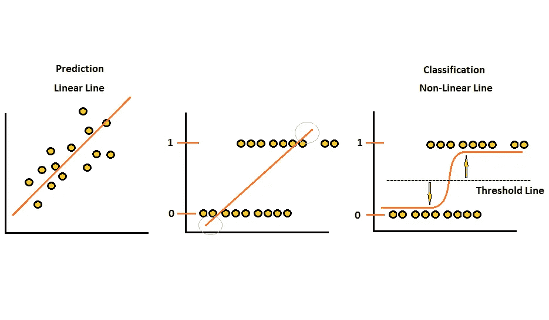
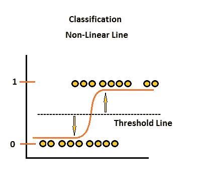
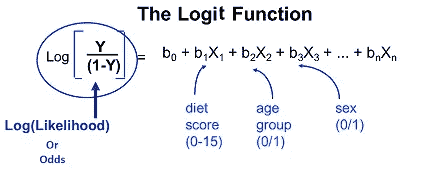
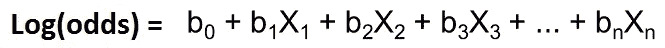
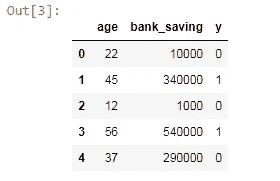
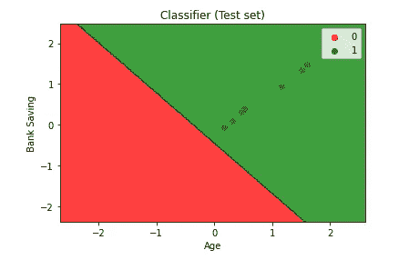
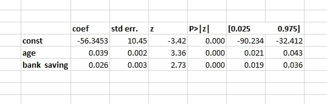
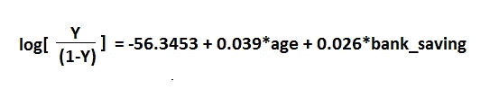

# 用 Python 全面解释逻辑回归

> 原文：<https://pub.towardsai.net/fully-explained-logistic-regression-with-python-f4a16413ddcd?source=collection_archive---------0----------------------->

## [机器学习](https://towardsai.net/p/category/machine-learning)

## 机器学习算法中的统计非线性方法



线性和非线性图。作者的照片

我们从线性回归模型切换到非线性回归模型的原因是因为输出特征变量。上周学习线性回归时，我得到了一个因变量有类别的数据集。

在这篇文章中，我们将讨论有关逻辑回归的基本概念，并了解我们将如何最大似然估计和日志(赔率)。很好的理解是非常重要的，它会节省我们很多时间。

[](https://medium.com/towards-artificial-intelligence/fully-explained-linear-regression-with-python-fe2b313f32f3) [## 用 Python 全面解释线性回归

### 如何用一个真实的例子解决回归问题。

medium.com](https://medium.com/towards-artificial-intelligence/fully-explained-linear-regression-with-python-fe2b313f32f3) 

首先，我们需要知道为什么线性回归不适合数据的类别。从下图中，我们观察到第一个是线性回归，第二个也是线性的，但有二进制类别值。从这两幅图中我们可以看出，第一幅图的值呈线性逼近，即自变量增加，因变量也增加。但是，第二张图没有说明这种类型的行为，而是仅在两个值(即“0”和“1”)上标出了因变量的值。


不同类型因变量的线性逼近。作者的照片

如果我们对第二个值使用线性方法，误差率将会增加，我们的模型将不会很好地拟合，还有一点需要注意，线性线在我们不需要预测的数据点的上方和下方。因此，我们需要一种方法，在这种方法中，预测将只在“0”和“1”中。



逻辑回归曲线。作者的照片

从这个思路出发，我们可以思考概率值在“0”到“1”范围内的概率。好吧，但是我们也需要改变我们的预测线。许多函数基于某个阈值给出“0”和“1”的值。这条曲线可以称为逻辑回归曲线或逻辑函数。

logit 回归模型如下所示。



逻辑模型。照片来自 sphweb.bumc.bu.edu

所以，概率的对数等于线性模型。



logit 函数比普通的逻辑函数更容易理解。所以，这个函数只不过是给出“0”和“1”中的值的 sigmoid 函数。

当我们试图拟合我们的模型时，它会在内部计算迭代和函数值。这两个词的意思都是，在多次迭代之后，模型优化将不起作用，在函数值中获得的值是目标函数的值，通过该值我们得到收敛。

[](https://medium.com/towards-artificial-intelligence/fundamentals-of-series-and-data-frame-in-pandas-with-python-6e0b8a168a0d) [## 用 python 实现熊猫系列和数据框架的基础

### 数据框中常用参数的基础知识

medium.com](https://medium.com/towards-artificial-intelligence/fundamentals-of-series-and-data-frame-in-pandas-with-python-6e0b8a168a0d) 

现在让我们用 python 做一些实际的事情。

我们创建了一个小数据集来解释逻辑回归中二进制输出的分类方法。

```
#importing the libraries
import pandas as pd
import numpy as np
import matplotlib.pyplot as plt
%matplotlib inline
import warnings
warnings.filterwarnings("ignore")
```

现在读取 excel 文件并查看它的前 5 行。

```
df = pd.read_excel("logistic.xlsx")
df.head()
```



数据集的前 5 行。作者的照片

将数据集分成独立变量和因变量。

```
x = df.iloc[:,[0,1]].values
y = df.iloc[:,2].values
```

现在，将数据分为训练和测试数据。

```
from sklearn.model_selection import train_test_split 
x_train, x_test, y_train, y_test = train_test_split(x, y, test_size =
                                           0.25, random_state = 0)
```

标准化数据，使数字的变化成为正常。

```
from sklearn.preprocessing import StandardScaler 
sc_x = StandardScaler() 
x_train = sc_x.fit_transform(x_train)  
x_test = sc_x.transform(x_test)
```

使训练集适合模型。

```
from sklearn.linear_model import LogisticRegression 
classifier = LogisticRegression(random_state = 0) 
classifier.fit(x_train, y_train)
```

用分类器进行预测。

```
y_pred = classifier.predict(x_test)
```

生成混淆矩阵。

```
from sklearn.metrics import confusion_matrix 
conf_matrix = confusion_matrix(y_test, y_pred) 

print ("Confusion Matrix : \n", conf_matrix)#output:
Confusion Matrix : 
 [[10  0]
 [ 0 10]]
```

检查逻辑模型的准确性。

```
from sklearn.metrics import accuracy_score 
print ("Accuracy : ", accuracy_score(y_test, y_pred))#output:
Accuracy :  1.0
```

绘制二元分类模型。

```
from matplotlib.colors import ListedColormap 
X_set, y_set = x_test, y_test 
X1, X2 = np.meshgrid(np.arange(start = X_set[:, 0].min() - 1,  
                               stop = X_set[:, 0].max() + 1, step = 0.01), 
                     np.arange(start = X_set[:, 1].min() - 1,  
                               stop = X_set[:, 1].max() + 1, step = 0.01)) 

plt.contourf(X1, X2, classifier.predict( 
             np.array([X1.ravel(), X2.ravel()]).T).reshape( 
             X1.shape), alpha = 0.75, cmap = ListedColormap(('red', 'green'))) 

plt.xlim(X1.min(), X1.max()) 
plt.ylim(X2.min(), X2.max()) 

for i, j in enumerate(np.unique(y_set)): 
    plt.scatter(X_set[y_set == j, 0], X_set[y_set == j, 1], 
                c = ListedColormap(('red', 'green'))(i), label = j) 

plt.title('Classifier (Test set)') 
plt.xlabel('Age') 
plt.ylabel('Bank Saving') 
plt.legend() 
plt.show()
```



统计模型的逻辑回归。

```
import statsmodels.api as sm
```

符合逻辑回归

```
x1 = sm.add_constant(x)
log_reg = sm.logit(y,x1)
log_output = log_reg.fit()
```

现在检查统计模型的摘要。

```
log_output.summary()
```



逻辑模型摘要的一部分。作者的照片

在这个逻辑总结中，我们有伪 R-square。一般来说，我们有一些像 AIC，BIC 和麦克法登的 R 平方。在此拟合中，它使用了麦克法登，其值为 0.3458。良好伪 r 平方的良好范围值在 0.2 到 0.4 值之间。logit 模型如下所示:



Logit 模型。作者的照片

我们用 logit 模型创建了逻辑回归的一般模型。

> ***结论:***

本文展示了在二元分类问题中使用逻辑回归的基本思想。结果值可能因数据集和运行模型的机器速度而异。

我希望你喜欢这篇文章。通过我的 [LinkedIn](https://www.linkedin.com/in/data-scientist-95040a1ab/) 和 [twitter](https://twitter.com/amitprius) 联系我。

# 推荐文章

1.  [NLP —用 Python 从零到英雄](https://medium.com/towards-artificial-intelligence/nlp-zero-to-hero-with-python-2df6fcebff6e?sk=2231d868766e96b13d1e9d7db6064df1)

2. [Python 数据结构数据类型和对象](https://medium.com/towards-artificial-intelligence/python-data-structures-data-types-and-objects-244d0a86c3cf?sk=42f4b462499f3fc3a160b21e2c94dba6)

3. [MySQL:零到英雄](https://medium.com/towards-artificial-intelligence/mysql-zero-to-hero-with-syntax-of-all-topics-92e700762c7b?source=friends_link&sk=35a3f8dc1cf1ebd1c4d5008a5d12d6a3)

4.[Python 时间序列基础](https://medium.com/towards-artificial-intelligence/basic-of-time-series-with-python-a2f7cb451a76?source=friends_link&sk=09d77be2d6b8779973e41ab54ebcf6c5)

5. [NumPy:用 Python 零到英雄](https://medium.com/towards-artificial-intelligence/numpy-zero-to-hero-with-python-d135f57d6082?source=friends_link&sk=45c0921423cdcca2f5772f5a5c1568f1)