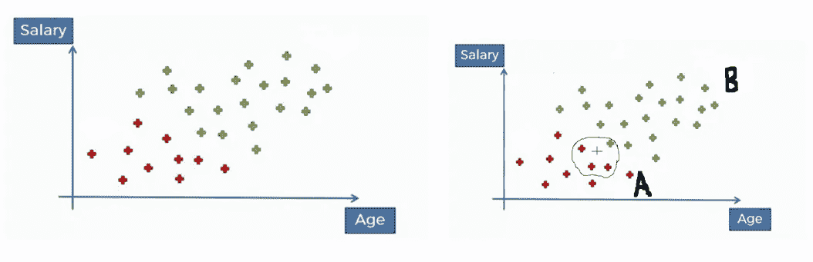
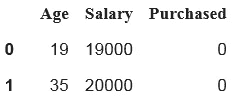
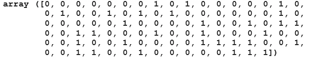
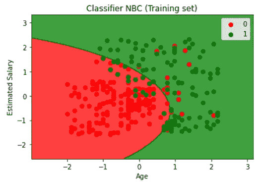
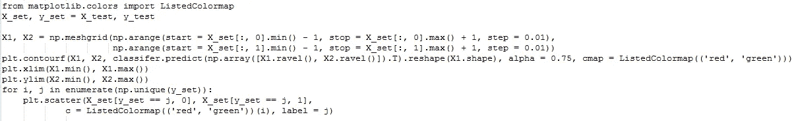
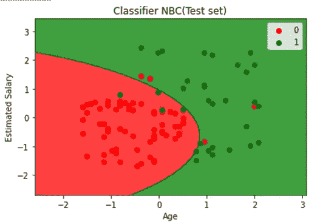

# 用 Python 例子充分解释了朴素贝叶斯分类

> 原文：<https://pub.towardsai.net/fully-explained-naive-bayes-classification-with-python-example-9110fcf2db?source=collection_archive---------1----------------------->

## [机器学习](https://towardsai.net/p/category/machine-learning)

## 监督机器学习算法


由[亚历克斯·丘马克](https://unsplash.com/@ralexnder?utm_source=medium&utm_medium=referral)在 [Unsplash](https://unsplash.com?utm_source=medium&utm_medium=referral) 上拍摄的照片

## 介绍

朴素贝叶斯是一种简单而流行的机器学习分类算法。它的工作是基于贝叶斯概率定理的原理，在计算条件概率之后预测未知数据点的类别，它的工作是基于贝叶斯定理，假设与预测器无关。

贝叶斯分类器认为一个特征与具有一组特征的特定类中的其他特征无关。

朴素贝叶斯模型用于大型数据集，例如在您的数据集中有成百上千个数据点和一些变量的地方或情况，因为这种算法比其他分类算法非常快速且易于实现。

贝叶斯定理是在已知一个事件发生的概率的情况下，求出另一个事件发生的概率。

在概率学中，贝叶斯定理描述了一个事件发生的概率，它基于可能与该事件相关的条件的先验知识。

公式如下所示:

**P(A|B) = P(B|A)*P(A) / P(B)**

借助一个例子，我们可以理解贝叶斯定理的全部工作原理。

让我们有两台机器，机器 1 和机器 2 制作面包。两台机器每小时分别生产 30 和 20 个面包。这两台机器每小时生产 50 个面包。

我们必须测量有缺陷零件的概率。

下面给出一些先验知识:

```
**Machine1**: 30 Breads / hr      =>   **P(Machine1**) = 30/50 = 0.6**Machine2**: 20 Breads /hr       =>  **P(Machine2**) = 20/50 =0.4Out of all product parts 1% are defective out of all defective parts => **P(Defect)** = 1%.We can see that 50% came from machine1 => **P(Machine1|Defect)** = 50%And 50% came from machine2  =>     **P(Machine2|Defect**) = 50% =>     **P(Defect | Machine2**) = ?
```

上述条件下的公式如下所示:

```
**P(Defect|Machine2) = P(Machine2|Defect)*P(Defect) / P(Machine2)****P(Defect | Machine2)** = 0.5 * 0.01 / 0.4 = 0.0125  =>  **1.25%**
```

我们可以说总**不良零件**的 **1.25%** 是由**机 2** 制造的，同样我们可以计算**机 1** 的不良零件。

## **朴素贝叶斯分类器的工作**

下面给我们一个年龄与工资的图表，红色数据点代表 A 级**和 b 级**

****

**图像[来源](https://techdifferences.com/difference-between-classification-and-clustering.html)**

**让我们假设一个**新值(+)** ，我们必须在朴素贝叶斯分类器的帮助下预测这个 **(+)** 属于 A 类还是 B 类。**

**因此基于 A 类和 B 类的朴素贝叶斯公式会是这样的:**

```
**P(A|B) = P(B|A)*P(A) / P(B)**
```

**现在计算所有的概率，如上面的公式所示:**

```
**P( ClassA )  = 10 /30 = 0.33**     
**P( ClassB )=   20 /30 = 0.66****Using Circle P(X)  = 4/30 = 0.13**              
**Using Circle P(X)  = 4/30 = 0.13****Using Circle with Red Data   
P(X | ClassA) = 3 / 10  = 0.3****Using Circle with Red Data   
P(X | ClassB) = 1 /20   = 0.05****P( ClassB | X) *=* P(X | ClassB)*P( ClassB ) / P(X) = 0.25**
```

**在哪里，**

****P( ClassB | X) —** 后验概率**

****P(X | class b)——**似然概率**

****P(class b)——**先验概率**

****P(X) —** 边际概率**

```
#Similarly for Class A
**P( ClassA | X) *=* P(X | ClassA)*P( ClassA ) / P(X)  =  0.75**
```

**因此， **0.75 > 0.25****

****我们的新值(+)属于/分配给 A 类**，A 类中存在的数据点数量将变为 11。**

## ****朴素贝叶斯的类型****

*   ****高斯朴素贝叶斯:**在高斯 NB 中，特征后面是正态分布曲线，而不是离散值。**
*   ****多项朴素贝叶斯:**在多项 NB 特征之后是离散值计数。文本内分类问题我们可以统计一个独特的词在文档中出现的频率。文档可以包括体育、政治、教育等。**
*   ****伯努利朴素贝叶斯:**二项式 NB 模型仅用于二进制形式的特征向量，即 0 和 1。例如，在文本分类中，0 和 1 决定句子中出现的单词。**

****应用:****

```
1\. Making predictions.
2\. Multiclass prediction feature
3\. Classify articles.
4\. Text classification
5\. Spam Filtering
6\. Sentiment Analysis
7\. Recommendation System
```

## ****优点****

*   **预测测试数据属于某个特定的类既快又容易。多类归属预测也可以顺利完成。**
*   **预测比其他分类算法更准确，如逻辑回归、KNN 等。**
*   **分类数据的表现非常好。**

## ****缺点****

*   **假设我们有一个未提供训练的分类变量，那么我们的模型将为其分配 0 概率，预测不会发生，称为零频率。**
*   **朴素贝叶斯假设独立的预测器，而在现实生活中，不可能有一组彼此完全独立的预测器。**

## ****朴素贝叶斯的 Python 代码****

```
# Importing the librariesimport numpy as np
import matplotlib.pyplot as plt
import pandas as pd
```

**导入数据集**

```
dataset = pd.read_csv('/content/LR.csv')
dataset.head(2)
```

****

**作者的照片**

**将数据分为自变量和因变量。**

```
X = dataset.iloc[:, [0,1]].values
y = dataset.iloc[:, 2].values
```

**分为训练集和测试集**

```
from sklearn.model_selection import train_test_splitX_train, X_test, y_train, y_test = 
              train_test_split(X,y,test_size=0.25, random_state=0)
```

**缩放数据的训练集和测试集。**

```
from sklearn.preprocessing import StandardScalersc_X = StandardScaler()X_train = sc_X.fit_transform(X_train)
X_test = sc_X.fit_transform(X_test)
```

**拟合和预测模型。**

```
from sklearn.naive_bayes import GaussianNBclassifer=GaussianNB()classifer.fit(X_train,y_train)
GaussianNB(priors=None, var_smoothing=1e-09)y_pred = classifer.predict(X_test)
y_pred
```

****

**作者的照片**

**计算混淆矩阵和模型的准确性。**

```
from sklearn.metrics import confusion_matrixcm =confusion_matrix(y_test, y_pred)
cm**#output:**
array([[64,  4],
       [ 5, 27]])#accuracy
from sklearn.metrics import accuracy_scoreaccuracy_score(y_test, y_pred)**#output:** 0.91
```

**可视化训练集结果**

****

**作者的照片**

```
plt.title('Classifier NBC (Training set)')
plt.xlabel('Age')
plt.ylabel('Estimated Salary')
plt.legend()
plt.show()
```

****

**训练集的分类。作者的照片**

**可视化测试集结果**

****

**作者的照片**

```
plt.title('Classifier NBC(Test set)')
plt.xlabel('Age')
plt.ylabel('Estimated Salary')
plt.legend()
plt.show()
```

****

**测试集的分类。作者的照片**

## ****结论****

**本文简要介绍了朴素贝叶斯分类监督机器学习算法，该算法比其他分类算法，如逻辑斯蒂和 KNN 等，给出更准确的结果。**

**我希望你喜欢这篇文章。通过我的 [LinkedIn](https://www.linkedin.com/in/data-scientist-95040a1ab/) 和 [twitter](https://twitter.com/amitprius) 联系我。**

# **推荐文章**

**[1。NLP —零到英雄用 Python](https://medium.com/towards-artificial-intelligence/nlp-zero-to-hero-with-python-2df6fcebff6e?sk=2231d868766e96b13d1e9d7db6064df1)
2。 [Python 数据结构数据类型和对象](https://medium.com/towards-artificial-intelligence/python-data-structures-data-types-and-objects-244d0a86c3cf?sk=42f4b462499f3fc3a160b21e2c94dba6)
3。[Python 中的异常处理概念](/exception-handling-concepts-in-python-4d5116decac3?source=friends_link&sk=a0ed49d9fdeaa67925eac34ecb55ea30)
4。[为什么 LSTM 在深度学习方面比 RNN 更有用？](/deep-learning-88e218b74a14?source=friends_link&sk=540bf9088d31859d50dbddab7524ba35)
5。[神经网络:递归神经网络的兴起](/neural-networks-the-rise-of-recurrent-neural-networks-df740252da88?source=friends_link&sk=6844935e3de14e478ce00f0b22e419eb)
6。[用 Python 充分解释了线性回归](https://medium.com/towards-artificial-intelligence/fully-explained-linear-regression-with-python-fe2b313f32f3?source=friends_link&sk=53c91a2a51347ec2d93f8222c0e06402)
7。[用 Python](https://medium.com/towards-artificial-intelligence/fully-explained-logistic-regression-with-python-f4a16413ddcd?source=friends_link&sk=528181f15a44e48ea38fdd9579241a78)
充分解释了 Logistic 回归 8。[concat()、merge()和 join()与 Python](/differences-between-concat-merge-and-join-with-python-1a6541abc08d?source=friends_link&sk=3b37b694fb90db16275059ea752fc16a)
9 的区别。[与 Python 的数据角力—第一部分](/data-wrangling-with-python-part-1-969e3cc81d69?source=friends_link&sk=9c3649cf20f31a5c9ead51c50c89ba0b)
10。[机器学习中的混淆矩阵](https://medium.com/analytics-vidhya/confusion-matrix-in-machine-learning-91b6e2b3f9af?source=friends_link&sk=11c6531da0bab7b504d518d02746d4cc)**