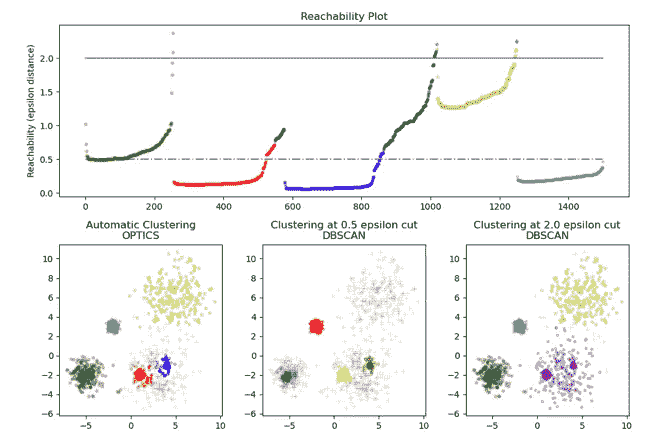
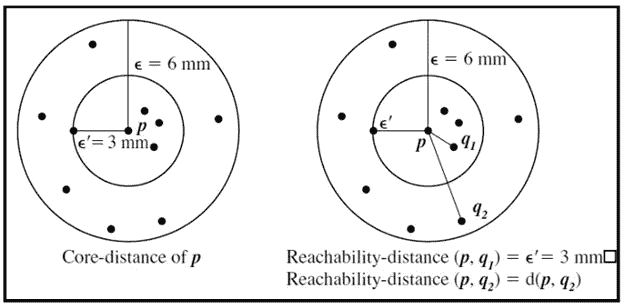
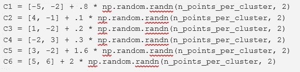
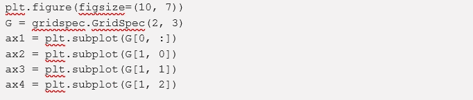
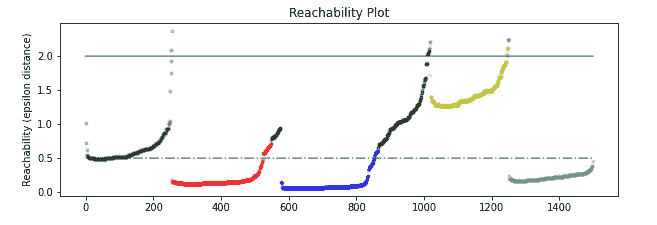
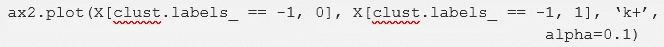
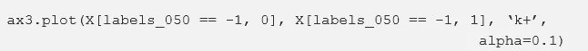
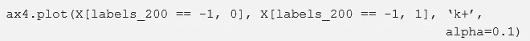
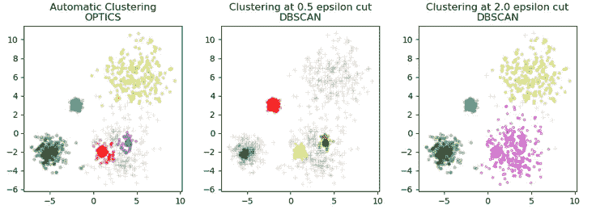

# 使用 Python 示例全面解释光学聚类

> 原文：<https://pub.towardsai.net/fully-explained-optics-clustering-with-python-example-4553108fa04b?source=collection_archive---------0----------------------->

## [机器学习](https://towardsai.net/p/category/machine-learning)

## 无监督机器学习算法



**光学:聚类技术**

众所周知，聚类是一种强大的无监督知识发现工具，目前用于将我们的数据点划分为相似特征类型的组。然而，每种聚类算法都是根据参数来工作的。基于相似性的技术(K-means 聚类算法工作基于数据点的相似性，其任务是指定多少个聚类可用，而分层聚类算法决定何时手动分配完成的聚类。通常使用的基于密度的聚类技术是 DBSCAN，它需要两个关于它如何定义其核心点的参数，但是找到参数是一项极其困难的任务。

DBSCAN 的相对算法叫做**光学(排序点识别团簇结构)**。它将创建一个可达性图，用于提取聚类，当输入时，最大ε可用于加速计算时间。

**算法的工作原理**

为了更好地理解光学，我们必须了解以下内容，如 DBSCAN 的工作原理、参数以及核心点和边界点之间的差异。

*核心距离-* 这是用于使一个独特点成为核心点的最小值。它是用于将一个点分类为核心点的半径的最小值。

*可达性距离-* 这是一个物体‘p’与另一个物体点‘o’之间的最小距离，但不能小于点‘o’。



图像[来源](https://towardsdatascience.com/clustering-using-optics-cac1d10ed7a7)

所有距离将以大致相同的速率缩放，因此当 MinPts 用于执行计算时，可能不会有太大影响。

核心距离可以在用于提取聚类的集合中的所有数据点上计算，然后我们将循环通过整个数据集，并更新可达性距离，每个点仅处理一次。没有被处理的数据点要被更新以得到可达距离，我们必须设置它的排序和它的可达距离。

处理完这些数据后，我们为流程选择下一个数据点，它可以基于最近的可达性距离来选择。这是算法的工作原理，以保持聚类在输出顺序中彼此靠近。

例如，局部最小值和最大值用于搜索图中的山谷。

[](/standardization-in-data-preprocessing-with-python-96ae89d2f658) [## 用 Python 实现数据预处理的标准化

### 机器学习和深度学习算法中的缩放方法

pub.towardsai.net](/standardization-in-data-preprocessing-with-python-96ae89d2f658) 

**光学与 DBSCAN 有何不同？**

光学和 DBSCAN 结果非常相似，但并不总是像标记外围和噪声点那样。每个第一个样本的可达性在每个密集区域点以及它们所在区域的数据点中更大。当相邻点被标记为外围点或噪声点时，这会影响相邻点的问题。

据观察，对于任何单个 eps 值，DBSCAN 将具有比光学器件更短的运行时间，但是对于在不同 eps 值下的重复运行，光学器件的单次运行可能比 DBSCAN 需要更少的运行时间。还观察到，只有当 eps 和 max_eps 接近时，OPTICS 的输出才接近 DBSCAN 的输出。

下面给出了一些生成的样本数据、光学标签和可达性图。彩色点代表聚类，而灰色点代表噪声。

**离群点检测**

Optics 算法的扩展用于异常值检测，称为 OPTICS-of，其中 OF 代表异常值因子。它会给每个点一个异常值，这意味着与其最近的邻居进行比较，而不是整个集合。这是一种独特的离群点检测，因为它是基于局部原则。

首先，它创建了一个新的度量，局部可达性密度，它是关于 MinPts-neighbors 的计算点的平均可达性的倒数。一旦对每个点都做了，我们就能计算出异常值因子。为了计算异常值因子 y，我们可以取该特定点的 MinPts-neighbors 比率的平均值。OPTICS-OF 的关键是将它与其他离群点检测方法分开的局部分量，因为它基于特定选项的邻域工作。

**代号**

```
from sklearn.cluster import OPTICS, cluster_optics_dbscan
import matplotlib.gridspec as gridspec
import matplotlib.pyplot as plt
import numpy as np
```

matplotlib.gridspec 作为 gridspec 用于需要在同一图形内进行子绘图的地方。Left、right、bottom、top、hspace 和 wspace 都可以确定网格单元的位置。

```
# Generate sample datanp.random.seed(0)
n_points_per_cluster = 250
```



```
clust = OPTICS(min_samples=50, xi=.05, min_cluster_size=.05)
```

当我们需要按行(垂直)堆叠数组时，使用 np.vstack。

```
# Run the fitclust.fit(X)labels_050 = cluster_optics_dbscan(reachability=clust.reachability_,
                               core_distances=clust.core_distances_,
                               ordering=clust.ordering_, eps=0.5)labels_200 = cluster_optics_dbscan(reachability=clust.reachability_,
                               core_distances=clust.core_distances_,
                               ordering=clust.ordering_, eps=2)space = np.arange(len(X))reachability = clust.reachability_[clust.ordering_]
labels = clust.labels_[clust.ordering_]
```



```
# Reachability plotcolors = [‘g.’, ‘r.’, ‘b.’, ‘y.’, ‘c.’]for klass, color in zip(range(0, 5), colors):
    Xk = space[labels == klass]
    Rk = reachability[labels == klass]
    ax1.plot(Xk, Rk, color, alpha=0.3)ax1.plot(space[labels == -1], reachability[labels == -1], ‘k.’, alpha=0.3)ax1.plot(space, np.full_like(space, 2., dtype=float), ‘k-’, alpha=0.5)ax1.plot(space, np.full_like(space, 0.5, dtype=float), ‘k-.’, alpha=0.5)ax1.set_ylabel(‘Reachability (epsilon distance)’)
ax1.set_title(‘Reachability Plot’)
```



Klass 利用 python 中的类对象，包括方法的自参数、继承和在超类上调用方法的能力。

[](https://medium.com/pythoneers/fully-explained-mean-shift-clustering-with-python-51aef7a17c5d) [## 用 Python 全面解释均值漂移聚类

### 基于无监督质心的算法学习

medium.com](https://medium.com/pythoneers/fully-explained-mean-shift-clustering-with-python-51aef7a17c5d) 

#光学

```
ax2 = plt.subplot(G[1, 0])
ax3 = plt.subplot(G[1, 1])
ax4 = plt.subplot(G[1, 2])colors = [‘g.’, ‘r.’, ‘b.’, ‘y.’, ‘c.’]for klass, color in zip(range(0, 5), colors):
    Xk = X[clust.labels_ == klass]
    ax2.plot(Xk[:, 0], Xk[:, 1], color, alpha=0.3)
```



```
 ax2.set_title(‘Automatic Clustering\nOPTICS’)# DBSCAN at 0.5for klass, color in zip(range(0, 6), colors):
    Xk = X[labels_050 == klass]
    ax3.plot(Xk[:, 0], Xk[:, 1], color, alpha=0.3, marker=’.’)
```



```
 ax3.set_title(‘Clustering at 0.5 epsilon cut\nDBSCAN’)# DBSCAN at 2.colors = [‘g.’, ‘m.’, ‘y.’, ‘c.’]for klass, color in zip(range(0, 4), colors):
    Xk = X[labels_200 == klass]
    ax4.plot(Xk[:, 0], Xk[:, 1], color, alpha=0.3)
```



```
 ax4.set_title(‘Clustering at 2.0 epsilon cut\nDBSCAN’)plt.tight_layout()
plt.show()
```



请注意，在这个生成的示例中，有足够多的点被识别为噪声点。当我们达到更高的ε数时，聚类的形成正在改变，并且我们还看到，与其他聚类相比，自动聚类中的噪声也变得更少。在这种情况下，它显示了微调提取参数的好处。

**缺点**

光学的一个缺点是不能处理重复值。假设多个或多个点占据相同的空间，那么它们的可达性距离都为 0，这可能会在我们的局部异常值因子计算中产生问题。这个问题的解决方案之一是删除所有重复的值。

**结论**

光学是一种非常有趣的技术，与其他聚类技术相比，它得到了大量的讨论。光学的主要优点是通过很少的参数调整就能发现变化的密度。光学主要用于非常容易地在地理数据中找到基于密度的聚类。

我希望你喜欢这篇文章。通过我的 [LinkedIn](https://www.linkedin.com/in/data-scientist-95040a1ab/) 和 [twitter](https://twitter.com/amitprius) 联系我。

# 推荐文章

1.[8 Python 的主动学习见解收集模块](/8-active-learning-insights-of-python-collection-module-6c9e0cc16f6b?source=friends_link&sk=4a5c9f9ad552005636ae720a658281b1)
2。 [NumPy:图像上的线性代数](/numpy-linear-algebra-on-images-ed3180978cdb?source=friends_link&sk=d9afa4a1206971f9b1f64862f6291ac0)3。[Python 中的异常处理概念](/exception-handling-concepts-in-python-4d5116decac3?source=friends_link&sk=a0ed49d9fdeaa67925eac34ecb55ea30)
4。[熊猫:处理分类数据](/pandas-dealing-with-categorical-data-7547305582ff?source=friends_link&sk=11c6809f6623dd4f6dd74d43727297cf)
5。[超参数:机器学习中的 RandomSeachCV 和 GridSearchCV](/hyper-parameters-randomseachcv-and-gridsearchcv-in-machine-learning-b7d091cf56f4?source=friends_link&sk=cab337083fb09601114a6e466ec59689)
6。[用 Python](https://medium.com/towards-artificial-intelligence/fully-explained-linear-regression-with-python-fe2b313f32f3?source=friends_link&sk=53c91a2a51347ec2d93f8222c0e06402)
7 全面讲解了线性回归。[用 Python](https://medium.com/towards-artificial-intelligence/fully-explained-logistic-regression-with-python-f4a16413ddcd?source=friends_link&sk=528181f15a44e48ea38fdd9579241a78)
充分解释了 Logistic 回归 8。[数据分发使用 Numpy 与 Python](/data-distribution-using-numpy-with-python-3b64aae6f9d6?source=friends_link&sk=809e75802cbd25ddceb5f0f6496c9803)
9。[机器学习中的决策树 vs 随机森林](/decision-trees-vs-random-forests-in-machine-learning-be56c093b0f?source=friends_link&sk=91377248a43b62fe7aeb89a69e590860)
10。[用 Python 实现数据预处理的标准化](/standardization-in-data-preprocessing-with-python-96ae89d2f658?source=friends_link&sk=f348435582e8fbb47407e9b359787e41)