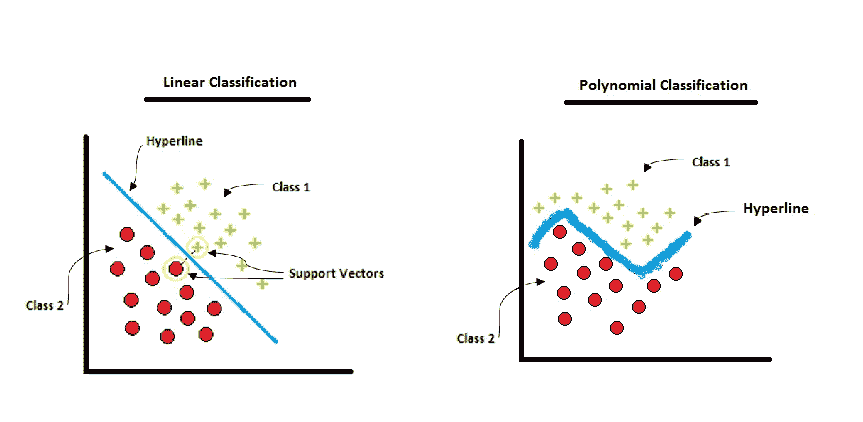
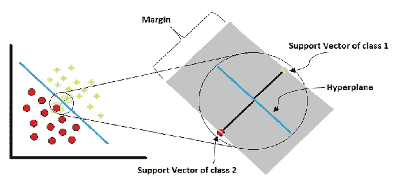
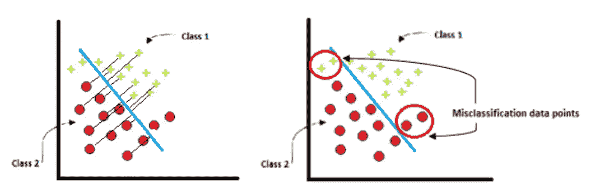
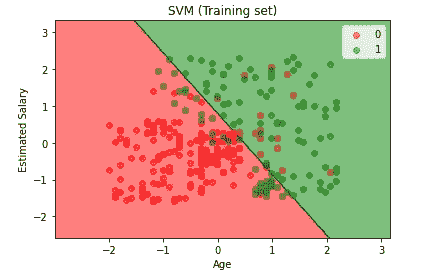
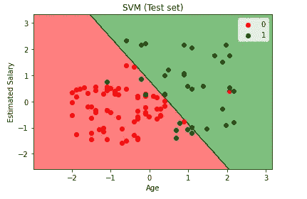

# 用 Python 全面解释了 SVM 分类

> 原文：<https://pub.towardsai.net/fully-explained-svm-classification-with-python-eda124997bcd?source=collection_archive---------0----------------------->

## [数据科学](https://towardsai.net/p/category/data-science)

## 如何用一个真实的例子解决分类问题。



SVM 分类。作者的照片

在本文中，我们将讨论分类问题中最常用的机器学习算法。支持向量机(SVM)算法用于****【分类】*** ，也用于 ***异常值检测*** 。*

*超线或超平面由 ***决策点*** 或支持向量分开。 ***支持向量*** 是在最近的不同类点之间提供最大间隔的样本点。这个分离平面叫做 ***边缘*** 。误差越大，误差越小，误分类率也越低。*

**

*SVM 的边缘。作者的照片*

*上面的照片显示了划分不同类别的线性超平面。但是，我们可以通过选择不同的核函数参数来选择不同的标准来划分类别，这些核函数参数在 SVM 的分类类别中针对决策点给出。不同的核分别是****RBF******多项式*** 和***sigmoid(tanh)***。**

**支持向量机在高维数据集上非常有用。这里，高维度意味着数据集中有更多的要素列。**

**有时，如果模型过度拟合，那么为了避免这种情况，我们应该使用正则化并选择不同的核。SVM 使用五重交叉验证，而不是直接概率估计。**

**作为输入，支持向量机使用密集数组和稀疏向量。这里，稀疏向量是来自大的行和列矩阵的行和列的子集。**

**sklearn 提供的 SVM 类中有不同的函数类用于分类。这些类是 ***SVC*** ， ***NuSVC*** ， ***LinearSVC*** ， ***OneClassSVM。*****

**SVM 回归的类有****NuSVR******linear SVR***。***

****

**SVM 不同的阶级功能。作者的照片**

**SVC 和 NuSVC 几乎相同，但使用了不同的参数。在线性 SVC 的情况下，没有内核参数，因为它的名字是线性的。OneClassSVm 还用于基于密度的数据集的异常值检测。**

**[](https://medium.com/towards-artificial-intelligence/become-a-data-scientist-in-2021-with-these-following-steps-5bf70a0fe0a1) [## 按照以下步骤，在 2021 年成为一名数据科学家

### 走上数据科学家之路需要具备的基本点

medium.com](https://medium.com/towards-artificial-intelligence/become-a-data-scientist-in-2021-with-these-following-steps-5bf70a0fe0a1) 

> ***SVM 实用的一些小技巧***

*   当我们拥有大量数据时，我们应该将默认缓存大小`SVC`、`SVR`、`NuSVC`、`NuSVR`更改为 500 MB。
*   当将数据中的噪声点的 C 值设置为较低的值时，我们还应该专注于正则化。
*   在建模或标准化之前，必须对数据进行缩放，以表示“0”和“1”的差异。
*   如果数据集不平衡，那么我们应该使用`fit`方法将`class_weight`参数作为平衡参数。

> ***SVM 仁***

核是 SVM 中的一个数学函数，它将数据作为输入，并进行一些处理以在数据点之间进行分类分离。

*   **线性:**当我们看到不同的类是线性可分的时候，就使用这个核。
*   **径向基函数(rbf):** 这个核在我们不知道数据分离的情况下用作通用目的。

当我们使用`rbf`内核时，我们应该始终考虑两个参数，即`gamma`和`C`。这两个参数是调谐参数之一。

*   **Sigmoid:** 这种核多用于神经网络或逻辑回归进行二元分类。
*   **多项式:**用于图像处理。多项式的次数大于 2 即`d = 2`。

[](https://medium.com/towards-artificial-intelligence/fully-explained-logistic-regression-with-python-f4a16413ddcd) [## 用 Python 全面解释逻辑回归

### 机器学习算法中的统计非线性方法

medium.com](https://medium.com/towards-artificial-intelligence/fully-explained-logistic-regression-with-python-f4a16413ddcd) 

> ***机器学习中的正规化***

机器学习中的正则化被称为`C`，它在模型建模中出现过拟合时使用。它也被称为惩罚参数。该参数的主要作用是避免在训练期间错误识别数据。

我们每次都在机器学习中进行优化，正则化是过拟合问题中的优化技术之一。

应当以避免错误分类方式选择`C`。`C`值越小，分离裕度越好。当我们看到有时不同类别的数据点如此接近，以至于超平面要做一个艰难的决定来分离具有较大`C`值的类别。

> ***伽玛***

通过检查从超平面到数据点的距离，伽玛值被认为是一个平滑的超平面。gamma 的*低值*表示检查近数据点距离，gamma 的*大值*表示测量远数据点距离超平面。



伽玛和正则化示例。作者的照片

虽然我们不知道如何手动选择正确的优化值。在这种情况下，我们应该使用`GridSearchCV`来调整参数，我们将获得参数值。

我知道消化所有这些要点需要时间，但是相信我，通过练习你会做得很好。

[](https://medium.com/towards-artificial-intelligence/fully-explained-k-means-clustering-with-python-e7caa573176a) [## 充分解释了使用 Python 进行 K-means 聚类

### 群体相似性机器学习中的非监督部分。

medium.com](https://medium.com/towards-artificial-intelligence/fully-explained-k-means-clustering-with-python-e7caa573176a) 

现在我们将做一个实际的 SVM 来解决分类问题。

```
# Importing the libraries
import numpy as np
import matplotlib.pyplot as plt
import pandas as pd
```

导入库后，现在我们将读取 CSV 文件，并将特征分成独立变量和因变量。

```
# Importing the dataset
dataset = pd.read_csv('Social_Network_Ads.csv')
X = dataset.iloc[:, [2, 3]].values
y = dataset.iloc[:, 4].values
```

现在将数据分为训练数据和测试数据。

```
# Splitting the dataset into the Training set and Test set
from sklearn.model_selection import train_test_split
X_train, X_test, y_train, y_test = train_test_split(X, y, test_size = 0.25, random_state = 0)
```

在对机器学习算法建模之前，我们应该总是做标准的缩放。

```
# Feature Scaling
from sklearn.preprocessing import StandardScaler
sc = StandardScaler()
X_train = sc.fit_transform(X_train)
X_test = sc.transform(X_test)
```

有时，人们会混淆训练用的`fit_transform`和测试用的`transform`。这两者之间的区别是 ***拟合变换*** 我们在训练中进行缩放，以便我们在标准化后得到的平均值和方差对于测试数据也应该是相同的。如果我们对训练和测试数据都进行拟合变换，那么我们会得到两个数据不同的平均值和方差。所以，这对我们的模型不好。

在这个算法中，我们将使用线性核。

```
# Fitting the classifier classifier to the Training set
from sklearn.svm import SVC
classifier = SVC(kernel = 'linear', random_state= 0)
classifier.fit(X_train, y_train)#output:SVC(C=1.0, cache_size=200, class_weight=None, coef0=0.0,
  decision_function_shape='ovr', degree=3, gamma='auto_deprecated',
  kernel='linear', max_iter=-1, probability=False, random_state=0,
  shrinking=True, tol=0.001, verbose=False)
```

在上面的输出中，我们看到了调整参数，如`C`、`kernel`、`gamma`、`shrinking`、`cache_size`等。

如果存在大量迭代，收缩参数用于缩短训练时间中的迭代次数。

现在，我们将预测数据并制作我们的模型。

```
# Predicting the Test set results
y_pred = classifier.predict(X_test)
```

现在，我们计算混淆矩阵。

```
# Making the Confusion Matrix
from sklearn.metrics import confusion_matrix
cm = confusion_matrix(y_test, y_pred)#output:array([[66,  2],
       [ 8, 24]], dtype=int64)
```

用线性核可视化训练和测试结果。

```
# Visualising the Training set results
from matplotlib.colors import ListedColormap
X_set, y_set = X_train, y_train
X1, X2 = np.meshgrid(np.arange(start = X_set[:, 0].min() - 1, stop = X_set[:, 0].max() + 1, step = 0.01),
                     np.arange(start = X_set[:, 1].min() - 1, stop = X_set[:, 1].max() + 1, step = 0.01))
plt.contourf(X1, X2, classifier.predict(np.array([X1.ravel(), X2.ravel()]).T).reshape(X1.shape),
             alpha = 0.5, cmap = ListedColormap(('red', 'green')))
plt.xlim(X1.min(), X1.max())
plt.ylim(X2.min(), X2.max())
for i, j in enumerate(np.unique(y_set)):
    plt.scatter(X_set[y_set == j, 0], X_set[y_set == j, 1], alpha=0.5,
                c = ListedColormap(('red', 'green'))(i), label = j)
plt.title('SVM (Training set)')
plt.xlabel('Age')
plt.ylabel('Estimated Salary')
plt.legend()
plt.show()
```



训练集中的线性核分类。作者的照片

现在，为了可视化测试集。

```
# Visualising the Test set results
from matplotlib.colors import ListedColormap
X_set, y_set = X_test, y_test
X1, X2 = np.meshgrid(np.arange(start = X_set[:, 0].min() — 1, stop = X_set[:, 0].max() + 1, step = 0.01),
 np.arange(start = X_set[:, 1].min() — 1, stop = X_set[:, 1].max() + 1, step = 0.01))
plt.contourf(X1, X2, classifier.predict(np.array([X1.ravel(), X2.ravel()]).T).reshape(X1.shape),
 alpha = 0.5, cmap = ListedColormap((‘red’, ‘green’)))
plt.xlim(X1.min(), X1.max())
plt.ylim(X2.min(), X2.max())
for i, j in enumerate(np.unique(y_set)):
 plt.scatter(X_set[y_set == j, 0], X_set[y_set == j, 1], alpha=0.9,
 c = ListedColormap((‘red’, ‘green’))(i), label = j)
plt.title(‘SVM (Test set)’)
plt.xlabel(‘Age’)
plt.ylabel(‘Estimated Salary’)
plt.legend()
plt.show()
```



测试集中的线性核分类。作者的照片

这些是训练集和测试集上的线性分离核。我们观察到图中有很好的分类。

> ***结论:***

SVM 分类在分类和回归中非常有用。核参数给出了不同的超平面分离，以处理任何类型的数据集。

我希望你喜欢这篇文章。通过我的 [LinkedIn](https://www.linkedin.com/in/data-scientist-95040a1ab/) 和 [twitter](https://twitter.com/amitprius) 联系我。

# 推荐文章

1.  [NLP —用 Python 从零到英雄](https://medium.com/towards-artificial-intelligence/nlp-zero-to-hero-with-python-2df6fcebff6e?sk=2231d868766e96b13d1e9d7db6064df1)

2. [Python 数据结构数据类型和对象](https://medium.com/towards-artificial-intelligence/python-data-structures-data-types-and-objects-244d0a86c3cf?sk=42f4b462499f3fc3a160b21e2c94dba6)

3. [MySQL:零到英雄](https://medium.com/towards-artificial-intelligence/mysql-zero-to-hero-with-syntax-of-all-topics-92e700762c7b?source=friends_link&sk=35a3f8dc1cf1ebd1c4d5008a5d12d6a3)

4.[Python 时间序列基础](https://medium.com/towards-artificial-intelligence/basic-of-time-series-with-python-a2f7cb451a76?source=friends_link&sk=09d77be2d6b8779973e41ab54ebcf6c5)

5. [NumPy:用 Python 零到英雄](https://medium.com/towards-artificial-intelligence/numpy-zero-to-hero-with-python-d135f57d6082?source=friends_link&sk=45c0921423cdcca2f5772f5a5c1568f1)

6.[用 python 实现熊猫系列和数据帧的基础](https://medium.com/towards-artificial-intelligence/fundamentals-of-series-and-data-frame-in-pandas-with-python-6e0b8a168a0d?source=friends_link&sk=955350bf43c7d1680be6e37b15b6628b)**