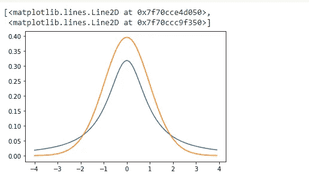

# 用 Python 例子充分解释了 t 分布

> 原文：<https://pub.towardsai.net/fully-explained-t-distribution-with-python-example-b861413ceb9?source=collection_archive---------0----------------------->

## [数据科学](https://towardsai.net/p/category/data-science)

## 数据科学分析的统计学概念


Firmbee.com 在 [Unsplash](https://unsplash.com?utm_source=medium&utm_medium=referral) 上[的照片](https://unsplash.com/@firmbee?utm_source=medium&utm_medium=referral)

## 介绍

t 分布，也称为学生 t 分布，是对统计世界的主要贡献之一。它为推断统计学铺平了道路，后来被证明是非常有用的。在深入推理和描述性统计的细节之前，让我们先了解一下为什么这种分布叫做学生 t 分布。

英国统计学家威廉·戈塞特(William Gosset)发现了 T 统计量，并以“学生”的名义撰写了研究论文，因为他被禁止使用自己的名字。这项名为“学生”的研究将 t 分布命名为学生的 t 分布。

t 分布看起来或多或少像一个标准的正态分布，但它有更重的尾部。我们一会儿会谈到它。我们先来了解一下描述性统计和推断性统计。

描述性统计让你知道你所拥有的数据的特征。它将帮助您分析数据点的中间值、数据点的平均值、每个类别的出现频率等参数。另一方面，推断统计允许您通过分析总体样本的特征来对总体做出推断。

为了更清楚地理解，我们来看一个例子。

假设你有一个地区 100 名女性的生活方式的数据。对这些数据的描述性统计将让你只知道这 100 位女性的生活趋势。你将能够计算出这些女性的平均支出分数或平均工资等。但是所有这些参数(即平均值、频率等。)是关于这 100 名女性的，我们只有她们的数据。

另一方面，如果我们从一个地区抽取 100 名妇女的样本，该样本的推断统计可用于预测该地区全部妇女人口的生活特征或趋势。

顾名思义，推断统计学可以根据样本的特征对总体进行预测(或做出推断)。

唯一的要求是样本应该准确地代表总体，并且不应该有偏差。

例如，如果我们需要查看印度女性的平均工资，我们决定抽取 100 名女性作为样本。有两种方法可以取样。

*   方式一:这 100 名女性中，90 名女性来自德里，10 名女性来自孟买。
*   方式 2:在这 100 名妇女中，每 4 名妇女属于该国的每个州。

你认为哪个样本更能代表这个国家的女性？如果你的答案是“第二”，

你是正确的。

在第一个案例中，所有的女性都来自德里和孟买，这两个地方都是发达国家，都有职业女性。但是这个样本没有考虑到大多数女性不工作的州！或者女性工资很低的地方！所以，第一个样本不能代表这个国家的妇女。

而在第二种情况下，所有各州的妇女都被考虑在内，因此考虑到了所有阶层的妇女。因此，第二个样本的推断统计将让我们对该国全部女性人口的工资做出推断。

正如我们前面谈到的，t-统计量就像 Z-统计量一样，不同之处在于它让位于推断统计量。下面给出了 T 统计量和 Z 统计量的公式。

**Z** = (X — μ) / [ σ/√(n) ]

**T** = (X — μ) / [ s/√(n) ]

Z 统计使用总体标准差来计算 Z 得分。但是，并不总是有可能知道总体标准差，这就是 T 统计发挥作用的地方。它使用“s ”,即样本的标准偏差，而不是总体的标准偏差。

T-statistic 也使用自由度，它通常等于比样本量小 1。

正如标准正态分布有一个与之关联的 Z 表一样，T 分布也有一个与之关联的 T 表。尽管对于大于 30°的自由度，两个表给出了相同的结果。

自由度也会影响 t 分布曲线的形状。我们将通过一个例子来了解它。让我们试着画出两个自由度不同的 t 分布，看看有什么不同。

```
import numpy as np
import matplotlib.pylot as plt
from scipy import stats
```

现在，我们可以给我们的分布范围

```
x = np.arange(-4,4,0.1)
```

现在，我们将绘制 t 分布图

```
firstT = stats.t.pdf(x,1)secondT = stats.t.pdf(x,30)plt.plot(x, firstT, x, secondT)
```



作者的照片

这里，“第一个”有 1 个自由度，“第二个”有 30 个自由度。外形上的差异可见一斑！另外，注意曲线的尾部比标准的正态分布要重。

我希望你喜欢这篇文章。通过我的 [LinkedIn](https://www.linkedin.com/in/data-scientist-95040a1ab/) 和 [twitter](https://twitter.com/amitprius) 联系我。

# 推荐文章

[1。NLP —零到英雄与 Python](https://medium.com/towards-artificial-intelligence/nlp-zero-to-hero-with-python-2df6fcebff6e?sk=2231d868766e96b13d1e9d7db6064df1)
2。 [Python 数据结构数据类型和对象](https://medium.com/towards-artificial-intelligence/python-data-structures-data-types-and-objects-244d0a86c3cf?sk=42f4b462499f3fc3a160b21e2c94dba6)3 .[Python 中的异常处理概念](/exception-handling-concepts-in-python-4d5116decac3?source=friends_link&sk=a0ed49d9fdeaa67925eac34ecb55ea30)
4。[为什么 LSTM 在深度学习方面比 RNN 更有用？](/deep-learning-88e218b74a14?source=friends_link&sk=540bf9088d31859d50dbddab7524ba35)
5。[神经网络:递归神经网络的兴起](/neural-networks-the-rise-of-recurrent-neural-networks-df740252da88?source=friends_link&sk=6844935e3de14e478ce00f0b22e419eb)
6。[用 Python](https://medium.com/towards-artificial-intelligence/fully-explained-linear-regression-with-python-fe2b313f32f3?source=friends_link&sk=53c91a2a51347ec2d93f8222c0e06402)
7 全面讲解了线性回归。[用 Python](https://medium.com/towards-artificial-intelligence/fully-explained-logistic-regression-with-python-f4a16413ddcd?source=friends_link&sk=528181f15a44e48ea38fdd9579241a78)
充分解释了 Logistic 回归 8。[concat()、merge()和 join()与 Python](/differences-between-concat-merge-and-join-with-python-1a6541abc08d?source=friends_link&sk=3b37b694fb90db16275059ea752fc16a)
的区别 9。[与 Python 的数据角力—第一部分](/data-wrangling-with-python-part-1-969e3cc81d69?source=friends_link&sk=9c3649cf20f31a5c9ead51c50c89ba0b)
10。[机器学习中的混淆矩阵](https://medium.com/analytics-vidhya/confusion-matrix-in-machine-learning-91b6e2b3f9af?source=friends_link&sk=11c6531da0bab7b504d518d02746d4cc)