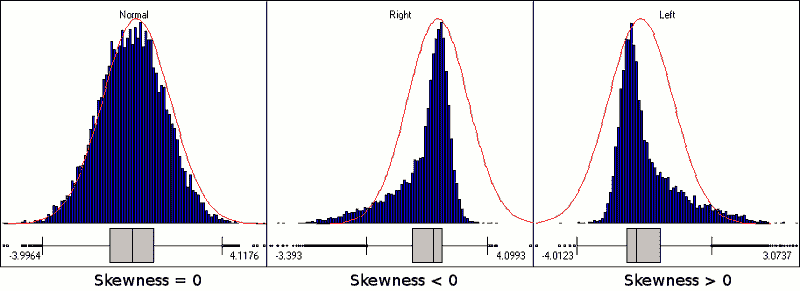
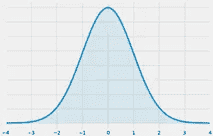
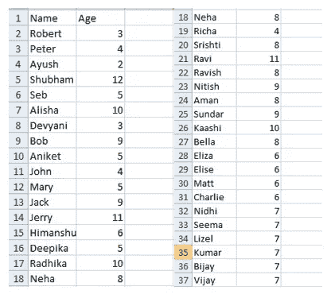
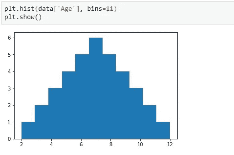

# 用 Python 示例充分解释了 Z 分布

> 原文：<https://pub.towardsai.net/fully-explained-z-distribution-with-python-example-a124ba4c4ec9?source=collection_archive---------0----------------------->

## [编程](https://towardsai.net/p/category/programming)

## 数据科学和机器学习的统计学概念


由 [Carlos Muza](https://unsplash.com/@kmuza?utm_source=medium&utm_medium=referral) 在 [Unsplash](https://unsplash.com?utm_source=medium&utm_medium=referral) 上拍摄的照片

我们处理的数据可以有任何结构和任何分布。其中一种分布是 Z 分布。

在深入 Z 分布之前，让我们首先尝试理解中心趋势的基本度量和数据扩散的度量。

## **数据模式**

数据的模式是具有最高频率的数据值。换句话说，在数据集中出现次数最多的数据值就是该数据集的模式。

这种模式应该表示数据，因为应该将出现次数最多的值视为该数据的特征。该模式不考虑数据集的每个值，而只考虑出现次数最多的值。

## **数据的中位数**

数据的中值代表排序数据的中心值。为了计算中值，对数据进行排序，然后将中心索引处的值视为中值。Median 不考虑所有的数据值，只考虑中央索引处的数据值。

假设“n”是数据点的数量。中位数的公式是，

*   情况 1:当“n”是奇数时

中位数=索引值(n+1)/2

*   情况 2:当 n 是偶数时

中位数=((索引 n/2 处的值)+(索引(n+1)/2 处的值)/2

## **数据的平均值**

数据的平均值是所有数据点的平均值。它考虑了所有的数据点，因此是最可靠的。

平均值=项的总和/项数

## **偏斜度**

偏斜度是对数据分布的一种度量。偏度代表数据的不对称。精确对称曲线的偏斜度= 0。



图像[来源](https://develve.net/Skewness.html)

*   **正偏态**:当更多的数据点位于平均值的左侧，或者更多的数据点的值小于平均值时，这种类型的分布称为正偏态。在这种情况下，偏斜度的值为正。

当数据正偏时，数据的峰值位于平均值的左侧，因此，在这种情况下，

模式< median < mean

*   **负偏态**:当更多的数据点位于平均值的右侧或其值大于平均值时，这种类型的分布称为负偏态。

当数据呈负偏态时，峰值位于平均值的右侧，因此，

众数>中位数>平均值

*   **偏斜度= 0** :当 skew()函数得出的值为 0 时，即曲线被称为正态分布，该分布称为 Z 分布或正态分布。在这种情况下，

众数=中位数=平均值

Z 分布，也称为正态分布，是一种在平均值两侧对称的钟形曲线。在 Z 分布或正态分布的情况下，均值两侧的数据点数量相同，这就是该曲线对称的原因。下图是一个 Z 分布的例子。



作者的照片

可以看出，上述分布的均值、中值和众数位于同一点，因此曲线是对称的。

下面是一些 37 岁的人的数据。让我们试着想象一下这些数据是什么样子。



作者的照片

[](/z-statistics-t-statistics-p-statistics-are-still-confusing-you-87557047e20a) [## Z-统计量，T-统计量，P-统计量还在迷惑你？

### 机器学习统计学中的定义和概念

pub.towardsai.net](/z-statistics-t-statistics-p-statistics-are-still-confusing-you-87557047e20a) 

让我们计算这个给定数据的平均值、中值和众数。我们将在整个过程中使用 numpy、pandas 和 matplotlib。

```
import numpy as np
import pandas as pdimport matplotlib.pyplot as pltfrom scipy.stats import norm
```

现在，从本地驱动器读取数据集

```
data = pd.read_csv(zdis.csv)
```

现在，用 python 计算平均值、众数和中位数

```
data['Age'].mean()#output:
7.0data['Age'].mode()#output:
7data['Age'].median()#output:
7.0
```

可以看出，在这里，均值=中位数=众数。那么，我们能说这是正态分布吗？如果是，那么它应该在平均值的两边有相等的值。我们做个直方图分析一下。

我们将使用 matplotlib 来制作这个直方图。

```
plt.hist(data['Age'], bins = 11)
plt.show()
```



作者的照片

我们可以看到这是完全对称的，因此，这是一个 Z 分布！我们也可以计算这个数据的偏斜度。如果你还记得我们之前讨论的，偏斜度应该是 0！。

```
data.skew()#output:
Age     0.0
dtype:  float64
```

我希望现在你已经清楚地了解 Z 分布是什么样子了！请继续关注相同的更多信息。

## 结论

本文通过一个 python 示例介绍了统计学中的基本 z 分布概念。

我希望你喜欢这篇文章。通过我的 [LinkedIn](https://www.linkedin.com/in/data-scientist-95040a1ab/) 和 [twitter](https://twitter.com/amitprius) 联系我。

# 推荐文章

[1。NLP —零到英雄与 Python](https://medium.com/towards-artificial-intelligence/nlp-zero-to-hero-with-python-2df6fcebff6e?sk=2231d868766e96b13d1e9d7db6064df1)
2。 [Python 数据结构数据类型和对象](https://medium.com/towards-artificial-intelligence/python-data-structures-data-types-and-objects-244d0a86c3cf?sk=42f4b462499f3fc3a160b21e2c94dba6)3 .[Python 中的异常处理概念](/exception-handling-concepts-in-python-4d5116decac3?source=friends_link&sk=a0ed49d9fdeaa67925eac34ecb55ea30)
4。[为什么 LSTM 在深度学习方面比 RNN 更有用？](/deep-learning-88e218b74a14?source=friends_link&sk=540bf9088d31859d50dbddab7524ba35)
5。[神经网络:递归神经网络的兴起](/neural-networks-the-rise-of-recurrent-neural-networks-df740252da88?source=friends_link&sk=6844935e3de14e478ce00f0b22e419eb)
6。[用 Python](https://medium.com/towards-artificial-intelligence/fully-explained-linear-regression-with-python-fe2b313f32f3?source=friends_link&sk=53c91a2a51347ec2d93f8222c0e06402)
7 全面讲解了线性回归。[用 Python](https://medium.com/towards-artificial-intelligence/fully-explained-logistic-regression-with-python-f4a16413ddcd?source=friends_link&sk=528181f15a44e48ea38fdd9579241a78)
充分解释了 Logistic 回归 8。[concat()、merge()和 join()与 Python](/differences-between-concat-merge-and-join-with-python-1a6541abc08d?source=friends_link&sk=3b37b694fb90db16275059ea752fc16a)
的区别 9。[与 Python 的数据角力—第一部分](/data-wrangling-with-python-part-1-969e3cc81d69?source=friends_link&sk=9c3649cf20f31a5c9ead51c50c89ba0b)
10。[机器学习中的混淆矩阵](https://medium.com/analytics-vidhya/confusion-matrix-in-machine-learning-91b6e2b3f9af?source=friends_link&sk=11c6531da0bab7b504d518d02746d4cc)