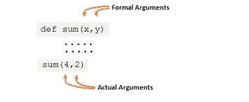

# Python 中的函数及其概念

> 原文：<https://pub.towardsai.net/functions-and-its-concepts-in-python-df08138fbca2?source=collection_archive---------2----------------------->

## [编程](https://towardsai.net/p/category/programming)

## 函数中参数的组成和类型


由[大卫·兰格尔](https://unsplash.com/@rangel?utm_source=medium&utm_medium=referral)在 [Unsplash](https://unsplash.com?utm_source=medium&utm_medium=referral) 上拍摄的照片

本文将涵盖所有与函数相关的概念，让你在编程时感到舒适。这个题目很容易理解，但是因为练习少而很难。

## 涵盖的主题:

*   介绍
*   函数参数及其类型
*   全局和局部变量
*   将数据序列传递给函数
*   匿名函数—***λ***

## 介绍

当你在一个程序或算法中不止一次或多次地写公式时，使用函数的价值就显现出来了，这很费时间。

制作一个由公式组成单一函数并多次使用这些函数是很重要的。

使用函数的好处如下所示:

*   它节省时间。
*   程序的可读性是用户友好的。
*   我们可以在程序中多次重用该函数。
*   它还做了一个 ***抽象*** 的用途，其中我们要知道，什么是函数名，函数做什么工作，以及它返回什么。

该函数有两个功能。

1.  它需要定义一个函数。
2.  为了让函数工作，我们必须调用它。

***语法***

```
def name_of_function():
```

为了在 python 中定义一个函数，有必要使用一个 *def* 字。

示例:

```
def india():                         # Defining a function
    print("People of this country are very great")
india()                              # Calling a function
```

*   我们定义一个函数，并分配一个任务来处理它。

```
#sum of a two numbers
def sum(x,y):
    a= x+y
    print(x)#giving two arguments
sum(4,2)#output: 6
```

[](/python-zero-to-hero-with-examples-c7a5dedb968b) [## Python:从零到英雄(带示例)

### python 初学者手册指南

pub.towardsai.net](/python-zero-to-hero-with-examples-c7a5dedb968b) [](/python-data-structures-data-types-and-objects-244d0a86c3cf) [## Python 数据结构数据类型和对象

### python 中类对象的便捷概念

pub.towardsai.net](/python-data-structures-data-types-and-objects-244d0a86c3cf) 

## 函数参数及其类型

参数是传递给函数的值或变量。

论点分为两种类型实际的和形式的论点。**实际参数**是调用时传递的值/变量。**形参**是函数定义中的值/变量。



函数中的参数。作者的照片

现在，让我们看看两个变量值是如何影响结果的

```
#passing a value                      #passing a variable
def num(x):                           def num(x)
                                          x= 10
    print(x)                              print(x)#passing one value                    #passing one variable
num(2)                                a= 2
                                      num(a)#output: 2                            #output: 10
```

在上面的例子中，我们看到结果受到函数内部给定值的影响。

但是在 list 的情况下，实际的列表会受到影响，并通过更改函数内部的列表中的值来更新。即使在更新之后，列表的地址仍然相同。

```
def num(x):
 print(id(x))
 x[1] = 10
 print(“x: “, x)
 print(id(x))a = [1,2,3]
print(“a: “, a)
print(id(a))
num(a)
print(“a: “, a)
print(id(a))#output:
a:  [1, 2, 3]
82513288
82513288
x:  [1, 10, 3]
82513288
a:  [1, 10, 3]
82513288
```

这两者的区别在于不可变数据类型和可变数据类型。

实际参数由四种类型组成，如下所示:

1.  位置
2.  关键字
3.  默认
4.  可变长度

> ***位置类型参数***

在位置类型中，我们必须在调用函数时维护一系列实际参数，在定义函数时维护一系列形式参数。所以，传递的值一个接一个地传递给形式参数。

例如:

```
def person(country_name, code):
    print(country_name)
    print(code)
person('India', 2412)#output:
India
2412
```

在上面的例子中，位置在代码 it 中的意思是“印度”到形式参数的第一个位置，“2412”到形式参数的第二个位置。

> ***关键字类型自变量***

在这种类型的参数中，如果我们不知道形式参数的顺序，但知道两个参数名，那么我们可以在实际参数中使用变量名作为关键字，而不管顺序如何。

例如:

```
def person(country_name, code):
    print(country_name)
    print(code)
person(code = 2412, country_name = 'India')#output:
India
2412
```

在上面的例子中，我们将值传递给变量名，这样它们就有了各自的形参。

> ***默认类型参数***

当我们必须在形式参数中设置一些条件并赋值时，这个参数很有用。

例如:

```
def person(country_name, code = 2412):
    print(country_name)
    print(code)
person('India')#output:
India
2412
```

上面的例子将给出传递一个参数的输出，因为第二个参数在形式参数中已经有值了。

> ***变长***

在这种类型的参数中，当我们有两个变量并且需要向一个变量传递多个值时，那么可变长度变量在图片中的变量前面带有“*”。

例如:

```
def sum(a, *b):
    x= a+b
    print(x)
sum(5,4,7,3)#output:
**TypeError**: unsupported operand type(s) for +: 'int' and 'tuple'
```

这里，当我们将多个值传递给两个形参时，这意味着实际形参的第一个值将作为位置规则传递给形参中的第一个变量。但是，其他三个值作为元组进入变量“b”。

```
a = 5
*b = (4,7,3)
```

这就是为什么我们会得到一个错误，因为我们不能把整数和元组相加。因此，为了解决这个问题，我们需要一个 for 循环，如下例所示。

```
def sum(a, *b):
    y = a
    for i in b:
        y = a+i
    print(y)
sum(5,4,7,3)#output:
8
```

这里是另一个技巧，可以在实际参数中使用“**”作为可变长度的关键字。

例如:

```
def sum(a, **b):
    print(a)
    print(b)
sum(5,State = 'Shillong', age = 20, mob = 235436)#output:
5
{'State': 'Shillong', 'age': 20, 'mob': 235436}
```

[](/exception-handling-concepts-in-python-4d5116decac3) [## Python 中的异常处理概念

### 使用 try、except 和 finally 关键字进行错误处理

pub.towardsai.net](/exception-handling-concepts-in-python-4d5116decac3) 

## 全局和局部变量

全局变量:在函数外部定义的变量。

局部变量:在函数内部定义的变量。

例如:

```
x = 4               #Global Variable
def hello(x):
    x= 20           #Local Variable
    print(x)
hello(x)
print(x)#output:
20
4
```

我们试图将全局变量的值改为局部变量，在函数内部，我们得到了打印的局部变量值。如果我们想用一个局部变量作为全局变量呢？

例如:

```
x = 4               #Global Variable
def hello():
    global x        #making local variable as global variable
    x= 20           #Local Variable
    print(x)
hello()
print(x)#output:
20
20
```

## 将数据序列传递给函数

在函数中，我们也可以传递序列数据类型。

例如，列表:

```
def calculate(lst):
    even = 0
    odd = 0

    for i in lst:
        if i%2 ==0:
            even = even+1
        else:
            odd = odd+1
    print("Even: ", even, "odd: ", odd)
    #return even, oddlst = [23, 33, 4, 22, 44, 16, 19]
calculate(lst)#output:
Even:  4 odd:  3
```

## 匿名函数—***λ***

lambda 函数是一个非常有用的函数，可以节省时间和内存。这是一个单行代码。

例如:

```
func = lambda x:x+x
result = func(3)
print(result)#output:
6
```

对字符串使用 lambda 函数，如下例所示:

```
name = lambda first_name, surname: f'name: {first_name.title()} {surname.title()}'name('Amit', 'Chauhan')#Output:
'name: Amit Chauhan'
```

## 结论:

本文介绍了 python 中函数的基本概念。

[](/become-a-data-scientist-in-2021-with-these-following-steps-5bf70a0fe0a1) [## 按照以下步骤，在 2021 年成为一名数据科学家

### 走上数据科学家之路需要具备的基本点

pub.towardsai.net](/become-a-data-scientist-in-2021-with-these-following-steps-5bf70a0fe0a1) 

我希望你喜欢这篇文章。通过我的 [LinkedIn](https://www.linkedin.com/in/data-scientist-95040a1ab/) 和 [twitter](https://twitter.com/amitprius) 联系我。

# 推荐文章

[1。NLP —零到英雄用 Python](https://medium.com/towards-artificial-intelligence/nlp-zero-to-hero-with-python-2df6fcebff6e?sk=2231d868766e96b13d1e9d7db6064df1)
2。 [Python 数据结构数据类型和对象](https://medium.com/towards-artificial-intelligence/python-data-structures-data-types-and-objects-244d0a86c3cf?sk=42f4b462499f3fc3a160b21e2c94dba6)
3。[数据预处理概念同 Python](/data-preprocessing-concepts-with-python-b93c63f14bb6?source=friends_link&sk=5cc4ac66c6c02a6f02077fd43df9681a)
4。[用 Python 进行主成分分析降维](/principal-component-analysis-in-dimensionality-reduction-with-python-1a613006d531?source=friends_link&sk=3ed0671fdc04ba395dd36478bcea8a55)
5。[用 Python 全面讲解 K-means 聚类](https://medium.com/towards-artificial-intelligence/fully-explained-k-means-clustering-with-python-e7caa573176a?source=friends_link&sk=9c5c613ceb10f2d203712634f3b6fb28)
6。[用 Python 充分解释了线性回归](https://medium.com/towards-artificial-intelligence/fully-explained-linear-regression-with-python-fe2b313f32f3?source=friends_link&sk=53c91a2a51347ec2d93f8222c0e06402)
7。[用 Python](https://medium.com/towards-artificial-intelligence/fully-explained-logistic-regression-with-python-f4a16413ddcd?source=friends_link&sk=528181f15a44e48ea38fdd9579241a78)
充分解释了 Logistic 回归 8。[用 Python 做时间序列的基础知识](https://medium.com/towards-artificial-intelligence/basic-of-time-series-with-python-a2f7cb451a76?source=friends_link&sk=09d77be2d6b8779973e41ab54ebcf6c5)
9。[与 Python 的数据角力—第一部分](/data-wrangling-with-python-part-1-969e3cc81d69?source=friends_link&sk=9c3649cf20f31a5c9ead51c50c89ba0b)10。[机器学习中的混淆矩阵](https://medium.com/analytics-vidhya/confusion-matrix-in-machine-learning-91b6e2b3f9af?source=friends_link&sk=11c6531da0bab7b504d518d02746d4cc)