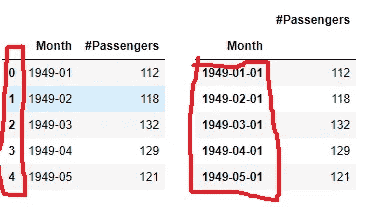
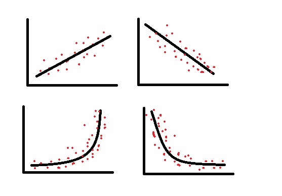
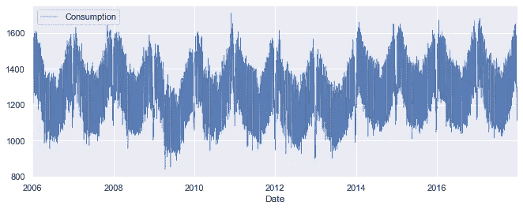
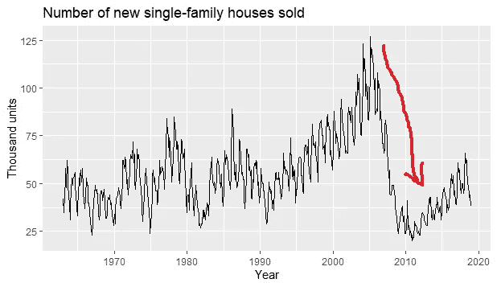
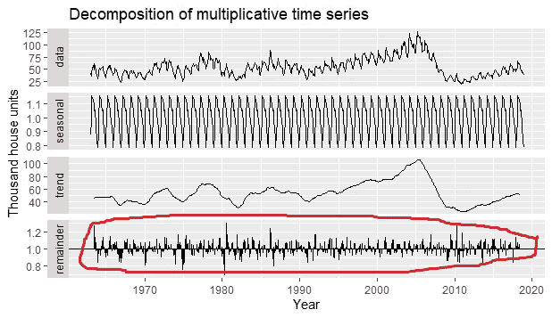

# 时间序列数据的基本性质

> 原文：<https://pub.towardsai.net/fundamental-properties-of-time-series-data-c56cfc048a49?source=collection_archive---------0----------------------->

## [数据科学](https://towardsai.net/p/category/data-science)

## 趋势、季节性、结构性突变、随机性等等！


[史蒂夫·哈维](https://unsplash.com/@trommelkopf?utm_source=medium&utm_medium=referral)在 [Unsplash](https://unsplash.com?utm_source=medium&utm_medium=referral) 上拍照

时间序列不是普通的，它是不同的。

使时间序列不同的是它的基本结构和性质；这使得时间序列在分析、洞察和建模方面如此强大。

有趣的是，仅从数据框来看，这种结构和属性并不明显。相反，当数据可视化时，您会看到与普通数据框相比的差异。

在这篇文章中，我将谈论其中的一些:数据结构，趋势，季节性，周期，突破和随机性。

所以让我们开始吧！

## 1)数据结构

第一个属性来自于它的数据结构。时间序列不只是任何数据帧，它是一个*时间序列对象*。

时间序列的核心是将观察值(行)存储在变量(列)中，一列时间对应于每个观察值。

最重要的是，时间列是一个 datetime 对象，而不是整数或字符串。因此在预处理时，您需要确保进行必要的日期时间转换，如下所示:

```
df["time column"] = pd.to_datetime(df["time column"])
```

最后但同样重要的是，时间列也是系列的索引。将时间设置为索引有助于基于特定日期或日期范围对数据进行切片和过滤。设置索引只需要一行代码:

```
df = df.set_index(df["date column"])
```



未格式化的数据帧(左)和格式化的时间序列对象(右)

## 2)趋势

第二个属性是它的*走势*。您需要将数据可视化，以查看观察结果是否有趋势成分。

一旦绘制出来，观察结果将显示各种趋势模式——上升或下降、线性或指数等。但也可以是“平的”，意思是完全没有趋势。

以下是一些常见的趋势模式。



图:时间序列数据中的各种趋势模式(来源:作者)

## 3)季节性

在时间序列中，季节性是一个同样重要的属性。通常，它表示在特定时间间隔内观察值和重复值的变化。这个时间间隔可以代表一年中的特定月份或季节。在更大的粒度上，它甚至可以是每周的变化。

季节性对于企业储备需求不断变化的产品尤为重要。季节性变化的例子可能是对冬衣的需求、夏季的酒店预订或食品杂货的周销售量。

季节性甚至可以围绕特定的事件，如 7 月 4 日周末的旅游高峰以及相应的某些产品和服务的消费。



图:数据显示强烈的季节性(来源:作者)

## 4)循环

在时间序列中，周期代表观察值的长期波动。与季节性相比，周期的可预测性较低，并且频率长度不同，通常高于两年。

周期性行为的一个例子是选民登记。每四年，选民登记会因总统选举而达到高峰。

不像选民登记，这是一个可预测的事件，这种循环模式也可能是由于随机过程，不那么容易发现。一些经济学家认为，经济衰退遵循长期周期，但无法使用传统的宏观经济指标进行预测。

## 5)结构突变

与季节性和周期性行为相关，时间序列的另一个属性是结构突变。当趋势或季节性从最初的方向突然改变时，就会发生这种情况。

在接下来的美国新房销售系列中，你可以看到一个结构性断裂的经典例子。正如您将在下面看到的，在 2005-2006 年之前，房地产市场具有相当可预测的季节性和趋势，然后在 2008 年左右出现了结构性突破。



图:新屋销售时间序列观察中的结构性突变(来源:作者)

## 6)白噪声

最后一个就是所谓的白噪声或者一个序列中的随机性。

虽然您可以预测季节性、趋势性和周期性行为，但由于相关的随机性，您无法预测随机成分。

白噪声是时间序列预测中的一个重要组成部分，因为它代表了一个序列可用于预测的准确程度。白噪声越高，序列越不可预测。

下图是新房销售数据分解后的随机/随机成分。



图:时间序列分解中呈现的白噪声(来源:作者)

## 摘要

本文的目的是讨论时间序列数据的一些重要性质:数据结构、趋势、季节性、周期、结构突变和白噪声。这些都是非常重要的特征，对于产生洞察力和建立基于时间序列的预测模型非常有用。

另外两个重要的属性——方差和自相关——由于它们的复杂性，需要更长时间的讨论，所以我没有在本文中讨论。请继续关注关于这个问题的后续文章。

谢谢你留下来，我可以通过 [Twitter](https://twitter.com/DataEnthus) 联系。