# 用 python 实现熊猫系列和数据框架的基础

> 原文：<https://pub.towardsai.net/fundamentals-of-series-and-data-frame-in-pandas-with-python-6e0b8a168a0d?source=collection_archive---------0----------------------->

## [数据科学](https://towardsai.net/p/category/data-science)

## 数据框中常用参数的基础知识


[于 W](https://unsplash.com/@stanyw?utm_source=medium&utm_medium=referral) 在 [Unsplash](https://unsplash.com?utm_source=medium&utm_medium=referral) 上拍照

学习熊猫对于分析数据集并从中获得洞察力非常重要。它在数据系列和表格中对数字和分类数据的操作和运算非常有用。它是 python 语言中用于数据争论的库。

在我们的日常工作中，不知不觉中我们产生了大量的数字、字符串、句子、字符等形式的数据。

[](https://medium.com/towards-artificial-intelligence/become-a-data-scientist-in-2021-with-these-following-steps-5bf70a0fe0a1) [## 按照以下步骤，在 2021 年成为一名数据科学家

### 走上数据科学家之路需要具备的基本点

medium.com](https://medium.com/towards-artificial-intelligence/become-a-data-scientist-in-2021-with-these-following-steps-5bf70a0fe0a1) 

在这篇文章中，我们将讨论熊猫争吵中使用的基本术语，以了解它们背后的工作功能。本文将涵盖如下所示的术语:

**1。系列和数据帧**

**2。行和列**

**3。选择和索引**

**4。轴和原位**

**5。Loc 和 iloc**

**6。数据帧上的条件**

**7。数据帧中缺少数据**

8。德罗普纳和菲尔娜

这些术语的解释如下:

> ***系列和数据帧***

在 pandas 中，有两种类型的数据输入，作为一个系列和作为一个数据帧。该系列有时也称为向量，因为该系列只是一列数据。数据框是包含行和列的表格的一种形式。两个或多个序列的组合相加形成一个数据帧。

**系列**可以由索引标签、列表、数字数组、字典等组成。

python 的示例如下所示:

```
#import the libraries for usinf pandas and numpy
import numpy as np
import pandas as pd#variables of index, list, array and dictionary
labels = ['a','b','c','d']
list = [6,3,9,15]
array = np.array([6,3,9,15])
dict = {'a':6,'b':3,'c':9,'d':15}#making series in pandas
pd.Series(data=list)
pd.Series(data=list,index=labels)
pd.Series(list,labels)
pd.Series(array)
pd.Series(dict)
```

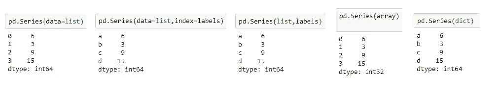

熊猫系列。作者的照片

我们可以使用索引参数来给出索引值。默认索引是从“0”开始的数字索引。

**数据帧**是共享相同索引位置的系列集合。

python 的例子如下所示，我们在其中生成随机数。split()函数用于拆分行名和列名。

```
from numpy.random import randn
dataframe = pd.DataFrame(randn(5,3),index='0 1 2 3
                              4'.split(),columns='A B C '.split())print(dataframe)
```

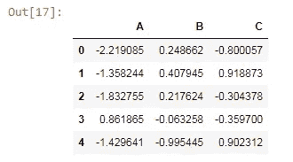

熊猫中的数据框。作者的照片

> ***行和列***

行和列是数据框表中的水平和垂直位置。

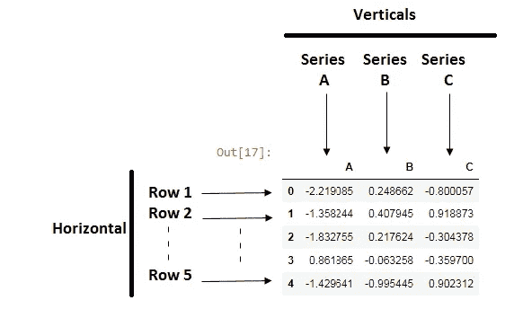

数据框中的行和列。作者的照片

> ***选择和分度***

数据框中的选择和索引对于访问特定的列或行非常有帮助。

```
#accessing column in data frame
dataframe['B']
```

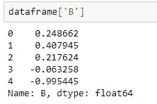

访问数据帧中的 B 列。作者的照片

我们可以通过列的列表来访问数据

```
dataframe[[‘A’,’B’]]
```

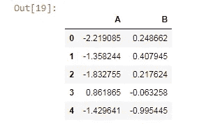

访问 A 列和 b 列。作者的照片

添加两列以形成一个新列。

```
dataframe['D']=dataframe['A'] + dataframe['B']
print(dataframe)
```

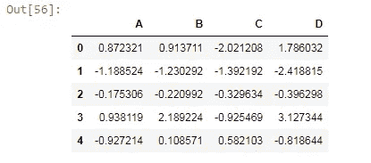

新的列 D 被添加到数据框中。作者的照片

> ***轴和原地***

该轴用于选择水平或垂直工作的方式。轴的值取决于它是行还是列，“0”代表行，“1”代表列。

```
dataframe.drop('D',axis=1)
```

这里轴=1 意味着删除列和我们必须删除的列被称为 d。


丢弃后返回原始数据帧。作者的照片

但是轴的 drop 函数的唯一用途是仅针对该特定命令进行丢弃，而不是从原始数据帧中丢弃。因此，要从原始数据框中删除一列，我们使用 inplace 参数。

```
dataframe.drop('D',axis=1,inplace=True)
```

> ***Loc 和 iLoc***

loc 和 iloc 的主要区别在于 loc 用于行和列的名称。iloc 用于通过整数索引访问特定的行和列。

```
#selecting row 3 
dataframe.loc['3']
dataframe.iloc[1]
```

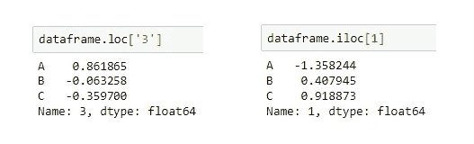

loc 用于选择行名为“3”和“1”的行。作者的照片

我们还可以从特定的行和列中访问特定的值。

```
dataframe.loc['1','C']#output:
0.9188734700068232
```

> ***数据帧上的条件***

数据框中的条件对于了解洞察力和分析也很重要。下面给出的条件表示“0.5”以上的值显示为真，否则显示为假。

```
dataframe>0.5
```

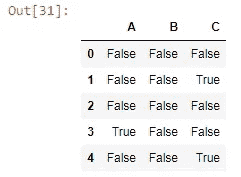

真假取决于阈值。作者的照片

> ***数据帧中缺失数据***

数据集中的缺失数据是常见的。处理缺失值是一种常见的做法。丢失的值可能来自从站点提取数据时的人为错误。让我们创建一个缺失值数据。

```
dataframe = pd.DataFrame({'English':[1,np.nan,3,4,np.nan,7,2,np.nan],
                  'Math':[5,np.nan,6,5,7,2,np.nan,5],
                  'Hindi':[5,3,6,5,7,2,8,5],
                  'Science':[1,2,3,np.nan,5,np.nan,7,8]})print(dataframe)
```

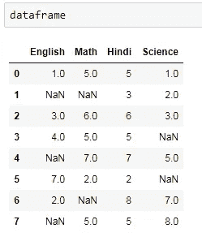

缺失值数据框。作者的照片

为了处理缺失值，我们使用 dropna 和 fillna 函数。

> ***Dropna 和 fillna***

dropna 函数将删除丢失的值，并保留没有丢失值的行。但是这样一来，我们可能会丢失从数据中获得的信息。数据越少意味着信息越少。因此，我们还使用 fillna 方法，其中缺失的值由我们提供的值填充，它可以是零或其他值。

```
dataframe.dropna()
```

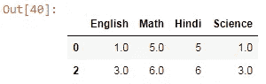

只剩下没有缺失值的行。作者的照片

```
#to delete the columns that have missing values use the "1" value in the axis
dataframe.dropna(axis=1)
```

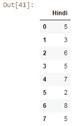

没有丢失值的列被保留。作者的照片

缺少的值用零填充。

```
dataframe.fillna(value=0)
```

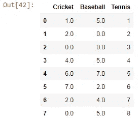

缺少的值用零填充。作者的照片

> ***结论:***

熊猫的基础是需要学习数据科学和机器学习。这些都是我们在日常的编码和算法实践中可以用到的基本东西。

我希望你喜欢这篇文章。通过我的 [LinkedIn](https://www.linkedin.com/in/data-scientist-95040a1ab/) 和 [twitter](https://twitter.com/amitprius) 联系我。

# 推荐文章

1.  [NLP——用 Python 零到英雄](https://medium.com/towards-artificial-intelligence/nlp-zero-to-hero-with-python-2df6fcebff6e?sk=2231d868766e96b13d1e9d7db6064df1)

2. [Python 数据结构数据类型和对象](https://medium.com/towards-artificial-intelligence/python-data-structures-data-types-and-objects-244d0a86c3cf?sk=42f4b462499f3fc3a160b21e2c94dba6)

3. [MySQL:零到英雄](https://medium.com/towards-artificial-intelligence/mysql-zero-to-hero-with-syntax-of-all-topics-92e700762c7b?source=friends_link&sk=35a3f8dc1cf1ebd1c4d5008a5d12d6a3)

4.[Python 时间序列基础](https://medium.com/towards-artificial-intelligence/basic-of-time-series-with-python-a2f7cb451a76?source=friends_link&sk=09d77be2d6b8779973e41ab54ebcf6c5)

5. [NumPy:用 Python 零到英雄](https://medium.com/towards-artificial-intelligence/numpy-zero-to-hero-with-python-d135f57d6082?source=friends_link&sk=45c0921423cdcca2f5772f5a5c1568f1)