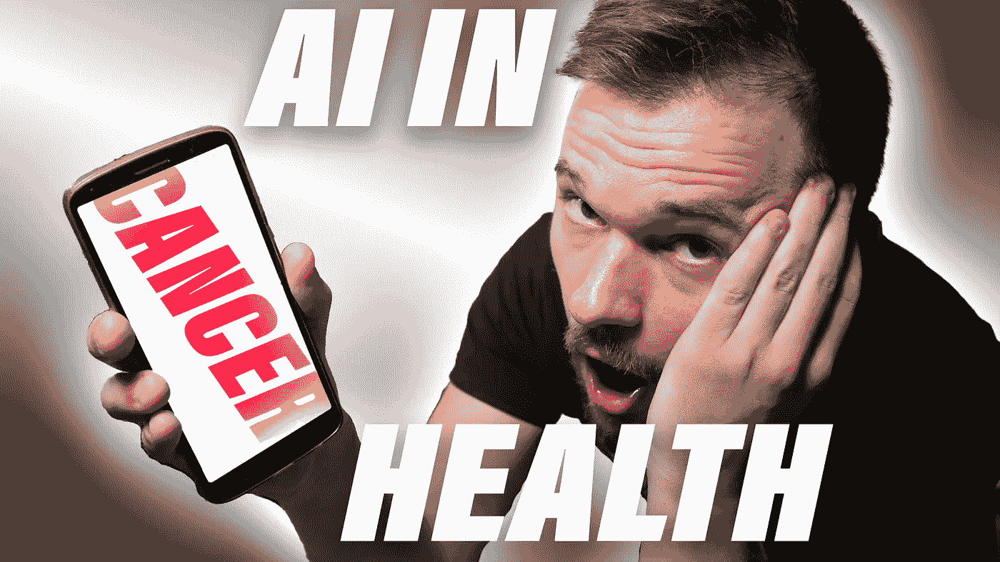
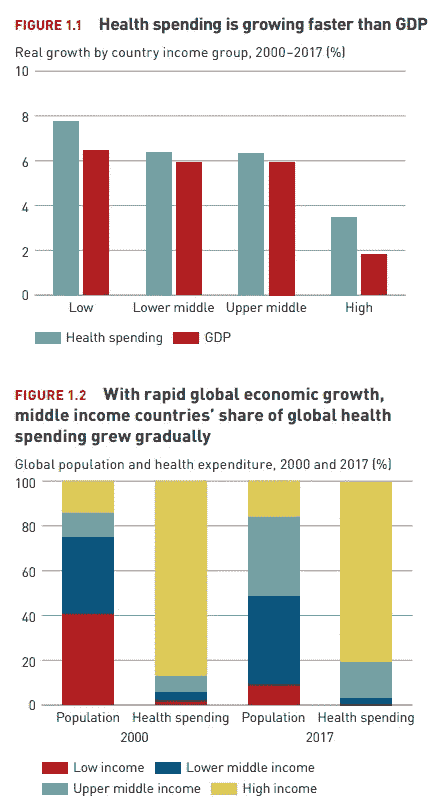
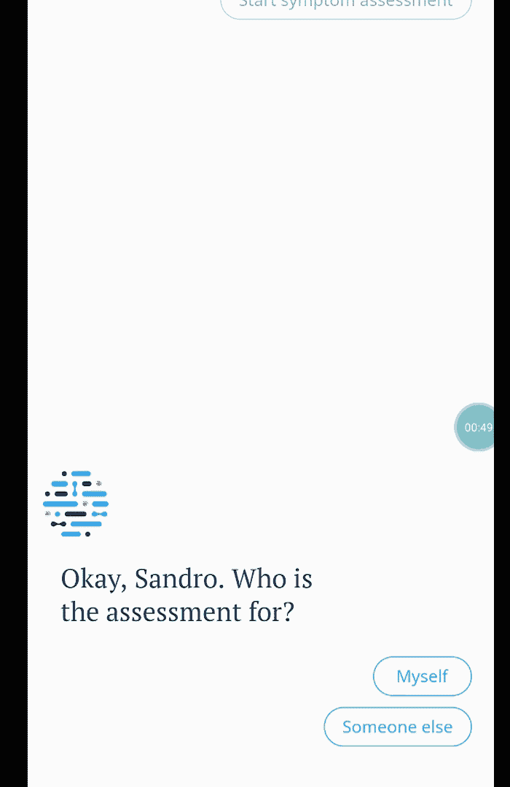
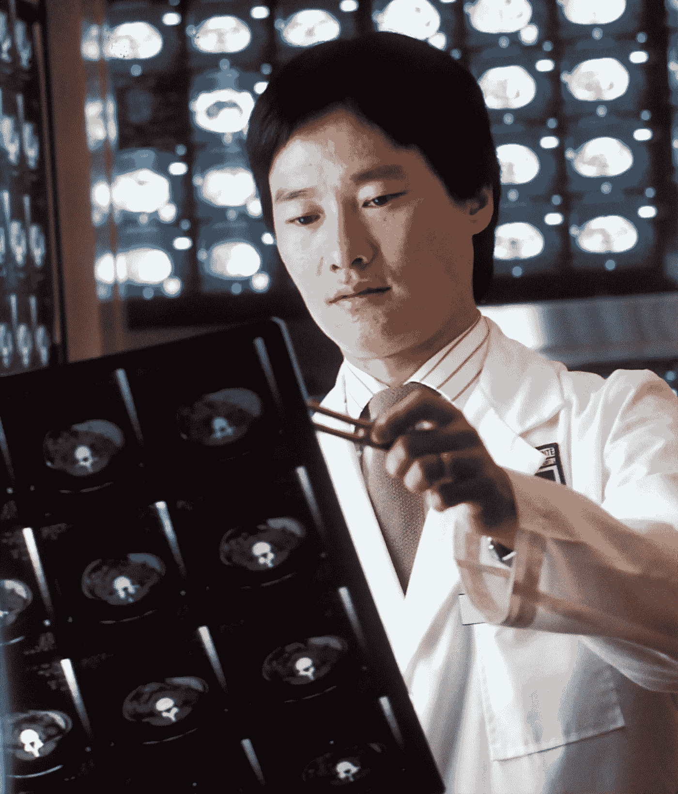

# 医疗保健工作的未来

> 原文：<https://pub.towardsai.net/future-of-work-in-healthcare-b8b0df5b3885?source=collection_archive---------6----------------------->

## [未来](https://towardsai.net/p/category/future)，[意见](https://towardsai.net/p/category/opinion)

## 人工智能、大数据、数据科学和机器学习如何改善医学

作者形象

随着疫情进入最后阶段。我们都开始思考未来我们如何对抗疾病。特别是因为我们还在应对不断增长和老龄化的世界人口。

我们目前每年在全球医疗保健上花费大约 7.8 万亿美元。这是从 2017 年开始的[估计，所以现在肯定更多。这大约是世界 GDP 的 10%。](https://www.who.int/health_financing/documents/health-expenditure-report-2019.pdf?ua=1)

更糟糕的是，在疫情之前，医疗支出已经超过了 GDP 的增长速度。特别是在世界上较富裕的地区，正如世界卫生组织(世卫组织)的图表所示。

图片来自[世卫组织](https://www.who.int/health_financing/documents/health-expenditure-report-2019.pdf?ua=1)，开放权限由[世卫组织](https://www.who.int/about/who-we-are/publishing-policies/copyright)授予

我们将研究人工智能、数据科学和大数据如何用于医疗行业，以及这如何宣传新的用例并改进现有流程。

# 自动数据采集（Automaticdataacquisitions）

世界各地的医生把大部分时间花在诊断病人身上。诊断是正确“标记”病人所患疾病的过程。为了做到这一点，他们主要与病人交谈，并进行一系列的测试。

d [诊断对总医疗成本的影响大约是 10%,如果我们能够以某种方式自动化其中的一些部分，我们将会如前所述，每年节省数十亿美元。](https://pubmed.ncbi.nlm.nih.gov/19526934/)

这正是 ADA 的想法，他们决定建立一个聊天机器人。在自然语言处理和医学的人工智能的最新发展的推动下。

这款应用可以在 [APP-store](https://play.google.com/store/apps/details?id=com.ada.app&hl=en_US&gl=US) 上找到，并且已经帮助我找到了治愈我左脚疼痛的伸展运动——可能是因为在疫情期间减少了行走。

> 无论是什么困扰着你，从胃病到头痛，Ada 的免费症状检查器都可以帮你找到答案，并让你知道是否应该去看医生

## 一般流程:

1.  输入症状列表
2.  回答你经历这些有多久了
3.  回答一系列相关的问题来缓解病情
4.  获得潜在疾病的诊断

Gif 由作者制作，使用 ADA 进行虚构的诊断。剪短一点。

# 放射学

ADA 是一种非常广泛的技术。为了理解人工智能如何给医学的不同领域带来好处，我们将研究人工智能有望带来最大收益的领域。

放射科医生看着计算机断层扫描，来源:Unsplash [国家癌症研究所](https://unsplash.com/photos/xcN1taJ2y0M)

放射学是一门利用[医学成像](https://en.wikipedia.org/wiki/Medical_imaging)来诊断和治疗疾病的学科。这包括各种成像技术，如 x 光[射线照相](https://en.wikipedia.org/wiki/Radiography)、[超声波](https://en.wikipedia.org/wiki/Ultrasound)、[计算机断层摄影](https://en.wikipedia.org/wiki/X-ray_computed_tomography) (CT)等等。

放射学通常也被认为是最容易自动化的医学学科。这主要是因为 Ai 近年来变得非常擅长分析带标签的图像。

2016 年末，神经网络教父杰弗里·辛顿教授在谷歌大脑和多伦多大学之间来回奔波，他说

> “如果你是一名放射科医生，你就像漫画中的怀尔斯·e·郊狼；你已经越过了悬崖的边缘，但你没有向下看”——杰弗里·辛顿

这种程度的自动化还没有发生，但公平地说，它仍然看起来很有希望，不是 100%自动化的希望，但我们肯定会在更短的时间内完成更多高质量的工作。

这方面的一个令人惊叹的工具是 NVIDIA 的 Clara Studio 零编码医疗保健机器学习解决方案(不用担心，你也可以编码；).它基于 NVIDIA 的框架 Clara。

> NVIDIA Clara 是一个医疗保健应用框架，用于人工智能成像、基因组学以及智能传感器的开发和部署。它包括全栈 GPU 加速库、SDK …以创建实时、安全和可扩展的解决方案。— [英伟达](https://developer.nvidia.com/clara)

Clara Studio 不仅集成了数据标记和转换工具，还提供了高效的计算实现。除了医学成像，他们目前还瞄准基因组学和智能医院作为潜在的使用领域。

# 更多数据/可穿戴设备

到目前为止，我们已经研究了当前可用的并由医疗从业者执行的过程。但是在不久的将来会出现什么全新的治疗方式呢？

主要的元趋势是由越来越多的可操作设备(如 apple watch)驱动的大规模数据收集。它已经检查了你的心率，进行了心电图测试，并检查了心房纤维性颤动。

智能手机、手表和潜在的智能眼镜中的廉价、简单的传感器将采集我们的汗水和血液样本，智能呼吸传感器——已经在开发中。

但不仅仅是可穿戴设备，智能技术也在推动这一趋势，例如 Toto 的概念项目——上周在消费电子展(CES)上展示的[健康马桶](https://mashable.com/article/toto-wellness-toilet/)。健康厕所是一种智能厕所，它可以扫描您的排泄物，为您提供健康数据。

另一个值得解决的健康问题是老年人跌倒的风险。跌倒是致命伤害的主要原因，也是老年人住院的最常见原因之一
。

> 跌倒每年导致超过 280 万人受伤，其中
> 超过 80 万人住院治疗，超过 2.7 万人死亡。
> 
> 2015 年，坠落伤害的总成本为 500 亿美元。— [智能腰带](https://www.weltcorp.com/)

这正是 SMART BELT PRO 试图解决的问题。他们开发了一种智能腰带，可以帮助检测老年人行走模式的异常，以判断他们是否处于危险之中，并在必要时提醒护理人员。此外，他们正试图进入体育市场。

趋势很明显，关于你和你的身体的数据越来越多，事实上，这个星球上医生的数量是不够的。这正是机器学习解决方案的正确位置。

想象一下，在这个世界里，你的手机几乎每天都为你提供健康和患病几率的最新信息。它会准确地告诉你什么时候应该去看医生，以及你可能忽略了哪些食物、锻炼和营养。

这种全身系统不仅能改善你的健康，还能节约成本，避免危险的手术/药物治疗。将此与药物研发中量身定制的个人解决方案相结合，肯定会给我们的卫生系统带来完全不同的关系。

# 结论

医疗保健质量和成本的提高是世界经济的关键因素，更重要的是对患者而言。随着我们在数据收集和机器学习技术上的进步，疾病将会被更准确、更早地检测出来。

随着我们通过可穿戴设备收集更多数据，医生也获得了一个有价值的盟友。理论可以进行“回溯测试”和验证，而不仅仅依赖于患者通常扭曲的看法。

当前疫情的少数优势之一是对个人健康的敏感度和兴趣增加。这不仅会资助该领域的新研究和开发，还会加速其应用。

如果你喜欢这篇文章，我会很高兴在 Twitter 或 LinkedIn 上联系你。

一定要看看我的 [YouTube](https://www.youtube.com/channel/UCHD5o0P16usdF00-ZQVcFog?view_as=subscriber) 频道，我每周都会在那里发布新视频。