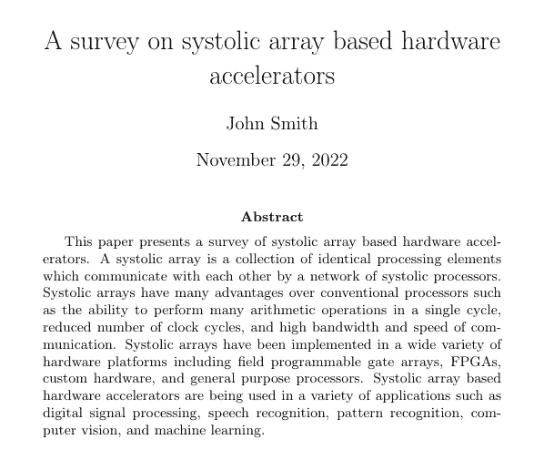
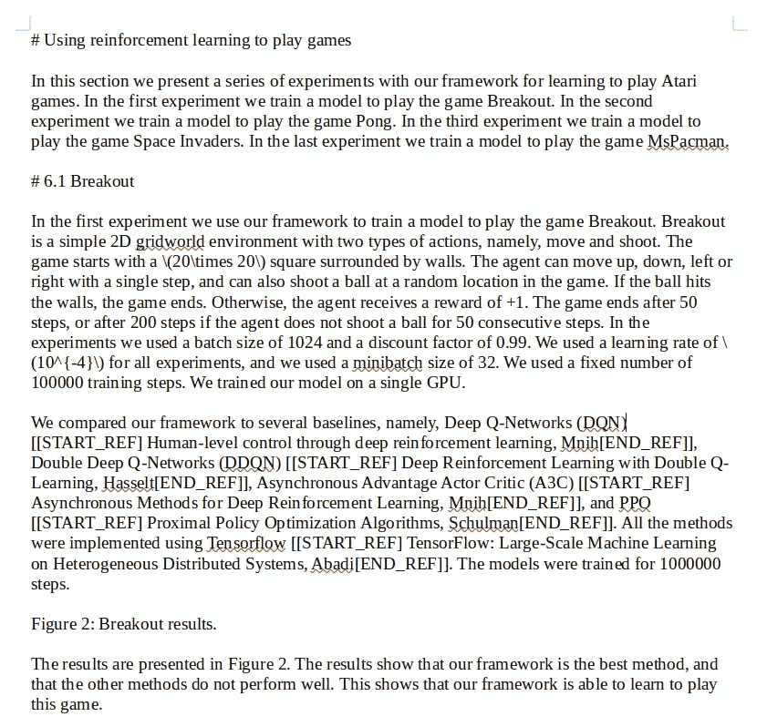

# 卡拉狄加:如何(负责任地)使用大家都在谈论的有争议的语言模型

> 原文：<https://pub.towardsai.net/galactica-how-to-responsibly-use-the-language-model-everyone-is-talking-about-31882a7c7339?source=collection_archive---------2----------------------->

安妮·斯普拉特在 [Unsplash](https://unsplash.com?utm_source=medium&utm_medium=referral) 上的照片

# 介绍

也许你已经读过很多关于 MetaAI 在 11 月发布的语言模型 Galactica 的文章。在最初的论文中，作者声称卡拉狄加可以通过提供一个能够“理解”科学的模型来帮助管理科学知识的爆炸。他们声称，像 Galactica 这样的系统能够整合来自不同来源的知识，并找到它们之间有趣的关系，从而与普通搜索引擎相比，提高了返回的结果。但是它到了吗？

在这篇文章中，我将解释什么是卡拉狄加以及围绕它的争议和戏剧，这些争议和戏剧最终导致了可用的[免费演示](https://galactica.org/)的取消(MetaAI 的董事总经理 Joelle Pineau 在演示网站上发表了一篇短文，解释了演示取消的原因)。但是……如果你能一直陪我到这篇文章结束，我将向你展示如何用最少的 Python 知识自己使用这个模型！最后，我将提出我自己对此事的一些拙见。

这篇文章还提供了一个**小挑战**:整篇文章中有*一小段*(只有一个，我发誓)是在卡拉狄加的帮助下写的。如果你能找到它，请在评论中告诉我！

# 卡拉狄加是什么？

Galactica 就是通常所说的大型语言模型(LLM)，一种能够模拟人类语言复杂概念的人工智能算法，并生成(理论上)有意义的文本。在过去的十年中，LLM 对自然语言处理的许多领域产生了重大影响，包括机器翻译、问题回答、自然语言推理和语言建模。这些模型是在大量文本语料库上训练的。许多法律硕士还会多种语言，这意味着他们接受的是用多种语言编写的文本培训。

卡拉狄加模型的介绍

根据 MetaAI 自己的首席人工智能 Yann LeCun 的话，我们可以将它视为“自动完成一切”，这是一种可以帮助生成新的科学著作的工具，但仍然依赖于人的干预来实际策划生成的文本。论文的以下摘录完美地总结了这一观点:

> Galactica 被用来帮助撰写本文，包括推荐遗漏的引文、引言和相关工作中要讨论的主题、推荐进一步的工作，以及帮助撰写摘要和结论。

卡拉狄加*帮*写了自己的论文！这是一件好事吗？这将有助于在未来产生更好的科学作品。或者这是一件坏事，一个只会被用来传播错误信息和虚假事实的启示录式人工智能？但更重要的是，它真的准备好被任何科学领域的研究人员使用了吗？我们能在多大程度上信任这个模型的输出？这个模型是一个可以用来更好地自动化错误信息传播的工具吗？

让我们先试着理解这个模型的能力和局限性。

## 文章和论文生成

这种模式最广为人知的特点之一是它能够生成整篇论文或维基百科文章。用户将插入一个标题(例如，“关于科学著作生成的大型语言模型的调查”)，模型将生成一个完整的文本，包括摘要、章节、数学公式，甚至引用！

因为该模型是用各种主题(机器学习、生物学、计算机科学等)的论文训练的，所以理论上它可以生成专注于其中一个主题的文本，甚至可以找到跨主题的关系。

## 引用提议

引用是向读者表明你所展示的信息来自其他来源的一种方式。在科学论文中，这通常用括号中的数字来表示([1]、[13])，它引用了论文末尾包含的列表。卡拉狄加实际上可以推荐几个句子的引用。为了让它工作，用户需要在他们的句子中插入文本[START_REF](例如，“LLMs like Galactica [START_REF]”)，Galactica 将自动完成与句子内容相关的论文名称。

## 太久了，没看(TLDR)

卡拉狄加可以生成 TLDR，即大段文字的小摘要。这并不新鲜，有很多模型可以生成 TLDR，但这仍然是一个有趣的特性，显示了模型的灵活性。

## 论证

卡拉狄加接受了一系列推理任务的训练，能够解决基本的物理问题，比如计算以特定加速度移动特定质量所需的力。

## 常见语言任务

这项工作最有趣的一个方面是，尽管它是在主要由科学论文组成的数据集上训练的，但根据作者的说法，它可以在普通自然语言处理任务上胜过以前的工作！作者认为这是因为他们使用的数据集的质量，声称在训练这些类型的模型时，质量比数量更好。

## 毒性和偏见

LLM 的一个常见问题是，它们是使用人类生成的文本进行训练的，因此，它们可能容易出现种族主义、刻板印象和偏见。因为消除训练数据集的所有这些邪恶态度实际上是不可能的，所以研究人员开发了测试和基准来衡量一个训练过的模型实际上有多有害。在本文中，Galactica 的作者测量了它的毒性，并将其与其他语言模型进行了比较。他们的结论是，卡拉狄加比其他型号更好，尽管我们必须记住，这并不意味着它没有毒性。但事实上，它们比现有的基准有所改进，这仍然是引人注目的。同样，作者认为这是他们用来训练模型的数据集质量的直接原因。

## 未来的工作

作者想要探索的一个有趣的补充是捕捉图像中包含的信息的方法(对于一个声称是为组织科学知识而量身定制的模型来说，这是一个自然的下一步)。

作者还强调需要改进这种人工智能算法的验证过程，以确保生成的数据不仅听起来权威，看起来正确，而且实际上 T2 是正确和可信的。根据尝试过之前可用演示的 Twitter 用户的强烈反对，这似乎是作者应该努力的主要主题。

## 限制

当然，卡拉狄加是**而不是**一个全能的模型，能够独立进行科学研究，**也不是**它能够始终提供科学上准确的信息。在本文的结尾有一个完整的部分，其中提供了限制和警告。

首先，该模型仅使用开放获取的论文进行训练，这些论文仅包含整个可用科学知识的一小部分:随着更多来源的增加，性能和泛化能力应该会提高。

作者还建议不要使用该模型来生成关于诸如“的首都是什么”等问题的常识答案的文本，因为尽管卡拉狄加可能知道答案，但它没有受过这方面的训练。

包含公开演示的网页也提供了一些限制:

*   LLM 容易产生幻觉！你不应该在未经核实的情况下听从 LLM 的建议！
*   Galactica 倾向于生成与被大量引用的概念相关的内容，所以如果你生成关于不太为人知的主题的文本，要小心。
*   更重要的警告是:“*卡拉狄加生成的一些文本可能看起来非常真实、非常自信，但在一些重要方面可能存在微妙的错误。*”

# 围绕它的争议(和戏剧)

尽管所有这些之前的功能看起来都非常有前途，但 Galactica 的[公开演示受到了谨慎的对待，在几个小时的测试后，完全被拒绝。](https://galactica.org/)

演示一上线，Twitter 用户和来自世界各地的研究人员就前往网站尝试该模型。这个演示用来生成各种输出，有些是准确的，有些是有问题的。这个社区很快分成了两个截然不同的团体:一个支持这个模型，另一个声称这个模型很危险，不应该公开。

该模型的批评者引用最多的推文之一是马克斯·普朗克智能系统研究所所长迈克尔·布莱克的观点。

迈克尔·布莱克的担忧

反对卡拉狄加的论点倾向于围绕这个模型可能的误用。赞同这一观点的用户表达了他们的担忧，即卡拉狄加发表的文章可能让*听起来*自信，让*看起来*像真正的科学著作，但包含虚假信息。他们还声称，这种模式的广泛使用甚至可以使虚假信息不被审稿人发现，从而发表具有误导内容的论文。

卡拉狄加保卫者一方由真正的扬·勒昆领导，他声称这种 LLM 可能产生的谎言和误导性事实与人类可以编造的谎言没有什么不同，并为卡拉狄加的创造者辩护:

Yann LeCun 为整个 LLMs 辩护

扬·勒昆为《卡拉狄加》的作者辩护

虽然这个讨论是从卡拉狄加开始的，但它已经扩展到了其他模型，比如 ChatGPT 和 LLMs。

## 动手！

也许你已经在我以前的文章中看到了，但是我喜欢提供代码的文章，这样你就可以自己测试了。尽管曾经有一个界面很好的网站来测试这个模型，但正如前面所讨论的，由于社区的强烈反对，这个网站被关闭了。但这只是针对普通大众:如果你懂一点 Python，实际上有一个 [GitHub 库](https://github.com/paperswithcode/galai)解释如何下载模型的不同版本，以及如何使用它生成文本！

首先，也是最重要的:如果你想使用这个现成的，你需要在你的电脑上安装一个 GPU 和 CUDA 工具包。我不会进入安装细节，因为网上已经有很多关于这个问题的优秀教程。所以让我们开始吧:

此示例向您展示了自己运行模型所需的最低要求。首先，我们导入*加莱*包和*火炬*包。然后，我们加载一个公开的卡拉狄加模型。这里我们有 5 种不同的型号可供选择，每种型号都有自己的尺寸，正如报纸上报道的:*迷你*、*底座*、*标准*、*大型*和*巨型*。最后，我们查询模型，告诉它生成 200 个标记(字符),并插入我们希望它生成的字符串的开头。结果将是一个 200 个字符长的 Markdown 字符串，带有(希望)一些与我们作为输入插入的字符串相关的有用信息。

现在，因为模型的输出是 Markdown 格式，所以需要做一点格式化，以便能够以漂亮的格式在这里呈现它。格式化之后，我向你展示基本的 Galactica 模型在被问到我以前的一篇文章的主题[时生成的输出:](https://medium.com/towards-data-science/accelerating-neural-networks-on-hardware-baa3c14cd5ba)

由 Galactica 为提示“标题:基于脉动阵列的硬件加速器调查”生成的摘要\n\n 作者:John Smith\n\n

我不得不承认，它对我来说看起来相当不错，尽管我不认为任何人会使用这种现成的输出来开始他们期望发表的实际论文。不管怎样，有趣的是它知道脉动阵列是相互通信的元素的集合。它也知道这种加速器在不同类型的应用中使用，它提到的一些优点也是正确的。也许在巨大的模型上运行相同的提示可以获得更好的结果。

让我们尝试一些不同的东西，并请 Galactica 生成一篇关于使用强化学习玩 1v1 游戏的维基百科文章，这是我之前的另一篇文章的主题[:](https://medium.com/towards-data-science/how-deepmind-discovered-new-ways-of-multiplying-matrices-using-ai-a04557e9f861)

卡拉狄加为提示“#使用强化学习玩游戏”生成的维基百科文章

这里有太多要说的了！看起来卡拉狄加声称发明了一个框架，并通过玩不同的游戏进行了测试。它对突破 Atari 游戏和训练程序进行了非常详细的描述，甚至引用了与这个虚构框架进行比较的论文(如果你在问自己这些论文是否存在，是的，它们都存在，是的，甚至连作者姓名都写对了)。但是…突破规则是完全错误的。

## 个人愚见

在阅读了该模型产生的大量输出结果，并查看了双方提出的论点后，我注意到大多数争议都围绕着 Galactica 的论文生成能力，而很少有人讨论它的其他功能，如引文生成/建议和 TLDR。尽管在该模型的文本生成功能方面仍有工作要做(正如作者在论文的“未来工作”一节中所述)，但我看到了一种工具的许多未来，这种工具能够提出给定特定概念或想法的特定引用。但作为辅助工具，它的输出仍然需要*人工审核。*

*卡拉狄加有没有可能排除某些引用结果？还是为了错过推荐一篇不太知名论文的机会？当然啦！该模型并不完美，作者在论文中解决了这两个问题。正如作者所说:*

> *我们的终极愿景是为科学任务提供动力的单一神经网络。我们相信这将是人类获取科学知识的下一个界面，我们从本文开始。*

*这是一个工具的第一次迭代，这个工具应该帮助科学家们生成 ***更*** 的科学，而不是为他们生成*。我相信这是朝着正确方向迈出的一步，尽管还需要做一些工作来限制在这项工作的未来版本中被误用的机会。**

**我想以迈克尔·布莱克关于 LLMs 的一些想法来结束这篇文章，你可以在[这个](https://twitter.com/Michael_J_Black/status/1594945693524938752) Twitter 对话中找到。我发现他们真的很有见地，所以我想与你分享:**

*   **如果一篇论文使用了 LLM，也许 LLM 应该被认为是作者。这是非常不切实际的，因为如果论文的内容受到质疑，作者应该能够为其辩护。逻辑思维模式能够解释他们在写一个特定的句子或段落时使用的“思维”过程吗？**
*   **科学建立在人民和政府的信任之上，这为学术研究提供了所需的资金。如果这些模型产生的虚假论文开始通过审查程序并被发表，在社会比以往任何时候都更需要科学的时候，对科学的信任将会下降，从而减少资金。**
*   **LLM 模型的传播应该是负责任的，考虑到所涉及的风险，并开发“解毒剂”来反击这些模型可能产生的伪科学。甚至可能在这些 LLM 旁边提供模型，可以区分 LLM 生成的文本和人类生成的文本。**

**欢迎在 [Twitter](https://twitter.com/PecciaF) 或 [LinkedIn](https://www.linkedin.com/in/fpecc/) 上关注我，让我知道你对这篇文章的看法，或者[请我喝杯咖啡](https://www.buymeacoffee.com/pecciaf)，如果你真的喜欢它！**

**感谢阅读！**

## ****参考文献****

**原始纸张:**

*   **[泰勒等人《卡拉狄加:科学的大语言模型》。2022.](https://galactica.org/static/paper.pdf)**

**关于这个话题的有趣的 YouTube 视频:**

*   **[卡拉狄加:科学的大型语言模型(戏剧&论文综述)](https://www.youtube.com/watch?v=ZTs_mXwMCs8&t=2638s)**

**迈克尔·布莱克对 LLMs 的看法:**

*   **[大型语言模型时代的同行评议、抄袭和作者身份](https://perceiving-systems.blog/en/news/peer-review-plagiarism-and-authorship-in-the-age-of-large-language-models)**