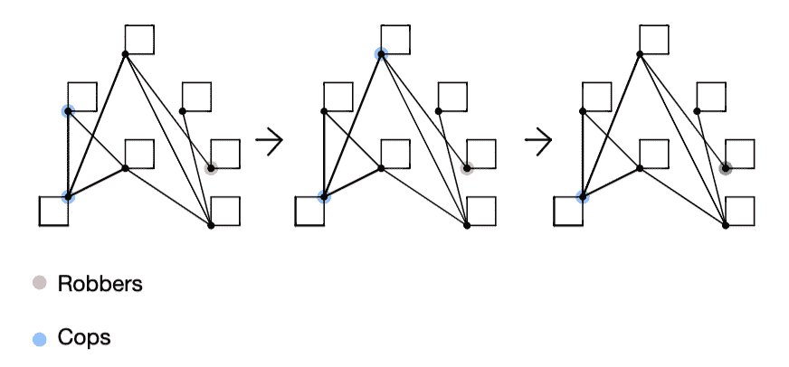
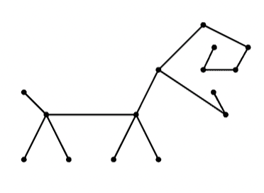
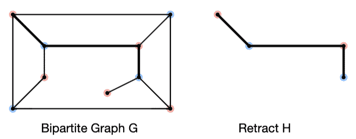
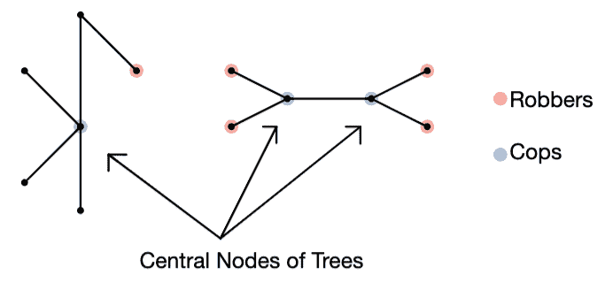
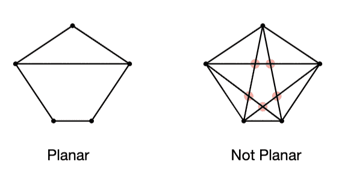
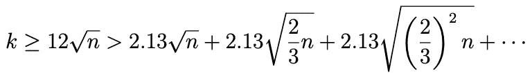
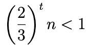

# 图网络上的警察&强盗游戏

> 原文：<https://pub.towardsai.net/game-of-cops-robbers-on-graph-networks-912525090239?source=collection_archive---------0----------------------->

## 网络警察与强盗背后的数学


图片由来自 [Unsplash](https://unsplash.com/photos/V79loOjFOLA) 的[埃里克·麦克林](https://unsplash.com/@introspectivedsgn)拍摄

**目录**

1.  介绍
2.  树和缩回
3.  平面图形
4.  讨论和后续步骤
5.  资源

# 1 导言

图论是数学的一个分支，它通过节点和边的形式帮助建立成对关系的数学表示。现实世界中的各种问题都可以通过图形有效地表示出来，本文关注的主题是警察与强盗的博弈。要了解过度描述的警察和强盗，必须先了解警察和强盗的游戏。警察和强盗的游戏是由[1，2，3]引入的。

关于图的警察和强盗的游戏可以被说明如下，想象一个自反图 G，使得每个节点有一个环，并且可以存在连接节点的多条边，但是游戏假设只有 1 条边连接节点。这些节点可以由两个玩家居住，第一个玩家代表一组警察(至少 1 个警察)，第二个玩家代表一个强盗(每个图只能有 1 个强盗)。这个游戏是反复进行的，警察和强盗轮流玩，直到游戏结束。由 C 表示的警察总是先移动，由 R 表示的强盗总是跟着警察移动。警察和强盗通过从一个节点移动到另一个节点来移动，因为在每个节点都有自循环，所以总是有机会停留在相同的位置。当警察能够抓住强盗，使得警察和强盗占据相同的节点时，游戏结束。同样，如果你能证明强盗永远不会被抓到，这个游戏就会以有利于强盗的方式结束。警察和强盗的获胜策略是让他们的对手失败。



**图 3** :图 g 上玩的警察和强盗的游戏，蓝色节点代表警察，红色节点代表强盗。经过 2 次迭代(0 索引)后，抢劫犯被抓获

cop 数(在[1]中创造)是指拥有有利于 COP 的获胜策略所需的 COP 的最小数量[4]。博弈长度代表抓捕劫匪所需的回合数，如果博弈长度是警察的最小整体可能策略，c(G)警察是最优的[4]。在这种情况下，c(G)表示图 G 的 cop 数，Meyniels 猜想指出 n 顶点图上 cop 数的上界是 O(√n)。K-capture time 指的是 k 个警察玩游戏的时候，其中 k ≥ c(G)表示为 captk(G)。因此，当 k = c(G)时，记为 capt(G ),也称为 G 的捕获时间。

现在我们已经对警察和强盗建立了一个基本的理解，过度规定的警察和强盗的游戏是指当警察的数量严格大于副本数量时[4]。对于本文的上下文，图 G 将是有限的和自反的。我们将概述关于平面图和树的各种证明。

# 2 个采油树和收回装置

与本节相关的基础理解和证明源于理解什么是图论中的树和收缩。树被定义为一个连通的无环无向图。参考图 2。



**图二:**上图是一棵树。它是一棵树，因为图中的边是无向的，没有圈。图片由作者提供。

要理解什么是回缩，就必须知道什么是同态。同态是两个图之间的映射，它是给定一对图的顶点集，将相邻顶点相互映射的函数。收缩是从图 G 到 G 的子图 H 的同态 r，使得对于 H 的每个顶点 v，r(v)= v[5]。在这种情况下，子图 H 被称为 g 的收缩，图同态和收缩参见图 3。Aigner 和 Fromme 在[1]中证明了与 G 的收缩 H 相关的 cop 数≤与 G 相关的 cop 数。这种说法经常被用在论文解释的整个证明中。



**图 3:** 图 H 是二分图 g 的回缩图，图片由作者提供。

整篇论文中阐述了各种证明，Bonato 等人在[4]中证明了以下陈述是有效的。下列定理、引理和推论已被证明是正确的:

```
Lemma 1\. For a retract H of a graph G, rad_k(H) ≤ rad_k(G).
Lemma 2\. For any graph G, capt_k (G) ≥ rad_k(G).
Corollary 3\. For any G and any k, capt_k (G) ≥ diam(G)−k+1/ 2k.
Theorem 4\. For any tree T, capt(T) = rad(T).
Theorem 5\. Suppose that V (G) = V1 ∪ · · · ∪ V_t , where G[V_i] is a retract of G for every i and k = Sum(i∈[t] k_i). Then capt_k(G) ≤ maxi∈[t] capt_ki (G[V_i]). Note that if k_i < c(G[V_i]), then we say that capt_ki (G[V_i]) = ∞.
Corollary 6\. For any tree T, capt_k (T) = rad_k(T).
```

再深入一点，让我们证明从引理 2 得出的定理 4。用 rad(G)表示，图半径是图中任何节点的最小图偏心率(图 G 中一个节点到另一个节点的最大距离)。定理陈述了树 T 的捕获时间等价于 T 的半径，证明如下，cop 放在树的一个中心节点上。树的中心节点被称为中间节点，即保存树中最长路径的节点。您可以通过算法识别中心节点，为此，您可以迭代地从树中删除叶节点，直到只剩下一个节点。如果剩下一对节点，那么该对中的两个节点都可以被认为是中心节点。这样，您可以最大化从这个节点到树中所有其他节点的距离。一旦 cop 被放置在中心节点上，cop 必须简单地沿着通向强盗的路径前进。现在警察扎根在中心，不管强盗位于什么位置，警察都可以狭窄地困住强盗。因此，强盗最多只能被抓到一步。



**图 4:** 树上中心节点的例子。蓝点代表警察的位置，而红点代表劫匪的潜在位置。图片由作者提供。

# 3 平面图

在这一节中，我们将探索平面图形上的警察和强盗的游戏。根据定义，如果一个图可以被直观地绘制成没有边相交，那么这个图就是平面的。请参考图 5，了解平面图的可视化表示。要记住的另一个定义与图的半径有关。用 rad(G)表示，图半径是图中任何节点的最小图偏心率(图 G 中一个节点到另一个节点的最大距离)。



**图 5:** 左边的图形是平面的，右边的图形不是。右侧图形上的红点表示边之间的交点，导致它不是一个平面图形。图片由作者提供。

在整篇论文中有各种与平面图相关的证明，Bonato 等人在[4]中证明了以下陈述是有效的。下面的定理是我们将深入探究的一个:

```
Theorem 13\. For any connected planar graph G, if k ≥ 12√n, then captk (G) ≤ 6 rad(G) log n [4].
```

与该定理相关的证明依赖于 Alon、Seymour 和 Thomas 创造的平面分离器定理[6]。平面分隔符定理指出，有一组最多 2.13√n 个节点将图分成大小最多为 2/3n 的两组[4]。这产生了以下界限:



这个公式取自[【4】](https://math.ryerson.ca/~abonato/papers/OverprescribedCR_Nov22.pdf)。图片由作者提供。

现在，cop 的策略是将 COP 放置在中心节点和分隔符上，使得每个分隔符最多有一个 COP(符合 2.13√n 界限)。不管强盗放在哪里，我们都可以把警察放在中心节点上，然后把警察从隔板上向内移动，以减少给强盗的空间。这基本上让警察可以诱捕强盗。COP 以迭代速率向内移动，其中在第二次迭代期间，它们将以 2.13√(2/3n)的速率移动(根据上面的公式)，等等。现在要问的问题是，要使这个约束有效，需要多少组警察。下面的公式表明了团队 t 的必要数量



公式取自[【4】](https://math.ryerson.ca/~abonato/papers/OverprescribedCR_Nov22.pdf)。图片由作者提供。

其中 t 表示警察队伍的数量。上述公式适用于 t = 6log(n)的情况，每个小组最多采取 rad(G)步[4]。

# 4 讨论和后续步骤

本文涵盖和证明的概念绝不是详尽的，警察和强盗游戏背后的数学可以通过多种方式进行探索。本文介绍的证明和概念可以在各种不同版本的《警察与强盗》中探索，看看它们是否仍然成立。

数学家们还没有彻底探索的一个领域是警察和强盗的博弈。在这个版本的游戏中，你可以探索警察和强盗之间一对一或一对多的映射。这是可行的，因为有许多警察和许多强盗，请注意，在这种情况下，强盗的数量不能超过地图中警察的数量。每个地图实际上代表了每个警察小组要追捕的目标强盗。虽然这可能看起来是对最初引入的主题的简单旋转，但问题的数学复杂性已经急剧增加。考虑这个问题的一种方式是，想象每个警察和强盗配对被映射到 g 的有限连通子图。然而，每个子图上可以有不止一个配对，并且映射到配对的子图可以基于警察和强盗的移动而扩展。这种简单的理解开启了各种数学探索的机会。其中一个领域将是探索当前用于识别 cop-win 的界限和公式是否仍然适用于这类问题。

这一数学领域的进步对各种其他行业都有许多影响。这是因为警察和强盗的游戏在许多领域都有广泛的应用，从机器人到游戏到反恐到生成性对抗网络(一种强化学习的框架，其中代理人相互竞争以学习某项任务)。解决《警察与强盗》中的问题的持续进展也可以帮助其他研究领域的进展。

# 5 资源

*   [1] M. Aigner，M. Fromme，警察和强盗的游戏，离散应用数学。8 (1984) 1–11.
*   [2] R.J. Nowakowski，P. Winkler,《图中的顶点到顶点追踪》,《离散数学》43(1983)235–239。
*   [3] A. Quilliot,《图形的青年和尖锐问题》,巴黎第六大学，1978 年，第 131-145 页。
*   [4] A. Bonato，X. Perez-Gimenez，P. Pralat，B. Reiniger，图形与组合学 33(2017)801–815。
*   【5】[地狱，帕沃尔](https://en.wikipedia.org/wiki/Pavol_Hell)； [Nešetřil，雅罗斯拉夫](https://en.wikipedia.org/wiki/Jaroslav_Ne%C5%A1et%C5%99il) (2004)，[图与同态](http://www.cs.sfu.ca/~pavol/hombook.html)，牛津数学及其应用系列讲座，第 28 卷，牛津大学出版社，[ISBN](https://en.wikipedia.org/wiki/ISBN_(identifier))[0–19–852817–5](https://en.wikipedia.org/wiki/Special:BookSources/0-19-852817-5)# p19。
*   [6] N. Alon，P. Seymour，R. Thomas，平面分离器，SIAM 离散数学杂志 7(1994)184–193。

如果你喜欢读这篇文章，你可能也会喜欢与数学相关的其他文章。

[](https://towardsdatascience.com/mining-modelling-character-networks-part-i-e37e4878c467) [## 挖掘和模拟字符网络——第一部分

### 图论研究论文讨论

towardsdatascience.com](https://towardsdatascience.com/mining-modelling-character-networks-part-i-e37e4878c467) [](https://towardsdatascience.com/mining-modelling-character-networks-part-ii-a3d77de89638) [## 挖掘和模拟字符网络—第二部分

### 本文将介绍挖掘和建模角色网络的 Python 实现

towardsdatascience.com](https://towardsdatascience.com/mining-modelling-character-networks-part-ii-a3d77de89638) [](/dynamic-time-warping-explained-fbb24c1e079b) [## 动态时间扭曲解释

### 动态时间扭曲背后的直觉&股票数据的 Python 实现

pub.towardsai.net](/dynamic-time-warping-explained-fbb24c1e079b) [](https://towardsdatascience.com/linear-algebra-explained-through-graph-theory-1c79711e9a20) [## 图论解释的线性代数

### 用图论直观地解释线性代数的基础

towardsdatascience.com](https://towardsdatascience.com/linear-algebra-explained-through-graph-theory-1c79711e9a20) [](https://towardsdatascience.com/active-learning-in-machine-learning-explained-777c42bd52fa) [## 机器学习中的主动学习解释

### Python 中主动学习管道的直觉和实现

towardsdatascience.com](https://towardsdatascience.com/active-learning-in-machine-learning-explained-777c42bd52fa) [](https://towardsdatascience.com/recommendation-systems-explained-a42fc60591ed) [## 推荐系统解释

### 用 Python 解释和实现基于内容的协同过滤和混合推荐系统

towardsdatascience.com](https://towardsdatascience.com/recommendation-systems-explained-a42fc60591ed)