# gam 和平滑样条(第一部分)

> 原文：<https://pub.towardsai.net/gams-and-smoothing-splines-part-1-simplified-8c5e2c10dbaa?source=collection_archive---------0----------------------->

## [统计数据](https://towardsai.net/p/category/statistics)

在当今世界，深度学习被用于大多数机器学习应用，可解释性在现实世界的应用中变得至关重要。模型的可解释性对于理解不同变量如何相互作用以生成模型决策至关重要。

在这种情况下，我想总结一个强大的可解释模型家族——广义可加模型(GAM)及其构建模块——平滑样条。

第 1 部分文章包括:

1.游戏攻略

2.样条曲线和平滑样条曲线简介

3.GAM fitting (R)的 1D 自定义示例

在下一篇第 2 部分文章中，我将解释与

1.二维扩展——张量积样条

# **1。GAMs 简介:**

每个人都知道广义线性模型的简单形式，其中响应线性依赖于预测变量(结构如下所示):

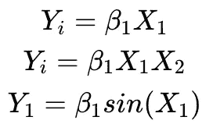

线性模型方程

其中β为未知参数，*‘X _ I’*为预测变量的模型矩阵。我们可以看到，即使我们在*‘X1，X2’*或*‘sin(X1)’*中有非线性，上述所有方程形式都是线性模型。下面是非线性模型形式—参数具有非线性:

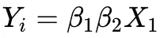

非线性模型的一般形式

广义可加模型-因变量和预测值之间的关系可以是非线性的，也可以是线性的。

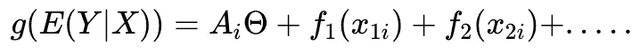

通式

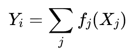

简化方程

这里，每个预测变量都与近似函数 f(x)相拟合。f(x)的一般形式如下

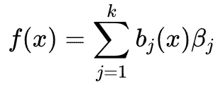

在上面，β是系数，“b()”被称为“基函数”，并且可以用类似于 R 的多项式函数*“poly(x，2)】来代替，以再次得到本质上是线性的多项式回归。但是一般来说，为了逼近 f(x ), gam 使用平滑样条。*

# **2。a .花键:**

以逼近预测变量的函数(上面的 f(x))。有两种插值。

1.  多项式插值:将 n 次多项式拟合到 n+1 个数据点的过程。用 n 次多项式表示基函数的最简单的插值类型。

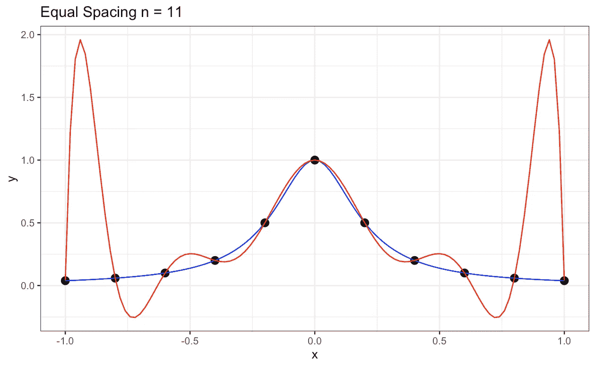

来源——图片由作者提供。生成这个图像的代码可以在我的 [Github](https://github.com/saipradeep-peri/GAMs_Tensor_Products_fits/tree/main/1D_Smoothing_Splines_exp) 上找到。

如果我们考虑一个点的附近，这些是有用的。但是，假设多项式的阶数变大(n > 10 ),如上图所示，它们可能在整个数据域范围内大幅振荡(误差较大)(查阅 [Runge 的](https://en.wikipedia.org/wiki/Runge%27s_phenomenon)现象，了解更多关于多项式限制的信息。)

2.分段插值:分段多项式插值通过在基于节点或断点划分的每个区间或区域中拟合低次局部多项式来解决上述问题。

样条是 k 次分段多项式，即 k-纽结，它是连续的并且可以 k-1 次可微。结、断点或控制点用于定义整个数据域的区间或区域。这些结的位置可以用许多方法来选择，如手动选择，分位数定位等。

如果我们看下图，我们可以看到由位于“t1”和“t2”的两个结产生的三个不同的区域或区间。现在，样条使用单独的多项式函数，特定于每个区域。

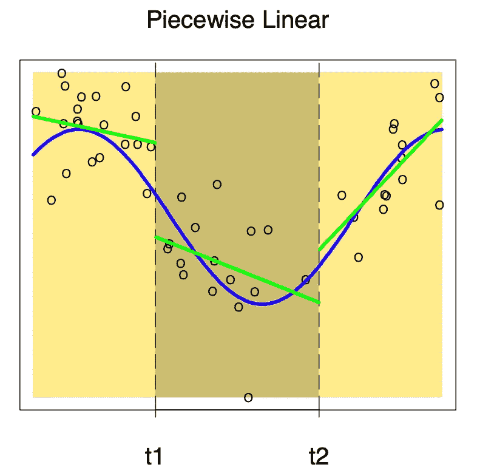

**来源— ESL 图书第 5 章图 5.2** 。具有分段线性基函数的样条。上面，你可以看到 3 个区间和 3 个不同的线性函数适合这些区间。

虽然有许多不同类型的样条——自然样条、三次样条、p 样条、B 样条、回归样条，但在本文中，我将讨论*自然三次样条*和*平滑样条*及其在 GAMs 中的应用。

三次样条是这样的样条，其中每个区间都用三次多项式拟合，并且施加了平滑约束(连续性)-二阶导数应该在区间边界(结点位置)匹配。

在边界处进行多项式拟合会使数据趋势的拟合变差。自然三次样条是通过为边界区间拟合线性基函数来处理这一问题的三次样条。

自然三次样条-其中分段多项式函数是具有连续性和边界约束的三次函数。边界区间中的基函数是线性的。

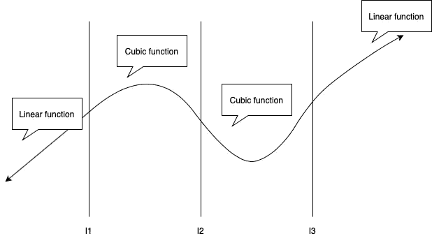

来源—作者提供的图片。上面表示的是带有自然边界条件的自然三次样条。

# 2.b .平滑样条:

这些是自然三次样条上的正则化回归，它具有通过将所有输入视为结来规避结选择的特性(这里的一般想法是您可以选择大量的结)。这里的正则化是基于通过积分曲线的二阶导数来平滑粗糙度，以最小化曲线的摆动。平滑样条的最小化函数如下。

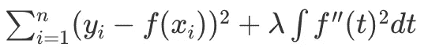

其中‘λ’是平滑参数，如果‘λ’= 0，则不会施加惩罚，这可能会导致非常嘈杂的拟合，如果它是无穷大，则是简单的最小二乘拟合。在上式中，f(x)是自然样条函数。(请理解，这里我们并不试图像线性模型那样开关各个特征的权重)

# 3.gams (R)的 1D 拟合示例:

我将使用 R 来拟合使用' mgcv()'包的 gam 模型。我不会在 Kaggle 的样本数据集上展示拟合过程；相反，我将设计一个带有目标曲线的简单玩具问题(人工数据创建)并解决一个回归问题。我相信，在样本实验曲线上拟合模型比解决一些具有高特征的真实示例数据更能帮助你理解概念，因为你不容易想象下面发生了什么(这是我的教授教我的，我喜欢这种方式)。

首先，我要创造一个玩具问题

```
library(tidyverse)
library(dplyr)
library(ggplot2)
library(mgcv)
library(broom)
library(splines)
library(purrr)# grid points
num_fine_int <- 80# A 1D-grid points on x-axis
fine_grid_list <- list(
  x1 = seq(-2, 2, length.out = num_fine_int+1)
) # Lets construct a target variable using natural splines of #certain degrees of freedom
fine_grid <- fine_grid_list %>% as.data.frame() %>% tibble::as_tibble()
fine_basis_mat <- model.matrix(~ ns(x1, df = 8) -1, data = fine_grid)
colnames(fine_basis_mat)# Create a rondom set of betas
set.seed(4545)
beta_true <- rnorm(n = ncol(fine_basis_mat), mean = 0, sd = 3)
beta_true# mean trend or Y generated using betas 
mean_trend_true <- as.numeric(fine_basis_mat %*% as.matrix(beta_true))
mean_trend_truefine_grid_df <- fine_grid %>% mutate(mean_trend = mean_trend_true)fine_grid_df %>%
  ggplot(mapping = aes(x = x1, y = mean_trend)) +
  geom_line(size = 1.15) +
  theme_bw()
```

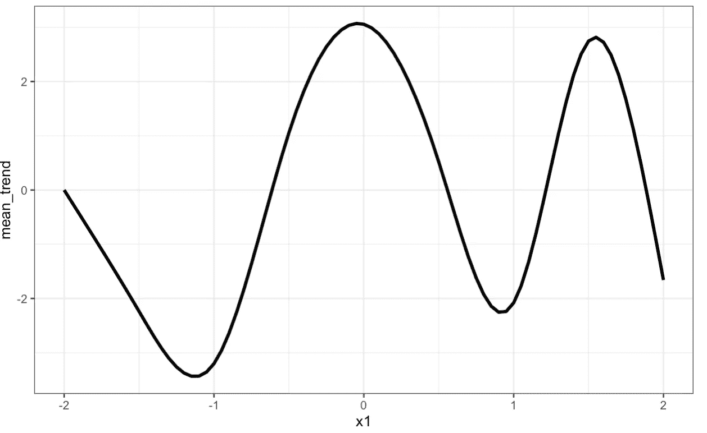

来源—作者提供的图片

上面，我们使用自然样条和随机正态系数创建了一个样本数据趋势。我们可以在上面的图像中看到目标趋势。

现在，让我们向完美的趋势线添加一些随机噪声，因为我们的目标是检查我们的 gam()模型是否能从噪声数据中正确预测趋势。我们将尝试使用粗网格点来训练模型(40 个数据点的一半)，并使用另一半进行预测。

```
### generate the noisy observations
sd_noise_1d <- 0.3 # noiseset.seed(65646)
fine_df_1d <- fine_grid_df %>% 
  mutate(y = rnorm(n = n(), mean = mean_trend, sd = sd_noise_1d))### work with a coarse grid instead of all of the points in the fine grid
num_coarse_int <- 40coarse_grid_list <- list(
  x1 = seq(-2, 2, length.out = num_coarse_int+1)
)
coarse_grid <- coarse_grid_list %>% as.data.frame() %>% tibble::as_tibble()train_df_1d <- fine_df_1d %>% 
  right_join(coarse_grid, by = c("x1"))train_df_1d %>%
  ggplot(mapping = aes(x = x1, y = mean_trend)) +
  geom_line(size = 1.15) +
  geom_point(mapping = aes(y = y), color = "red") +
  theme_bw()
```

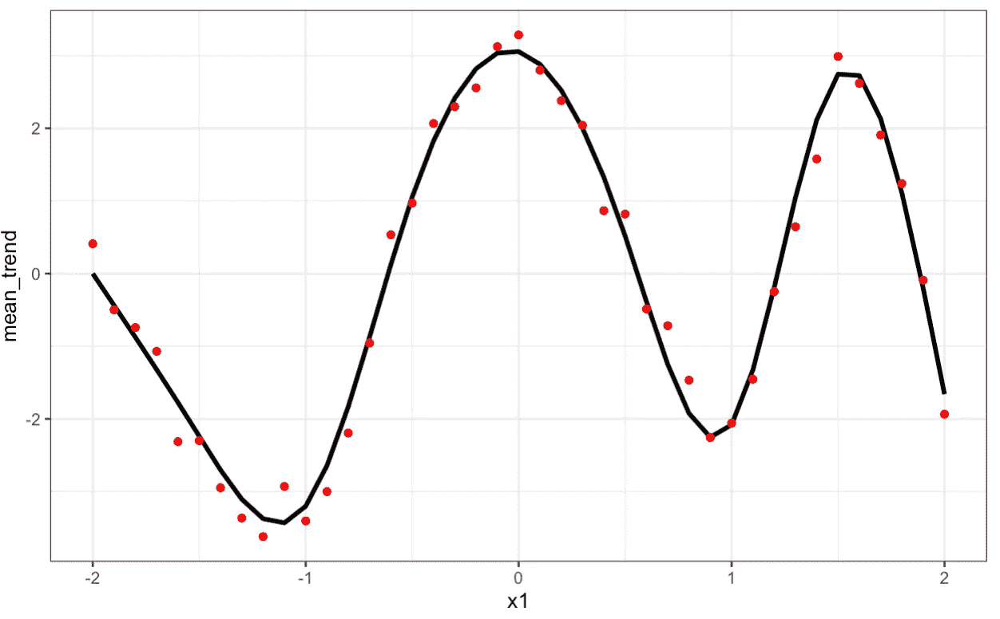

来源—作者提供的图片

相对于原始响应，可以在上图中看到噪声列车观测值。红点是我们的训练数据，粗黑线是我们的实际反应。现在我们已经为玩具问题设置了所有变量，现在让我们尝试使用 gam()拟合来预测上述数据的平均趋势。

现在，对于模型拟合，我将向您展示两种建模方法。第一种是使用‘R’的 mgcv()包中的 gam()函数。第二种方法是首先拟合平滑样条(生成基函数)，然后使用线性模型来拟合这些样条(这是 gam 正在做的事情，至少在本例中是这样)。

来自 mgcv 的 gam():

S() ->暗示平滑样条，bs 参数是你想要使用的样条类型([链接](https://stat.ethz.ch/R-manual/R-devel/library/mgcv/html/smooth.terms.html)获取文档)，你也可以通过参数 k 指定你想要使用的结数。

```
# only training on coarse grid points
model <- gam(y ~ s(x1, bs = 'cs'), data = train_df_1d)
summary(model)
```

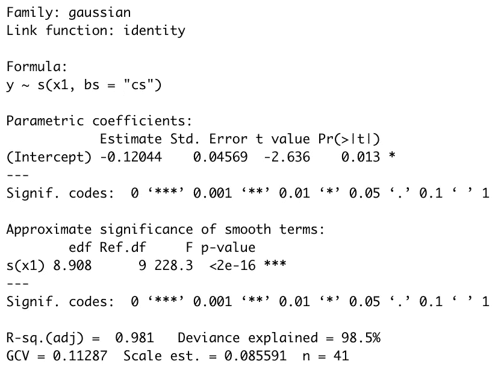

来源—作者提供的图片

可以使用“visreg()”来可视化 gam 模型预测，如下所示

```
library(visreg)
visreg(model, "x1",jitter = TRUE, line=list(col="blue"), fill=list(col="orange"))
```

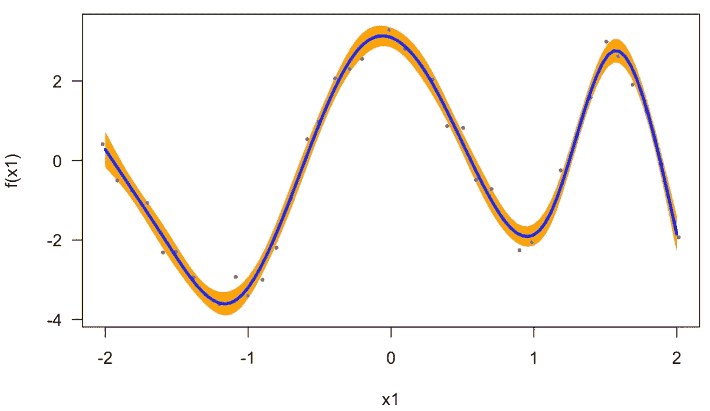

来源—作者提供的图片

我更喜欢用“ggplot()”来可视化事物，因为它提供了很大的灵活性。

```
#Prediction on the entire dataset
prediction <- predict.gam(model, newdata = fine_df_1d)fine_df_1d %>%
  mutate(y_pred = prediction) %>%
  ggplot(mapping = aes(x = x1, y = mean_trend)) +
  geom_line(size = 1.15) +
  geom_line(mapping = aes(y = y_pred), color = 'green', size = 1.5, linetype = 'dashed') +
  geom_point(mapping = aes(y = y), color = "red") +
  theme_bw()
```

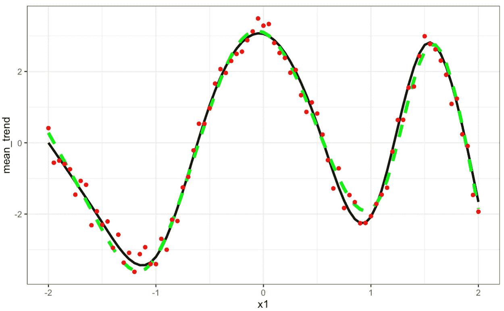

来源—作者提供的图片

在上面的 ggplot 中，红点是目标；黑线表示平均趋势，绿色虚线表示从 gam()模型生成的预测。

上面的方法是通过 gam()直接拟合。现在，让我们打破常规，用一个正常的一步一步的过程来拟合上面的模型(我喜欢这种方法，因为这更容易解释)。

由于游戏使用平滑样条，让我们基于数据构建一个平滑样条。我将使用 mgcv 包中的[smooths con()](https://www.rdocumentation.org/packages/mgcv/versions/1.8-33/topics/smoothCon)——它以给定输入的基矩阵的形式生成函数 smooth。

```
# This creates the basis functions
CubicSplines_smooth = smoothCon(s(x1, bs = 'cs'), data = train_df_1d)[[1]]#CubicSplines_smooth$S -> this is the penalty matrix integral part
# but not using here.# Lets visualize all the basis functions
CubicSplines_smooth$X %>% as.data.frame() %>% tibble::as_tibble() %>%
  mutate(x1 = train_df_1d$x1) %>% 
  tibble::rowid_to_column() %>% 
  tidyr::gather(key = "key", value = "value", -rowid, -x1) %>%
  ggplot(mapping = aes(x = x1, y = value)) +
  geom_line(mapping = aes(color = key),
            size = 1.15) +
  theme_bw() +
  theme(legend.position = "top")
```


来源—作者提供的图片

如果你观察上面的图，它表示每个基函数的趋势，现在再看看下面的样条函数方程。


每个 b(x)代表一个基函数，所有单个基函数都可以在上图中观察到。对此我遇到的另一种解释是，它就像一个单一的手动层神经网络，但神经元是静态的。每个基函数代表一个神经元和要学习的系数β，最后，所有神经元加在一起(如果你喜欢就用这个解释，如果你认为这不符合你的观点就不用)。

现在我们有了基本的功能。我们需要做的就是学习贝塔系数。如果你正确地看上面的等式，你会得到这样的想法，问题基本上简化为一个光滑样条基础上的线性模型。所以，你甚至可以用 lm()模型来拟合这个，这样会给你等价的结果(你也可以不使用 s()而直接使用变量本身来使用同一个 gam()，但是我想用 lm()模型来展示这一点)。

在下面，正则化部分不包括在内，但如果你想知道如何做到这一点，SmoothCon 函数会给你一个惩罚矩阵(在这种情况下是 CubicSplines_smooth$S)。所以，你可以用‘广义交叉验证’来调优‘lambda’，结果等同于 gam。但是在下面，我不包括正则化部分(请查看我的 git hub [repo](https://github.com/saipradeep-peri/GAMs_Tensor_Products_fits) 来寻找这方面的一些实验)。

```
# Linear regression model on top of Smoothing splines basis.
CubicSplines_smooth_df <- CubicSplines_smooth$X %>% as.data.frame() %>% tbl_df() %>% mutate(y = train_df_1d$y)
CubicSplines_smooth_fit <- lm(y ~ . - 1, data = CubicSplines_smooth_df)
CubicSplines_smooth_fit %>% summary()
```

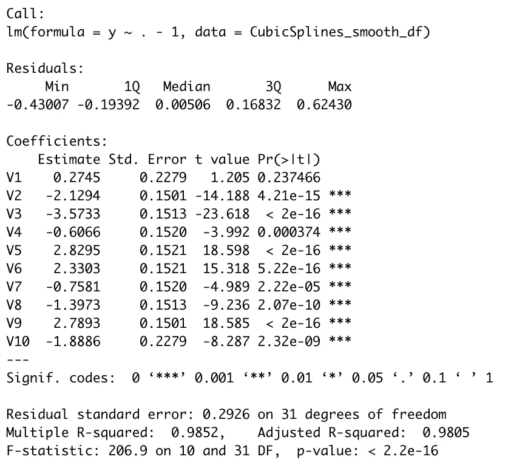

来源—作者提供的图片

现在，这种方法的预测有点不同，因为您需要构建一个测试基础矩阵，然后使用训练好的线性模型进行预测。

```
# Building the test basis matrix using train smoothCon variable.
CubicSplines_smooth_test_basis_df <- PredictMat(CubicSplines_smooth, fine_df_1d) %>% as.data.frame() %>% tbl_df()# Prediction on test basis matrix
CubicSplines_overfit_test_pred <- predict(CubicSplines_smooth_fit, newdata = CubicSplines_smooth_test_basis_df)fine_df_1d %>%
  mutate(y_pred = CubicSplines_overfit_test_pred) %>%
  ggplot(mapping = aes(x = x1, y = mean_trend)) +
  geom_line(size = 1.15) +
  geom_line(mapping = aes(y = y_pred), color = 'green', size = 1.5, linetype = 'dashed') +
  geom_point(mapping = aes(y = y), color = "red") +
  theme_bw()
```

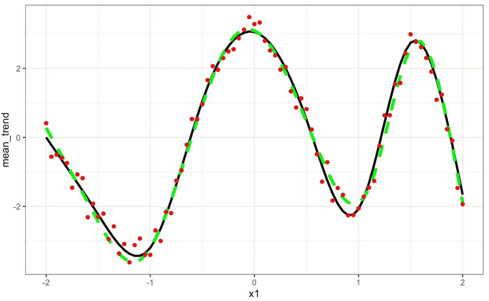

来源—作者提供的图片

## 结论:

在这篇第 1 部分的文章中，我解释了广义可加模型的一般概念，平滑样条，以及如何使用人工数据在 R 中使用和解释它们。在第 2 部分的文章中，我将尝试使用张量样条来解释二维交互样条，并在 gam 中使用它们。

查看我的 [Github](https://github.com/saipradeep-peri/GAMs_Tensor_Products_fits) repo，获得更多关于 1D 平滑的示例实验代码，使用不同的样条类型和使用 optim()函数的手动正则化部分。

参考资料:

1.  统计学习的要素——数据挖掘、推理和预测。
2.  广义加性模型导论。
3.  [https://m-clark.github.io/generalized-additive-models](https://m-clark.github.io/generalized-additive-models/)