# GAMs 和光滑样条(第二部分)——张量积样条

> 原文：<https://pub.towardsai.net/gams-and-smoothing-splines-part-2-tensor-product-splines-97928f226a2c?source=collection_archive---------1----------------------->

## [统计数据](https://towardsai.net/p/category/statistics)

在本文中，我将把 1D 样条平滑的概念扩展到称为张量积平滑的高阶维函数逼近。如果你没有读过[第一部，](/gams-and-smoothing-splines-part-1-simplified-8c5e2c10dbaa)请读一读。

这篇文章主要分为两部分:

1.  张量积样条
2.  在人工数据集上使用 GAMs 的 2D 张量插值

# 张量积样条；

**张量:**

张量是 1D 阵列向更高维度的推广，这就是为什么它们被称为多维阵列。

**张量积:**

假设我们有 V，一个 n 维向量，W，一个 m 维向量。在那种情况下，张量积 V⊗W 定义了 m*n 维的向量空间，其基跨越 V_basis 和 W_basis 的积(相当于外积，kronecker 积)。

张量积在不同领域有许多应用，从量子物理到深度学习中的张量乘法，并有不同的解释方式。

但是在这篇文章中，我想提出曲线间张量积的观点，以及产生超曲面的张量积。

如果我们考虑绘制如下的两条函数曲线 x1 和 x2(例如高斯曲线):

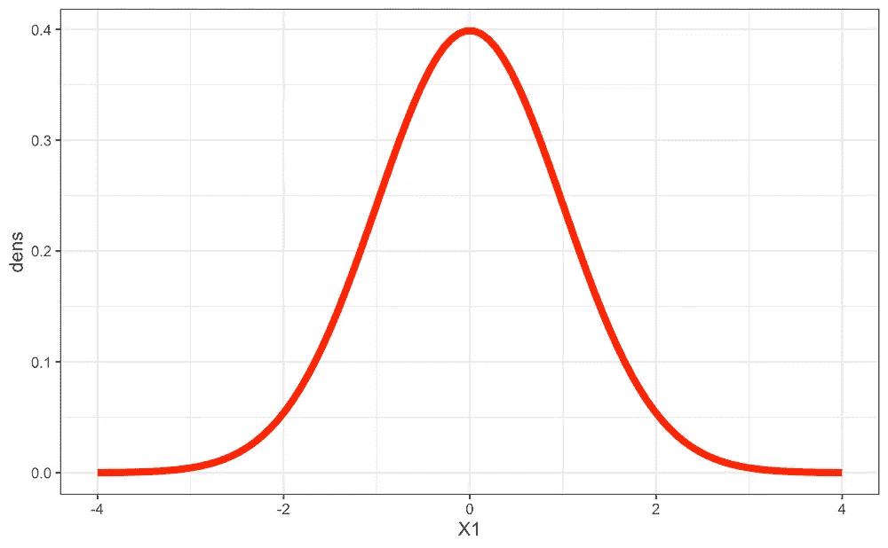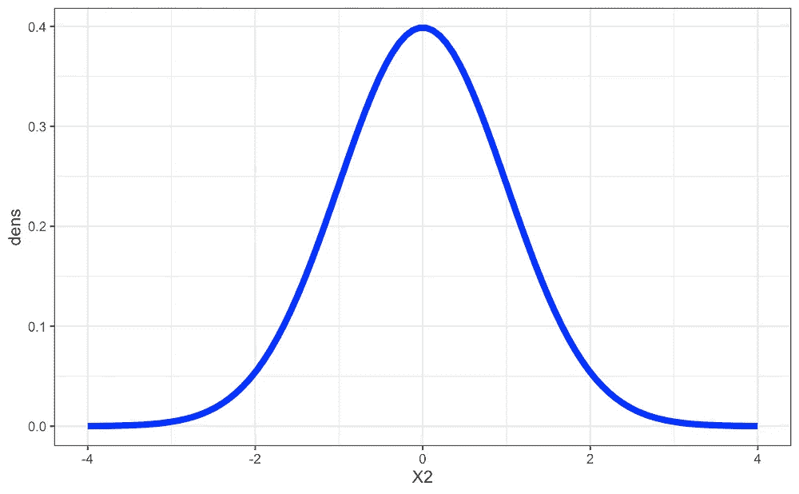

来源—作者提供的图片

得到的张量积-> x1⊗ x2(对于 2D 情况，这等同于外积)将是跨越 x1 和 x2 的基的多元函数。下图可视化

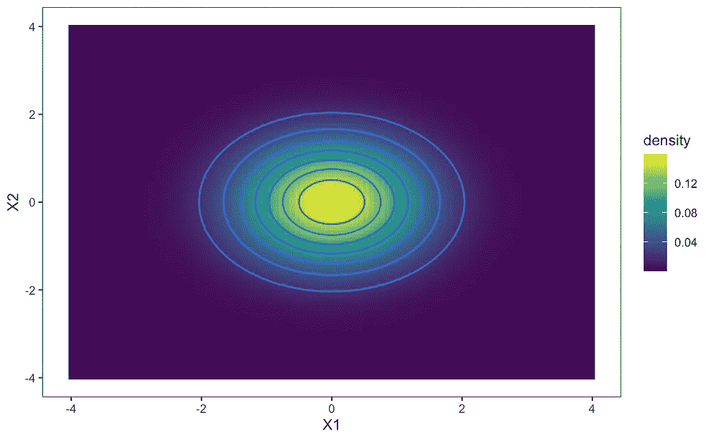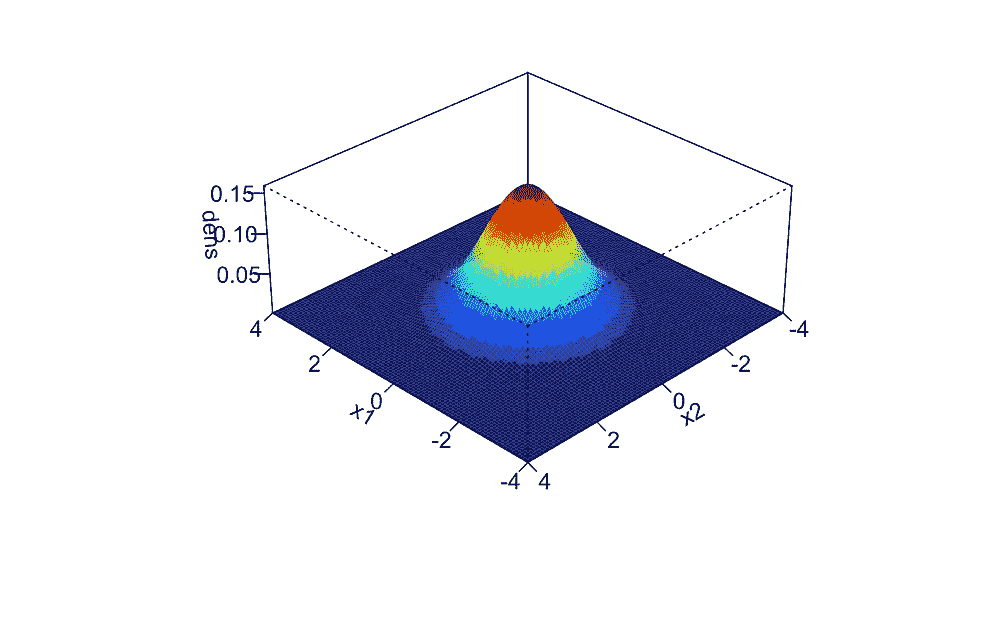

来源—作者提供的图片。第一个是 2D 等高线图，第二个是相同的三维可视化。

我想在这里接受的主要思想是两条一维曲线的张量积代表一个二维的超空间。

## 张量积样条简介；

在[第 1 部分中，](/gams-and-smoothing-splines-part-1-simplified-8c5e2c10dbaa)你对样条是什么以及它们如何工作有了大致的了解。在 1D 维度的情况下，我们关心的是将曲线拟合到一些数据点，但是如果响应是超平面表面呢？

张量积样条是基于样条基曲面的张量积概念形成的。让我们看看同样的数学表示(如果你想了解样条基和函数形式，请看看 [part-1](/gams-and-smoothing-splines-part-1-simplified-8c5e2c10dbaa) 文章)。

**张量积基础:**

样条为什么要用张量基:我们可以在一元变量 x 上，在[x(i)，x(i+1)]的区间上构造一个光滑函数。但是如何定义一个光滑函数来表示相互作用协变量的基。张量积旨在构建一个基础，该基础对于任何或所有协变量的重新标度都是不变的。

让我们考虑关于 x、z、v 变量的如下 3 个平滑函数(这些是在 [*第一部分*](/gams-and-smoothing-splines-part-1-simplified-8c5e2c10dbaa) 中介绍的类似的单变量平滑)


αi，δl，βk 是系数，ai(x)，dl(z)，fv(v)是基函数。

如果我们要求 f_x 随 z 平滑变化，可以通过允许 f_x 的参数随 z 平滑变化来实现。

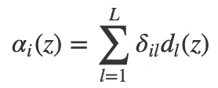

现在我们可以在 x，z 上定义一个光滑函数(这将是一个加性模型中的相互作用项)。

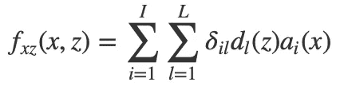

上述术语可以重新格式化为

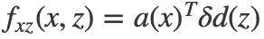

也就是 fx 和 fz 两个空间的张量积。两条一维线的张量积给你一个二维子空间。

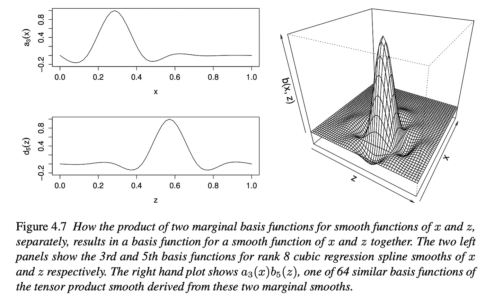

来源——广义可加模型——西蒙·伍德《R 导论》第 4 章。

张量积是表示两个样条曲面之间的联合交互的自然数学方式。

# 使用 GAMs 的 2D 张量插值；

类似于[第一部分](/gams-and-smoothing-splines-part-1-simplified-8c5e2c10dbaa)，我将创建一个人工回归问题，并使用张量积样条来解决它。我会尽力解释我所关注的重要部分。这里我们的目标是一个 2D 曲面，而不是一条曲线，因为我们正在处理高维空间中的样条插值。

好了，现在让我们定义问题并创建我们的目标数据。为了便于视觉理解，让我们用正弦曲线和它们的张量积来制作我们的目标曲面。

```
## This block is related to creating a target surface and involves ## a bit of data pre-processing.library(dplyr)
library(ggplot2)
library(mgcv)
library(purrr)#define the fine spatial grids for each GP, the spatial resolution
#will be between -2 and 2 for all dimensions for simplicitynum_fine_int <- 40fine_grid_list <- list(
  x1 = seq(-2, 2, length.out = num_fine_int+1),
  x2 = seq(-2, 2, length.out = num_fine_int+1)
)### set the true relationships per factor### set the functional expressionstrue_functions <- list(
  g1 = function(x, av){av$a0 + av$a1 * cos(av$a2 * pi * x)},
  g2 = function(x, av){av$a0 + av$a1 * cos(av$a2 * pi * x)}
)### set the parameters of the functions
true_hypers <- list(
  g1 = list(a0 = 0, a1 = 1, a2 = 1),
  g2 = list(a0 = 0, a1 = 1, a2 = 1)
)### define a wrapper function for executing the functions
run_factors <- function(myfunc, myx, myparams)
{
  myfunc(myx, myparams)
} ### calculate each of the factors over the fine grid
fine_true_factors <-pmap(list(true_functions,
                              fine_grid_list,
                              true_hypers),
                         run_factors) pmap_dfr(list(fine_grid_list,
              fine_true_factors,
              1:2),
         function(x, g, glabel){tibble::tibble(x = x, g = g) %>% 
             mutate(factor_name = glabel)}) %>% 
  ggplot(mapping = aes(x = x, y = g)) +
  geom_line(mapping = aes(group = factor_name), size = 1.15) +
  facet_wrap(~factor_name) +
  theme_bw()
```

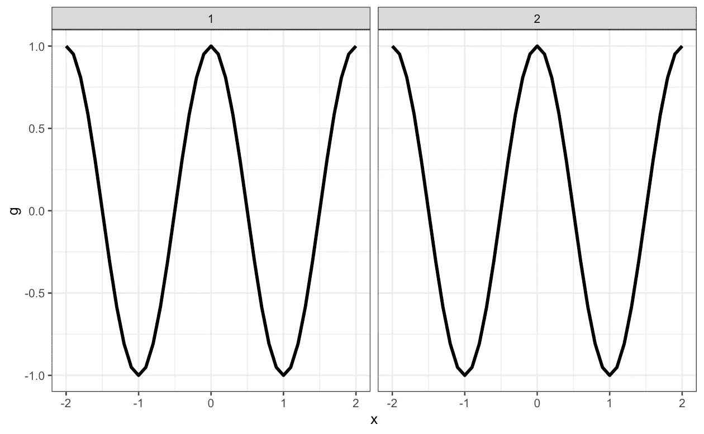

来源—作者提供的图片。以上是 2 条单变量平滑曲线(正弦曲线),我们将用它们来创建一个张量积曲面

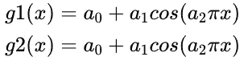

上述单变量曲线的函数形式

让我们把两个正弦函数相乘，使它成为一个有点复杂的目标

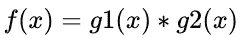

这是我们将要建模的函数

```
fine_true_latent_dfs <- 
  pmap(list(fine_grid_list,
            fine_true_factors,
            1:2),
       function(x, g, glabel){tibble::tibble(x = x, g = g) %>% 
           set_names(c(sprintf("x%d", glabel),
                       sprintf("g%d", glabel))) %>% 
           tibble::rowid_to_column(sprintf("x%d_id", glabel))}) ### create the tensor product of the two factors
fine_latent_tensor <- expand.grid(fine_grid_list,
            KEEP.OUT.ATTRS = FALSE,
            stringsAsFactors = FALSE) %>% 
  as.data.frame() %>% tbl_df() %>% 
  left_join(fine_true_latent_dfs[[1]], by = "x1") %>% 
  left_join(fine_true_latent_dfs[[2]], by = "x2") %>% 
  select(ends_with("_id"), x1:x2, g1, g2) %>% 
  tibble::rowid_to_column("fine_id") ### visualize the sum of the first two factors
fine_latent_tensor %>% 
  ggplot(mapping = aes(x = x1, y = x2)) +
  geom_raster(mapping = aes(fill = g1 * g2)) +
  coord_equal() +
  scale_fill_viridis_c() +
  theme_bw()
```

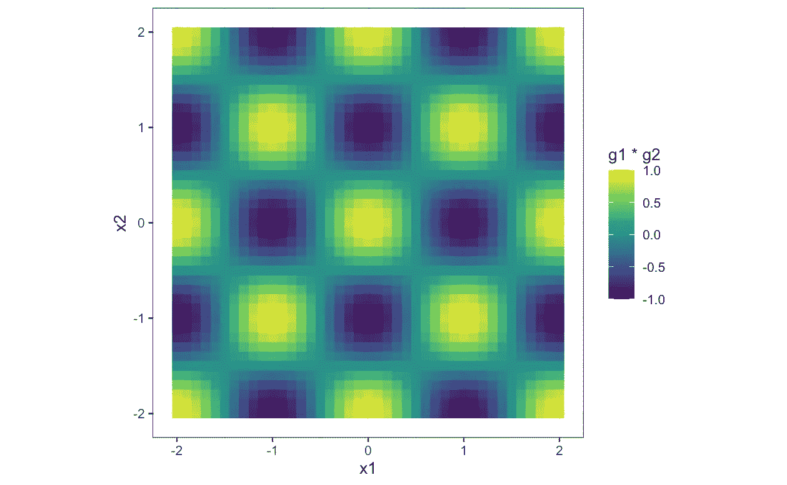

来源—作者提供的图片。目标函数表面热图。

如果我们看上面的视觉，它似乎是复杂的表面(你可以把这想象成图像)。因此，让我们简化一下，看看 x1 相对于 x2 是如何变化的(如下)

```
### visualize the sum of the all 2 factors with marginal behavior
fine_latent_tensor %>% 
  mutate(go = g1 * g2) %>% 
  ggplot(mapping = aes(x = x1, y = go)) +
  geom_line() +
  facet_wrap(~x2, labeller = "label_both") +
  theme_bw() +
  theme(axis.text = element_blank())
```

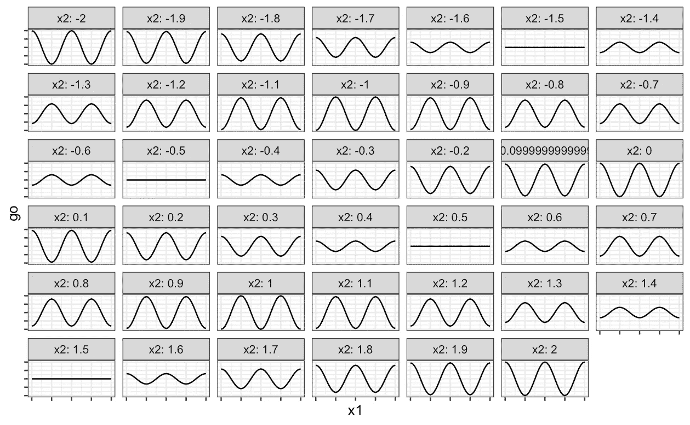

来源—作者提供的图片。X1 与 X2 网格图

现在，让我们给目标添加一些噪声(因为我们想检查模型是否能在噪声中找出潜在的平滑表面。)

```
### generate the noisy observations
sd_noise <- 0.2 # noiseset.seed(813123)
fine_df <- fine_latent_tensor %>% 
  mutate(go = g1 * g2,
         y = rnorm(n = n(), mean = go, sd = sd_noise))# Noisy target surface
fine_df %>% 
  ggplot(mapping = aes(x = x1, y = x2)) +
  geom_raster(mapping = aes(fill = y)) +
  scale_fill_viridis_c() +
  coord_equal() +
  theme_bw()
```

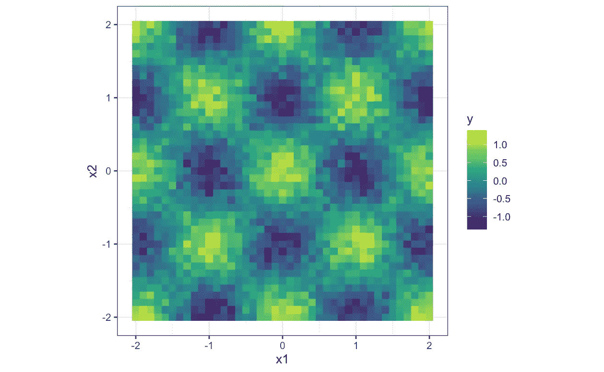

来源—作者提供的图片。噪声目标表面

```
### work with a coarse grid instead of all of the points in the fine grid
num_coarse_int <- 20coarse_grid_list <- list(
  x1 = seq(-2, 2, length.out = num_coarse_int+1),
  x2 = seq(-2, 2, length.out = num_coarse_int+1)
)coarse_grid <- expand.grid(coarse_grid_list,
                           KEEP.OUT.ATTRS = FALSE,
                           stringsAsFactors = FALSE) %>% 
  as.data.frame() %>% tbl_df()train_df <- fine_df %>% 
  right_join(coarse_grid, by = c("x1", "x2"))### look at the true latent function in the space with respect # to x2
train_df %>% 
  ggplot(mapping = aes(x = x1, y = go)) +
  geom_line() +
  geom_point(mapping = aes(y = y), color = "red") +
  facet_wrap(~ x2, labeller = "label_both") +
  theme_bw() +
  theme(axis.text = element_blank())
```

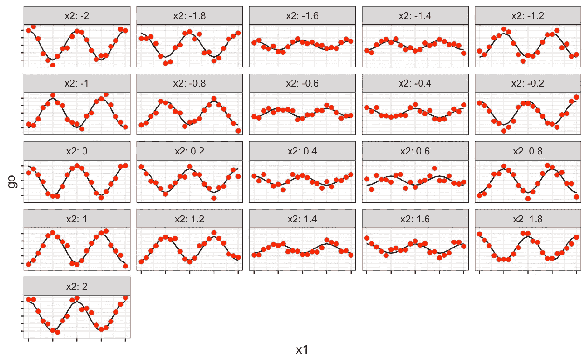

来源—作者提供的图片。嘈杂的目标边缘行为。

我们通过添加噪声复杂性和仅使用原始数据的一半进行训练，使目标尽可能难以建模。

(上面的代码我已经做的有点复杂了，但是我想展示 target 的创建，你不需要理解代码；试着去诠释你想要的情节。这里的代码只基于 gam()模型函数，会更简单。)

**张量积样条拟合:**现在，mgcv gam()函数直接提供了使用函数 ti()和 te()直接创建张量平滑样条的手段。

ti()-->这仅考虑通过 ANOVA 分解支持的没有边际效应的纯交互作用。因此，在假设它们将被单独包括的情况下，主要影响已经被消除。这有助于理解边际效应和交互作用(通过约束会有一些损失)。通常的公式是~ ti(x) + ti(z) + ti(x，z)

te() —这是考虑了余量和相互作用的全张量积，但不能单独研究影响

我知道从上面看不清楚 ti()和 te()平滑到底是什么，什么时候用哪个。让我们通过安装它们来讨论。

首先，我将拟合 ti()模型。

```
# ti() model is usually fitted based on below formulation.# I am giving max number of knots below because gam use #regularization so we don't to worry about overfitting here.
ti_model_marginal_interaction <- gam(y ~ ti(x1) + ti(x2) + ti(x1, x2, k = c(20,20)), data = train_df, method = 'ML')ti_model_marginal_interaction %>% summary()
```


来源—作者提供的图片。ti()模型摘要

现在我想在这里集中讨论两件事。

1.  我首先拟合了“ti()”模型，因为通常在真实世界的数据中，我们不确定是否只有交互作用效应或交互作用增加了边际效应。因此，“ti()”模型有助于分解它们，并分别查看它们的影响，基于此，我们可以决定是要转向“te()”全张量积，还是坚持使用“ti()”
2.  如果我们查看显示特性重要性部分的模型摘要，我们可以看到边际的重要性较低(我们对 x1 的边际项具有重要性，但为了探究 te()，我认为它的重要性不高，但如果您面对这些类型的结果，您应该坚持 ti()，因为它比 te()更稳定)。基于此，我们可以看到贡献主要是由于相互作用项。因此，在这种情况下，“te()”提供了更好的结果(并不总是取决于数据)，因为在“te()”中，“自由度”比“ti()”大(ti 由于边缘项约束而失去了一些自由度)。

现在让我们看看“te()”模型的结果。

```
te_model_interaction <- gam(y ~ te(x1, x2, k = c(20,20)), data = train_df, method = 'ML')te_model_interaction %>% summary()
```

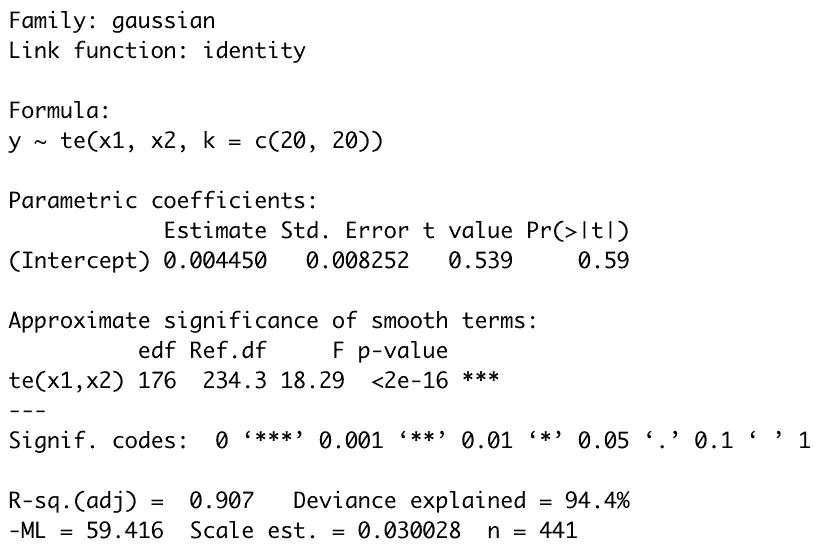

来源—作者提供的图片。te()模型摘要

好吧，这个模型只是在性能上有一点点改进(但即使比 ti()给定的相同节数要好)。在上面的总结中，如果你看一下 edf(估计自由度)，这些对于“te()”比“ti()”更大，这给予“te()”甚至模拟复杂决策表面的优势(正如我上面提到的，ti()在处理边缘约束时损失了一些自由度)。

只是为了澄清一些疑问，te()和 ti()是在建模同一个东西。在 te()中我们不能清楚地看到边际效应-> ti()是通过 ANOVA 分解作为近似值引入到 te()中，以分离所有效应并提供稳定的公式。

```
# A good library for visualizing the gam() model trends
library(mgcViz)# coverting gam object to a getViz object for plotting gam terms
te_model_interaction <- getViz(te_model_interaction)#plot method from mgcViz object helps in plotting 2D
plot(sm(te_model_interaction, 1)) + l_fitRaster() + l_fitContour()
```

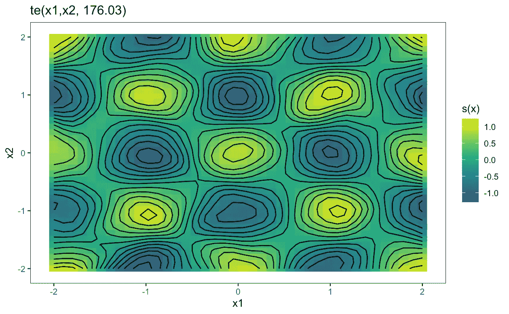

来源—作者提供的图片。gam()模型以趋势为目标。

哇哦。！！我们已经拟合了一个 2D 超曲面，并且我们可以将这个概念类似地扩展到 n 维。

结尾…

(开玩笑)！！！

在结束之前，我还想给你看一样东西。

你不觉得模型拟合太简单了吗？这是因为 mgcv()包是一个很好的包装器函数，就像今天的大多数数据科学从业者一样，我们忘记了看一下幕后发生了什么。让我们不要让它那样。所以，我想向你们展示最后一件事——te()究竟是如何通过视觉来构建的。

我想让你们再看看下面的等式


d(z)和 a(x)是曲线 x 和 z 的基函数，张量积样条是基于 x 和 z 的基的张量积形成的。

因此张量样条的基础也是高阶维数(我们有 1D 插值情况的 1D 曲线[第一部分](/gams-and-smoothing-splines-part-1-simplified-8c5e2c10dbaa)试着以类似的方式思考；这是 2D 表面的 2D 插值的情况)。

现在让我们看看我们上面拟合的张量样条的基础。

```
#predict.gam using type = 'lpmatrix' gives the basis matrix and if #this is removed and given 'newdata' argument it gives prediction #on new data#te basis matrix 
te_basis_matrix <- predict.gam(te_model_interaction, type = "lpmatrix")#Visualizing te() basis matrix (only top 40 basis out o 400)
te_basis_matrix %>% as.data.frame() %>% tbl_df() %>%
  select(-'(Intercept)') %>%
  tibble::rowid_to_column() %>%
  left_join(coarse_grid %>% tibble::rowid_to_column(), by = 'rowid') %>%
  tidyr::gather(key = "key", value = "value", -rowid, -x1, -x2) %>%
  tidyr::separate(key, 
                  c("te_word", "te_id"),
                  sep = '\\.',
                  fill = "right",
                  remove = FALSE) %>%
  filter(te_id %in% seq(1, 40, by = 2)) %>%
  ggplot(mapping = aes(x = x1, y = x2)) +
  geom_raster(aes(fill = value)) +
  facet_wrap(~ te_id, labeller = "label_both") +
  scale_fill_viridis_b() +
  theme_bw()
```

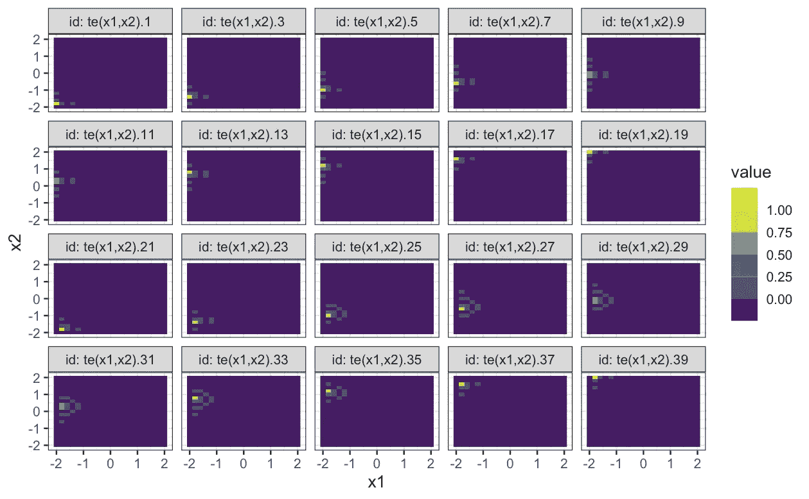

来源—作者提供的图片。Te()基础可视化。

在上面，我们可以看到由 te()样条创建的基础曲面。由于我们使用 400 个自由度，每个基础都是高度局部化的(从单个像素级别来看)。

在[第一部分](/gams-and-smoothing-splines-part-1-simplified-8c5e2c10dbaa)中，我已经向你展示了你可以使用 smoothCon()来创建平滑样条，并使用线性模型来拟合结果基。这里我不会向您展示完整方法，但是让我们使用 smoothCon()来看看低自由度的基础。

```
#te() spline smooth creation using smoothCon
SmoothCon_te_basis = smoothCon(te(x1, x2, k=c(4,4)), data = train_df)[[1]]#visualizing the tensor product basis.
SmoothCon_te_basis$X %>% as.data.frame() %>% tbl_df() %>% 
  tibble::rowid_to_column() %>% 
  left_join(coarse_grid %>% tibble::rowid_to_column(),
            by = "rowid") %>%
  tidyr::gather(key = "key", value = "value", -rowid, -x1, -x2) %>%
  mutate(id = factor(key, levels = as.vector(unique(key)))) %>%
  ggplot(mapping = aes(x = x1, y = x2)) +
  geom_raster(mapping = aes(fill = value)) +
  facet_wrap(~ id, labeller = "label_both") +
  scale_fill_viridis_b() +
  theme_bw()
```

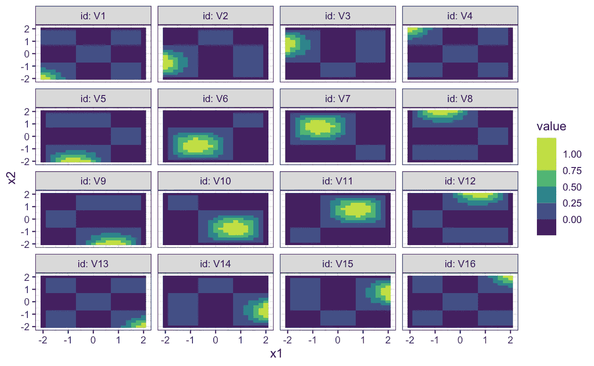

上图看起来更有解释性。现在，当看到上图时，你会想到什么->在图像维度上移动的内核激活。我把它们看做在维度间移动的图像激活过滤器。你可以认为它们类似于一层 CNN 过滤器，但是过滤器设置为静态的(不要把它们直译为静态 CNN 过滤器。只是为了解释他们在某种程度上，我比较他们与 CNN 过滤器)。

好了，现在我真的要结束了。如果你想检查预测部分，我已经在下面链接的 github 中添加了代码。

# 结论:

总之，我已经向您展示了张量积样条函数，以及如何使用 mgcv gams 函数拟合它们，并解释了其基本原理。

你一定在很多地方听说过这一点，我在这里也指出了这一点->张量积是在加法模型中表示平滑相互作用的自然数学方法。

我想分享的另一个想法是在示例数据中；我们能够仅使用 20*20 的缩减尺寸来适合尺寸为 40*40 的图像。因此，这种方法也可以用作降维技术，并在某种意义上优于 PCA(只能产生离散值),因为这种方法为您提供了数据的功能等价物。所以，你甚至可以生成新的数据(高分辨率)。

检查我的 [Github](https://github.com/saipradeep-peri/GAMs_Tensor_Products_fits) 上面的代码，其中添加了关于预测的代码和一些与张量积样条相关的更多实验。

参考资料:

1.  广义加性模型导论。
2.  [https://stat . ethz . ch/R-manual/R-devel/library/mgcv/html/smooth . terms . html](https://stat.ethz.ch/R-manual/R-devel/library/mgcv/html/smooth.terms.html)