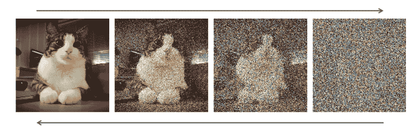
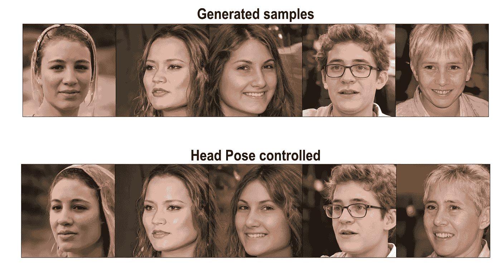
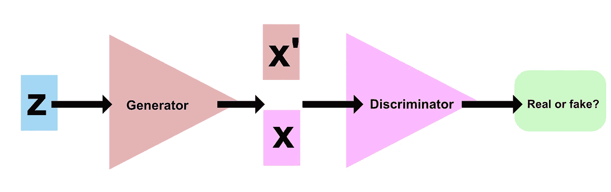
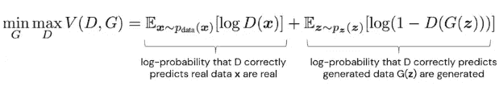
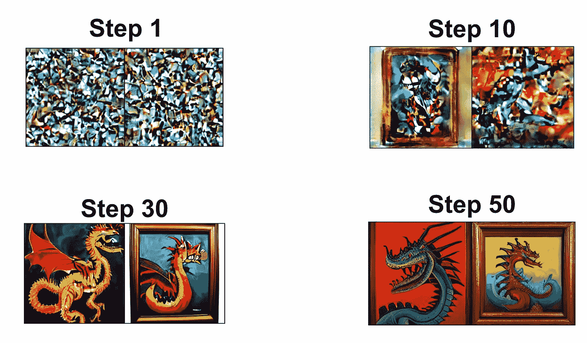
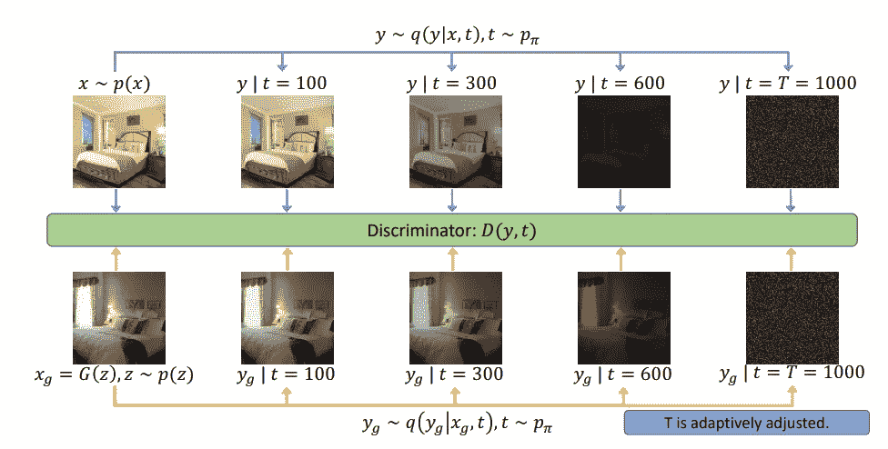

# 甘:扩散就够了吗？

> 原文：<https://pub.towardsai.net/gan-is-diffusion-all-you-need-5ef127fa4ca?source=collection_archive---------1----------------------->

猫图片上一个扩散过程的图解(改编自**【4】**)。

八年前，出现了一种最有前途的生成建模方法:生成对抗网络(GAN)**【1】**。从那以后，在工艺和所获得的结果方面取得了相当大的进展。这些模型从生成模糊的人脸到具有不同约束的高清现实图片。

从模型生成的样本( [amazon-research/gan-control:这个包提供了“gan-control:显式可控 gan”的 pythorch 实现，ICCV 2021。(github.com)](https://github.com/amazon-research/gan-control))**【2】**

如果这些改进令人印象深刻，这种模型仍然没有准备好广泛的公共利用。事实上，要使这些模型成功，它们应该满足*生成学习三难困境***【4】***:*

*   它们需要快速生成高质量的采样，例如 GAN 应用于图像合成。
*   他们需要良好的模式覆盖和样本多样性，因为这可以减少此类模式的负面社会影响。
*   例如，对于实时图像编辑或实时合成的应用，他们需要快速且廉价的采样。

我将首先概述 GAN 由什么组成，以及这些模型的优点和不便之处。在第二部分，我将解释深度生成模型的一个新趋势:扩散模型。最后，我将重点介绍最近的研究成果，这些成果提出了一种混合 GAN 与扩散模型的新方法。

# 什么是甘？

GAN 的目标是从特定的数据集中生成新的看不见的数据。它通过尝试从样本中学习真实的、未知的底层数据分布的模型来做到这一点。换句话说，这些网络是试图学习特定统计分布的隐式模型**【6】**。

甘的创新之处在于他们学习实现这一目标的方式。事实上，他们通过双人游戏学习隐式模型来生成数据。其结构如下:

*   **学习区分真实数据和生成数据的鉴别器**
*   **一个学习生成数据的生成器**骗过了鉴别器。

带有向鉴频器提供输入的发生器的 GAN 原理图。

换句话说，生成器必须设计一个高分辨率的图像，以便能够欺骗鉴别器，因为鉴别器就像一个教师网络。与 autoencoder 模型的一个很大的区别是，这些生成器没有使用任何分布作为输出来训练。

模型的损失函数可以分解为两项:

*   量化鉴别器是否正确预测真实数据是真实的部分
*   生成正确预测生成数据的部分

然后在最佳可能的鉴别器上最小化该损失函数:

因此，生成模型可以被视为距离最小化模型，并且如果鉴别器是最优的，则可以被视为真实分布和生成分布之间的散度最小化。在实践中，可以使用多种差异，并对 GANs 进行不同的培训。

然而，虽然 GANs 的损失函数可以容易地控制，但是很难跟随学习动态，因为它包括发生器和鉴别器之间的权衡。此外，没有保证学习的一致性。因此，训练 GAN 模型具有挑战性，因为经常会遇到诸如消失梯度和模式崩溃(当生成的样本中没有多样性时)之类的问题。

# 扩散模型

扩散模型的设计目标是解决 GANs 训练收敛的问题。这些模型背后的思想是，扩散过程等同于由于噪声的逐渐介入(在扩散过程的每个时间步添加高斯噪声)而导致的信息损失。

这种模型的目标是了解噪声对样本中可用信息的影响，或者换句话说，扩散过程在多大程度上减少了可用信息。如果一个模型可以学习这一点，那么它应该能够逆转发生的信息丢失，并检索原始样本。去噪扩散模型正是这样做的。它由两步过程组成:正向和反向扩散过程。在正向扩散过程中，连续引入高斯噪声(即扩散过程)，直到数据都是噪声**【7】**。反向扩散过程然后训练神经网络来学习条件分布概率以反转噪声。

具有正向和反向扩散过程的扩散模型示意图

这些类型的网络已经成功地解决了生成过程，如下图所示(模型来自**【3】**):

使用来自[CompVis/潜在扩散:使用潜在扩散模型的高分辨率图像合成(github.com)](https://github.com/CompVis/latent-diffusion)的扩散模型，通过提示“画布上的龙”生成样本

然而，为了产生样本，反向扩散链必须经过许多次。这在计算上非常昂贵，使得这些模型生成样本的效率很低。尽管它们能够生成高质量的真实图像，但它们在现实世界中的应用却受到了限制。

# 扩散氮化镓

已经提出了各种方法来降低基于扩散的模型的生成成本。减少这种成本的最直观的方法之一是减少扩散模型**【4】**的逆过程的去噪步骤的数量。生成扩散模型通常假设去噪分布可以由高斯分布来建模。问题是这种假设仅适用于小的去噪步骤，这导致生成过程中大量的去噪步骤，因此不实用。

最近的方法以如下方式结合了深度生成模型(GAN)和扩散模型。它不是在过程结束时最小化真实数据和扩散数据之间的差异，而是在几个时间步长 **t** 内最小化扩散真实数据分布和扩散生成器分布之间的差异。换句话说，在训练过程中，通过先通过正向扩散链，然后通过鉴别器(下图)反向传播梯度来更新生成器。此外，Diffusion-GAN 注入了基于扩散的高斯混合分布**【5】**，而不是注入一个简单的实例噪声来破坏发送到鉴频器的数据，从而允许去噪过程一次近似几个步骤。这种特定的训练过程导致了这样一个事实，即生成器只需一步就可以将噪声映射到生成的样本，这意味着扩散 GAN 生成样本的速度几乎与经典 GAN 一样快。使用去噪扩散 GAN 从噪声中生成样本。

扩散 GAN 工艺示意图(图片来自**【5】**)

该技术允许 GAN“通过将降噪分布随时间表示为多峰分布来学习加速的反向降噪过程”**【8】**。为了适应加速生成过程，通过将该过程分解成几个条件去噪步骤，鉴别器不太可能过度拟合，因为扩散过程将平滑数据分布。这种类型的模型表现出更好的训练稳定性以及采样多样性。这种扩散模型的变体在快速深度生成学习方面似乎非常有前途，并且不仅可以在图片和视频处理中找到实际用途，还可以在诸如药物发现的另一个领域中找到实际用途。

# 参考

[1]古德费勒，伊恩，等。“生成性对抗性网络。”*神经信息处理系统进展* 27 (2014)。

[2] Shoshan，Alon 等，“Gan 控制:显式可控 Gan”IEEE/CVF 国际计算机视觉会议论文集*。2021.*

[3] Rombach，Robin 等，“用潜在扩散模型合成高分辨率图像”IEEE/CVF 计算机视觉和模式识别会议文集。2022.

[4]肖、智胜、卡斯滕·克瑞斯和阿拉什·瓦赫达特。"用去噪扩散甘斯解决生成学习的三难问题." *arXiv 预印本 arXiv:2112.07804* (2021)。

[5]王，振东，等.“扩散——甘:用扩散训练甘” *arXiv 预印本 arXiv:2206.02262* (2022)。

[6]深度思维 x UCL |深度学习讲座| 9/12 |生成式对抗网络[https://youtu.be/wFsI2WqUfdA](https://youtu.be/wFsI2WqUfdA)

[7] [扩散模型制作简单。了解去噪基础知识… |作者 J. Rafid Siddiqui 博士| 2022 年 5 月|迈向数据科学](https://towardsdatascience.com/diffusion-models-made-easy-8414298ce4da)

[8] [改进扩散模型作为 GANs 的替代方案，第 2 部分| NVIDIA 技术博客](https://developer.nvidia.com/blog/improving-diffusion-models-as-an-alternative-to-gans-part-2/)