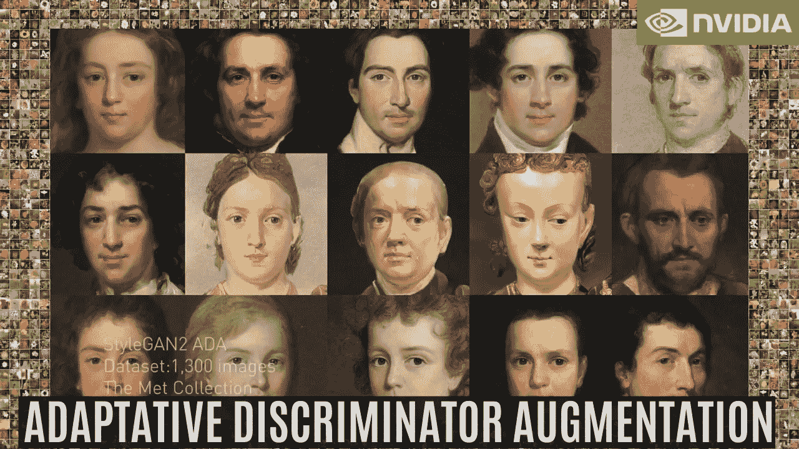
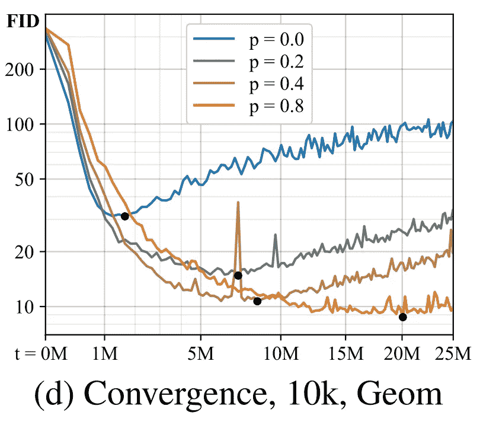
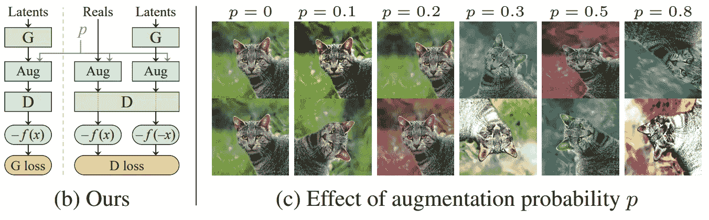
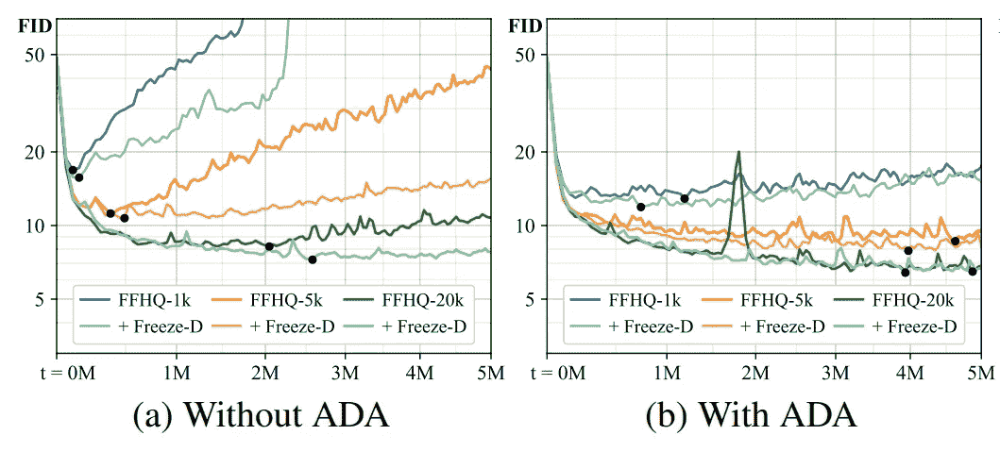
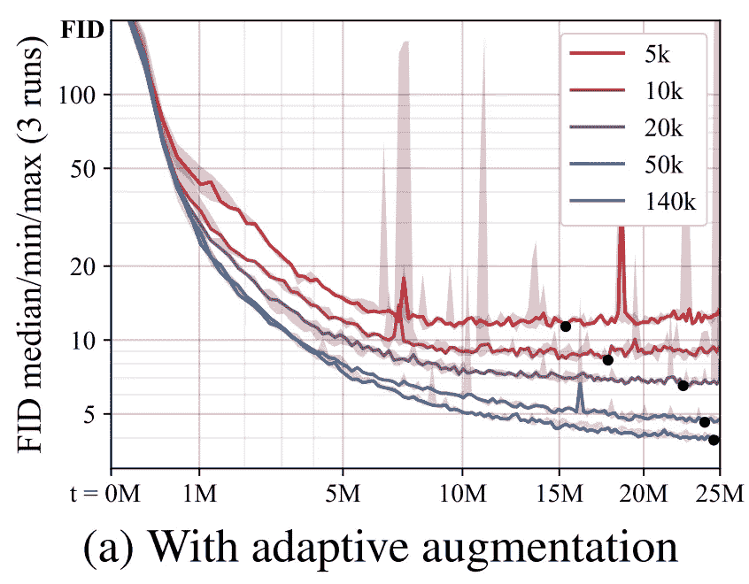
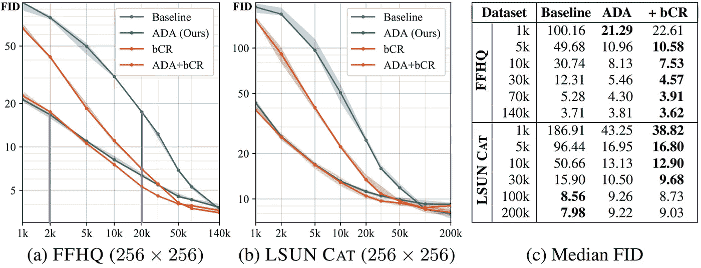

# 有限数据应用的 GAN 培训突破&新 NVIDIA 计划！英伟达研究

> 原文：<https://pub.towardsai.net/gan-training-breakthrough-for-limited-data-applications-new-nvidia-program-nvidia-research-3652c4c172e6?source=collection_archive---------2----------------------->

## [计算机视觉](https://towardsai.net/p/category/computer-vision)，[新闻](https://towardsai.net/p/category/news)，[科技](https://towardsai.net/p/category/technology)

## 通过 NVIDIA 开发的这种新的训练方法，你可以用十分之一的图像训练出一个强大的生成模型！使得许多无法访问如此多图像的应用成为可能！

> *原载于*[*louisbouchard . ai*](https://www.louisbouchard.ai/nvidia-ada/)*，前两天看了我的博客***！**

**

*这篇新论文介绍了一种训练 GAN 架构的技术。它们被用在许多与计算机视觉相关的应用程序中，在这些应用程序中，我们希望按照特定的风格生成图像的逼真变换。如果你不熟悉 GANs 是如何工作的，我强烈建议你在继续之前看一下我做的解释它的视频。*

*如你所知，甘斯的建筑是以对抗的方式训练的。这意味着同时存在两个网络训练，一个训练用于从输入、生成器生成变换图像，另一个训练用于将生成的图像与训练图像的基本事实区分开。这些训练图像的基础事实正是我们希望对每个输入图像实现的变换结果。然后，我们试图同时优化这两个网络，从而使生成器越来越好地生成看起来真实的图像。但是，为了产生这些伟大而现实的结果，我们需要两样东西。由成千上万的图像组成的训练数据集，并在过度拟合之前停止训练。*

**

*图片 via:[NVIDIA](https://arxiv.org/abs/2006.06676)用有限数据训练生成性对抗网络*

*GAN 训练期间的过度拟合将意味着我们的鉴别器的反馈将变得毫无意义，并且生成的图像只会变得更差。当你训练你的网络超过你的数据量时，就会发生这种情况，质量只会变得更差，正如你在黑点之后看到的。*

*这些是 NVIDIA 通过这篇论文解决的问题。他们意识到这基本上是同一个问题，可以通过一个解决方案来解决。他们提出了一种他们称之为适应性鉴别器增强的方法。他们的方法在理论上非常简单，您可以将其应用于您已经拥有的任何 GAN 架构，而无需进行任何更改。*

**

*图片 via:[NVIDIA 用有限的数据训练生成性对抗网络](https://arxiv.org/abs/2006.06676)*

*正如你可能知道的，在深度学习的大多数领域，我们执行我们所谓的数据增强来对抗过度拟合。在计算机视觉中，通常在训练阶段对图像进行变换，以增加训练数据的数量。这些变换可以是应用旋转、添加噪声、改变颜色等等。来修改我们的输入图像并创建一个独特的版本。让我们的网络在更加多样化的数据集上训练，而不必创建或找到更多的图像。不幸的是，这不能容易地应用于 GAN 架构，因为生成器将学习按照这些相同的增强来生成图像。这就是 NVIDIA 的团队所做的。他们找到了一种方法来使用这些增强来防止模型过度拟合，同时确保这些增强不会泄露到生成的图像上。他们基本上将这组图像增强应用于显示给鉴别器的所有图像，其中每个变换随机发生的概率是选定的，并且使用这些修改的图像来评估鉴别器的性能。这种大量的随机应用的变换使得鉴别器不太可能看到甚至一个未改变的图像。当然，生成器经过训练和指导，只生成干净的图像，而不进行任何变换。他们的结论是，只有当每个变换的发生概率低于 80%时，这种通过向鉴别器显示增强数据来训练 GAN 架构的方法才有效。它越高，应用的扩充就越多，因此您将拥有更多样化的训练数据集。*

**

*图片 via:[NVIDIA 用有限的数据训练生成性对抗网络](https://arxiv.org/abs/2006.06676)*

*他们发现，虽然这解决了训练图像数量有限的问题，但根据初始数据集的大小，仍然存在在不同时间出现的过度拟合问题。这就是为什么他们想出了一种适应性的方法来做这种增强。不是用另一个超参数来决定出现的理想增强概率，而是在训练期间控制增强强度。从 0 开始，然后根据训练集和验证集之间的差异迭代调整其值。指示过度拟合是否正在发生。该验证集只是相同类型图像的不同集，网络没有被训练。验证集只需要由鉴别器以前没有见过的图像组成。它用于测量我们结果的质量，量化我们网络的分歧程度，同时量化过度拟合。*

**

*图片 via:[NVIDIA 用有限的数据训练生成性对抗网络](https://arxiv.org/abs/2006.06676)*

*在这里，您可以在 FFHQ 数据集上看到这种针对多个训练集大小的适应性鉴别器增强的结果。在这里，我们使用 FID 测量，你可以看到随着时间的推移越来越好，永远不会达到这种过度拟合问题，只会变得更糟。FID 或弗雷歇初始距离基本上是生成图像和真实图像的分布之间的距离的度量。它测量生成的图像样本的质量。它越低，我们的结果越好。*

**

*这个 FFHQ 数据集包含 70 000 张来自 Flickr 的高质量人脸。它是作为生成性对抗网络的基准而创建的。事实上，他们成功地匹配了 StyleGAN2 的结果，使用了数量级更少的图像，正如你在这里看到的。*

**

*图片 via:[NVIDIA 用有限的数据训练生成性对抗网络](https://arxiv.org/abs/2006.06676)*

*其中对 1 000 到 140 000 个训练示例绘制结果，再次使用 FFHQ 数据集上的相同 FID 测量。*

## *观看视频，了解这种新训练方法的更多示例:*

## *结论*

*当然，代码也是完全可用的，并且很容易使用 TensorFlow 实现到您的 GAN 架构中。如果您想在自己的代码中实现这一点，或者想通过阅读本文对这一技术有更深入的理解，下面的参考资料中链接了代码和论文。这篇论文刚刚发表在 NeurIPS 2020 上，以及 NVIDIA 的另一份公告。他们宣布了一个名为应用研究加速器计划的新项目。他们的目标是支持研究项目，通过部署到商业和政府组织采用的 GPU 加速应用程序中来产生实际影响。向学生提供硬件、资金、技术指导、支持等。如果这符合你目前的需求，你一定要看一看，我在视频的描述中也链接了它！*

*如果你喜欢我的工作并想支持我，我会非常感谢你在我的社交媒体频道上关注我:*

*   *支持我的最好方式就是跟随我上**。***
*   ***订阅我的[YouTube 频道 。](https://www.youtube.com/channel/UCUzGQrN-lyyc0BWTYoJM_Sg)***
*   ***在 [**LinkedIn**](https://www.linkedin.com/company/what-is-artificial-intelligence) 上关注我的项目***
*   ***一起学习 AI，加入我们的 [**Discord 社区**](https://discord.gg/SVse4Sr) ，*分享你的项目、论文、最佳课程，寻找 Kaggle 队友，等等！****

## ***参考***

*****NVIDIA 利用有限数据训练生成性对抗网络**。发表在 NeurIPS 2020 会议上。[https://arxiv.org/abs/2006.06676](https://arxiv.org/abs/2006.06676)
ADA—GitHub 同代码。[https://github.com/NVlabs/stylegan2-ada](https://github.com/NVlabs/stylegan2-ada)
**英伟达的应用研究计划。**[https://www.nvidia.com/accelerateresearch/](https://www.nvidia.com/accelerateresearch/)***