# 用于合成数据生成的 GANs

> 原文：<https://pub.towardsai.net/gans-for-synthetic-data-generation-1cca50317d87?source=collection_archive---------0----------------------->

## *使用开源 GAN 实现生成合成数据的实用指南*

T 技术的进步为在一分钟内生成数百万千兆字节的真实世界数据铺平了道路，这对任何组织或个人利用这些数据来说都是非常好的。然而，大量的时间和资源将消耗在清理、处理和从大量数据中提取重要信息上。

处理这种问题的答案是通过生成*合成数据*。

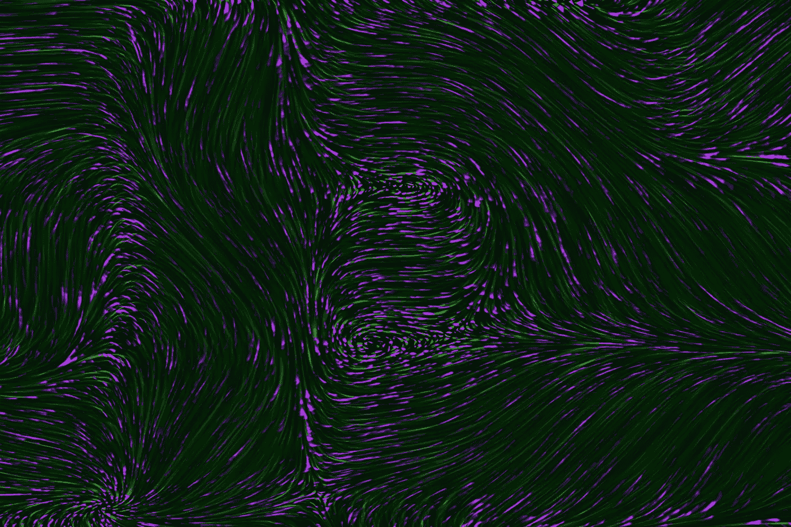

照片由 [Unsplash](https://unsplash.com/s/photos/artificial-data?utm_source=unsplash&utm_medium=referral&utm_content=creditCopyText) 上的[真空背景](https://unsplash.com/@vackground?utm_source=unsplash&utm_medium=referral&utm_content=creditCopyText)拍摄。

**内容**

1.  [**什么是合成数据？**](#a1c8)
2.  [**甘斯简介**](#a967)
3.  [**模式崩溃**](#79cd)
4.  [**瓦瑟斯坦甘(WGAN)**](#7ddb)
5.  [**实现用于合成数据生成的 GAN**](#5abc)
6.  [**数据集**](#65dc)
7.  [**设计和训练合成器**](#333c)
8.  [**最后的话**](#f5d3)
9.  [**参考文献**](#a143)

**什么是合成数据？**


作者使用 [DALL-E 生成的照片。](https://labs.openai.com/s/pphalwrtTUy9erVtIsvZTQej)

合成数据的定义非常简单:模拟真实世界数据的人工生成的数据。组织和个人可以利用合成数据来满足他们的需求，并能够根据他们的规范生成他们需要的数据。

使用合成数据非常有利于保护信息敏感领域的隐私:患者的医疗数据和银行客户的交易细节是合成数据可用于掩盖真实数据的几个例子，这将使组织之间能够共享敏感数据。

很少标记良好的数据可以用来生成大量的合成数据，这将快速跟踪处理大量真实世界数据所需的时间和精力。

有许多生成合成数据的方法:SMOTE、ADASYN、变分自动编码器和生成对抗网络是一些用于合成数据生成的技术。

本文将重点关注使用生成式对抗网络来生成合成数据，以及使用开源库生成合成数据的实际演示。

**GANs 简介**

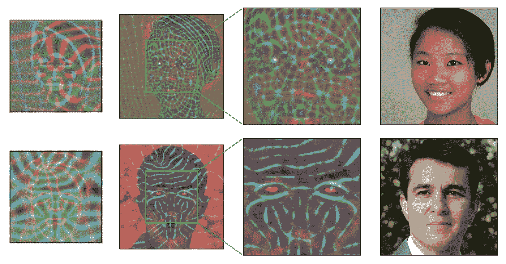

基于 StyleGAN3 研究的 GANs 生成真实感人脸。图片来自[1]。

许多机器学习和深度学习架构容易受到敌对操纵，也就是说，当输入的数据与用于训练的数据不同时，模型就会失败。为了解决对抗问题，Ian Goodfellow [2]引入了生成对抗网络(GANs ),目前，GANs 在生成合成数据方面非常流行。

典型的 GAN 由两部分组成:发生器和鉴别器，两个网络相互竞争。

生成器是 GAN 的核心，它试图通过从真实数据中学习特征来生成看起来真实的假数据。

鉴别器使用真实数据评估生成的数据，并对生成的数据看起来是否真实进行分类，并向生成器提供反馈以改进其数据生成。

生成器的目标是生成可以欺骗鉴别器的数据。


一个香草甘架构。图片来自[3]。

**模式崩溃**

模式崩溃是基于 GAN 的架构在对抗训练期间面临的一个常见问题，其中生成器重复生成一种特定类型的数据。当生成器发现它可以用一种类型的数据欺骗鉴别器时，就会发生这种情况，生成器会继续生成相同的数据。

这个问题很容易被发现，因为度量将指示模型训练正在顺利运行，但是生成的结果将指示其他情况。

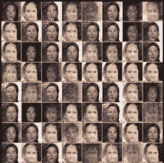

基于图像的 GANs 中模式崩溃的一个例子。图片来自[4]。

**瓦瑟斯坦甘**

标准 GAN 的主要问题是发生器和鉴频器输出的复杂性不同。

标准普通 GAN 使用二进制交叉熵(BCE)损失函数[5]来评估生成的数据是否真实，其中损失函数的输出介于 0 和 1 之间。生成器的任务是生成可能具有大量特征和值的合成数据，来自鉴别器的输出不足以供生成器学习，并且由于缺乏指导，生成器很容易陷入模式崩溃。

WGAN [6]通过用鉴别器代替鉴别器来缓解该问题，其中鉴别器将使用生成数据的分布来评估真实数据的分布，并输出生成数据与真实数据相比看起来有多真实的分数。WGAN 中使用的 Wasserstein 损失函数测量实际分布和基于推土机距离产生的分布之间的差异。

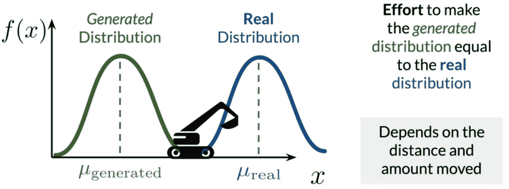

推土机距离的可视化。图片来自 [Coursera 球场](https://www.coursera.org/learn/build-basic-generative-adversarial-networks-gans?specialization=generative-adversarial-networks-gans) [8]

推土机的距离测量使生成数据的分布看起来与真实数据的分布相似所需的努力。因此，对输出的值没有限制。也就是说，如果两个分布相距很远，推土机的距离将给出真正的正值，而 BCE 损失将输出更接近于零的梯度值。因此，Wasserstein 损失函数能够解决训练期间的消失梯度问题。

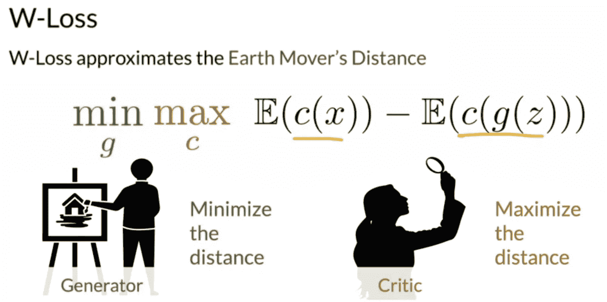

瓦瑟斯坦失落的表情。图片来自 [Coursera 球场](https://www.coursera.org/learn/build-basic-generative-adversarial-networks-gans?specialization=generative-adversarial-networks-gans)【8】。

上图显示了 Wasserstein 损耗的公式，与 BCE 损耗相比，该公式相对简单。等式的初始部分是评论家根据真实数据提供的预测的期望值。等式的第二部分是评论家对生成的数据提供的预测的期望值。批评家的目标是最大化真实数据和生成数据之间的距离，而生成器的目标是最小化这种差异。

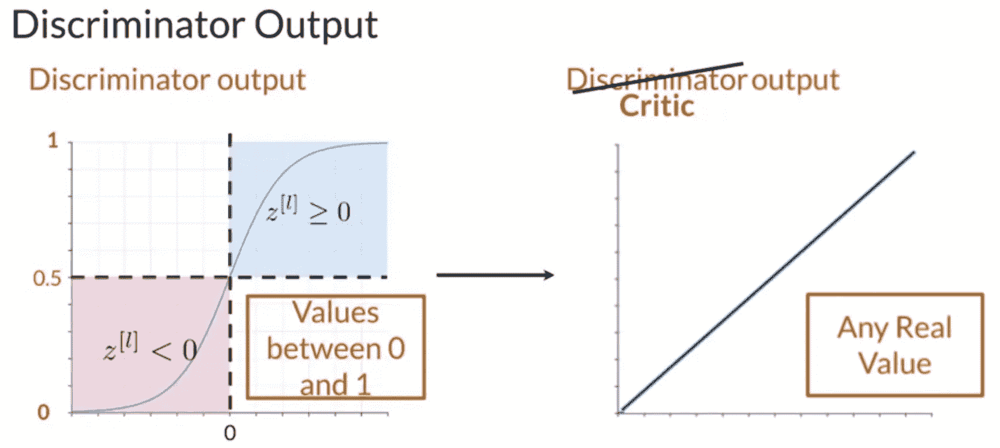

BCE(左)和 Wasserstein(右)损失之间的差异。图片来自 [Coursera 球场](https://www.coursera.org/learn/build-basic-generative-adversarial-networks-gans?specialization=generative-adversarial-networks-gans)【8】。

WGANs 容易出现爆炸梯度问题，因为 Wasserstein 损失输出任何正值和实数；因此，当生成数据的分布不同于真实数据的分布时，梯度值会不受控制地增加。这是通过引入正则化项梯度惩罚[7]来解决的，它确保梯度被包含，这确保了 WGAN 模型的更好优化。

为了深入了解 GANs，强烈推荐由 [deeplearning.ai](https://www.deeplearning.ai/) 和 [Sharon Zhou](https://www.coursera.org/instructor/sharon-zhou) 制作的[Coursera specialization on GANs](https://www.coursera.org/specializations/generative-adversarial-networks-gans)。

**实现用于合成数据生成的 GAN**

ydata-synthetic 库在构建 GANs 以生成表格数据集的合成数据方面提供了巨大的帮助，否则这将是一项艰巨而乏味的工作。

有大量不同类型的 GAN 可用于生成合成数据:标准普通 GAN 和条件 GAN，以及高级 WGAN、带梯度惩罚的 WGAN、深度遗憾分析 GAN、CramerGAN 和条件 WGAN，以及可用于时间序列的 GAN 选项(TimeGAN)。

这些模型可以开箱即用，只需稍加修改，几乎可以用于任何表格数据集。

只需一个简单的命令，就可以在 python 环境中安装这个库:

```
pip install ydata-synthetic
```

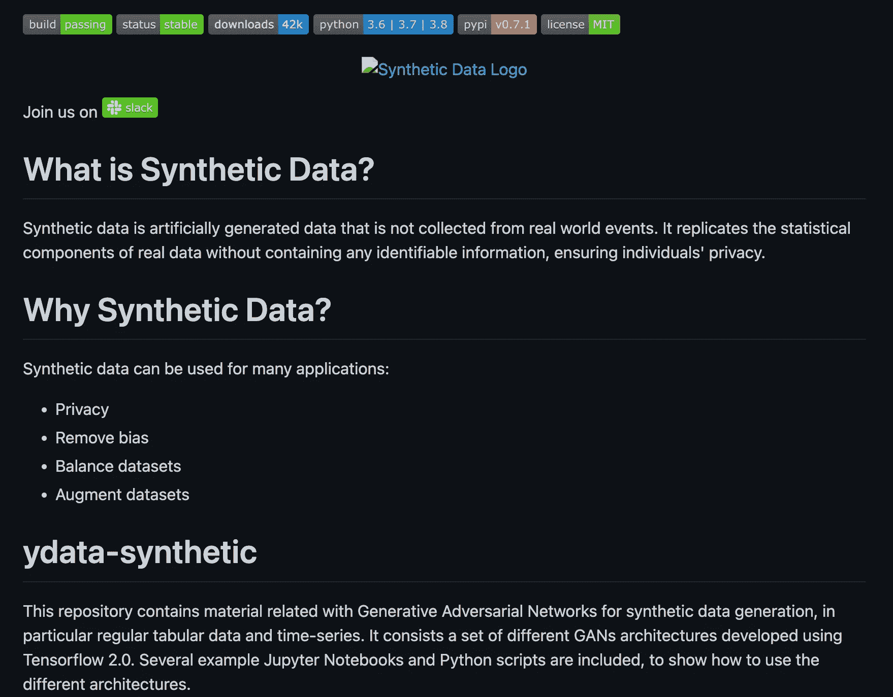

ydata-synthetic 的 GitHub 库。作者截图自 [ydata-synthetic](https://github.com/ydataai/ydata-synthetic) 。

**数据集**

选择[糖尿病健康指标数据集](https://www.kaggle.com/datasets/alexteboul/diabetes-health-indicators-dataset)，其为 [CC0 许可](https://creativecommons.org/publicdomain/zero/1.0/)。数据集具有敏感数据，即患者的医疗记录，并且需要获得更多关于诊断为糖尿病的患者的数据；因此，使用合成数据将非常有益。数据集由 21 个特征组成，目标特征是患者是否被诊断为糖尿病。


在 [Unsplash](https://unsplash.com/s/photos/diabetes-awareness?utm_source=unsplash&utm_medium=referral&utm_content=creditCopyText) 上 [Towfiqu barbhuiya](https://unsplash.com/@towfiqu999999?utm_source=unsplash&utm_medium=referral&utm_content=creditCopyText) 拍摄的照片。

另一个开源工具 [pandas-profiling](https://github.com/ydataai/pandas-profiling) 对于探索性数据分析非常有用，只需两行代码即可将特征和关系可视化，该工具用于对糖尿病健康指标数据集进行探索性数据分析。这将生成有关数据集中存在的所有变量的详细报告，对数据中存在的任何异常发出警报，显示变量之间的关系(或相关性)，并显示每列中缺少的值和数据中存在的重复值。

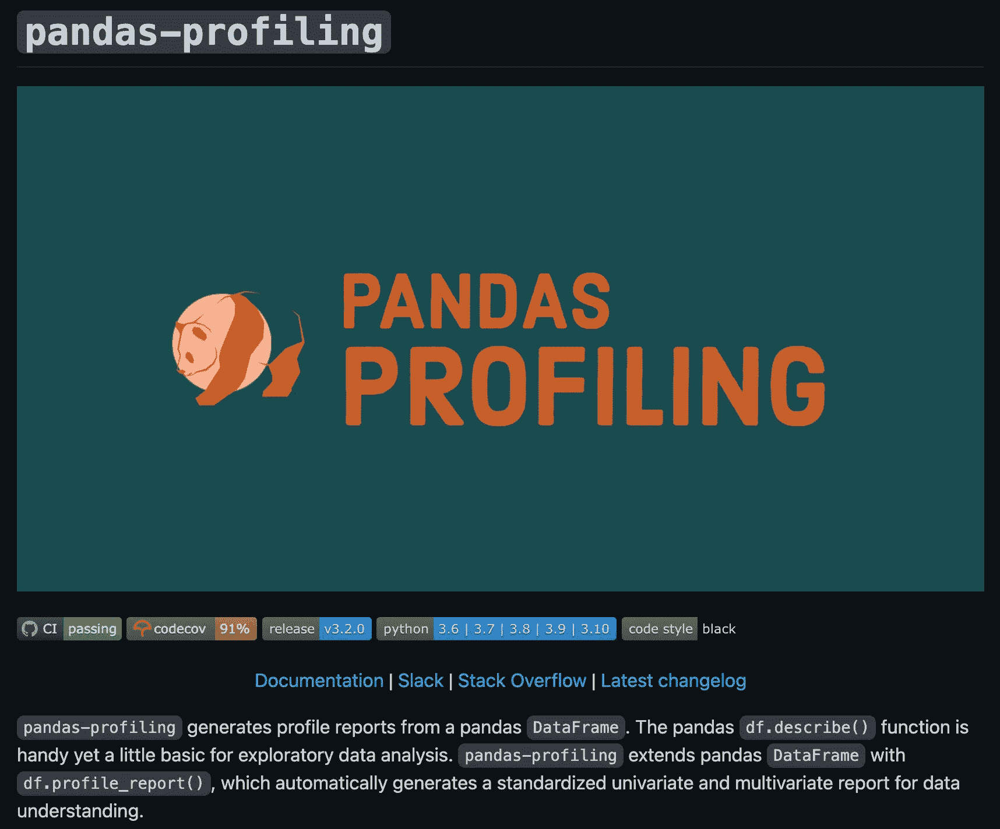

GitHub 熊猫档案库。作者从[熊猫档案](https://github.com/ydataai/pandas-profiling)截取的截图。

加载数据并运行 pandas-profiling。

有超过 218，000 例非糖尿病患者和超过 35，000 例诊断为糖尿病的患者。

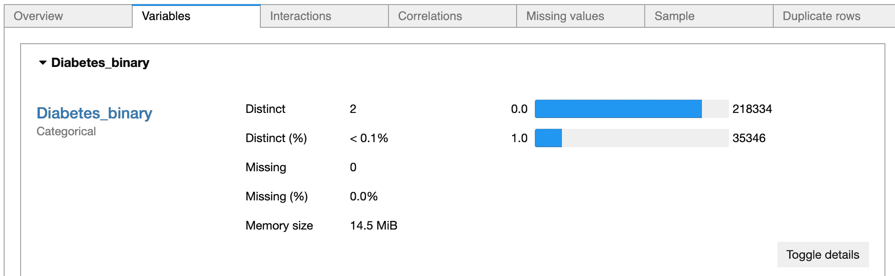

有和没有糖尿病的病人数量。图片来自作者。

所有变量都是浮点型的，因为数据集已经过预处理。在 pandas-profiling 库的帮助下，发现有 3 个数值变量(身体质量指数、曼氏和 PhysHlth)，其他变量是分类变量。pandas-profiling 工具强调了大约 4%的数据集包含重复项。

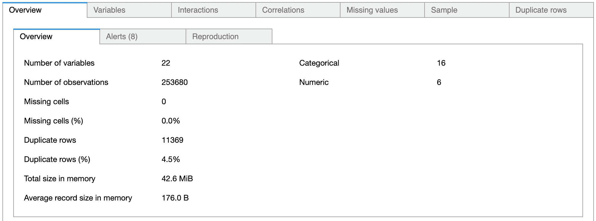

数据的概述。图片来自作者。

pandas-profiling 工具还强调了某些变量之间的高度相关关系，这可以在以后的特征工程任务中加以考虑。

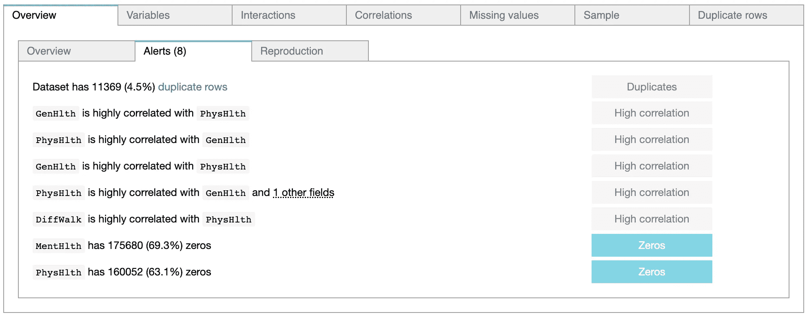

熊猫图谱库检测到的异常。图片来自作者。

有选项可以查看变量之间的关系，从上图中可以看出，pandas-profiling 工具已经检测到六个数值变量，并绘制了描述变量之间关系的散点图。

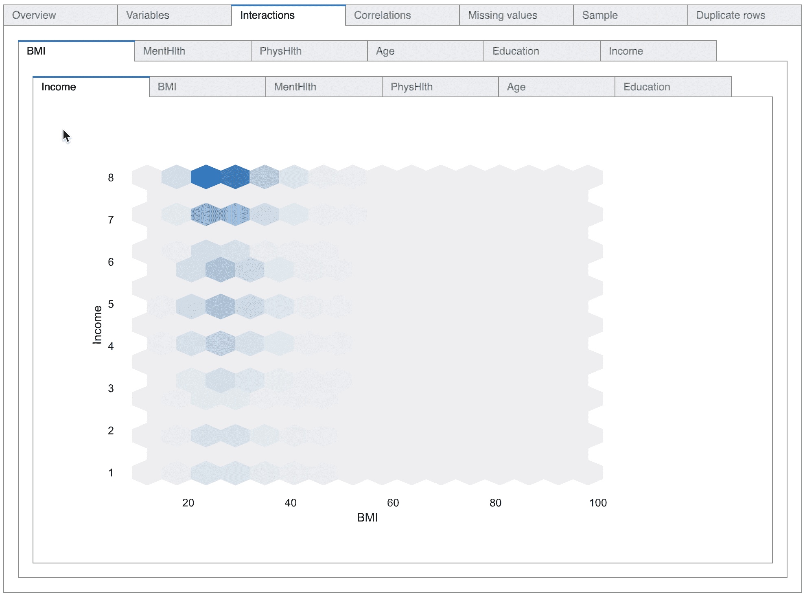

查看数值变量之间的相互作用。作者 GIF。

该工具在进行变量之间的统计相关性测试时也非常有用，因为它提供了进行数值相关性测试和类别相关性测试的选项。

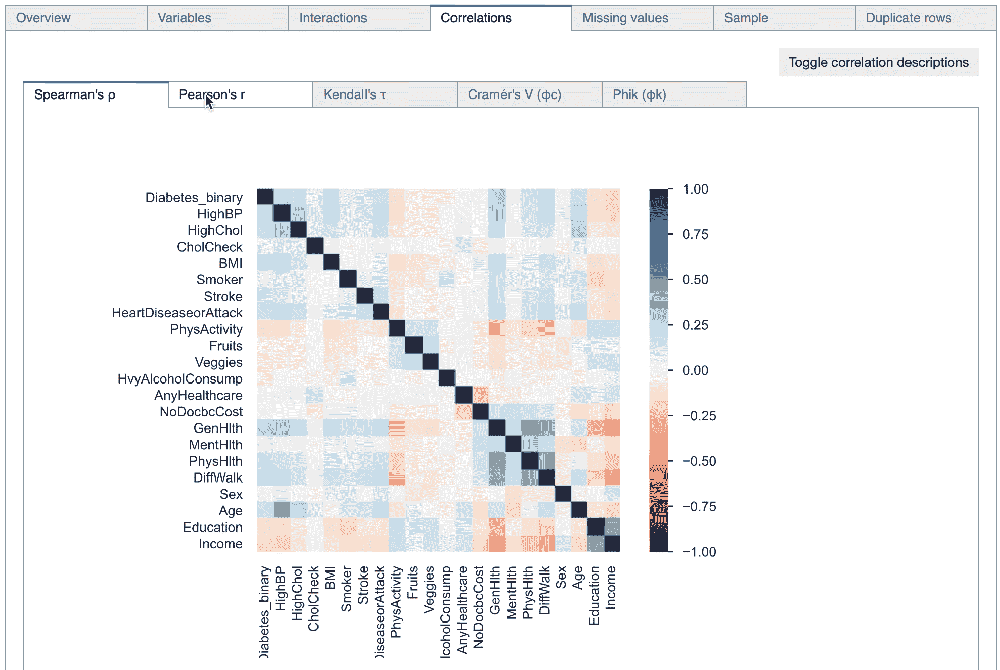

pandas-profiling 库中提供了不同的相关性测试。作者 GIF。

pandas-profiling 工具表明数据集中没有缺失值。

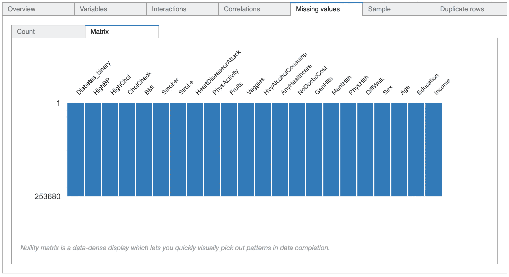

数据中不存在缺失值。图片来自作者。

由于 4.5%的数据由重复数据组成，因此可以检查准确的重复行以及这些行重复的次数。

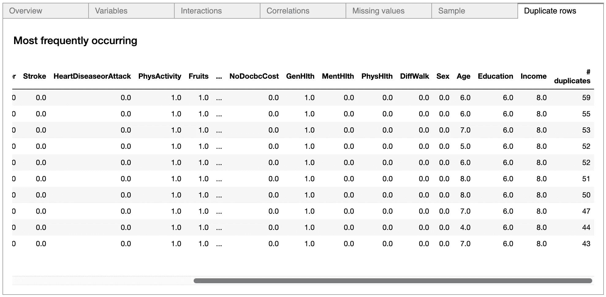

数据中存在的重复项。

完整的熊猫概况报告可以在[这里](https://vaseekaran-v.github.io/real_diabetes_pd_prof_report/)查看。

**合成器的设计和训练**

最初，数字和分类列是分开的，因为变量的类型是训练 GAN 模型所必需的。根据之前完成的数据分析，有三个数值变量，其余的是分类变量。

为了开始生成合成数据的过程，基于患者的糖尿病状态来分离患者的标签。首先，GAN 被训练为糖尿病患者生成合成数据。

选择分类变量和数值变量，并只选择糖尿病患者的数据。

下一步是选择 GAN 模型，如前所述，选择具有梯度惩罚的 Wasserstein GAN。使用 ydata-synthetic 库初始化 GAN 非常容易。

初始化 GAN 模型。

一旦 GAN 初始化，训练过程就开始了。

开始 GAN 的训练过程。

培训时间取决于用于培训的机器。与在 CPU 上训练相比，使用 NVIDIA GPU 进行训练要快得多。但是，该库也经过优化，可以在 CPU 上很好地运行。

一旦训练完成，下一步就是生成合成数据。GAN 模型被训练以理解糖尿病患者数据的分布，并且生成了代表糖尿病患者的 100，000 行数据。

为糖尿病患者生成合成数据。

与原始数据集中存在的 35，000 行糖尿病患者相比，使用基于 GAN 的模型，可获得 100，000 行糖尿病患者的合成数据。使用 ydata-synthetic 的另一个优点是，合成数据以输入数据的形式返回，所有列保持不变。

在多数类上训练 GAN 的步骤类似于先前为少数类生成数据所采取的步骤。为非糖尿病患者的数据训练 GAN 的时期数被设置为 100，以减少训练时间。

为非糖尿病患者的数据生成合成示例。

使用简单的代码函数来合并多数类和少数类的合成样本。

连接合成的多数和少数数据帧。

pandas-profiling 工具用于获得合成数据的快速探索性数据分析。

评估来自真实数据集和生成的数据集的数字列的分布。

考虑到身体质量指数特征，合成数据具有真实数据集的可接受的表示。合成数据的值的范围在真实数据的值的范围内。合成数据的平均值已向右移动，但总体而言，合成数据的身体质量指数列与真实数据相当。

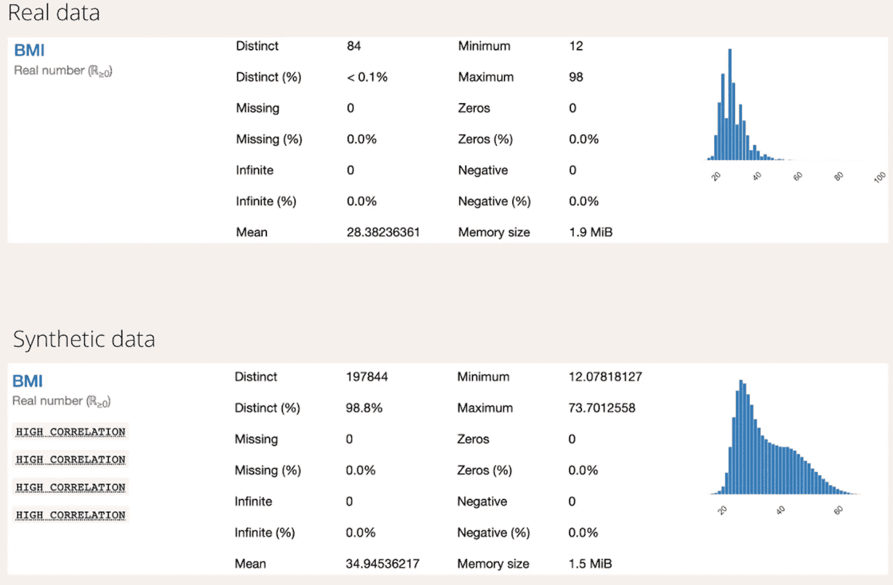

身体质量指数柱与真实和合成数据的比较。图片由作者提供。

比较“身体健康”和“精神健康”可能有点棘手。根据基于数据的列的定义，这两列分别代表过去 30 天中精神健康状况不佳的天数和过去 30 天中身体受伤的天数。因此，这些列中的许多值都是零，并且数据是数字的，因为考虑了天数。

合成数据为两列生成了负值，这需要在继续建模之前进行一些特征处理，因为负值将被转换为零。

当考虑特征“薄荷健康”时，合成数据产生了可接受的分布，因为所有产生的值都在 30 以下。合成数据的平均值已经向左移动。

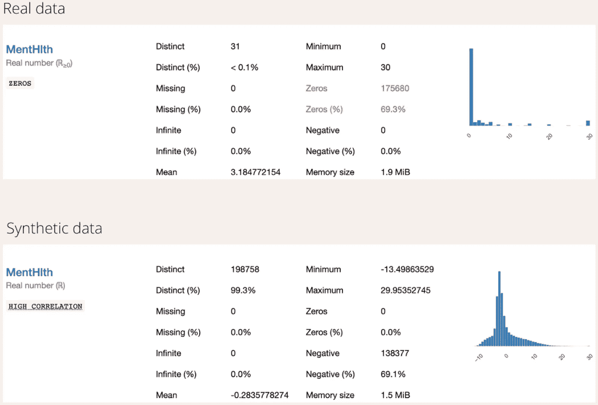

曼氏柱与真实数据和合成数据的比较。图片由作者提供。

然而，列“PhysHlth”的合成数据的平均值已经显著向右移动。但是生成的值小于 30，用零替换负值可能会稍微改善生成的结果。

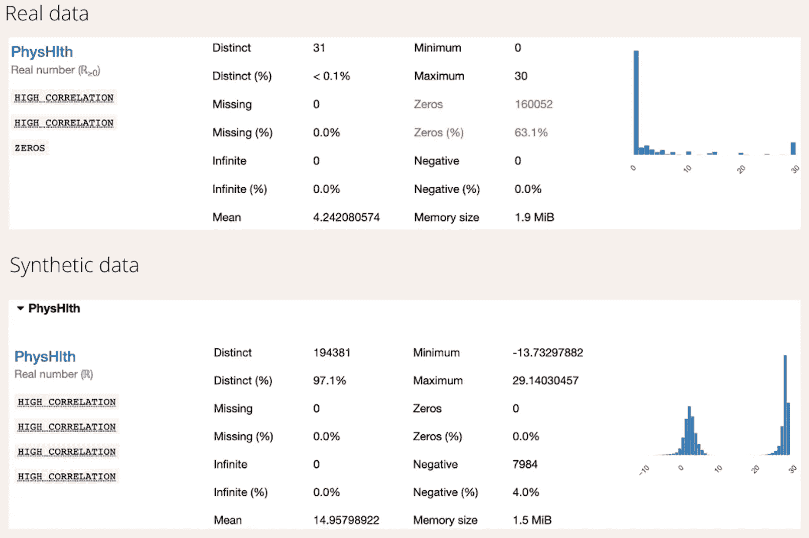

PhysHlth 柱与真实数据和合成数据的比较。图片由作者提供。

需要注意的是，对于真实数据中的“PhysHlth”和“MentHlth”字段，近 70%的值为零。剩下的 30%分布在 1-30 之间，但没有任何特定的模式。与“身体质量指数”字段不同，在这两列中看不到特定的分布。这可能是 GAN 为“物理长度”和“精神长度”字段产生负值的另一个重要原因。

在合成的“PhysHlth”和“MentHlth”列的分布中，零值周围有一个峰值，这表明合成器已经识别出这两列的许多值都是零，但是由于这两个字段都被初始化为数值，GAN 试图预测精确的数值，因此产生了负值。

合成数据的完整的 pandas-profiling HTML 报告可以在[这里](https://vaseekaran-v.github.io/synth_data_pd_prof_report/)查看，整个工作的存储库可以在[这里](https://github.com/Vaseekaran-V/Synthetic_Data_Generation_Diabetes)找到。

**遗言**

人工智能的范式正在从以模型为中心转变为以数据为中心的方法，合成数据的使用加速了这种转变。

合成数据提供了一种低成本和隐私安全的替代方法来收集和标记真实世界的数据，任何人都可以利用开源的强大工具来为他们的特定用例生成数据。

有许多[开源工具](https://github.com/ydataai/awesome-data-centric-ai)可用于生成高质量的合成数据，正如本文所讨论的，在 ydata-synthetic 的帮助下，通过利用 GANs 的能力来生成合成数据相对容易。

我希望您已经了解了为表格数据集生成合成数据有多简单，并期待看到您将如何使用这些强大的工具来处理和创建合成数据。干杯！

**参考文献**

[1] T. Karras，S. Laine 和 T. Aila，“一种基于风格的生成式对抗网络生成器体系结构”， *IEEE 模式分析和机器智能事务*，第 1-1 页，2020，doi:10.1109/tpami . 2020 . 297091999916

[2]I . j . good feller*等*，【生成性对抗网络】*arXiv.org*，2014。[https://arxiv.org/abs/1406.2661](https://arxiv.org/abs/1406.2661)

[3] G. H. de Rosa 和 J. P. Papa，“利用生成性对抗网络的文本生成研究综述”，*模式识别*，第 119 卷，第 108098 页，2021 年 11 月，doi:10.1016/j . pat cog . 2021.108098098

[4] M. Pasini，“我在一年的培训中吸取的 10 个教训”，*中*，2019 年 7 月 28 日。[https://towards data sciences . com/10-教训-我-吸取-培训-生成-对抗-网络-gan s-for-a-year-c 9071159628](https://towardsdatascience.com/10-lessons-i-learned-training-generative-adversarial-networks-gans-for-a-year-c9071159628)

[5]u . r . Dr . A，“二进制交叉熵结合深度学习技术用于图像分类”，*国际计算机科学与工程高级趋势杂志*，第 9 卷，第 4 期，第 5393-5397 页，2020 年 8 月，doi:10.30534/I jatcse/2020/175942020。

[6] M. Arjovsky，S. Chintala，L. Bottou，“Wasserstein GAN”，*arXiv.org*，2017 .[https://arxiv.org/abs/1701.07875](https://arxiv.org/abs/1701.07875)

[7] I. Gulrajani，F. Ahmed，M. Arjovsky，V. Dumoulin，a .库维尔，“Wasserstein GANs 的改进培训”， *arXiv:1704.00028 [cs，stat]* ，2017 年 12 月，[Online]。可用:[https://arxiv.org/abs/1704.00028](https://arxiv.org/abs/1704.00028)

[8]“建立基本的生成性对抗网络(GANs)，” *Coursera* 。[https://www . coursera . org/learn/build-basic-generative-adversarial-networks-gans？特殊化=生成-对抗-网络-gans](https://www.coursera.org/learn/build-basic-generative-adversarial-networks-gans?specialization=generative-adversarial-networks-gans)(2022 年 7 月 28 日访问)。