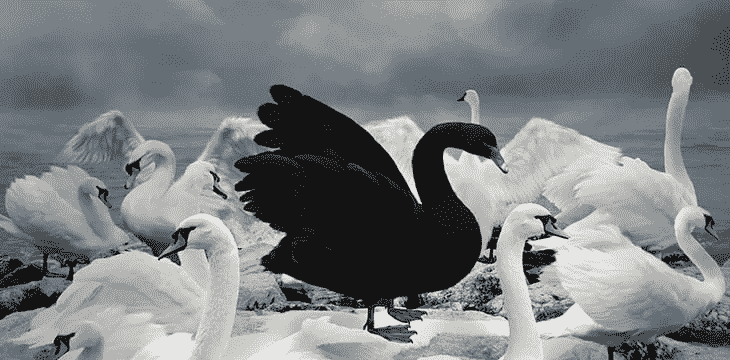
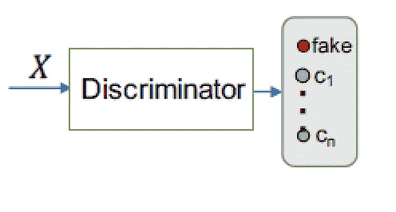
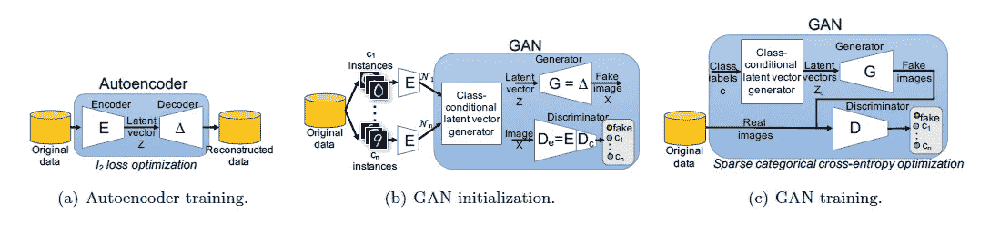
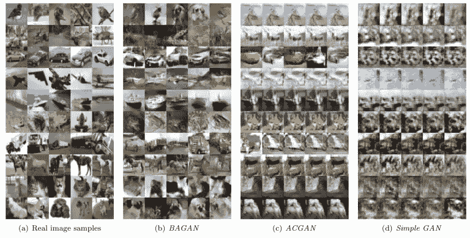
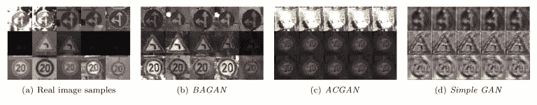

# 能够识别少数群体概念以减少偏见的 GANs

> 原文：<https://pub.towardsai.net/gans-that-can-recognize-minority-concepts-to-mitigate-bias-23b5c7f4f3af?source=collection_archive---------1----------------------->

## [人工智能](https://towardsai.net/p/category/artificial-intelligence)

## IBM 的 BAGAN 能够识别输入数据集中的少数概念。

图片来源:[https://coin geek . com/bsv-impact-could-be-bit coins-black-swan-event-if-it-avoids-btcs-errors/](https://coingeek.com/bsv-impact-could-be-bitcoins-black-swan-event-if-it-avoids-btcs-mistakes/)

> 我最近创办了一份专注于人工智能的教育时事通讯，已经有超过 10 万名订户。《序列》是一份无废话(意思是没有炒作，没有新闻等)的 ML 导向时事通讯，需要 5 分钟阅读。目标是让你与机器学习项目、研究论文和概念保持同步。请通过订阅以下内容来尝试一下:

 [## 序列

### 订阅人工智能世界中最相关的项目和研究论文。受到 120，000+的信任…

thesequence.substack.com](https://thesequence.substack.com/?r=2g8vk) 

人类有一种独特的能力，可以在一次拍摄中从图像中学习概念。给孩子看一张狗的图片，他或她可以立即认出所有种类的天鹅，不管它们的肤色、大小、品种、性别等等。相比之下，在人工智能(AI)中训练一个简单的图像分类模型可能需要大量的训练数据集。更糟糕的是，人工智能模型不太擅长识别同一类对象的变化，这就是为什么训练图像分类模型来识别狗需要有各种天鹅的训练数据集。因此，基于训练数据集，图像分类模型因不平衡和表现出有偏见的行为而臭名昭著。该领域最有趣的研究之一已经发表，但来自苏黎世[IBM 研究实验室的一组人工智能研究人员在一篇论文中提出了一种基于生成对抗网络(GANs)的新方法，以对抗偏见并实现图像数据集的平衡](https://arxiv.org/abs/1803.09655)。

平衡是影响图像分类模型准确性的关键因素之一。当呈现黑天鹅的图像时，识别天鹅的模型很可能失败，因为它们不是很常见。因此，数据科学家花费大量时间和资源，试图通过引入少数类图像来扩充训练数据集，但这种手动方法几乎不可扩展。诸如 GANs 之类的生成模型对于从数据集生成新图像是理想的，但是它们不能被有效地训练，因为没有足够的少数样本。总而言之，在影像数据集中恢复平衡的生成模型需要两件事情:

a)根据少数民族的例子生成新图像的能力。

b)基于缩减的训练集学习少数民族概念的能力。

# 介绍 BAGAN

平衡生成对抗网络(BAGAN)是一种 GAN 变体，专注于恢复基于少数图像的训练数据集中的平衡。作为传统的 GANs，BAGAN 使用两个竞争的神经网络:生成器和鉴别器，它们在多数和少数图像中联合训练，并学习生成与数据集匹配的新图像。在训练期间，明确地要求生成器绘制每个类别的图像，并让鉴别器相信生成的图像是期望类别的真实图像。在这样做的时候，生成器会因为绘制了每个类(包括少数类)的真实图像而获得明显的奖励。另一方面，鉴别者会因为给图像贴上假标签或者把它们放在特定的类别中而得到奖励。蒲甘的主要贡献在于，它能够跨越不同类别的图像，包括少数民族的图像，进行生成过程。BAGAN 通过使用自动编码技术扩展传统的 GANs 实现了这一点，该技术提供了对类别条件的精确选择。

图片来源:IBM Research

BAGAN 的架构基于三个不同的阶段:自动编码器训练、GAN 初始化和 GAN 训练。

图片来源:IBM Research

**自动编码器训练:**使用训练数据集的所有图像来训练 BAGAN 自动编码器。自动编码器没有明确的类别知识，它无条件地处理来自多数和少数类别的所有图像。

**甘初始化:**在蒲甘中，对抗模型用不同类别的图像进行初始训练。在训练期间，要求生成器为不同的类创建图像，同时要求鉴别器将图像标记为假的或特定的类。GAN 还利用自动编码器的知识进行训练，该自动编码器利用解码器的权重来初始化发生器。鉴别器最初用允许它将图像分类到不同类别的特征来训练。

**对抗性训练:**在这个阶段，数据成批地流经生成器和鉴别器，它们的权重被微调以优化它们的损失函数。鉴别器将输入图像分类为属于 n 个特定于问题的类别中的一个或者是伪造的。对于鉴别器学习的每一批，生成器学习相同大小的一批，帮助保持两个网络之间的平衡。该过程重复多次，直到在数据集中达到平衡。

Github 提供了基于 Keras 和 TensorFlow [的 BAGAN 的初始实现。](https://github.com/IBM/BAGAN)

# 行动中的蒲甘

使用上一节描述的架构，BAGAN 能够从少数类生成图像，从而恢复目标数据集中的平衡。如果我们需要量化 BAGAN 的有效性，我们应该在生成的图像中寻找三个关键属性:

a)生成的图像必须代表一个目标类别。

b)生成的图像不得重复。

c)生成的图像必须不同于初始数据集中的图像。

基于那三个性质，你可以自己判断蒲甘的结果。当用于流行的微小图像数据集时，BAGAN 能够生成比竞争对手更具多样性的图像。

图片来源:IBM Research

当使用[德国交通标志识别数据集](http://benchmark.ini.rub.de/?section=gtsrb&subsection=news)中的少数类进行训练时，观察到了类似的结果。

图片来源:IBM Research

对抗偏见是人工智能在未来十年的关键挑战之一。开发可以有效地与少数类一起工作以及在公共对象上执行的人工智能模型对于创建更加多样化和更少偏见的人工智能是必不可少的。像 BAGAN 这样的方法是恢复图像分类数据集中平衡的最初尝试之一。毕竟，人工智能也许能够识别黑天鹅。