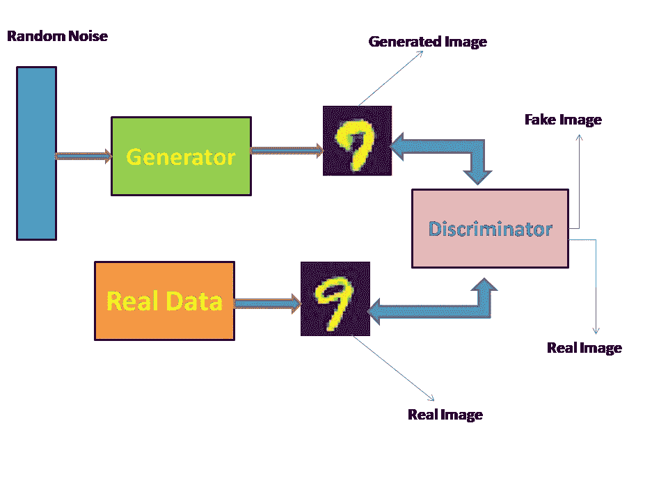
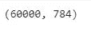
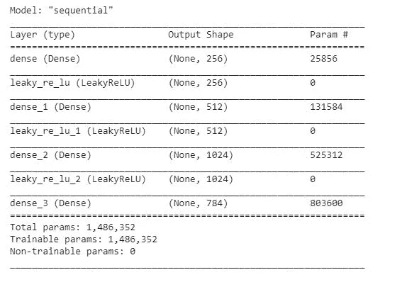
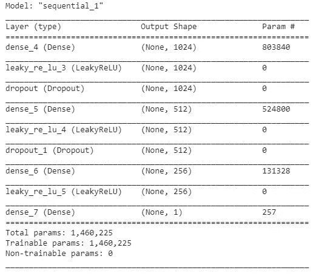
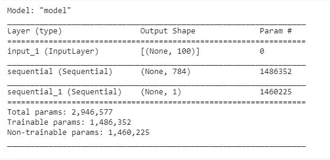
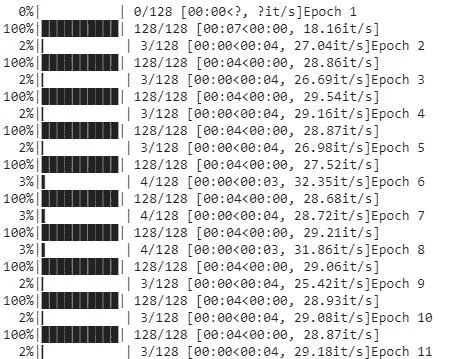
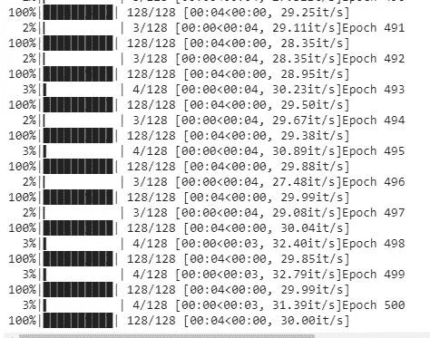
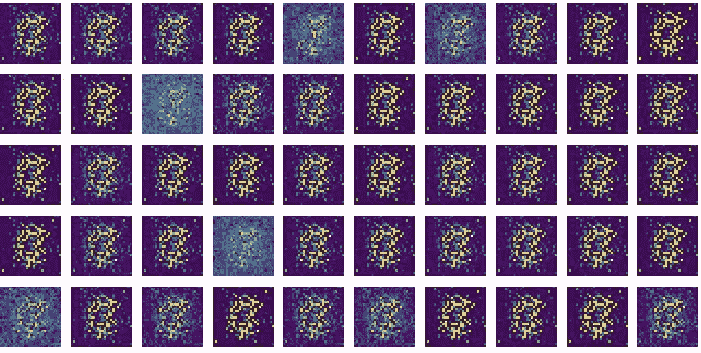
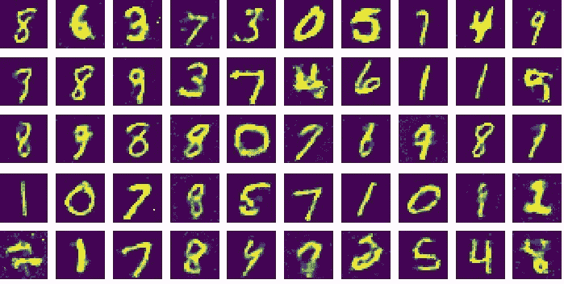

# 使用 MNIST 数据集的甘斯

> 原文：<https://pub.towardsai.net/gans-using-mnist-dataset-7a11fd254a53?source=collection_archive---------0----------------------->

使用 Keras API 生成类似 MNIST 的角色图像

[来源](https://pixabay.com/illustrations/monalisa-mona-lisa-corona-virus-4893660/)

## “生成对抗网络是过去 10 年机器学习中最有趣的想法”——**Yann le Cun**。

自 2018 年初以来，世代对立网络(GANs)变得极为流行。GANs 是关于创建、设计和操作输入图像的，这些图像与数据集图像相似，但又不完全相同。

GANs 由两部分组成:

1.  发电机
2.  鉴别器

它主要是一个无监督的计算机视觉网络，其中发生器的输出与鉴别器进行比较。一旦整个网络经过训练和评估，我们就可以使用生成器模块来生成新的图像。

> **简单的直觉** - **生成器就像一个小贩试图创造新的葡萄酒样本，而鉴别器则像一个品酒师团队一样努力寻找已经创造出来的样本。生成器和鉴别器都试图超越对方。此外，发生器和鉴别器都有一个多层感知器(MLP)结构。**

生成对抗网络

生成器的工作是创建与数据集相似的新图像，该数据集应该不能被鉴别器网络区分。

鉴别器网络考虑两个输出，即来自真实数据集的图像和来自生成器网络的图像。鉴别器网络作为二元分类器工作，并且对给定图像是生成的图像还是真实的图像进行分类。

# 训练 GAN

对于这个示例博客，我们将使用 MNIST 数据集并创建新的角色图像。我们会一个接一个地理解这个模型的细节和复杂性。训练 GAN 包括以下步骤:

## ***第一步:加载数据集***

在这一步中，我们加载数据集。对于这个博客，我们将使用 MNIST 数据集，它是数据集中每个数据点的(28，28)维图像。它们被展平成(784，1)维向量。数据集中总共有 60，000 幅图像。

## ***第二步:定义优化器参数***

我们使用给定的参数定义 adam 优化器。

学习率=0.02

## ***第三步:定义发电机模型架构***

发电机模型是一个 MLP 架构，一层堆叠在另一层之上。它接受一个 100 维的随机噪声，并返回一个 784 维的输出向量。必须注意，最终输出层具有' *tan h'* 激活，而不是' *sigmoid* 激活。使用 tan h 而不是 sigmoid 的原因超出了本博客的范围。

发电机网络

发电机网络概述

## ***第四步:定义鉴别器模型***

像发电机模型一样，鉴别器模型也是一种 MLP 架构。它从数据和生成器网络中获取 784 维输入。它返回单个值输出，这是分类生成图像和真实图像时的输出分数(概率)。与发生器不同，它在最终输出层中具有 s 形激活，而不是 tan h 激活层。

鉴别器网络

鉴频器网络概述

## ***第五步:定义 GAN 模型***

到目前为止，我们已经加载了 MNIST 数据集，并定义了生成器和鉴别器网络。现在，我们将结合发生器和鉴别器模型来定义 GAN 模型。

我们将一个 100 维随机噪声馈入发生器网络，其输出馈入鉴别器网络。很难同时训练鉴别器和发生器网络。在神经网络术语中，同时训练两个网络的挑战在于它们可能无法收敛。

开始

## ***步骤 6:定义函数从发生器输出*** 创建图像

到目前为止，很明显，生成器网络给出的输出是 784 维向量，而 MNIST 数据集中的图像大小为(28，28)。因此，一旦生成器模型给出了它的预测，它就被整形为(28，28)矩阵。

## ***第七步:训练网络***

在这一步中，我们定义一个批处理(比如 batch_size=128)。然后我们定义发电机网络。一旦确定了发生器，就给网络一些随机噪声，用它来预测输出。现在，来自真实的和生成的数据集的批量数据被提供给鉴别器。现在，我们将使鉴频器重量可训练，发电机重量冻结。我们通过交替冻结生成器和鉴别器模型的权重来训练 GAN。

对 128 和 500 个时期的批量进行培训

这就是最初的纪元训练的样子

这就是最终纪元训练的样子。

更多参考，试试这个 [colab](https://colab.research.google.com/drive/1PErY9XmsMTGOYApgh1xmErXkmXbMSNjY) 笔记本或者这个 [Github](https://github.com/sawarn69/GANs) 链接。

## **输出**

初始时期(少于 20)

最终纪元(450 年到 500 年之间)

 [## 什么是生成性对抗网络？

### 从无到有创造一些东西是最伟大的感觉之一，...简直是天堂。

medium.com](https://medium.com/@jonathan_hui/gan-whats-generative-adversarial-networks-and-its-application-f39ed278ef09)