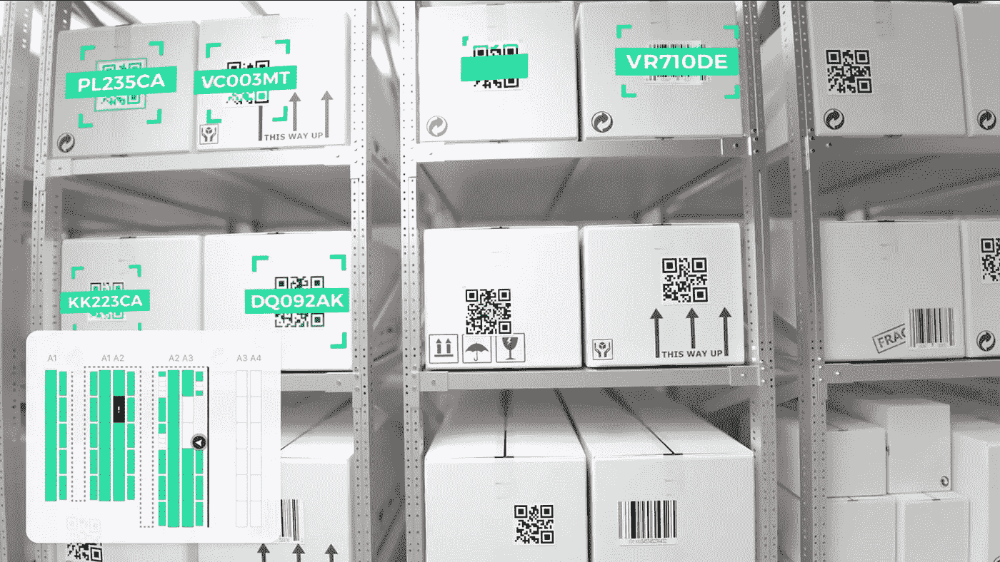
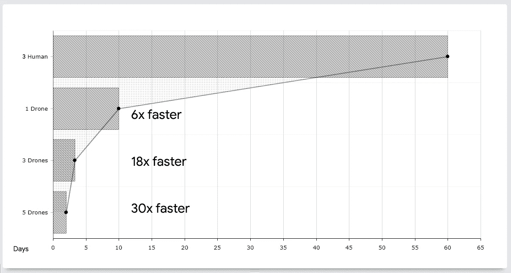

# 聚集人工智能，一次革新一架无人机的库存管理

> 原文：<https://pub.towardsai.net/gather-ai-revolutionizing-inventory-management-one-drone-at-a-time-461aedfe8759?source=collection_archive---------2----------------------->

来源:[聚 AI](https://mktg.best/gather-ai)

## [新闻](https://towardsai.net/p/category/news)

## [Gather AI](https://mktg.best/gather-ai) 的视频展示了世界上第一个专用于仓库的自主纯软件库存管理平台。

最近，我有幸参观了匹兹堡最具创新性的人工智能公司之一。 [**聚 AI**](https://mktg.best/gather-ai) ，一家自主库存管理 AI 公司，如题所提“一次一架无人机”，彻底变革仓储行业。

Gather AI 的创始团队由卡内基梅隆大学机器人研究所的三名毕业生组成，包括联合创始人兼首席机器人官 Sankalp Arora、联合创始人兼首席技术官 Daniel Maturana 以及联合创始人兼首席安全官 Geetesh Dubey。

Gather AI 使用最先进的机器人技术、经典的人工智能方法和深度学习引擎来实现自主库存监控和管理，其中使用了无人机舰队。每架无人机都是完全自主的，并与平板设备配对，后者提供库存数据。可以通过提供的无人机平板电脑随时查看收集的数据，或者通过实时在线同步收集人工智能的网络仪表盘。

阿罗拉博士回答了一些关于 Gather AI 最先进的人工智能技术的关键问题。下面是我们谈话的一些关键话题。

视频来源:[聚 AI](https://mktg.best/gather-ai)

## 《盗梦空间》是怎么聚集 AI 的？

**Arora:**2017 年 1 月，我们最初在卡内基梅隆大学的机器人研究所和斯沃茨创业中心(swar tz Center for entrepreneurs hip)以 Nabla Ascent 开始，但我们的客户很难记住我们的名字。我的博士论文名为“[物理空间中的安全数据收集](https://www.ri.cmu.edu/publications/safe-data-gathering-in-physical-spaces/)”，为我提供了“收集”的想法，我向我们的创始团队提出了这个想法，我们就收集人工智能达成了一致。

## Gather AI 是否获得过任何投资者的资助？

**Arora:** 我们最初在 2017 年获得了 1.5 万美元的麦金尼斯奖，随后获得了 VentureBridge 1.3 万美元的种子前投资。今年，我们完成了一轮 250 万美元的融资，这使我们能够加快我们的招聘流程和扩张。

## 你能给我们简单介绍一下 Gather AI 背后的技术吗？

**Arora:** 我们的全自主平台使用最先进的机器人技术、经典的人工智能方法，以及我们深度学习引擎的关键用途，该引擎可以全面优化我们所有的方法。

大规模发射无人机需要它们完全自主，这使其具有挑战性，特别是在空间紧张、缺乏全球定位系统(GPS)以及仓储设施中进出的交通流量的情况下。

## 你能给我们一些使用无人机扫描一个设施节省了多少时间的指标吗？

**阿罗拉:**在一个 6 万英尺的仓库上，通常三个人两个月扫描一次，一架无人机快 6 倍(10 天)，三架无人机快 18 倍(3.33 天)，五架无人机快 30 倍(2 天)。

图 1:显示了扫描一个 60，000 平方英尺的仓储设施所需的时间长度；这些数字代表了这样做所需要的天数。

使用无人机自动扫描仓库设施节省的时间令人印象深刻。我们的客户对使用我们的技术节省的时间非常满意。

## 在你看来，Gather AI 目前面临的最大挑战是什么？

**阿罗拉:**我们很难找到人才。匹兹堡有这么多科技创业公司和科技公司，很难找到合适的人才。我们的目标是在年底前将现有员工人数增加一倍。

## 你的定价策略是什么？

**Arora:** 我们为自主软件平台提供订阅定价模式。无人驾驶飞机仍然是 Gather AI 的财产。与此同时，我们的客户享受到了订阅模式的好处，与手动解决方案相比节省了高达 60%的成本，进一步提高了劳动生产率。

## 如果无人机坏了或者停止工作会怎么样？

**Arora:** 在合理使用的情况下，如果我们的硬件出现故障，我们会确保在 24 小时内将替换硬件运送出去，不会向客户收取额外费用。无人机从箱子里出来，准备部署。

## 客户怎么和你联系？

**Arora:** 我们的客户可以[通过我们的网站](https://mktg.best/gather-ai)联系我们，安排在他们的设施上进行现场演示，或者从他们的计算机上进行远程演示，或者通过发送电子邮件至 [info@gather.ai](mailto:info@gather.ai) 联系我们。

Sankalp Arora 是 Gather AI 的联合创始人兼首席机器人官。凭借十多年的机器人经验，他为世界上第一架安全自主直升机开发了安全和传感器规划。一个获得霍华德·休斯奖、AUVSI Xcellence 奖，并获得科利尔奖杯提名的项目。阿罗拉是高通创新奖学金和斯沃茨创新奖学金的获得者。他在卡内基梅隆大学获得了机器人学博士学位。