# 高斯朴素贝叶斯解释和实践与 Scikit-Learn

> 原文：<https://pub.towardsai.net/gaussian-naive-bayes-explained-and-hands-on-with-scikit-learn-4183b8cb0e4c?source=collection_archive---------0----------------------->

使用 Python 和 Google Colab

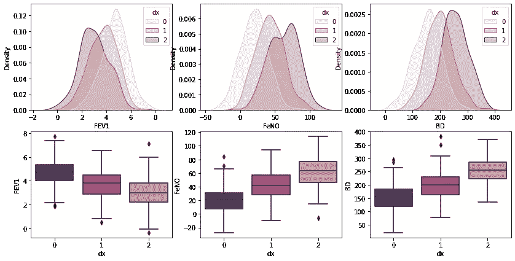

高斯朴素贝叶斯(GNB)是一种基于概率方法和高斯分布的机器学习(ML)中使用的分类技术。高斯朴素贝叶斯假设每个参数(也称为特征或预测值)都有独立的预测输出变量的能力。所有参数的预测组合就是最终的预测，它返回要分类到每个组中的因变量的概率。最终分类被分配给具有较高概率的组。

> **迷茫？让我们打破它……**

## 什么是高斯分布？

高斯分布也叫正态分布。正态分布是描述自然界中连续随机变量统计分布的统计模型。正态分布由其钟形曲线定义。正态分布的两个最重要的特征是均值( **μ** 和标准差( **σ** )。平均值是分布的平均值，标准差是平均值周围分布的“宽度”。

要知道正态分布的变量( **X** )从**∞<X<+∞**连续分布(连续变量)，模型曲线下的总面积为 1。

## 多类高斯朴素贝叶斯

和往常一样，第一件事是导入必要的库:

```
from random import random
from random import randint
import pandas as pd
import numpy as np
import seaborn as sns
import matplotlib.pyplot as plt
import statistics
from sklearn.model_selection import train_test_split
from sklearn.preprocessing import StandardScaler
from sklearn.naive_bayes import GaussianNB
from sklearn.metrics import confusion_matrix
from mlxtend.plotting import plot_decision_regions
```

现在，我们将创建一个预测变量呈正态分布的数据库。

```
**#Creating values for FeNO with 3 classes:** FeNO_0 = np.random.normal(20, 19, 200)
FeNO_1 = np.random.normal(40, 20, 200)
FeNO_2 = np.random.normal(60, 20, 200)**#Creating values for FEV1 with 3 classes:** FEV1_0 = np.random.normal(4.65, 1, 200)
FEV1_1 = np.random.normal(3.75, 1.2, 200)
FEV1_2 = np.random.normal(2.85, 1.2, 200)**#Creating values for Broncho Dilation with 3 classes:** BD_0 = np.random.normal(150,49, 200)
BD_1 = np.random.normal(201,50, 200)
BD_2 = np.random.normal(251, 50, 200)**#Creating labels variable with three classes:(2)disease (1)possible disease (0)no disease:** not_asthma = np.zeros((200,), dtype=int)
poss_asthma = np.ones((200,), dtype=int)
asthma = np.full((200,), 2, dtype=int)**#Concatenate classes into one variable:** FeNO = np.concatenate([FeNO_0, FeNO_1, FeNO_2])
FEV1 = np.concatenate([FEV1_0, FEV1_1, FEV1_2])
BD = np.concatenate([BD_0, BD_1, BD_2])
dx = np.concatenate([not_asthma, poss_asthma, asthma])**#Create DataFrame:** df = pd.DataFrame()**#Add variables to DataFrame:** df['FeNO'] = FeNO.tolist()
df['FEV1'] = FEV1.tolist()
df['BD'] = BD.tolist()
df['dx'] = dx.tolist()**#Check database:**
df
```

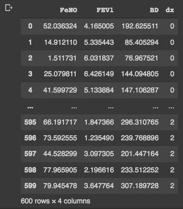

我们有一个 600 行 4 列的数据框。现在我们可以通过目视检查来检查变量的分布:

```
fig, axs = plt.subplots(2, 3, figsize=(14, 7))sns.kdeplot(df['FEV1'], shade=True, color="b", ax=axs[0, 0])
sns.kdeplot(df['FeNO'], shade=True, color="b", ax=axs[0, 1])
sns.kdeplot(df['BD'], shade=True, color="b", ax=axs[0, 2])
sns.distplot( a=df["FEV1"], hist=True, kde=True, rug=False, ax=axs[1, 0])
sns.distplot( a=df["FeNO"], hist=True, kde=True, rug=False, ax=axs[1, 1])
sns.distplot( a=df["BD"], hist=True, kde=True, rug=False, ax=axs[1, 2])plt.show()
```

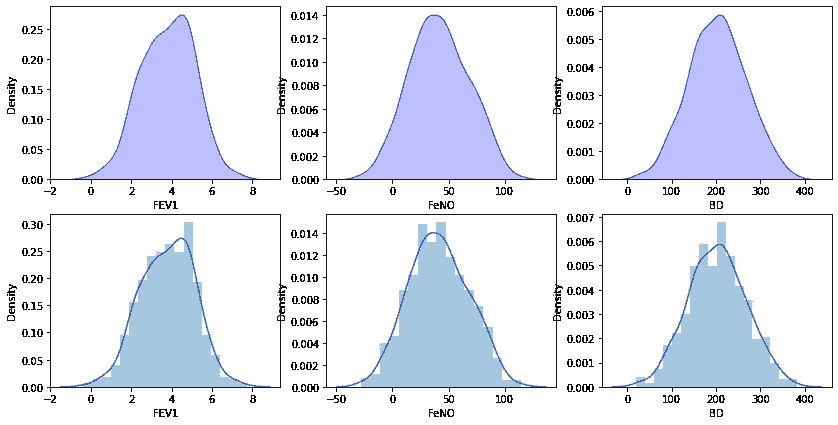

通过目测，我们的数据似乎接近高斯分布。我们可以仔细检查构建 qq-plots:

```
from statsmodels.graphics.gofplots import qqplot
from matplotlib import pyplot**#q-q plot:**fig, axs = pyplot.subplots(1, 3, figsize=(15, 5))qqplot(df['FEV1'], line='s', ax=axs[0])
qqplot(df['FeNO'], line='s', ax=axs[1])
qqplot(df['BD'], line='s', ax=axs[2])pyplot.show()
```

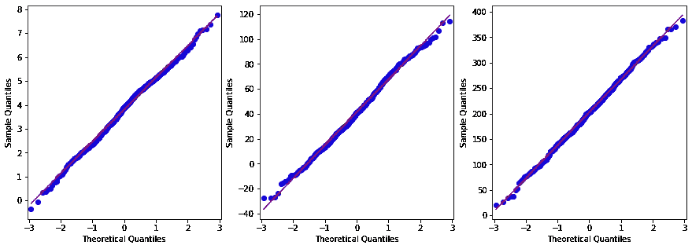

对于我们的变量，我们没有一个完美的正态分布，但是我们足够接近并且能够使用它们。为了探索我们的数据集和变量之间的相关性，我们将构建一个配对图:

```
**#Exploring dataset:** sns.pairplot(df, kind="scatter", hue="dx")
plt.show()
```

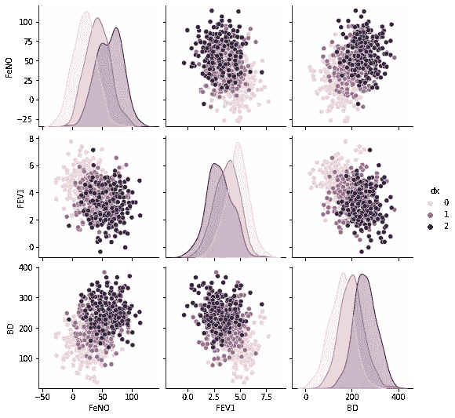

要检查三组的分布，并查看哪些参数最能区分类别，我们可以构建一个箱线图:

```
**# plotting both distibutions on the same figure**fig, axs = plt.subplots(2, 3, figsize=(14, 7))fig = sns.kdeplot(df['FEV1'], hue= df['dx'], shade=True, color="r", ax=axs[0, 0])
fig = sns.kdeplot(df['FeNO'], hue= df['dx'], shade=True, color="r", ax=axs[0, 1])
fig = sns.kdeplot(df['BD'], hue= df['dx'], shade=True, color="r", ax=axs[0, 2])
sns.boxplot(x=df["dx"], y=df["FEV1"], palette = 'magma', ax=axs[1, 0])
sns.boxplot(x=df["dx"], y=df["FeNO"], palette = 'magma',ax=axs[1, 1])
sns.boxplot(x=df["dx"], y=df["BD"], palette = 'magma',ax=axs[1, 2])plt.show()
```


## **正态分布方程**

正态分布有一个数学等式，它定义了一个观察值属于其中一个组的概率。公式是:

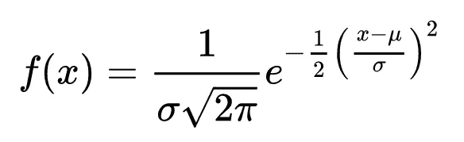

其中 **μ** 为平均值， **σ** 为标准差。

我们可以创建一个函数来计算这个概率:

```
**#Creating a Function:**def normal_dist(x , mean , sd):
      prob_density = (1/sd*np.sqrt(2*np.pi)) * np.exp(-0.5*((x-mean)/sd)**2)
      return prob_density
```

如果我们知道正态分布公式，我们可以手动计算观察值属于三组之一的概率。首先，我们需要计算所有预测参数和组的平均值和标准偏差:

```
**#Group 0:** group_0 = df[df['dx'] == 0]print('Mean FEV1 group 0: ', statistics.mean(group_0['FEV1']))
print('SD FEV1 group 0: ', statistics.stdev(group_0['FEV1']))print('Mean FeNO group 0: ', statistics.mean(group_0['FeNO']))
print('SD FeNO group 0: ', statistics.stdev(group_0['FeNO']))print('Mean BD group 0: ', statistics.mean(group_0['BD']))
print('SD BD group 0: ', statistics.stdev(group_0['BD']))**#Group 1:**
group_1 = df[df['dx'] == 1]print('Mean FEV1 group 1: ', statistics.mean(group_1['FEV1']))
print('SD FEV1 group 1: ', statistics.stdev(group_1['FEV1']))print('Mean FeNO group 1: ', statistics.mean(group_1['FeNO']))
print('SD FeNO group 1: ', statistics.stdev(group_1['FeNO']))print('Mean BD group 1: ', statistics.mean(group_1['BD']))
print('SD BD group 1: ', statistics.stdev(group_1['BD']))**#Group 2:**
group_2 = df[df['dx'] == 2]print('Mean FEV1 group 2: ', statistics.mean(group_2['FEV1']))
print('SD FEV1 group 2: ', statistics.stdev(group_2['FEV1']))print('Mean FeNO group 2: ', statistics.mean(group_2['FeNO']))
print('SD FeNO group 2: ', statistics.stdev(group_2['FeNO']))print('Mean BD group 2: ', statistics.mean(group_2['BD']))
print('SD BD group 2: ', statistics.stdev(group_2['BD']))
```

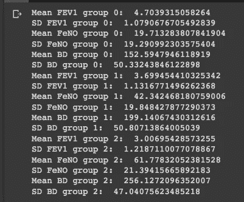

现在，用一个例子观察:
**Fe v1 = 2.75
FeNO = 27
BD = 125**

```
**#Probability for:** #FEV1 = 2.75
#FeNO = 27
#BD = 125**#We have the same number of observations, so the general probability is: 0.33** Prob_geral = round(0.333, 3)**#Prob FEV1:** Prob_FEV1_0 = round(normal_dist(2.75, 4.70, 1.08), 10)
print('Prob FEV1 0: ', Prob_FEV1_0)
Prob_FEV1_1 = round(normal_dist(2.75, 3.70, 1.13), 10)
print('Prob FEV1 1: ', Prob_FEV1_1)
Prob_FEV1_2 = round(normal_dist(2.75, 3.01, 1.22), 10)
print('Prob FEV1 2: ', Prob_FEV1_2)**#Prob FeNO:** Prob_FeNO_0 = round(normal_dist(27, 19.71, 19.29), 10)
print('Prob FeNO 0: ', Prob_FeNO_0)
Prob_FeNO_1 = round(normal_dist(27, 42.34, 19.85), 10)
print('Prob FeNO 1: ', Prob_FeNO_1)
Prob_FeNO_2 = round(normal_dist(27, 61.78, 21.39), 10)
print('Prob FeNO 2: ', Prob_FeNO_2)**#Prob BD:** Prob_BD_0 = round(normal_dist(125, 152.59, 50.33), 10)
print('Prob BD 0: ', Prob_BD_0)
Prob_BD_1 = round(normal_dist(125, 199.14, 50.81), 10)
print('Prob BD 1: ', Prob_BD_1)
Prob_BD_2 = round(normal_dist(125, 256.13, 47.04), 10)
print('Prob BD 2: ', Prob_BD_2)**#Compute probability:** Prob_group_0 = Prob_geral*Prob_FEV1_0*Prob_FeNO_0*Prob_BD_0
print('Prob group 0: ', Prob_group_0)Prob_group_1 = Prob_geral*Prob_FEV1_1*Prob_FeNO_1*Prob_BD_1
print('Prob group 1: ', Prob_group_1)Prob_group_2 = Prob_geral*Prob_FEV1_2*Prob_FeNO_2*Prob_BD_2
print('Prob group 2: ', Prob_group_2)
```

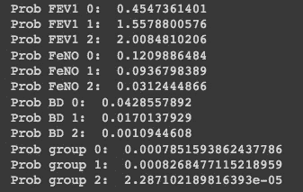

根据给出的结果，我们看到我们的观察值 FEV1 = 2.75，FeNO = 27，BD = 125 有更高的概率属于第 2 组。然而，尽管这些步骤很有教育意义，对学习也很有帮助，但是做这些步骤很费时间，我们有一个更快的方法。我们可以使用 Scikit-Learn 中的高斯朴素贝叶斯，它在实现上类似于其他分类算法。我们创建 ***X*** 和 **y** 变量，并执行训练和测试分割:

```
**#Creating X and y:** X = df.drop('dx', axis=1)
y = df['dx']**#Data split into train and test:** X_train, X_test, y_train, y_test = train_test_split(X, y, test_size=0.30)
```

我们还需要用标准标量函数转换/规范化我们的数据:

```
sc = StandardScaler()
X_train = sc.fit_transform(X_train)
X_test = sc.transform(X_test)
```

现在构建并评估模型:

```
**#Build the model:**
classifier = GaussianNB()
classifier.fit(X_train, y_train)**#Evaluate the model:** print("training set score: %f" % classifier.score(X_train, y_train))
print("test set score: %f" % classifier.score(X_test, y_test))
```

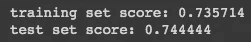

我们可以使用混淆矩阵来可视化我们的结果:

```
**# Predicting the Test set results**
y_pred = classifier.predict(X_test)**#Confusion Matrix:** cm = confusion_matrix(y_test, y_pred)
print(cm)
```

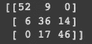

我们可以通过混淆矩阵看到，我们的模型是预测类 0 的最佳模型，但对类 1 和类 2 有较高的错误率。最后，我们可以使用两个变量构建决策边界图:

```
df.to_csv('data.csv', index = False)
data = pd.read_csv('data.csv')def gaussian_nb_a(data):
    x = data[['BD','FeNO',]].values
    y = data['dx'].astype(int).values
    Gauss_nb = GaussianNB()
    Gauss_nb.fit(x,y)
    print(Gauss_nb.score(x,y))
    #Plot decision region:
    plot_decision_regions(x,y, clf=Gauss_nb, legend=1)
    #Adding axes annotations:
    plt.xlabel('X_train')
    plt.ylabel('y_train')
    plt.title('Gaussian Naive Bayes')
    plt.show()def gaussian_nb_b(data):
    x = data[['BD','FEV1',]].values
    y = data['dx'].astype(int).values 
    Gauss_nb = GaussianNB()
    Gauss_nb.fit(x,y)
    print(Gauss_nb.score(x,y))
    #Plot decision region:
    plot_decision_regions(x,y, clf=Gauss_nb, legend=1)
    #Adding axes annotations:
    plt.xlabel('X_train')
    plt.ylabel('y_train')
    plt.title('Gaussian Naive Bayes') 
    plt.show()def gaussian_nb_c(data):
    x = data[['FEV1','FeNO',]].values
    y = data['dx'].astype(int).values
    Gauss_nb = GaussianNB()
    Gauss_nb.fit(x,y)
    print(Gauss_nb.score(x,y))
    #Plot decision region:
    plot_decision_regions(x,y, clf=Gauss_nb, legend=1)
    #Adding axes annotations:  
    plt.xlabel('X_train')
    plt.ylabel('y_train')  
    plt.title('Gaussian Naive Bayes')
    plt.show()gaussian_nb_a(data)
gaussian_nb_b(data)
gaussian_nb_c(data)
```

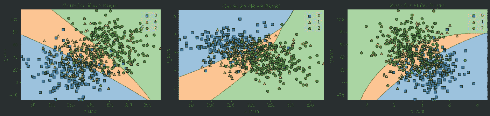

感谢您的阅读！如果你有建议要添加到这个列表中，请告诉我，不要忘记订阅以接收关于我未来出版物的通知。

如果:你喜欢这篇文章，别忘了关注我，这样你就能收到所有关于新出版物的更新。

否则如果:你想了解更多，你可以通过[我的推荐链接](https://cdanielaam.medium.com/membership)订阅媒体会员。它不会花你更多的钱，但会支付我一杯咖啡。

Else:谢谢！