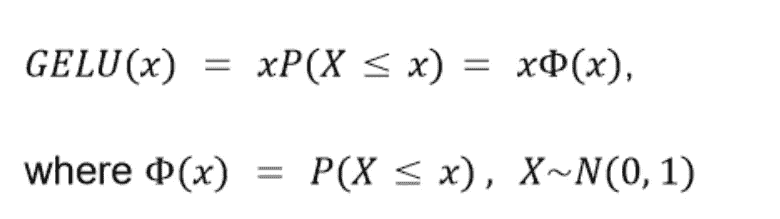
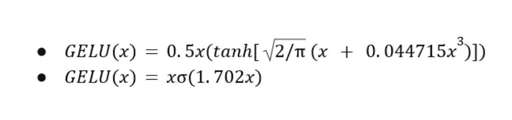

# GELU:高斯误差线性单位码(Python，TF，Torch)

> 原文：<https://pub.towardsai.net/gelu-gaussian-error-linear-unit-code-python-tf-torch-neural-network-bert-de539517edef?source=collection_archive---------4----------------------->

## 代码教程为 GELU，高斯误差线性单位激活函数。包括裸 python，Tensorflow 和 Pytorch 代码。


照片由[马库斯·温克勒](https://unsplash.com/@markuswinkler?utm_source=medium&utm_medium=referral)在 [Unsplash](https://unsplash.com?utm_source=medium&utm_medium=referral) 上拍摄

# GELU 激活功能

高斯误差线性单元，GELU，是最先进的模型中使用最多的激活函数，包括 BERT、GPT、视觉变压器等..

如果你想了解 GELU 背后的直觉和数学，我建议你看看我以前写的关于 GELU 论文的文章 [(GELU，ReLU 的继承者？](/is-gelu-the-relu-successor-deep-learning-activations-7506cf96724f)高斯误差线性单位解释)。GELU 背后的动机是将随机正则化子(如漏失)与非线性(即激活函数)联系起来。像伯特和 GPT 这样巨大的变形金刚模型使得 GELU 激活功能非常受欢迎。

[](/is-gelu-the-relu-successor-deep-learning-activations-7506cf96724f) [## 葛鲁，是热鲁接班人吗？

### 高斯误差线性单元 GELU 在激活函数中结合了一个正则化子。有希望替代……

pub.towardsai.net](/is-gelu-the-relu-successor-deep-learning-activations-7506cf96724f) 

# **葛鲁数学公式**

高斯误差线性单元激活函数的输出值是不确定的，而是随机地依赖于输入值。



高斯误差线性单位公式

GELU 激活可以用下面的两个公式来近似。第一种近似更精确，而第二种不太精确但更快。我们使用第一个公式来编写一个 Python 实现。



高斯误差线性单位激活函数逼近

# Python 中的 GELU

为了得到精确的公式，我们需要计算高斯误差函数(erf)。这是最耗时但也是最精确的实现。为了更快地实现，我们使用基于 tanh()的近似值，因为它更精确。下面的 Python 代码涵盖了这两个方面。

GELU 激活函数的 Python 代码。精确的和近似的实现都包括在内。

# Tensorflow -Keras 的 GELU

Tensorflow 在其 tf.keras.activations 模块中提供激活功能，您可以将其导入为

`from tensorflow.keras.activations import gelu`

该函数有一个布尔型`approximate` 参数。如果选择`True`，那么你将得到上面的近似 python 实现。否则，您会得到精确但较慢的实现，它实际上是按元素计算`x`的[高斯误差函数](https://en.wikipedia.org/wiki/Error_function) (erf)。

下面是一个用 GELU 激活函数构建 Keras 神经网络的例子。请注意，您可以通过使用别名“gelu”或直接传递导入的`gelu` 模块，将 gelu 作为层的激活。拟合过程类似于所有其他的 Keras 网络。

```
input_shape = (28, 28, 1)
num_classes = 10
gelu_act = gelu(approximate = False)
model = keras.Sequential(
    [
        keras.Input(shape=input_shape),
        layers.Conv2D(32, kernel_size=(3, 3), activation="gelu"),
        layers.MaxPooling2D(pool_size=(2, 2)),
        layers.Conv2D(64, kernel_size=(3, 3), activation=gelu),
        layers.MaxPooling2D(pool_size=(2, 2)),
        layers.Flatten(),
        layers.Dropout(0.5),
        layers.Dense(num_classes, activation="softmax"),
    ]
)model.summary()# Compile the GELU network
model.compile(loss="categorical_crossentropy", optimizer="adam", metrics=["accuracy"])#Fit the GELU network 
model.fit(x_train, y_train, batch_size=batch_size, epochs=epochs, validation_split=0.1)
```

# 火炬中的格鲁

与 Tensorflow 类似，PyTorch 为 GELU 提供了近似形式和精确形式。如果您想要更快的实现，或者保留默认值`None` 用于计算高斯误差函数的精确形式，您可以通过导入 torch 模块并将`approximate`参数设置为`True`来访问该函数。在`**forward**` 方法中，您可以使用 gelu 函数并将`approximate` 参数设置为真或假。

```
import torch.nn as nn 
import torch.nn.functional as F
import torch.optim as optim
import torchvisionclass Net(nn.Module):
    def __init__(self):
        super(Net, self).__init__()
        self.conv1 = nn.Conv2d(1, 10, kernel_size=5)
        self.conv2 = nn.Conv2d(10, 20, kernel_size=5)
        self.conv2_drop = nn.Dropout2d()
        self.fc1 = nn.Linear(320, 50)
        self.fc2 = nn.Linear(50, 10)def forward(self, x):
        out = self.conv1(x)
        out = F.max_pool2d(out, 2)
        out = F.gelu(out)        # Using exact GELU formula with erf 
        out = self.conv2(x)
        out = F.max_pool2d(out, 2)
        out = self.conv2_drop(out)
        out = F.gelu(out, approximate=True) # Using approximation
        out = F.dropout(out)
        out = self.fc2(x)
        return out
```

# 结论

在过去的几年中，GELU 激活功能的使用出现了巨大的增长。像伯特、GPT 和其他视觉变形金刚(vit)这样的巨大变形金刚模型的出现，承载了更强的正则化的必要性。GELU 提供了隐藏在激活函数中的正则化，这就是为什么它被广泛用于像伯特和 GPT 这样的模型中。

编写 GELU 非常容易，主流框架在它们的激活功能模块中默认支持它。

# 参考

[1] [高斯误差线性单位(GELUs)](https://arxiv.org/abs/1606.08415)

[2] [葛鲁，热鲁的继承者？高斯误差线性单位解释](/is-gelu-the-relu-successor-deep-learning-activations-7506cf96724f)

[3] [BERT:用于语言理解的深度双向转换器的预训练](https://arxiv.org/abs/1810.04805)

[4][TF . keras . activations . gelu](https://www.tensorflow.org/api_docs/python/tf/keras/activations/gelu)

[5][torch . nn . functional . gelu](https://pytorch.org/docs/stable/generated/torch.nn.functional.gelu.html)

*如果你学到了有用的东西，请关注我，获取更多深度学习内容和技术教程。使劲鼓掌也让我感觉很棒:)*

如果你愿意支持我，你可以使用我的链接成为 Medium 的一员。我会得到一半的奖励，不需要你额外付费:)

[https://medium.com/@poulinakis.kon/membershipT21](https://medium.com/@poulinakis.kon/membership)

*感谢阅读，随意伸手！*

**我的链接:** [中](https://medium.com/@poulinakis.kon)|[*LinkedIn*](https://www.linkedin.com/in/konstantinos-poulinakis-4554821a3/)*|[GitHub](https://github.com/Poulinakis-Konstantinos)*