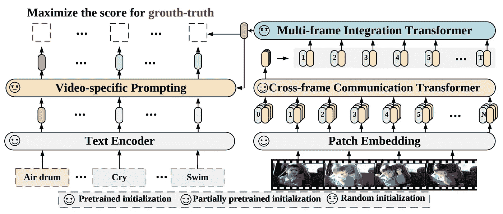
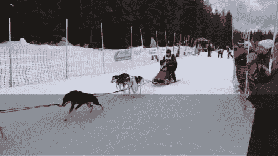

# 人工智能的一般视频理解

> 原文：<https://pub.towardsai.net/general-video-understanding-with-ai-e88956333848?source=collection_archive---------2----------------------->

## 当这样的模型看到这样的图片或者更复杂的视频时，它能理解什么？

> 最初发表于 [louisbouchard.ai](https://www.louisbouchard.ai/general-video-recognition/) ，前两天在[我的博客上读到的！](https://www.louisbouchard.ai/general-video-recognition/)

## 观看视频

我们已经看到人工智能生成文本，然后[生成图像](https://youtu.be/qOxde_JV0vI)，最近甚至生成短视频，尽管它们仍然需要工作。当你想到没有人真正参与这些作品的创作过程，并且它只需要被训练一次，然后就像 stable diffusion 一样被成千上万的人使用，结果是令人难以置信的。尽管如此，这些模型真的明白他们在做什么吗？他们知道他们刚刚制作的图片或视频真正代表了什么吗？当这样的模型看到这样的图片或者更复杂的视频时，它能理解什么？

论文中的结果实例。

让我们专注于两者中更具挑战性的一个，并深入研究人工智能如何通过一项名为一般视频识别的任务来理解视频，其中的目标是让模型将视频作为输入，并使用文本来描述短视频中发生的事情。

普通视频识别是理解视频中最具挑战性的任务之一。然而，这可能是衡量一个模型了解正在发生的事情的能力的最佳方式。这也是许多应用程序背后的基础，这些应用程序依赖于对视频的良好理解，如体育分析或自动驾驶。但是是什么使得这项任务如此复杂呢？嗯，有两件事:

1.  我们需要理解显示的内容，即特定视频的每一帧或每一幅图像。
2.  我们需要能够以人类理解的方式说出我们理解的东西，这意味着单词。

幸运的是，第二个挑战已经被语言社区解决了无数次，我们可以接管他们的工作。更准确地说，我们可以借鉴语言-图像领域的人们对剪辑甚至稳定扩散等模型所做的工作，在这些模型中，你有一个文本编码器和图像编码器，它们学习将两种类型的输入编码成同一种表示。这样，通过用数百万个图像标题示例训练该架构，您可以将相似的场景与相似的文本提示进行比较。将文本和图像编码在一个相似的空间是非常强大的，因为它需要更少的空间来执行计算，并且它允许我们很容易地将文本与图像进行比较。意思是模型仍然不能理解一幅图像或者甚至一个简单的句子，但是它可以理解两者是否相似。我们离智能还很远，但这对大多数情况来说是非常有用和足够好的。

现在带来了最大的挑战:视频。为此，我们将使用 Bolin Ni 及其同事在他们最近的论文“扩展通用视频识别的语言图像预训练模型”中的方法。

模型概述。图片来自报纸。

由于时间信息，视频比图像复杂得多，这意味着多个帧，并且每个帧都通过连贯的运动和动作与下一个和前一个帧相链接。模型需要看到每一帧之前、之中和之后发生了什么，以便对场景有一个正确的理解。

就像在 YouTube 上一样。在短视频中，你不能真的向前跳过 5 秒，因为你会错过有价值的信息。

在这种情况下，他们将每一帧发送到我们刚刚讨论过的同一个图像编码器，使用基于视觉转换器的架构，利用注意力将它们处理到一个压缩空间中。

如果你不熟悉视觉变形金刚，或者注意力机制，我将邀请你[观看我制作的介绍它们的视频](https://youtu.be/QcCJJOLCeJQ)。

一旦您有了每一帧的表示，您可以使用类似的基于注意力的过程让每一帧一起通信，并允许您的模型在帧之间交换信息，并为视频创建最终表示。这种使用注意力的帧之间的信息交换将作为模型的某种记忆，以便将视频作为一个整体来理解，而不是将几个随机图像放在一起。

最后，我们使用另一个注意力模块将我们拥有的帧的文本编码与我们的压缩视频表示合并。

论文中的结果实例。

瞧！

这是人工智能理解视频的一种方式。当然，这只是微软研究院作为视频识别介绍的这篇伟大论文的概述，我邀请您阅读这篇论文以更好地理解他们的方法。

感谢您通读整篇文章，下周我将带着另一篇精彩的论文与您见面！

路易斯（号外乐团成员）

## 参考

阅读全文:【https://www.louisbouchard.ai/general-video-recognition/】
倪，b，彭，h，陈，m，张，s，孟，g，傅，j，向，s，凌，h，2022。通用视频识别的扩展语言图像预处理模型。arXiv 预印本 arXiv:2208.02816。代码:[https://github.com/microsoft/VideoX/tree/master/X-CLIP](https://github.com/microsoft/VideoX/tree/master/X-CLIP)
【我的时事通讯(一个新的人工智能应用每周向你的电子邮件解释！):[https://www.louisbouchard.ai/newsletter/](https://www.louisbouchard.ai/newsletter/)