# 带 R 的广义可加模型

> 原文：<https://pub.towardsai.net/generalized-additive-models-with-r-5f01c8e52089?source=collection_archive---------1----------------------->

## 统计学，R

## 通过非线性模型平衡可解释性和预测能力

丹·弗里曼在 [Unsplash](https://unsplash.com/) 上拍摄的照片

**广义加法模型**是线性模型的扩展，允许以灵活的方式对非线性关系建模。此外，gam 是线性回归等简单模型和梯度推进等更复杂模型之间的中间道路。

线性模型易于解释，用于推断，并允许理解预测值和响应之间的线性关系，但可能存在较高的偏差。另一方面，像梯度推进和随机森林这样的机器学习模型可以非常好地预测复杂的关系，但它们往往需要大量的数据，并且很难解释[1]。

然后，广义加性模型通过拟合复杂的非线性关系并做出良好的预测来解决这个问题。同时，它允许进行推断统计，理解和解释我们模型的底层结构。在本文中，我将简单地解释这些模型，并将它们应用于一个著名的数据集，来自 Kaggle 的华盛顿特区自行车共享。

# 比较 MLR 和 GAM

**多重线性模型**是一种基于预测变量 x 预测定量响应 Y 的方法。它假设每个预测变量和响应之间存在线性关系。如果我们有 3 个预测变量和一个响应变量，它可以写成:

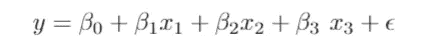

其中，Xᵢ是第 I 个预测变量，βᵢ是模型系数或参数，ε是误差项。特别是，系数量化了变量和响应之间的关系[2]。

**广义加法**模型类似于多元线性回归模型。唯一的区别是，它为每个预测变量拟合了一个非线性函数，允许对非线性关系建模:

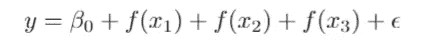

其中，f(xᵢ是预测变量 xᵢ.的非线性函数非线性函数的例子有样条、多项式和阶跃函数。一般来说，最常用的非线性函数是**平滑样条**。GAM 也可以有两个解释变量之间的相互作用。例如:

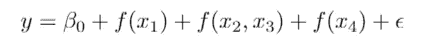

在案例研究中，我将限制没有交互的简单案例。这可能意味着一个限制，但它仍然允许灵活性。

# 平滑样条

广义加性模型算法的构造块是平滑样条。目标是拟合一条平滑曲线 f(x ),该曲线概括了 y 对 x 的依赖性。我们寻求使以下各项最小化的函数 f(x ):

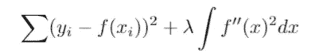

其中λ是曲线 f(x)的粗糙度的正惩罚参数。该参数的范围在 0 和 1 之间。平滑参数值越大，f 越平滑。平衡过拟合和欠拟合是有用的[2]。

# 基本函数

gam 中的灵活平滑实际上是由许多更小的函数构成的，称为基函数。每个光顺都是若干基函数的和，每个基函数都乘以一个系数，每个系数都是模型中的一个参数。

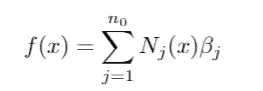

其中 Nⱼ(x 是自然三次样条的基函数，βⱼ是模型系数。不仅平滑参数λ影响曲线 f(x ),而且 Nⱼ(x 也有贡献。基函数的数量越多，函数 f(x)就越能更好地解释数据的复杂模式。如果基函数的数目太少，GAM 函数就受到限制。

# 步骤 1:导入库和数据集

我们现在将使用自行车共享数据集，该数据集在[这里](https://www.kaggle.com/lakshmi25npathi/bike-sharing-dataset)可用。所考虑的数据集包含华盛顿特区 2011 年至 2012 年间每小时租赁自行车的数量。有 17379 个实例和 17 个变量。我们将构建预测租赁自行车数量的模型，由 cnt 表示。

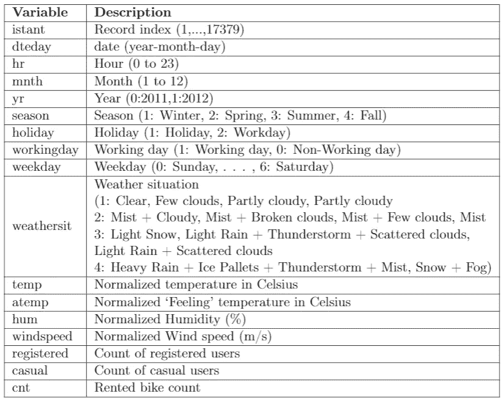

数据变量和描述

下面我们导入库。特别是，包含所有在 R 中建模 GAM 的函数的包被称为 **gam** 。

现在让我们从 Kaggle 读取 CSV 文件，指定正确的路径:

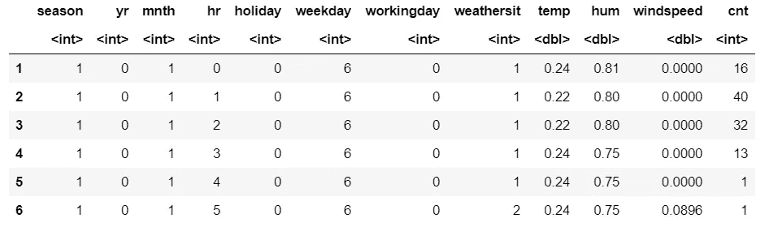

变量 instant、dtday、atemp、registered、casual 被删除，因为它们是不必要的。temp 和 atemp 都测量温度，因此我们删除 atemp 以避免冗余信息。为了观察结果数据集的摘要，让我们通过函数 str 来显示它:

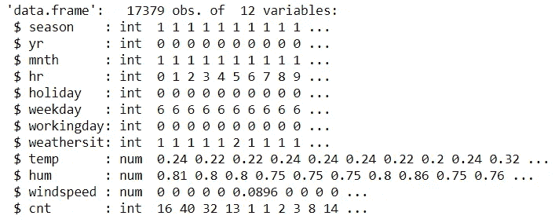

有些变量表示为“int ”,我们需要将它们转换成因子:

# 步骤 2:将数据集分成训练集和测试集

在训练任何模型之前，我们将数据集分成两部分:80%用于训练，剩下的 20%用于测试。大型训练集确保了良好的建模能力，而测试集使我们能够评估模型性能。

# 步骤 3:解释性分析

我们希望了解定量变量和响应变量之间的关系。因此，让我们展示每个预测值和响应的散点图。很容易看出变量之间的关系不是线性的。

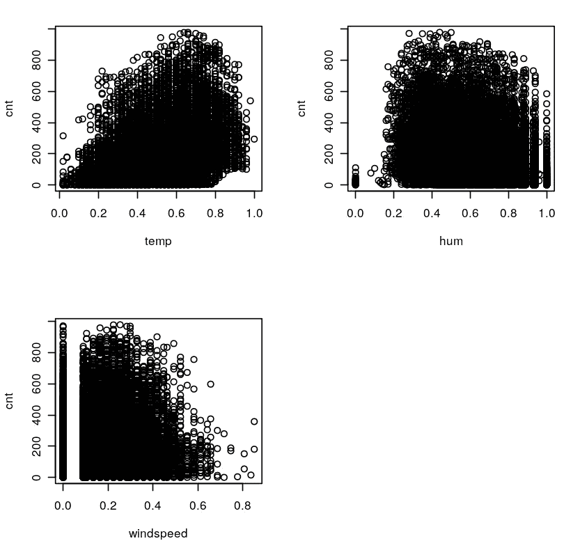

# 第四步:线性模型

在应用广义可加模型之前，我们先拟合多元线性回归模型。最后做比较会很有用。变量 workingday 被删除，因为它考虑了节假日，所以变量 workingday 和 holiday 是相关的。

我们的模型看起来不错，即使拟合度的优度是 68.85%。大多数变量都很重要，因此它们有助于解释我们的模型。显然，与三月、五月、九月和十月相关的月份变量非常显著，而其他变量不显著。但拦截有一月的作用，意义重大。为此，我们不删除变量 mnth。

现在，让我们绘制残差与拟合值的关系图。该图显示了残差中的强模式，并且各项的方差是非常数，表明存在非线性。当然，我们没有捕捉到数据中的所有信息。

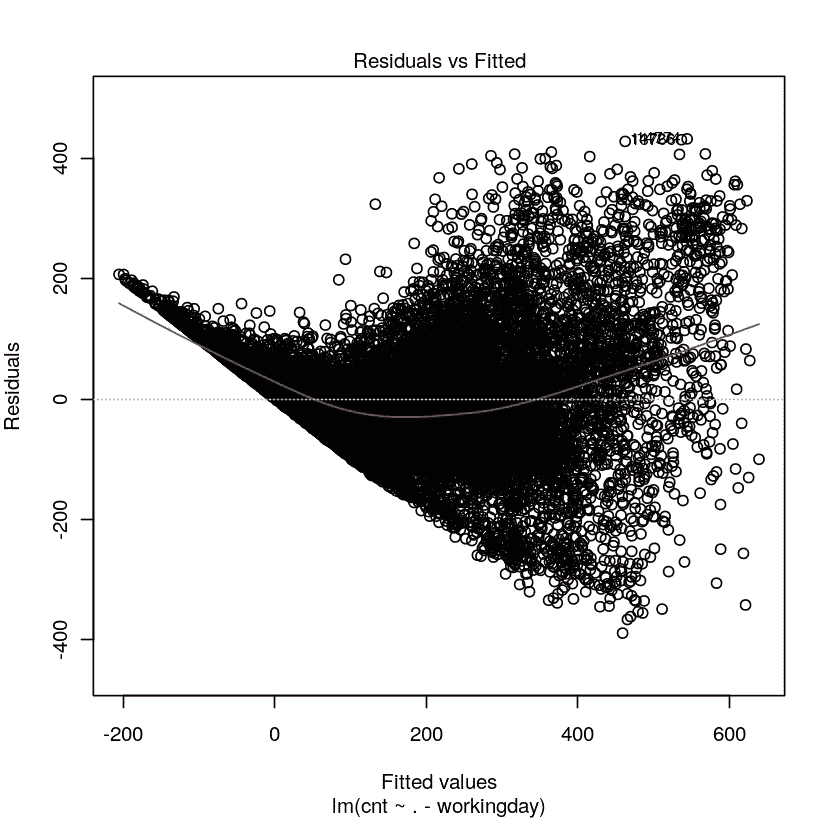

在训练模型之后，我们可以对测试集进行预测，并使用函数 **postResample** 对模型进行评估。它将两个数值向量的数据作为输入，即预测值和目标值，并返回均方误差和 R 平方。

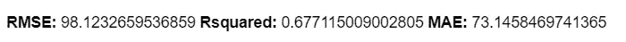

# 第五步:广义加性模型

最后，我们可以使用 gam 包中的 gam()函数来拟合 GAM。当我们拟合模型时，我们将量化变量包装在 s()中，这是一个平滑函数，用来指定我们希望这种关系是灵活的。其他分类变量作为线性项包含在内。例如，季节有四个类别(1:冬天，2:春天，3:夏天，4:秋天)。当我们在这个分类变量中包含一个线性项时，gam 函数适合一个模型，该模型对类别的每个级别都有固定的影响。

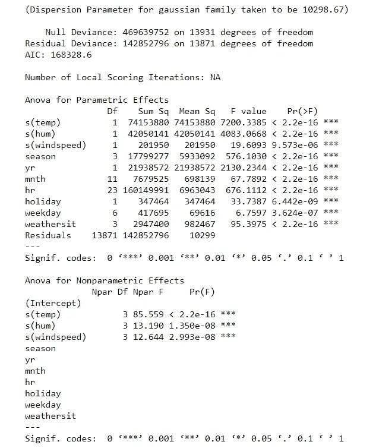

GAM 模型的总结分为两部分:参数效应的**Anova**和非参数效应的**Anova**。用样条建模的变量 temp、hum 和 windspeed 在这两个部分中都很重要。其他分类变量仅对第一部分有显著影响，因为我们没有对它们应用平滑样条。从意义上说，这是令人满意的。

在 gam 模型对象上调用函数 **coef()** ，我们可以显示模型的每个基函数的系数。

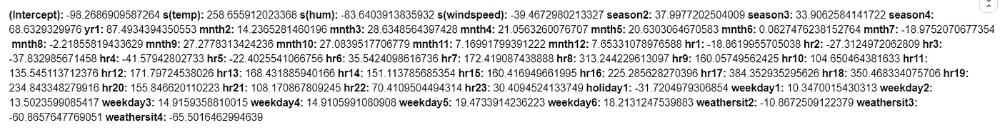

有可能看到一个包含 10 个变量的模型有更多的系数。现在我们可以使用 plot()函数来可视化模型。我们指定 se=T 以包括两倍的估计标准误差(虚线)。x 轴是解释变量，而 y 轴包含响应值。实线是因变量的预测值，作为 x 轴的函数。下面我报道了前四个情节。

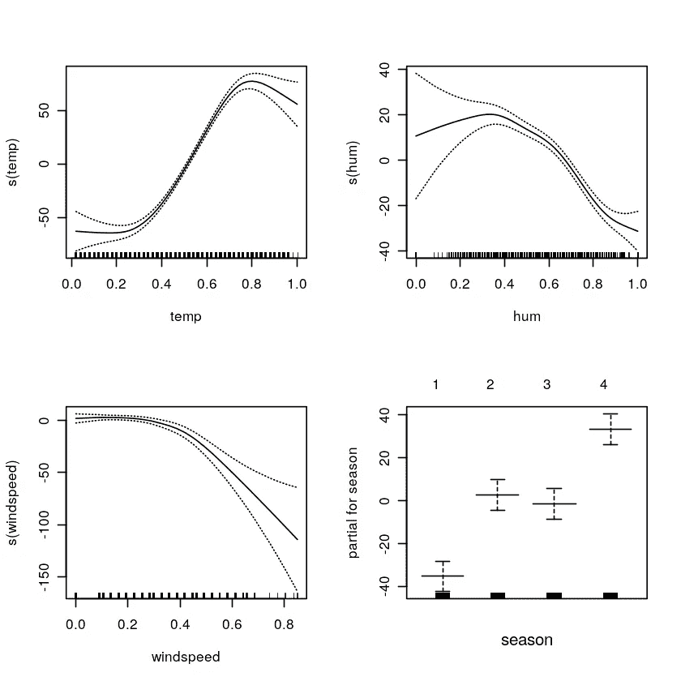

我们可以看到，最终的模型捕捉到了每一对变量之间的非线性关系。在第一幅图中，温度对租赁自行车数量的非线性影响越来越大，而湿度和风速对响应变量的影响越来越小。事实上，温度、嗡嗡声和风速都是模型中的非线性项。模型中作为线性项包含的其他分类变量用箱线图表示。在季节的情况下，有一个递增的效应。秋季租用自行车的数量增加了。

在此分析之后，我们可以对测试集进行预测，并获得:

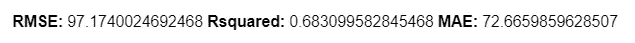

误差测度略有下降，而 R 增加，证明 GAM 模型以更好的方式解释了数据的行为。比较这两个模型的另一个衡量标准是 **Akaike 信息标准**或 AIC，这是一种判断模型质量并量化训练模型的信息量的统计数据:丢失的信息越少，模型的质量越高。

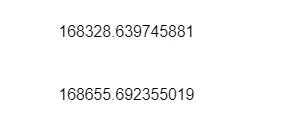

广义加性模型的 AIC 值较低。因此，我们确认我们对最后拟合的模型更满意。

# 最终想法:

感谢阅读。我希望这篇教程能帮助你理解这个模型。代码在 [Github](https://github.com/eugeniaring/Medium-Articles/blob/main/Statistics/gam-bike-sharing.ipynb) 上。如果您想了解更多信息，请尝试使用其他数据集。这是真正能够全面了解 GAM 的唯一方法。建议你用 R 搭配 [Google collab](https://colab.to/r) 或者 Kaggle 笔记本。它们主要用于 Python 编码，但也允许运行 R。我发现它们更容易以有序的方式将情节和评论可视化。

**参考文献:**

[1][https://camp . data camp . com/courses/nonlinear-modeling-in-r-with-gams/introduction-to-generalized-additive-models？ex=1](https://campus.datacamp.com/courses/nonlinear-modeling-in-r-with-gams/introduction-to-generalized-additive-models?ex=1)

[2][https://doc . lagout . org/Others/Data % 20 mining/Data % 20 analysis % 20 and % 20 Data % 20 mining _ % 20 an % 20 简介% 20% 5 bazzalini % 20% 26% 20 Scarpa % 202012-04-23% 5d . pdf](https://doc.lagout.org/Others/Data%20Mining/Data%20Analysis%20and%20Data%20Mining_%20An%20Introduction%20%5BAzzalini%20%26%20Scarpa%202012-04-23%5D.pdf)

[3][https://citeseerx.ist.psu.edu/viewdoc/download?doi = 10 . 1 . 1 . 46 . 8665&rep = re P1&type = pdf](https://citeseerx.ist.psu.edu/viewdoc/download?doi=10.1.1.46.8665&rep=rep1&type=pdf)

你喜欢我的文章吗？ [***成为会员***](https://eugenia-anello.medium.com/membership) ***每天无限获取数据科学新帖！这是一种间接的支持我的方式，不会给你带来任何额外的费用。如果您已经是会员，*** [***订阅***](https://eugenia-anello.medium.com/subscribe) ***每当我发布新的数据科学和 python 指南时，您都可以收到电子邮件！***