# SAS 中的广义线性混合模型

> 原文：<https://pub.towardsai.net/generalized-linear-mixed-models-in-sas-distributions-link-functions-scales-overdisperion-and-4b1c767bb89a?source=collection_archive---------0----------------------->

## [统计数据](https://towardsai.net/p/category/statistics)

## 残差的分布、连接函数、标度、过度离差和正态性。

ll 统计模型有系统和随机两部分。在方差分析和 GLM 模型中，系统部分是固定效应，随机部分是误差/无法解释的方差。在混合模型中，我们至少有两个随机零件:

1.  旨在描述和使用方差的变量(例如，块)
2.  错误/无法解释的差异

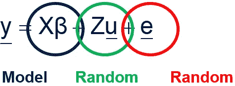

我们对世界的理解依赖于我们收集和观察的数据。[这就是为什么我们的实验设计如此重要](https://medium.com/@marc.jacobs012/general-introduction-to-design-of-experiments-in-animal-science-using-sas-for-codes-fe1c5272b37a)。基于这些观察，我们建立了一个包括固定和随机部分的统计模型。我们建立一个模型来描述/解释这个世界。我们将概率论应用于该模型以做出推论:

1.  模型没有准确描述世界的可能性有多大？
2.  我们所观察到的是偶然的可能性有多大？(当然，这永远不会发生，因为机会本身并不发挥作用)

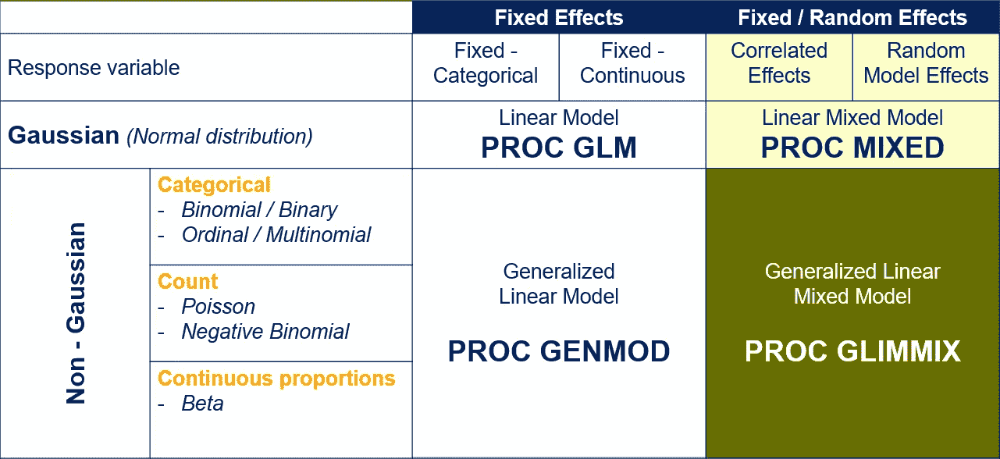

矩阵表明反应变量的类型和包括的影响类型决定了最佳使用的程序。在 SAS 中， **PROC GLIMMIX** 可以解决所有问题，尽管它仍处于开发阶段。

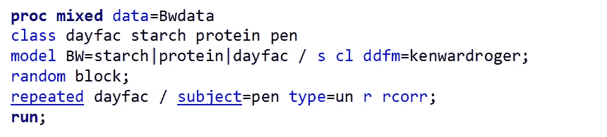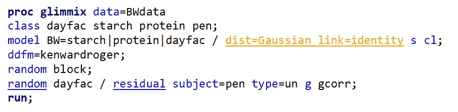

通过 **PROC MIXED** 或 **PROC GLIMMIX 进行同类分析的比较。**

[线性混合模型(LMMs)](https://medium.com/@marc.jacobs012/introduction-to-mixed-models-in-r-9c017fd83a63) 只能分析正态分布的数据。在广义线性混合模型(GLMMs)中，响应函数(y)可以来自不同的分布。在 LMMs 中，我们直接分析响应，而在 GLMMs 中，我们需要应用链接函数来转换模型中的数据

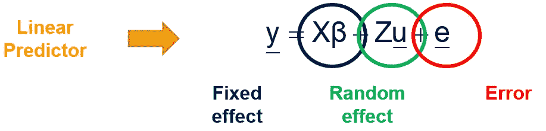

线性预测值是模型公式的聚合形式。

在 SAS 中有很多选项可以这样做。

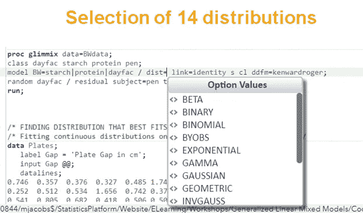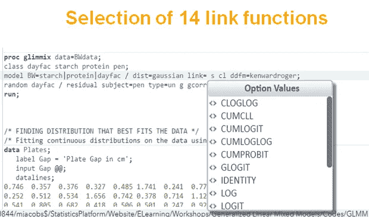

不是每个链接功能都可以应用到每个发行版！

下面是一个需要进行对数转换(原始数据或模型内部数据)才能进行分析的数据示例。

正常标度或对数标度的数据比较。在 **PROC GLIMMIX** 中，这样的转换可以在模型内部完成，而不是必须使用 **PROC MIXED** 来转换原始数据。

对于来自对数正态分布的数据，对原始数据使用正态分布是完全错误的。

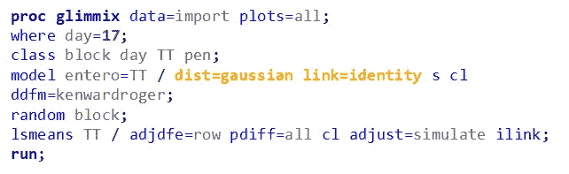

你进入，SAS 提供。SAS 不在乎你包括什么。

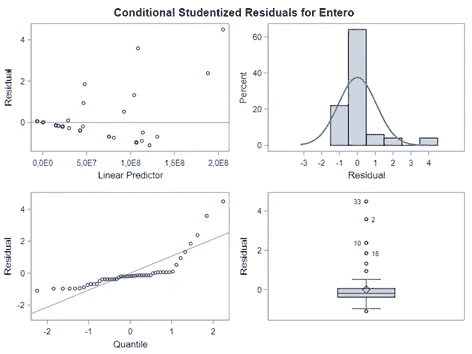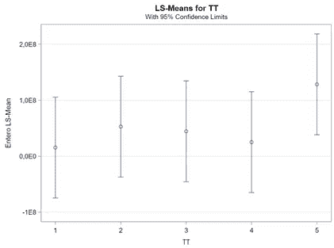

这看起来不太好。记住，你没有做任何内部变换，所以残差应该是正常的，应该是齐次的。他们都不是。因此，如右图所示，LSMEANS per treatment 是不可行的，也不是很有用。

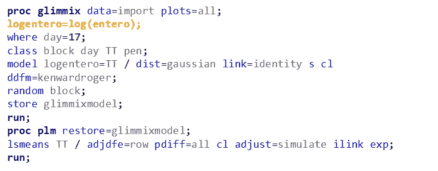

对转换后的数据使用正态分布更好。

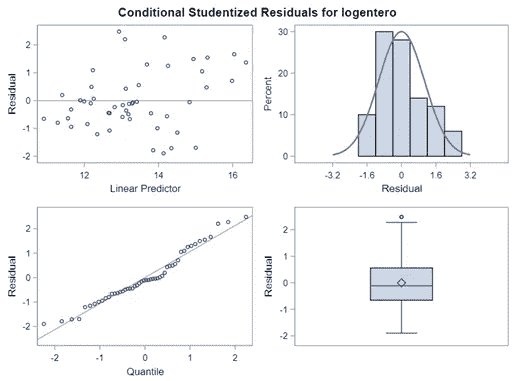

这可以从剩余输出中看出。

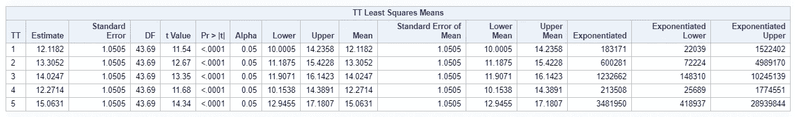

由于数据被转换，估计值和平均值列现在是相同的。通常它们是不同的，因为它们类似于估算的链接版本和反向链接。或者换句话说，观察数据的模型比例和数据比例。

现在，让我们使用一个不同的分布。因为我们使用对数转换来转换数据，所以我们可以在模型的中选择对数正态分布**。这有一个额外的好处，即逆变换是自动完成的。**

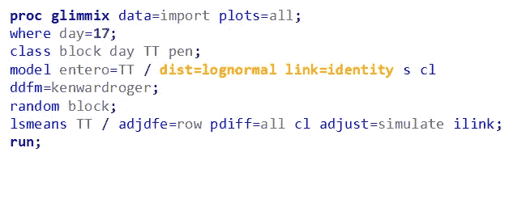

转换是在模型内部使用分布和链接函数完成的。在这里，我指定了 **link=identity** ，这意味着没有应用任何转换，只有一个不同的分布。

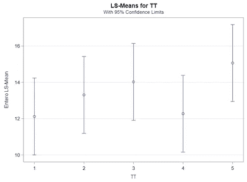

残差好看！

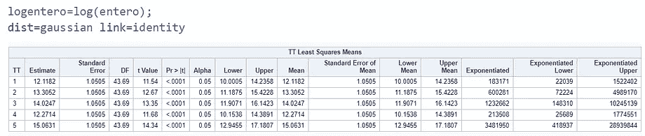

你可以看到转换后的方式和 **PROC GLIMMIX** 方式没有区别。这是因为我使用了身份链接。

T 在 **PROC MIXED** 中，数据和模型比例是相同的，因为我们只使用正态分布。 **PROC MIXED** 中没有链接函数。在 **PROC GLIMMIX** 中，通过使用链接功能确定模型比例。模型比例将导致不可观测的估计和响应变量的非线性函数。它们用于推理。然后，可以通过使用 **PROC GLIMMIX** 中的 *ilink* 功能恢复到数据标度。估计值被转换成可观察值。这只对均值有效，对差异无效，因为 *link* 函数是一个非线性函数，不存在封闭的公式反向转换。

链接函数通常是非线性的，因此非线性函数中不会保留差异。因此，对差异应用反向链接通常会产生无意义的结果。要估计数据尺度上的差异，你必须更聪明*(对于 logit 尺度，你有优势比)。*分布和链接可以在你估计的时候改变，线性预测值永远不会改变。由于我们使用了身份链接( *link=identity* )，因此在模型规模和数据规模上的结果是相同的。身份链接不在模型中执行转换

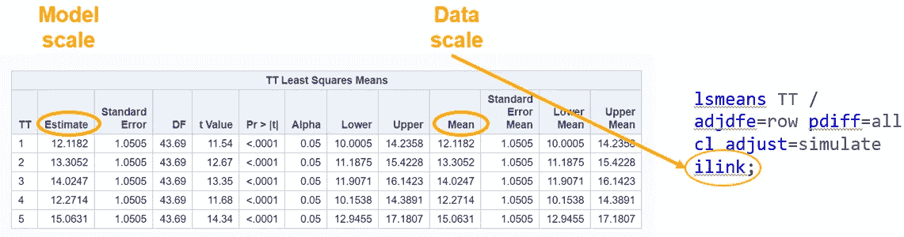

在这里，您可以看到，由于使用了 **link=identity** 函数，模型和数据规模保持不变。

让我们用一个新的例子，在这个例子中，我们采用来自二项分布的观察值。

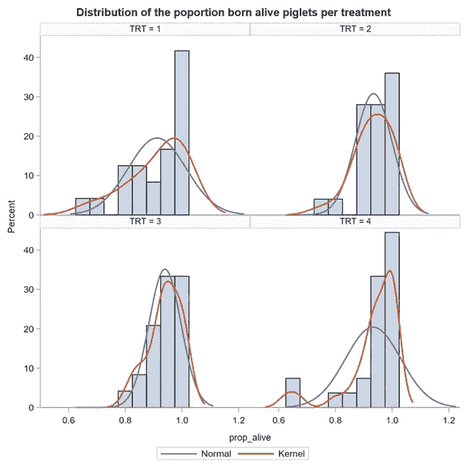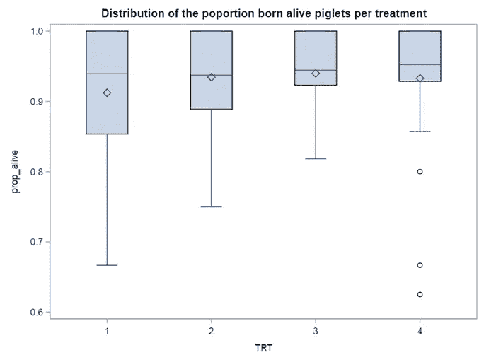

二项式数据

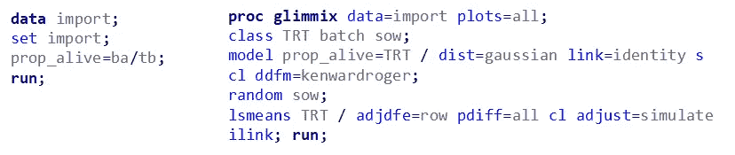

将二项式数据视为常态是错误的

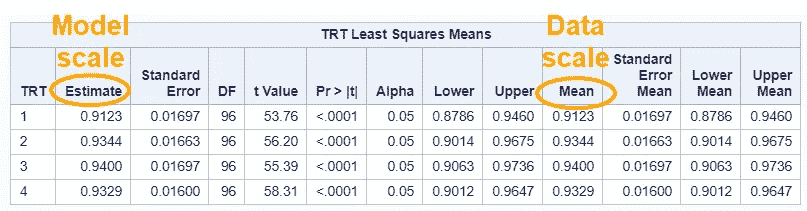

模型比例和数据比例是相同的——因为我使用了 **link=identity** 。

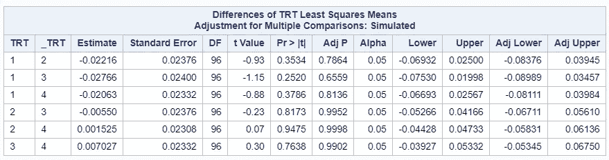

以及不同之处。

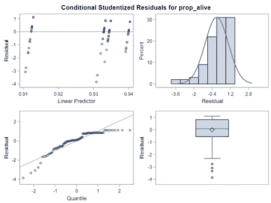

和残差。

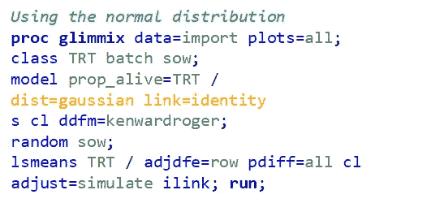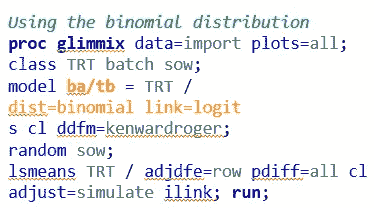

使用正确的分布。

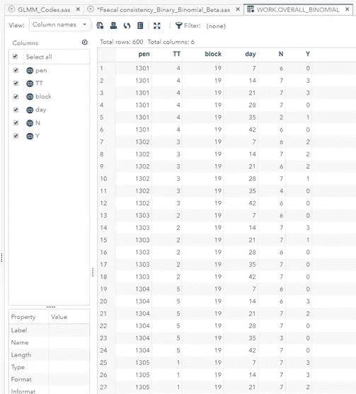

通过创建正确的数据集

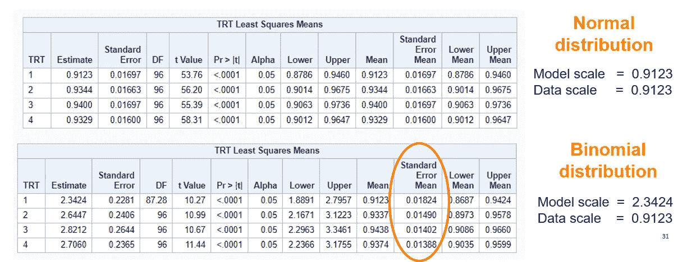

使用正态分布，**均值**几乎相同，但**标准差**不同

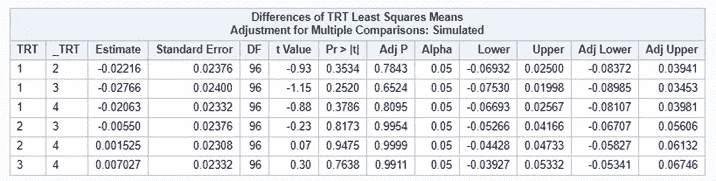

现在，为了比较治疗估计值，我们需要回到比值比，因为差异的关联函数是非线性的。

因此，使用 *dist=binomial* 和 *link=logit* 而不是 *dist=Gaussian* 和 *link=identity* 导致:

1.  较小的 p 值。
2.  不能直接获得两个处理比例之间的差异。
3.  不得不求助于**优势比**来解释治疗差异。

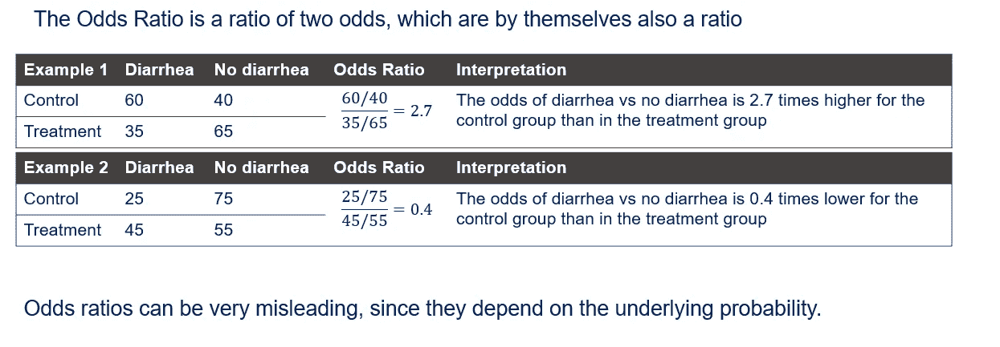

比值比是一个很好的指标，其中的值可以达到两位数，但意义仍然很小。

因此，线性混合模型只能分析正态分布的数据。广义线性混合模型可以分析所有分布。为此，它需要使用链接功能(**模型比例**)转换模型中的数据。为了获得原始比例(**数据比例**)的模型结果，我们使用反向链接。对非正态分布的数据使用 GLMM 将为您提供正确的结果！对于二项式数据，优势比现在必须用来解释治疗差异

ets 谈论更多的是概率和分布。在统计学中，概率分布是一个数学函数，它提供实验中不同可能结果的发生概率。

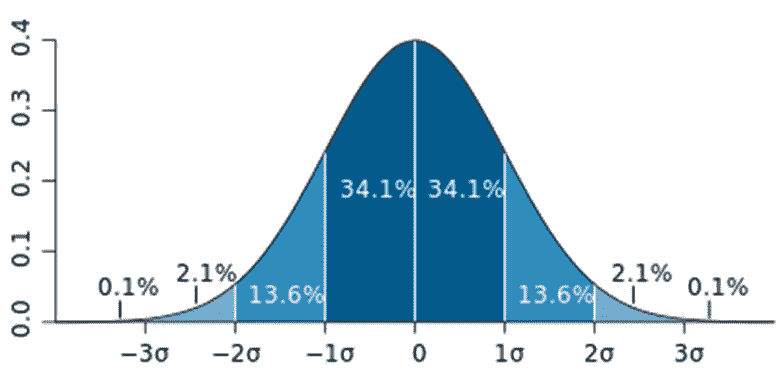

世界著名的正态(高斯)分布。令人惊讶的是，世界上的许多变量都可以用正态分布来近似。话又说回来，这只是分布，不是真相。

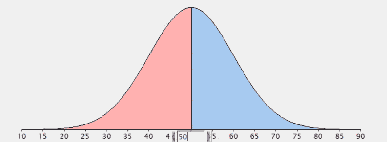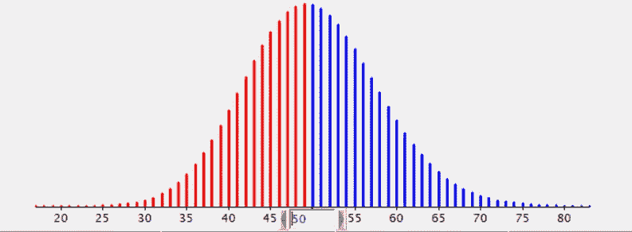

左:正态分布。右图:二项分布如果推很多。给定某些值，许多分布看起来像正态分布。但是，即使看起来像，它们也不是，这可以通过中间的空白看出。左边的分布是非常连续的，而右边的是绝对离散的。

连续结果和离散结果的概率分布不同*(整数)。你可以在下表中看到一些例子。*

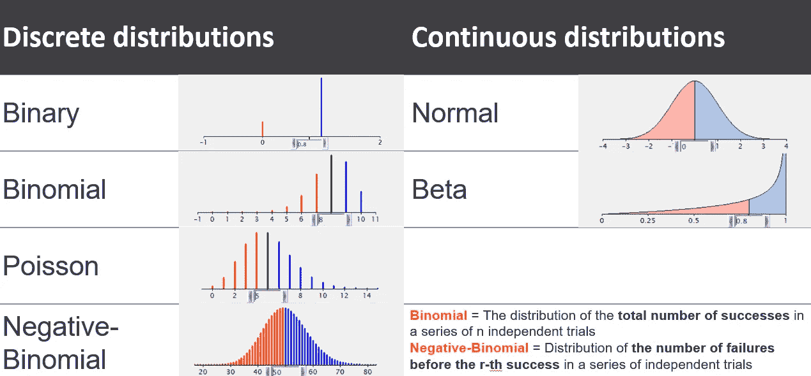

这不是一个详尽的表格。存在许多概率分布，然后我甚至没有讨论混合物，尽管负二项式(这是一种伽马毒素)非常接近。

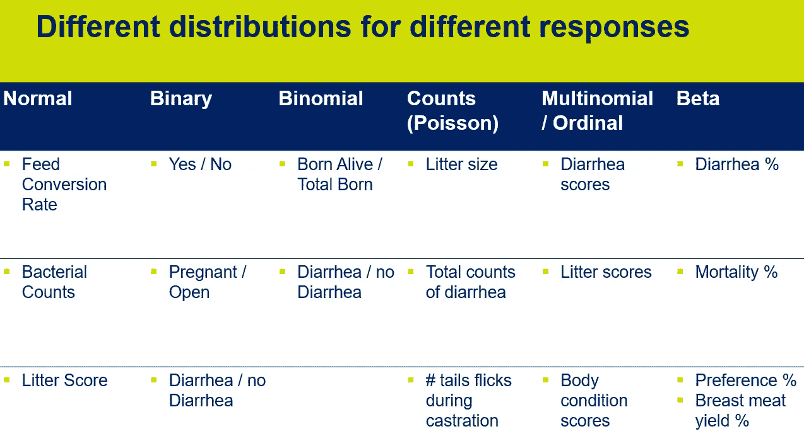

并且可以使用不同的分布来适应不同的响应或目的。在这里，你可以从动物科学中找到例子，但同样，这些例子远非详尽无遗。

如果我们要谈论分布，我们绝对需要谈论均值-方差关系，这在很大程度上决定了分布的行为，以及它们在分析不同类型的数据时有多大用处。

正态分布是一个很好的分布，因为我们可以分别估计平均值和方差。因此，如果基础过程是正态的，那么估计理论正态分布的性质将是非常容易的！

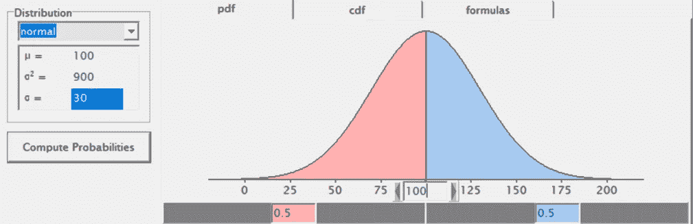

在这里，你可以看到正态分布有多正常——只包括一个平均值和一个方差。

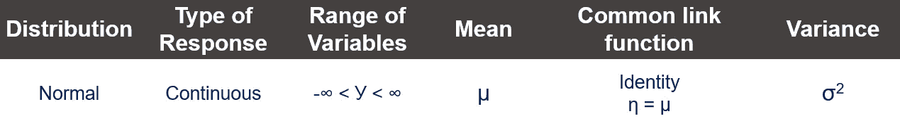

一些技术上的东西，但它基本上说，均值和方差可以分别确定。这是一个非常大的自由！

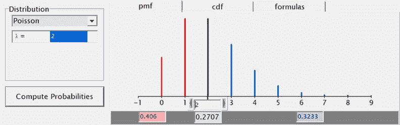

然而，泊松分布只有一个平均值。因此，没有真正的自由。

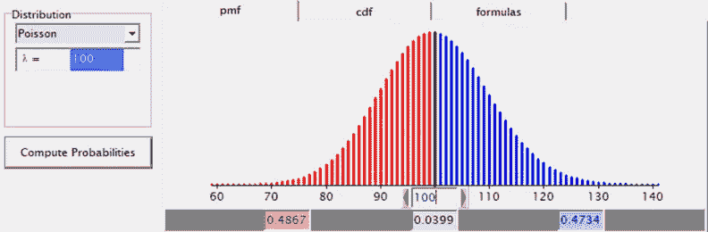

即使它可以在形状上模拟正态分布，但不能在性质上模拟正态分布。

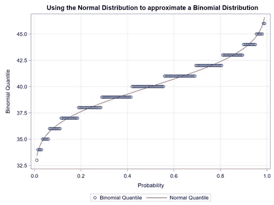

使用二项数据的正态分布。它可以遵循它的形状，但肯定不能遵循它的属性。

处理非正态数据的困难是因为均值估计量和方差估计量之间存在依赖关系。此外，数据是离散的，因此不再直观*(许多人在高中被教授关于正态分布的知识)。因此，在没有平均值的情况下，我们现在必须讨论比例，我们使用分布来模拟我们看到的数据，将其外推至总体，并以此为基础进行推断(p 值)。为此，我们有两种主要的分布类型—连续分布和离散分布。*

正态分布是连续的，最常用，也最容易解释，因为它有两个可以单独估计的参数——均值和方差。对于均值-方差关系相关的分布，通常会出现过度离差，即方差被低估，从而导致假阳性。

答于是我们谈到了过度分散的话题，这也是均值-方差关系变得非常有趣的地方。下面，您将看到四种分布的特征以及它们的均值和方差是如何指定的。泊松分布立即凸显出来。

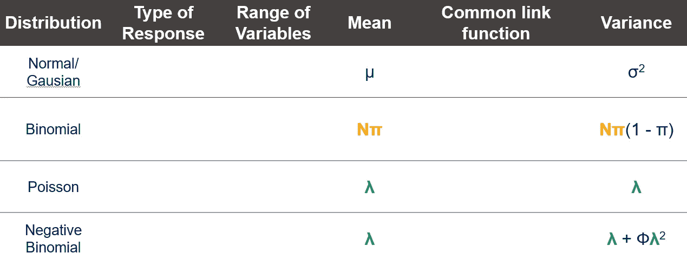

前一部分简要提到过过度分散，在进行更实际的例子之前，我们将进一步强调这一点。过度离差在线性混合模型中不是问题，因为 lmm 仅处理来自正态分布的数据，并且在正态分布中，方差与均值分开估计。然而，在 GLMMs 中，某种形式的离差实际上总是存在的，这意味着方差要么被低估*(过度离差)*要么被高估*(不足离差)。*

让我们用一个例子来说明这个问题。

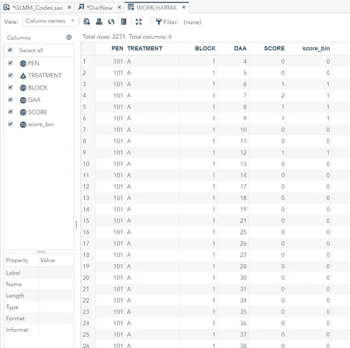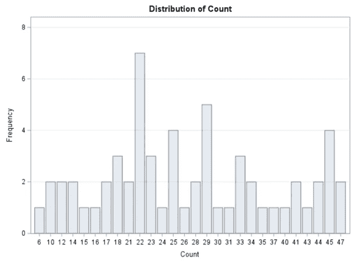

显示计数数据的数据集-泊松分布最喜欢的数据类型，因为它是离散的，并且通常在一处有很大的频率。然而，这里的情况并非如此，所以让我们看看泊松分布是怎样的。

评估泊松分布是否适合的简单直接的方法是绘制组间的均值-方差关系。圆点应该在红线上。

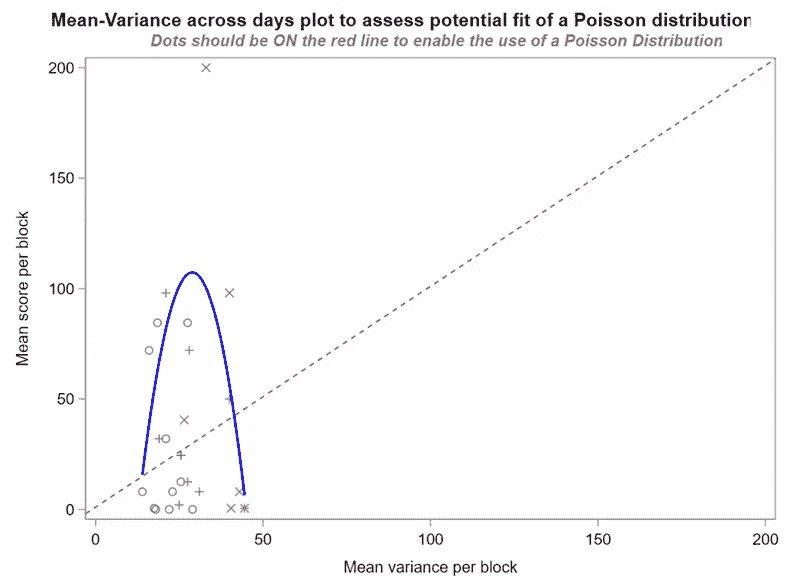

他们显然不是。

过度分散经常发生，因为线性预测器不完整，这是没有包括足够的/最重要的变量的结果。要检测过度离差，您需要在给定样本大小的情况下，通过将检测到的方差除以自由度来查看模型中是否存在比预期更多的方差。要获得这一指标，您需要更改 GLIMMIX 中的估算方法，这将开启一些复杂的统计理论:

1.  伪似然性
2.  拉普拉斯(方法=拉普拉斯)
3.  正交(方法=四次(qpoints= **5** ))

如果包含随机/残差语句，选项二或三不能用在 **PROC GLIMMIX** 中。要从数字上检查过度分散，可以用皮尔逊卡方除以自由度来查看。如果这个值在 0.5-1.5 之间，你是可以的，但是没有正式的临界值。

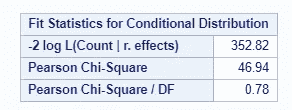

0.5–1.5 =正常

在这个例子中，我们实际上检测到了欠分散。当不存在离差时，皮尔逊卡方/ DF 值应为 1，这意味着方差是根据存在的自由度正确估计的。超出范围[0.5；1.5 ]会构成太大的离差。在极端情况下，您会看到一个介于 5 和 10 之间的值，这意味着我们低估了方差的 5 倍或 10 倍

让我们用一个例子来测试所有这些:

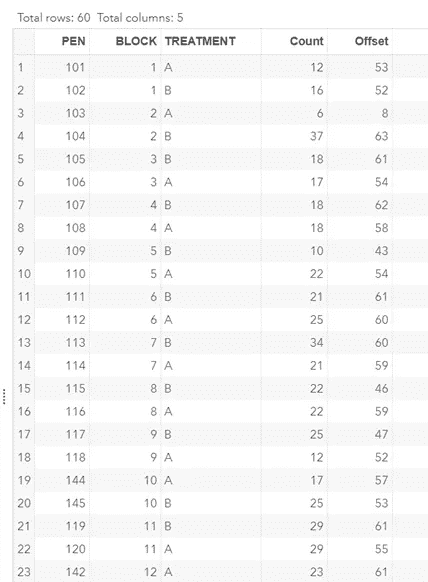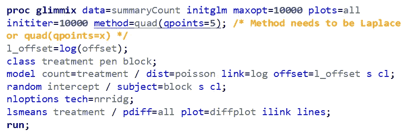

从统计学角度检测过度分散。为此，该方法需要拉普拉斯求积(因为它们模拟最大似然)。因为它是一个泊松，我还包括一个偏移变量，这使数据更符合泊松的本质，即一个比率。

一些你可能在 **PROC MIXED** 代码中没有意识到的新特性。

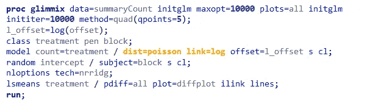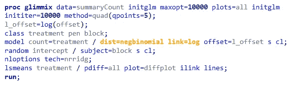

通过使用不同的分布但相同的链接函数来处理数据。这意味着统计是可比的！

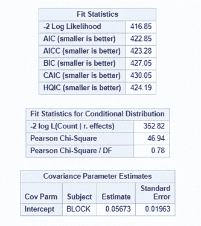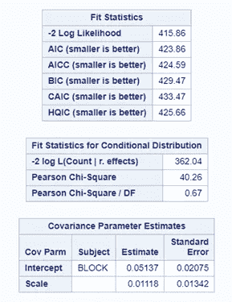

尽管负二项式有一个额外的参数可以创造奇迹，但这些模型同样很好地拟合了数据。比例参数的估计值较低，这一事实可能解释了为什么从单参数泊松分布到双参数负二项式分布不会增加您解释数据的工作量。

概括地说，在正态分布中，均值和方差是分开估计的。在其他分布中，方差*(例如，泊松、二项式、贝塔)*是均值的函数。这经常造成**过度分散**——低估方差导致假阳性。**分散不足**不太常见，但肯定会发生。在这两种情况下，最好的方法是将发行版改为一个为您提供更多建模自由的版本。

在大多数模型中，假设模型的残差是[独立同分布的随机变量。这是如何工作的，你可以从下面的模拟中看出来。](https://en.wikipedia.org/wiki/Independent_and_identically_distributed_random_variables)

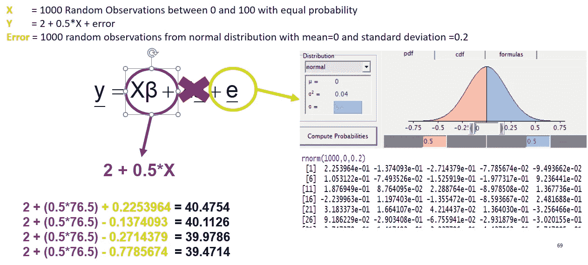

观察值由“真”值和一些误差确定。假设误差或残差来自正态分布，其中每个绘图与另一个绘图不相关。因此，黑色值是您在数据集中看到的值，紫色和灰色值是固定效果和残差的估计值。这就是最大似然法的作用——它反向工作。

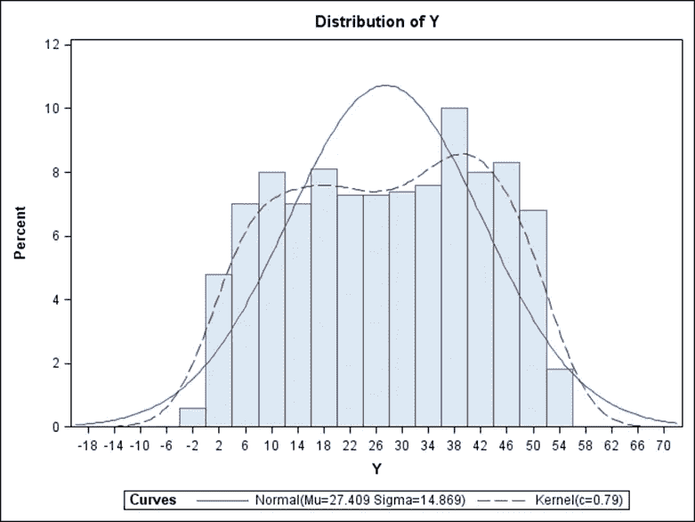

从正态分布模拟的值的分布。但是，观察到的数据并不正常。只要残差服从正态分布，这就不是问题。

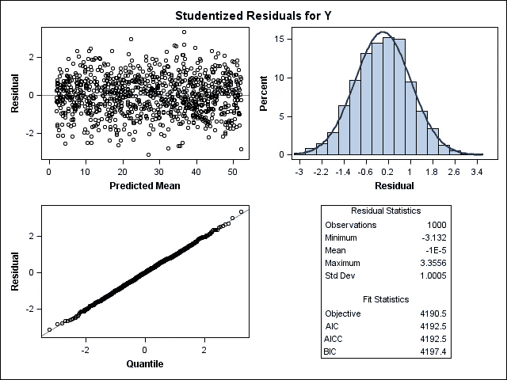

幸运的是，它们是存在的，但是我们已经知道了，因为我们模拟了它们。

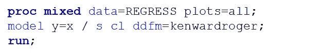

用于获取独立同分布残差的模型。

现在，让我们模拟一个泊松分布，看看残差会是什么样子。

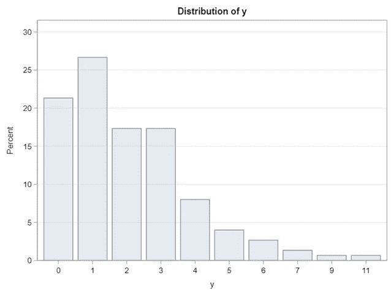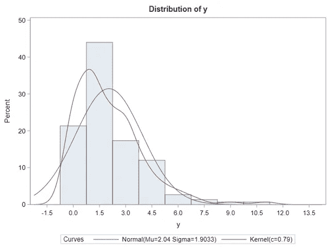

左图:传统的计数数据分布，模式为一个和一个右斜斜率。右:努力看看正态分布是否可以做到这一点——它可以，但它必须是负数，而且没有负数。因此，不是一个很好的拟合，内核已经开始暗示泊松(或伽马)。

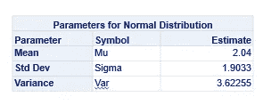

评估泊松生存的一个更简单的方法是创建一个均值-方差表。这对泊松来说可不太好。

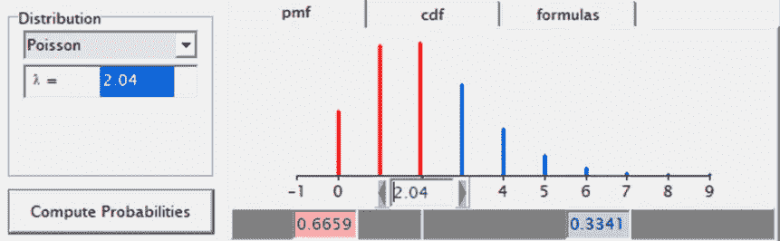

让我们模拟平均值和方差。

基于平均值的泊松分布看起来不同于基于方差的分布。在泊松分布中，较大的λ会导致较长的尾部。让我们看看如果我们开始对数据建模会发生什么。

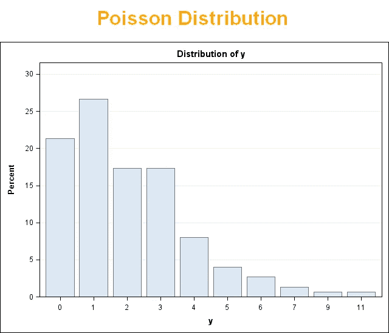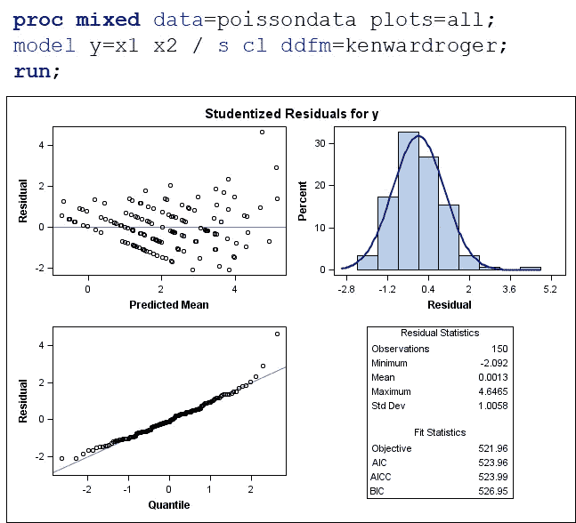

残差看起来正常，但肯定不是同质的。令人惊讶的是，正态分布实际上仍然能够提供这样的图形。

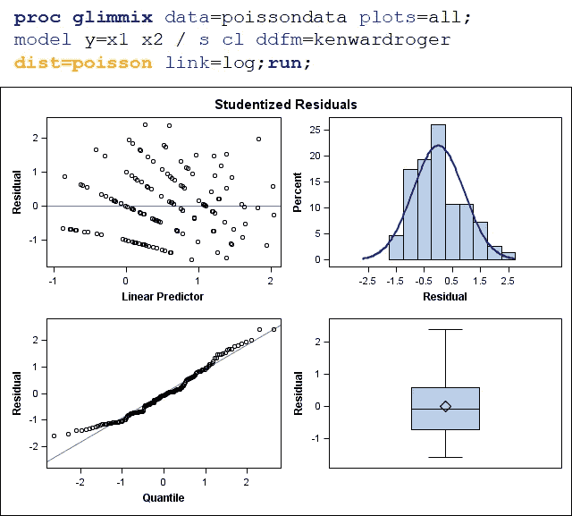

残差来自泊松分布。当然不太正常，也不是同质的，但为什么会期望这样的事情摆在首位？

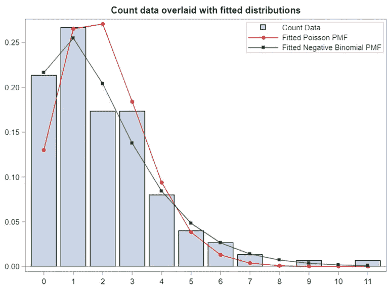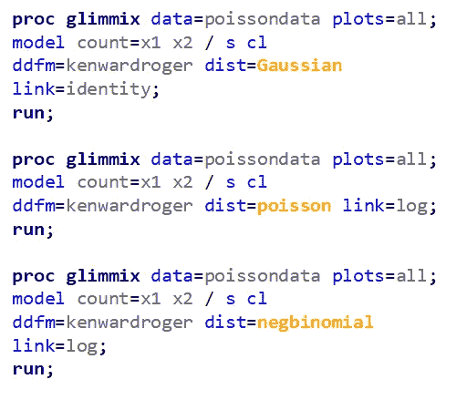

这是一个泊松和负二项式叠加的图。负二项看起来更有说服力。

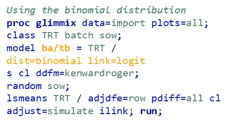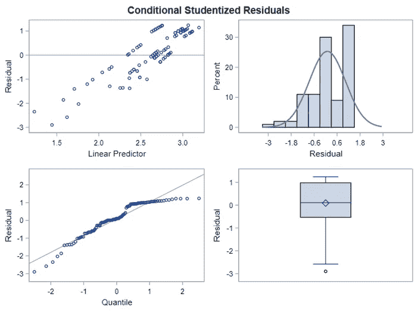

使用二项分布并不能真正提供更好的前景。

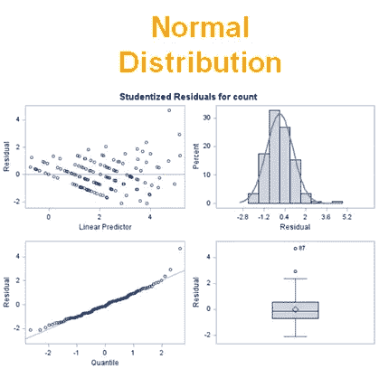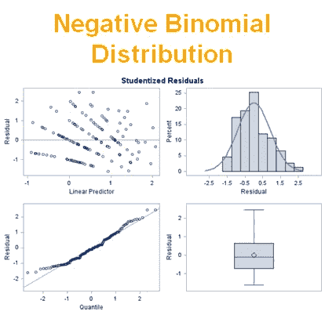

来自正态分布、泊松分布和负二项分布的残差。

上述实践提供了宝贵的经验:

1.  不要使用 GLIMMIX 模型的图来评估一个模型是否优于另一个模型。
2.  坚持线性混合模型课程中描述的信息标准。
3.  最好查看 ls 均值、标准误差和过度/不足分散的度量
4.  在广义线性混合模型中，误差不可能来自正态分布

因此，使用残差图来评估模型拟合和比较模型是很棘手的，会导致不正确的结果，即使它们看起来像你习惯的那样。最好查看 ls 均值、标准误差和过度/不足分散的度量。

希望你喜欢这个！更多关于特定类型的数据以及如何处理它们！