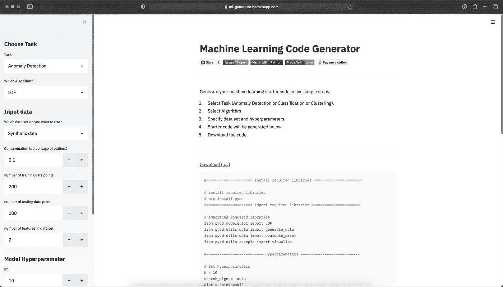
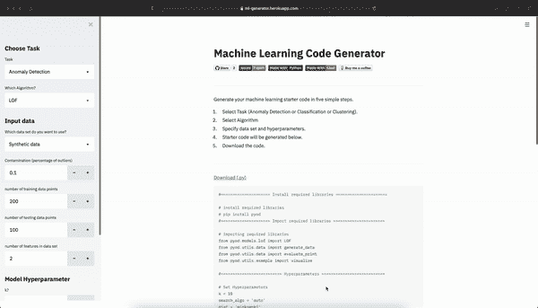

# 使用机器学习代码生成器，只需点击几下鼠标即可生成机器学习代码

> 原文：<https://pub.towardsai.net/generate-machine-learning-code-in-few-clicks-using-machine-learning-code-generator-62e4a4f30b23?source=collection_archive---------3----------------------->

## [机器学习](https://towardsai.net/p/category/machine-learning)

[MLgenerator](https://ml-generator.herokuapp.com/) 截图

[MLGenerator](https://ml-generator.herokuapp.com/) 是一个简单的 web 应用，使用 [Streamlit](http://streamlit.io/) 构建，部署在 [Heroku](https://www.heroku.com/home) 上，为异常检测、分类、聚类、降维等不同任务生成机器学习代码。MLGenerator 是由三年级机器学习博士候选人 Durgesh Samariya 创建的开源软件。

MLGenerator gif。

目前，MLGenearator 允许用户生成异常检测代码，包括 LOF、iForest 和 kNN 异常检测器，以及分类代码，包括逻辑回归、随机森林、决策树、SVM 和 k 近邻分类器。MLGenerator 为不同的任务使用不同的广泛使用的 Python 库，例如 [Scikit-Learn](https://scikit-learn.org/stable/) 和 [PyOD](https://pyod.readthedocs.io/en/latest/) 。

使用 MLGenerator，您可以通过几个步骤为任何机器学习任务创建代码。它对于机器学习初学者来说很方便——他们可以获得每个任务的代码，以便从中学习，同时，它对机器学习从业者来说也很有帮助——它节省了他们重复编写相同代码的时间。他们可以轻松地为任何机器学习任务创建骨架代码。目前，MLGenerator 允许在。py 格式。

MLGenerator 针对不同的机器学习任务，不断更新不同的最先进算法。这里有几个算法，在待办事项列表里。

*   聚类— K 均值、DBSCAN、OPTICS、BIRCH
*   降维—主成分分析、t-SNE

MLGenerator 欢迎各种形式的贡献。

# 未来计划

目前，MLGenerator 只提供 python 中的代码模板。以后能看到 R、Java 等不同编程语言的模板就太好了。除此之外，如果有文本分类、图像分类等不同的基于应用的模板，以及 Keras、PyTorch 等深度学习库的示例代码就更好了。

# GitHub 回购

 [## durgeshsamariya/MLgenerator

### 一个 web 应用程序，为不同的机器学习任务生成代码。它是在我学习和维护的空闲时间开发的

github.com](https://github.com/durgeshsamariya/MLgenerator) 

**感谢阅读。**

## 关于我

我是 [Durgesh Samariya](https://durgeshsamariya.github.io) ，澳大利亚费杜尼大学的三年级机器学习博士生。

## 在互联网上:

在 [LinkedIn](https://www.linkedin.com/in/durgeshsamariya/) 、 [Instagram](https://www.instagram.com/themlphdstudent/) 、 [Kaggle](https://www.kaggle.com/themlphdstudent) 、 [GitHub](https://github.com/themlphdstudent) 、 [Medium](https://pub.towardsai.net/@themlphdstudent) 上关注我。

如果你喜欢阅读这样的故事，并希望支持我的写作，考虑成为一名[灵媒成员](https://medium.com/@themlphdstudent/membership)。每月支付 5 美元，你就可以无限制地阅读媒体上的故事。如果你使用我的注册链接，我会收到一小笔佣金。

**已经是会员了**？[订阅](https://medium.com/subscribe/@themlphdstudent)在我发布时得到通知。