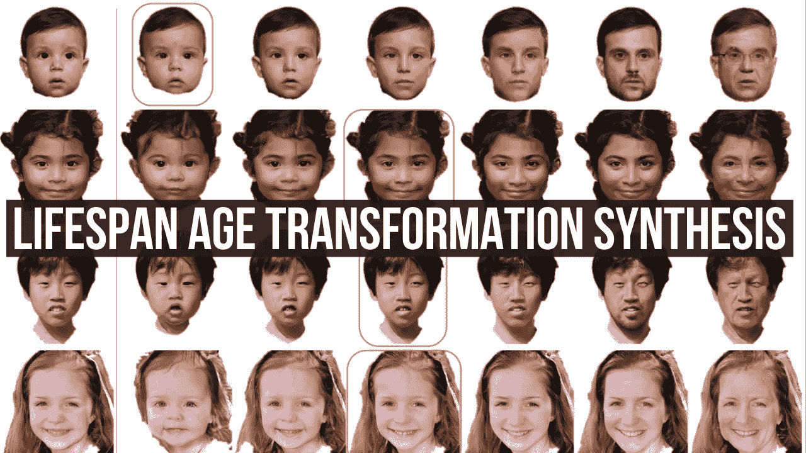
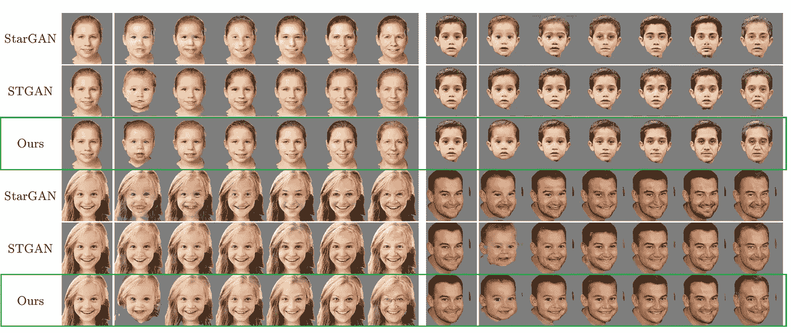
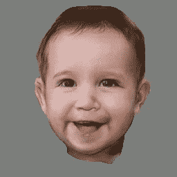
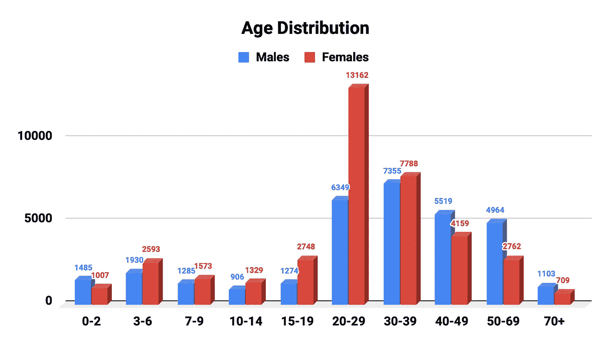
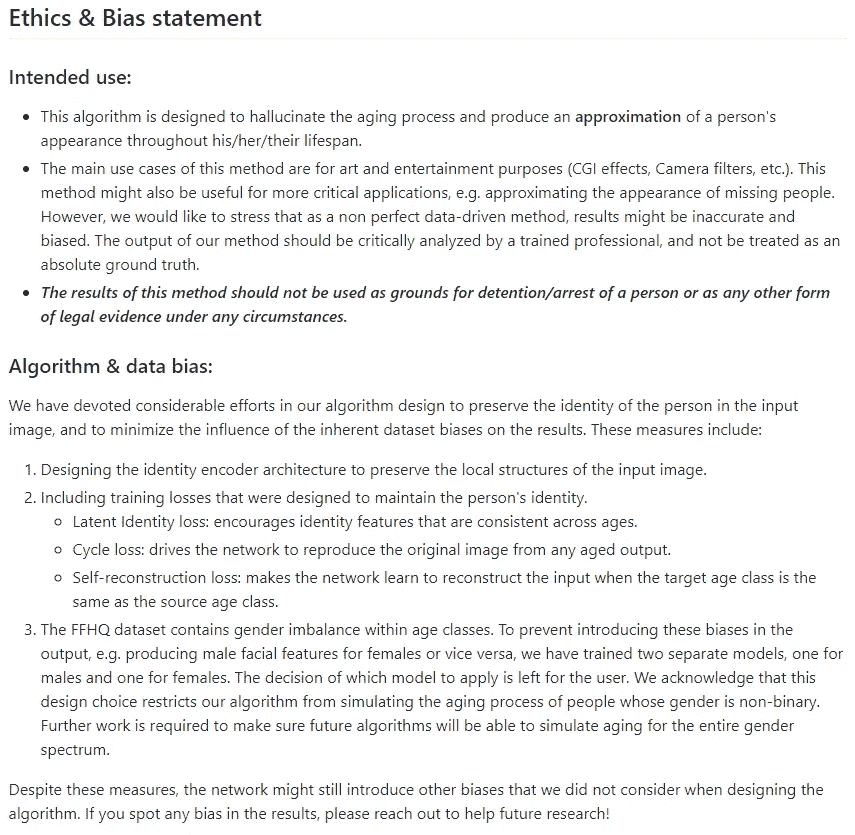
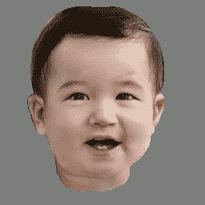
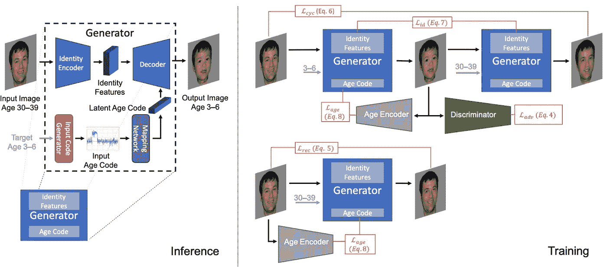
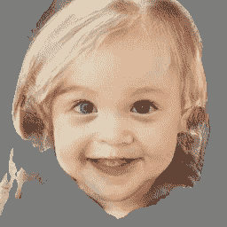

# 生成更年轻和更老版本的自己！

> 原文：<https://pub.towardsai.net/generate-younger-older-versions-of-yourself-1a87f970f3da?source=collection_archive---------1----------------------->

## [计算机视觉](https://towardsai.net/p/category/computer-vision)

## 给定一张你在任何年龄的照片，这个模型可以生成一个真实且相当精确的你的一生！

Adobe Research 的一组研究人员开发了一种新的技术，仅基于一张个人照片进行年龄转换合成。
它可以从你发送给它的任何图片生成寿命图片。

图片来自[论文](https://arxiv.org/pdf/2003.09764.pdf)

只要看看他们的结果与以前最先进的方法相比有多好就知道了。它非常逼真，每张照片看起来都像是不同年龄的同一个人。这通常被称为单幅照片年龄增长和回归问题，其目标是预测一个人未来的样子，或者他们过去的样子。正如你在这里看到的，大多数当前的技术确实是有限的。他们经常忽略头型和皮肤纹理，这两者通常会随着年龄的增长而改变。限制目前的方法，以缩小年龄差距，而不是一个完整的生命周期转换合成。

图片来自[论文](https://arxiv.org/pdf/2003.09764.pdf)

他们用一种全新的模型架构来解决这个问题。
我只是开玩笑，他们也像大多数方法一样使用 GANs，但做了一些修改，我将进一步详述。换句话说，这是一个生成性的对抗网络。他们将他们的新方法称为“多域图像到图像生成对抗网络”。它基本上是学习代表连续双向老化过程的潜在空间模型。这意味着它学会了如何表现一个特定的人的照片，无论是年长的还是年轻的。

图片来自[论文](https://arxiv.org/pdf/2003.09764.pdf)

在进入这种新方法的细节之前，我只想提一下，他们使用完全标有年龄、性别和语义分段的 FFHQ 数据集来训练他们的模型，并且他们的预训练模型是公开可用的。

你可以在他们的 GitHub 上找到它，甚至可以在 Google Colab 上用你自己的图片试试他们的演示！它完全免费使用，你甚至不需要一个 GPU 来运行它。这两者在本文的参考文献中都有联系。请注意，它所训练的 FFHQ 数据集包含性别失衡，可能会产生带有特定图片的怪异输出。
当然，它只能产生一个人一生中外貌的近似值，不可能产生相同的图像，但结果仍然令人印象深刻。

现在，让我们更深入地了解一下他们是如何做到这一点的。

图片来自[报](https://arxiv.org/pdf/2003.09764.pdf)

这里的主要目标是学习头部形状随时间的变形，这是当前的方法所忽略的。当然，这不是唯一的挑战，他们还需要学习不同年龄阶段的外貌变化，这不是一件容易的事情。由于没有数据集可以给我们同一个人在不同年龄的许多照片，他们无法使用监督学习来完成这项任务。在那里，他们可以看到所有这些照片，并注明照片中人的性别和年龄，这使得这项任务变得更加容易。

相反，他们使用 GAN 架构来利用对抗性学习的优势。如果你对 GANs 和它的学习方式都不熟悉，我建议你暂停视频，看看我对 GANs 的介绍，这会让一切更清楚。点击此处观看视频:

图片来自[报](https://arxiv.org/pdf/2003.09764.pdf)

像往常一样，有一个生成器和一个鉴别器。生成器的作用是使用编码器-解码器架构跨时代过渡。假设即使某人的外貌随着年龄的增长而变化，他们仍然保持相同的“身份”，也就是说他们看起来仍然相似。知道他们分别对年龄和身份进行编码，这样他们就可以对每个人进行相对的改变。然后，它被发送到负责近似连续年龄转换的潜在空间。然后，他们使用一种经典的鉴别器，试图在训练中区分生成的图像和真实的图像。正如你在这里看到的，网络使用多重损失在许多方面迭代改进它的结果，例如尊重身份转换，同时仍然最大可能地保留它，并为每个年龄框架找到良好的表示。在他们的论文中详细解释了这种新方法中的这些损失和其他一切。如果你想了解更多关于这篇新论文的信息，我强烈邀请你阅读它，下面有链接！

图片来自[报](https://arxiv.org/pdf/2003.09764.pdf)

**观看本视频中的更多示例:**

如果你喜欢我的工作并想支持我，我会非常感谢你在我的社交媒体频道上关注我:

*   支持我的最好方式就是在 [**中**](https://medium.com/@whats_ai) 关注我。
*   订阅我的 [**YouTube 频道**](https://www.youtube.com/channel/UCUzGQrN-lyyc0BWTYoJM_Sg) 。
*   在 [**LinkedIn**](https://www.linkedin.com/company/what-is-artificial-intelligence) 上关注我的项目
*   一起学习 AI，加入我们的 [**Discord 社区**](https://discord.gg/SVse4Sr) ，*分享你的项目、论文、最佳课程，寻找 Kaggle 队友，等等！*

**参考文献:**

论文:[https://arxiv.org/pdf/2003.09764.pdf](https://arxiv.org/pdf/2003.09764.pdf)
GitHub:[https://GitHub . com/royo rel/lifetime _ Age _ Transformation _ Synthesis](https://github.com/royorel/Lifespan_Age_Transformation_Synthesis)
Colab:[https://Colab . research . Google . com/GitHub/royo rel/lifetime _ Age _ Transformation _ Synthesis/blob/master/LATS _ demo . ipynb](https://colab.research.google.com/github/royorel/Lifespan_Age_Transformation_Synthesis/blob/master/LATS_demo.ipynb)