# DiscoGANs 网络，从鞋子图像生成匹配的包，反之亦然

> 原文：<https://pub.towardsai.net/generating-matching-bags-from-shoe-images-and-vice-versa-using-discogans-8149e2cbc02?source=collection_archive---------0----------------------->

## 揭秘 discodans |[走向 AI](https://towardsai.net)

# 介绍

A**Discovery GAN**([**discover GAN**](https://arxiv.org/pdf/1703.05192.pdf)**)**是一个生成性对抗网络，给定一个**域 A** 的图像，生成**域 B** 中产品的图像。它将风格元素从一个图像转移到另一个图像，从而将纹理和装饰从一个时尚项目(如包)转移到另一个时尚项目(如一双鞋)。这种 GAN 在游戏和时尚行业有许多应用，值得感兴趣的读者进一步探索。

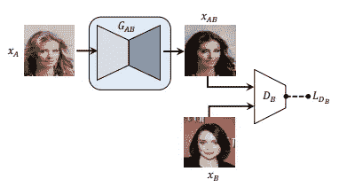

[**标准 GAN (Goodfellow 等，2014)**](https://arxiv.org/pdf/1703.05192.pdf)

[**甘带着重建的失落**](https://arxiv.org/pdf/1703.05192.pdf)

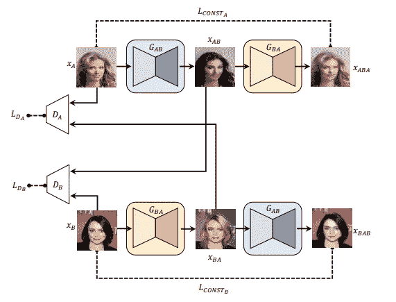

**提议的** [**模型(DiscoGAN)旨在发现两个未配对、未标记数据集之间的关系**](https://arxiv.org/pdf/1703.05192.pdf)

# 高层 **DiscoGAN** 的架构图

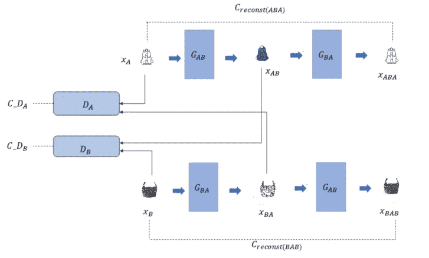

高层 DiscoGAN 的架构图

**DiscoGAN** 将有两个**生成器**，一个用于从**手袋**(用 **A** 表示)到**鞋子**(用 **B** 表示)的映射，另一个用于反之亦然。

*   第一**生成器**将输入图像从**域 A** 映射到**域 B** ，
*   第二**生成器**从**域 B** 到**域 A** 重构图像。
*   在**域 B** 中生成的图像在风格和模式上都类似于**域 A** 中的图像。这种关系可以在训练期间无需明确地将来自两个域的图像配对来学习。
*   **发现者**试图学习两个**发电机**功能 *G(ab)* 和 *G(ba)。*当一幅图像 *xA* 通过**生成器**G*ab 时，它将*生成一幅图像 *xAB* ，在**域 B** 中看起来很逼真。
*   当这个图像 *xAB，*通过另一个**发生器**网络 *G(ba)* 馈入时，它应该产生一个图像 *xABA* ，该图像应该理想地与原始图像 *xA* 相同
*   在训练期间，无需明确配对来自两个**域**的图像，就可以学习这种关系。鉴于物品的配对是一项耗时的任务，这是一项非常强大的功能。

**在数学上，这可以表示如下**

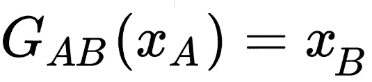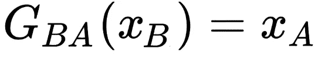

**关于发电机功能，以下关系应成立**

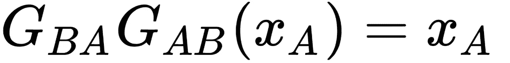

**发生器**函数 *G(ab)* 和 *G(ba)* 实际上不可能相互反转，所以我们必须使重建图像和原始图像之间的损失最小化。为此，我们可以使用 **L1** 或 **L2** 正规化。

*   L1 正则化是每个数据点的绝对误差之和。
*   L2 正则化是每个数据点的平方损失之和。
*   我们可以如下示出单幅图像的 L2 正则化损失函数。

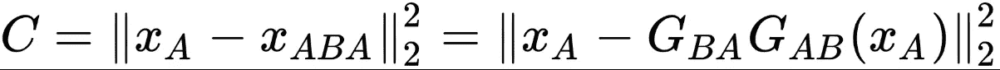

*   将 L2 损失最小化是不够的。我们必须确保创建的图像 *xB* 在**域 B** 中看起来真实。例如，如果我们将域 A**中的包**映射到域 B 中的鞋，我们必须确保 *xB* 看起来像一只鞋。
*   **域 B** 上的**鉴别器** *Db* 会将 *xB* 检测为假的如果图像作为鞋子不够逼真，则必须考虑这种损失。
*   在训练中，生成的( *xAB = G(ab)(xA))* 图像和**域 B** 中的原始( *yB* )图像都将作为输入馈送给**鉴别器**，以便它学习将真实图像与虚假图像进行分类
*   **生成器**将**域 A** 中的一幅图像 *xA* 映射到**域 B** 中的一幅图像的损失可以写成如下所示。

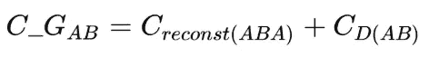

*   并且在 L2 范数下的重建损失可以写成如下所示。

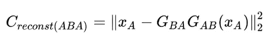

**发生器**试图将图像 *xAB* 转换为对**鉴别器**来说看起来真实的图像。

**鉴别器**试图将转换后的图像标记为假图像，因此**生成器** *G(ab)* 应该以尽可能小的假图像对数损失的方式生成图像 *xAB* 。

如果**域 B** 中的**鉴别器** *D(b)* 为真图像标记 1，为假图像标记 0。图像真实的概率由 *D(b)给出。)*。

然后**生成器**尝试使图像 *xAB* 在**鉴别器**网络下极有可能被标记为真实，这意味着**生成器**尝试使*D(b)(xB)= D(b)(G(ab)(xA))*尽可能接近 1。

就对数损失而言，**生成器**应最小化概率的负对数，这给我们 *C(D(ab))* ，如下所示。

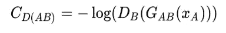

结合上面的函数，我们可以得到将一幅图像从**域 A** 映射到**域 b**的总生成成本 *C_GAB*

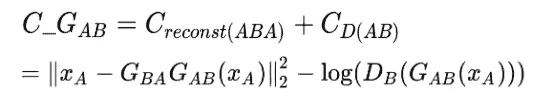

**生成器** *G(ba)* 映射从**域 B** 到**域 A** 的图像。由**生成器** *G(ba)* 将**域 B** 中的图像 *xB* 变换成图像 *xBA* 并且在**域 A** 处的**鉴别器**由 *D(a)* 给出，那么与这样的变换相关联的代价函数由下面给出。

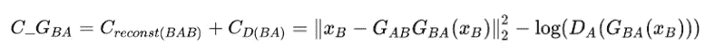

**生成器**两个域中所有图像的损失由下式给出。

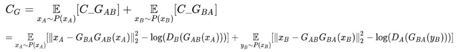

# 鉴别器的成本函数

两个域中的**鉴别器**都试图从伪图像中鉴别出真实图像，所以**鉴别器** *G(b)* 试图最小化代价 *C_D(b)* 如下图所示。

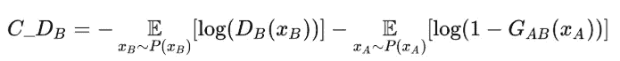

同样的，**鉴别器** *D(a)* 尝试最小化成本 *C_DA* 如下图。

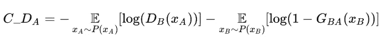

总的**鉴别器**成本由 *C(d)* 给出，如下所示。

# CycleGAN 和 DiscoGAN 之间的相似性

*   ***CycleGAN** 和 **DiscoGAN** 两者几乎相似。 **CycleGANs、**中有一个变化，它有一个附加超参数来调整重建/周期一致性损失在总损失函数中的贡献。这种灵活性决定了相对于 GAN 损失或归因于**鉴别器**的损失，分配给重建损失多少权重。*
*   *这个超参数平衡了损耗，帮助网络在训练时更快地收敛。*
*   *一个 **CycleGANs** 的其余实现与 **DiscoGANs 的相同。***

***为本帖所配的 jupyter 笔记本可以在** [**G**](https://github.com/nitwmanish/Generating-Matching-Bags-From-Shoe-Images-And-Vice-Versa-Using-DiscoGANs) **ithub 上找到。***

# *结论*

***DiscoGANs** 的一个很酷的应用是将装饰从一个时尚单品比如包包转移到另一个时尚单品比如一双鞋。*

****我希望这篇文章能帮助你开始建立自己的* DiscoGANs *。我想这至少会提供一个很好的解释和理解关于*发现者*。****