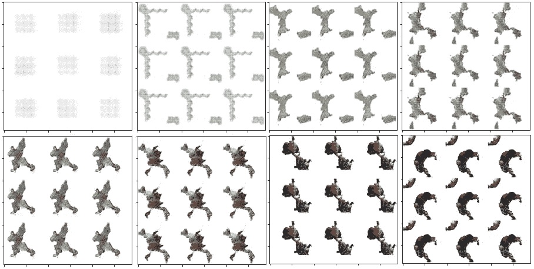

# 生成性对抗网络 102: DCGAN 和模式崩溃

> 原文：<https://pub.towardsai.net/generative-adversarial-networks-102-dcgan-mode-collapse-ef119aa31a6f?source=collection_archive---------0----------------------->

## [深度学习](https://towardsai.net/p/category/machine-learning/deep-learning)

## 革新简单的 GAN 以提高生成图像的质量。

在我上一篇关于生成对抗网络的文章中，我们已经看到了这些巧妙简单而强大的模型是如何工作的，它们可以用来做什么，并且我们已经构建了一个非常简单的 GAN 来生成新的口袋妖怪物种。如果你还没有读过，请查看一下:

 [## 生成性对抗网络 101

### 如何构建一个简单的 GAN

towardsdatascience.com](https://towardsdatascience.com/generative-adversarial-networks-101-c4b135a440d5) 

在本文中，我们将把我们的模型更进一步，包括卷积层，更适合处理图像。我们将构建一个深度卷积 GAN，或 DCGAN，看看它是否能提高性能，以及它可能会带来什么问题。我们开始吧！

## 深度卷积 GAN

有人可能会认为，从简单的前馈 GAN 网络过渡到卷积网络并不困难:只需用卷积网络取代密集层，就万事大吉了！然而，事实证明这比预期的要困难得多。

自从 [Goodfellow 等人在 2014 年提出最初的 GAN](https://arxiv.org/abs/1406.2661) 后，研究人员一直在试图使 GAN 更深，并使用卷积，以便它们可以生成更大更高质量的图像。这些任务被证明是困难的，因为训练是不稳定的，而 CNN 架构在监督问题上表现良好，但在应用于 GANs 时却变得无效。直到第一个成功的[深度卷积 GAN 被提出](https://arxiv.org/pdf/1511.06434.pdf)，几乎花了两年时间。该模型被恰当地称为 DCGAN，代表深度卷积 GAN，是作者对不同模型架构进行大量实验的结果。最终，他们提出了以下一套指导方针:

*   只使用大步卷积层，没有任何池或全连接层；
*   使用批处理规范化；
*   在生成器中对所有层使用 ReLU 激活，除了最后一层使用 tanh
*   对所有层使用鉴别器中的 LeakyReLU 激活，除了最后一层，它不需要任何激活。

让我们看看为什么所有这些指导方针如此重要。

首先，与使用确定性池化操作相反，使用步进卷积而不是池化层允许模型学习它自己的下采样(或上采样，在生成器的情况下)。这增加了网络的学习能力。接下来，不在卷积块上放置任何全连接层已经成为当时的一个增长趋势，人们使用全局平均池来代替。DCGAN 的作者发现，全球平均池增加了模型的稳定性，但损害了收敛速度。作为折衷，他们建议将卷积层直接连接到输入端(在发生器中)或输出端(在鉴别器中),他们证明这样做效果很好。

第二，DGGAN 作者提倡使用批量标准化，它通过标准化网络单元的输入来稳定学习，使其均值为零，方差为一。这防止了由不幸的参数初始化引起的问题，并确保梯度在流经深层网络时不会消失。在 GANs 中，批处理规范化被证明有助于防止模式崩溃，这一点我们稍后会谈到。然而，关键的洞察力是*而不是*将其应用于发生器输出层和鉴别器输入层，因为那只会降低训练稳定性。

最后，激活。作者建议在生成器中使用 ReLU，因为它可以确保模型更快地饱和并覆盖数据的颜色空间。在鉴别器中，他们通过实验发现 Leaky ReLU 工作良好，尤其是在处理高分辨率图像时。

让我们遵循这些准则来构建一个 DCGAN，以生成新的口袋妖怪！

## 深度卷积生成器👨‍🎨

我们刚刚讨论过的生成器指南的 PyTorch 实现可能看起来像这样。我们在输出图像中使用 4 个通道，因为我们将使用的[口袋妖怪精灵](https://github.com/PokeAPI/sprites)图像有 4 个颜色通道。

## 深度卷积鉴别器👮‍♀️

鉴频器也将在其输入中使用 4 个通道。其他超参数，如每层中的块数或隐藏单元数，是任意选取的。让我们看看这将如何为我们的数据集工作。

## 培养

训练过程与我们用于简单的前馈 GAN 的[非常相似。这个`PokemonDataset`物品是我创作的，你可以在 GitHub](https://towardsdatascience.com/generative-adversarial-networks-101-c4b135a440d5) 上找到它[。](https://github.com/MichalOleszak/gans/blob/main/gans/datasets.py)

不同的是，我们手动初始化卷积层的参数，并为 Adam 优化器指定动量参数(betas)。我们还使用了一个很小的学习率，仅为 0.0002。所有这些都是按照 DCGAN 作者的建议进行的。

发生器和鉴频器以及训练环路的损耗函数与前馈 GAN 完全相同。感兴趣的读者可以在之前的帖子中找到所有的[。你也可以在](https://towardsdatascience.com/generative-adversarial-networks-101-c4b135a440d5)[这个笔记本](https://github.com/MichalOleszak/gans/blob/main/notebooks/dcgan.ipynb)里自己运行代码。

看看我们的 GAN 都出了什么！下面的图片显示了一些甘制作的口袋妖怪随着训练的进行。

甘随着训练的进行生成了口袋妖怪。图片由作者提供。

所有生成的图像都是一样的！这里发生了什么？

## 模式崩溃

我们现在看到的是所谓的*模式崩溃*的典型案例。为了理解这个术语，考虑一下发生器对其产生的图像进行采样的概率空间。这个概率空间通常是多模态的，也就是说，它有几个(或可能有许多)区域，从这些区域有可能生成图像，并且它有其他区域，从这些区域生成图像是不可能的。

生成器的概率空间。Benjamin Grull 在 [Unsplash](https://unsplash.com?utm_source=medium&utm_medium=referral) 上的照片

想象一幅多山的风景。峰值是发生器概率分布的模式。发生器更有可能从一个峰而不是从一个谷的底部产生图像。理想地，从不同峰值生成的图像将类似于不同类型的训练数据图像。

当发生器发现通过从一个特定的峰生成图像，它可以很好地欺骗鉴别器时，模式崩溃就发生了。这些图像甚至不需要看起来真实。如果出于某种原因，鉴别者无法正确地将它们归类为假货，这就足够了。生成器对此的反应将是生成更多这样的图像，导致它不断产生相同的输出。

随着训练的进行，鉴别者可能最终学会从真实的训练样本中辨别这些相同的假图像的任务。但是，发生器将简单地跳到鉴别器不擅长的另一个峰上，并从那里继续生成新的相同图像。

这就是我们口袋妖怪的遭遇。对于纪元，生成器会生成看起来相似的形状，然后突然迁移到不同的形状。这是一个很好的例子，说明训练 GANs 是多么具有挑战性。

## 防止模式崩溃

发现了模式崩溃，我们能做些什么呢？一种方法是调整模型架构。改变层数，每层中的单元数，也许调整其他超参数，如学习率或优化器的动量设置。我们在这里使用的架构类似于作者在人脸和卧室数据集上测试的原始 DCGAN 架构。调整它，使之与我们的口袋妖怪一起工作可能是一个漫长而乏味的过程。

幸运的是，还有另一种方法。训练 gan 的许多问题源于损失函数的选择。敬请关注下一篇文章，在这篇文章中，我们将使用一种称为 Wasserstein distance 的度量来取代我们迄今为止一直使用的二元交叉熵损失，以构建 Wasserstein GAN 或 WGAN，并希望这将使我们的伪 Pokomens 更加真实！

## 感谢

这个 DCGAN 的训练循环代码以及损失计算函数是基于 Coursera 的[由 Sharon Zhou 等人提出的生成对抗网络(GANs)专门化](https://www.coursera.org/specializations/generative-adversarial-networks-gans)。

感谢阅读！

如果你喜欢这篇文章，为什么不在我的新文章上 [**订阅电子邮件更新**](https://michaloleszak.medium.com/subscribe) ？而通过 [**成为媒介会员**](https://michaloleszak.medium.com/membership) ，就可以支持我的写作，获得其他作者和我自己的所有故事的无限访问权。

需要咨询？你可以问我任何事情，也可以在这里 为我预约 1:1 [**。**](http://hiretheauthor.com/michal)

你也可以试试我的其他文章。不能选择？从这些中选择一个:

 [## 贝叶斯思维在日常生活中的重要性

### 这个简单的思维转变将帮助你更好地理解你周围不确定的世界

towardsdatascience.com](https://towardsdatascience.com/on-the-importance-of-bayesian-thinking-in-everyday-life-a74475fcceeb)  [## 可解释的助推机器

### 保持高准确性，同时获得有启发性的解释，从而创造知识并帮助理解和调试数据。

pub.towardsai.net](/explainable-boosting-machines-c71b207231b5)  [## 生产中威胁机器学习系统的 8 种危险

### 维护 ML 系统时需要注意什么

towardsdatascience.com](https://towardsdatascience.com/8-hazards-menacing-machine-learning-systems-in-production-5c470baa0163)