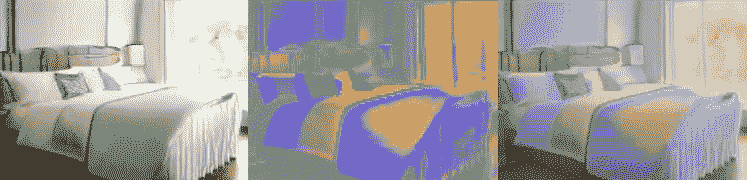
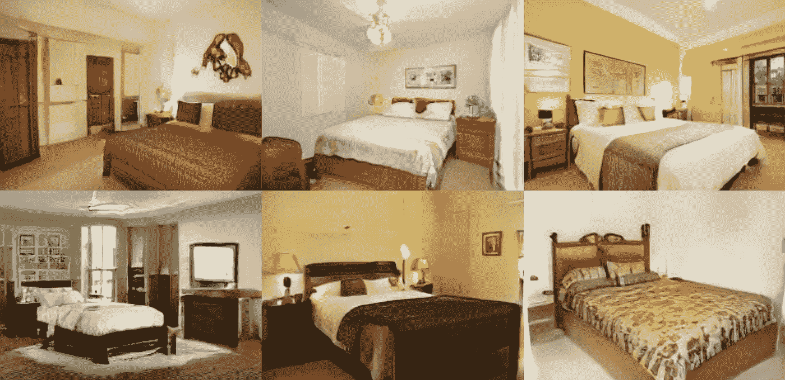
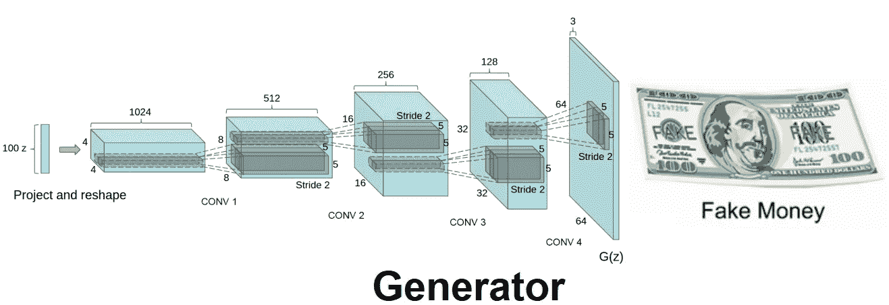
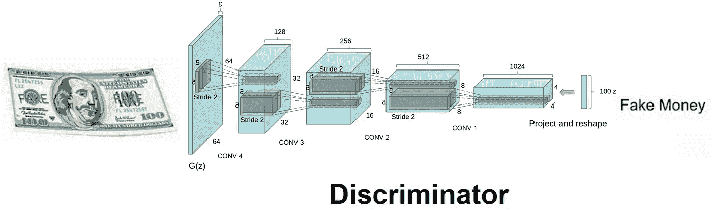
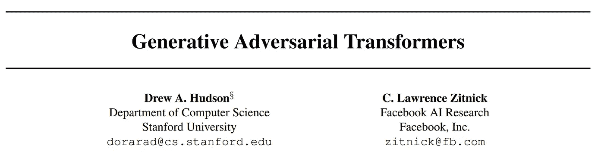
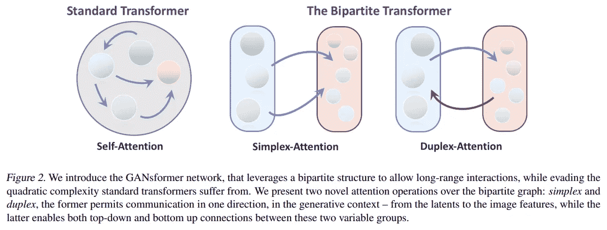
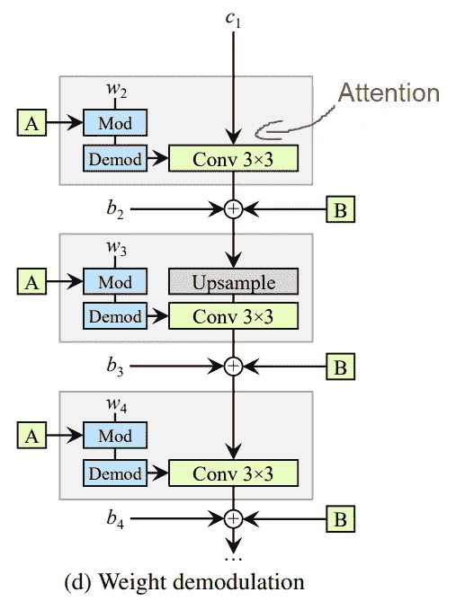
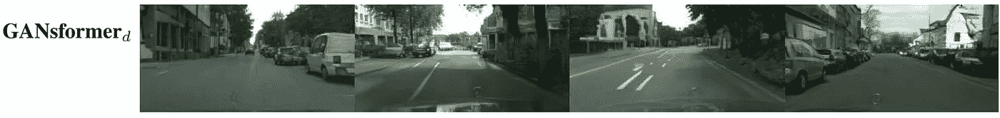

# GANsformers:使用 GANs 和变形金刚生成复杂的场景

> 原文：<https://pub.towardsai.net/generative-adversarial-transformers-gansformers-explained-bf1fa76ef58d?source=collection_archive---------2----------------------->

## [深度学习](https://towardsai.net/p/category/machine-learning/deep-learning)

## 他们基本上利用了强大的 StyleGAN2 架构中变形金刚的注意力机制，使其更加强大！

## 观看视频:

使用注意力地图生成卧室场景的结果示例。图片来自:德鲁·a·哈德森(Drew A. Hudson)和 c·劳伦斯·兹尼克(C. Lawrence Zitnick)，生成式对抗性变形金刚(2021)。

上周我们看了 DALL-E，OpenAI 的最新论文。
它使用与 GPT 3 相似的架构，包括从文本生成图像的变形金刚。这是一个超级有趣和复杂的任务，称为文本到图像的翻译。正如你在下面的视频中所看到的，与之前最先进的技术相比，结果令人惊讶地好。这主要是由于使用了变压器和大量的数据。

本周我们将看一个非常相似的任务，叫做视觉生成模型。其中目标是生成高分辨率的完整场景，如道路或房间，而不是单张人脸或特定对象。这与 DALL-E 不同，因为我们不是从文本中生成这个场景，而是从一个特定风格的场景的训练模型中生成的。这里是卧室。

生成卧室场景的结果示例。图片来自:德鲁·a·哈德森(Drew A. Hudson)和 c·劳伦斯·兹尼克(C. Lawrence Zitnick)，生成式对抗性变形金刚(2021)。

相反，它就像 StyleGAN 一样，能够在真实人脸数据集上训练生成独特而不存在的人脸。

不同之处在于，它以传统的生成和区分方式将这种 GAN 架构用于卷积神经网络。经典的 GAN 架构会有一个经过训练的生成器来生成图像，还有一个鉴别器，用于通过猜测图像是来自数据集的真实图像还是由第一个网络生成的伪图像来测量所生成图像的质量。这两种网络通常都由卷积神经网络组成。其中生成器看起来像这样，主要包括使用卷积对图像进行下采样以对其进行编码，然后再次使用卷积对图像进行上采样，以基于编码生成具有相同风格的图像的新“版本”，这就是为什么它被称为 StyleGAN。然后，鉴别器获取这个生成的图像，或者来自你的数据集中的图像，并试图判断它是真实的还是生成的，称为假的。

相反，他们利用强大的 StyleGAN2 架构内的变形金刚注意力机制，使其更加强大。注意力是这个网络的一个基本特征，允许网络在输入和输出之间画出全局依赖关系。在这种情况下，在架构的当前步骤的输入和先前编码的潜在代码之间，正如我们将在一分钟内看到的。

在一头扎进去之前，如果你对变形金刚不熟悉或者不关注，建议你看看我做的关于变形金刚的视频。

要了解更多细节，更好地理解注意力，你应该看看视频“注意力是你所需要的”,它来自于我的一个同事，Yannic Kilcher，他报道了这篇惊人的论文。

好的，我们知道他们一起使用变形金刚和甘斯来产生更好更真实的场景，这解释了这篇论文的名字，甘斯弗勒，但是他们为什么和如何做呢？

至于为什么，他们这样做是为了自动生成像这样复杂而真实的场景。对于电影或视频游戏等许多行业来说，这可能是一个强大的应用程序，比让艺术家在计算机上创建它们，甚至在现实生活中为它们拍照需要更少的时间和精力。此外，想象一下，当结合文本到图像的翻译，从一个单一的文本输入生成许多不同的场景，并按下一个随机按钮时，它会对设计师多么有用！

他们使用了最先进的 StyleGAN 架构，因为当我们谈论一般图像时，GAN 是强大的生成器。由于 GANs 使用卷积神经网络工作，它们天生使用像素的本地信息，将它们合并以获得关于图像的一般信息，出于同样的原因，错过了远处像素的长程相互作用。这使得 GANs 成为图像整体风格的强大生成器。出于同样的原因，它们在生成的图像中的小细节的质量方面仍然没有那么强大。不能控制生成的图像本身内的局部区域的样式。

这就是为什么他们有想法将变压器和 GANs 结合在一个架构中，他们称之为“二分变压器”。

图片来自:德鲁·a·哈德森(Drew A. Hudson)和 c·劳伦斯·兹尼克(C. Lawrence Zitnick)，生成式对抗性变形金刚(2021)。

正如 GPT-3 和许多其他论文已经证明的那样，变形金刚在长距离互动方面非常强大，可以绘制它们之间的依赖关系，并理解文本或图像的上下文。

`StyleGAN2 architecture. Image from: Tero Karras et al., Analyzing and Improving the Image Quality of StyleGAN, (2020).`

我们可以说，他们只是在生成器和鉴别器的卷积层之间添加了关注层，这是变压器网络的基础。因此，它们不是像卷积天生所做的那样集中于使用全局信息和全局控制所有特征，而是利用这种注意力将信息从局部像素传播到全局高级表示，反之亦然。与应用于图像的其他变形器一样，该注意力层采用像素位置和 StyleGAN2 潜在空间 W 和 Z。潜在空间 W 是在网络开始处完成的对中间潜在空间的输入的编码，这里表示为 a。而编码 Z 只是网络中当前步骤的输入的结果特征。

这使得生成整个图像更加“有表现力”，尤其是在生成描绘多对象场景的图像时。

生成道路场景的结果示例。图片来自:德鲁·a·哈德森(Drew A. Hudson)和 c·劳伦斯·兹尼克(C. Lawrence Zitnick)，生成式对抗性变形金刚(2021)。

当然，这只是脸书人工智能研究所和斯坦福大学的这篇新论文的概述。我强烈建议阅读这篇文章，以便更好地理解这种方法。这是下面引用中的第一个链接。代码也是可用的，并且将在参考文献中链接。

如果你喜欢我的工作，并想了解最新的人工智能技术，你绝对应该在我的社交媒体频道上关注我。

*   订阅我的 [**YouTube 频道**](https://www.youtube.com/channel/UCUzGQrN-lyyc0BWTYoJM_Sg) 。
*   关注我的项目上 [**LinkedIn**](https://www.linkedin.com/in/whats-ai/) 和这里上[**中**](https://whats-ai.medium.com/) **。**
*   一起学习 AI，加入我们的 [**不和谐社区**](https://discord.gg/learnaitogether) ，*分享你的项目、论文、最佳课程，寻找 Kaggle 队友，等等！*

# 参考

**论文**:[https://arxiv.org/pdf/2103.01209.pdf](https://arxiv.org/pdf/2103.01209.pdf)
代码:[https://github.com/dorarad/gansformer](https://github.com/dorarad/gansformer)
**完整参考**:德鲁·a·哈德森和 c·劳伦斯·兹尼克(Drew a . Hudson and c . Lawrence Zitnick)，Generative Adversarial Transformers，(2021)，发表在 Arxiv 上，摘要:“我们介绍了一种新颖高效的变形金刚(GANsformer)，并对其进行探索，以完成可视化生成建模的任务。该网络采用二分结构，能够在图像上进行远程交互，同时保持线性效率的计算，可以很容易地扩展到高分辨率合成。它反复地将信息从一组潜在变量传播到进化的视觉特征，反之亦然，以支持根据另一个对每一个的改进，并鼓励对象和场景的合成表示的出现。与经典变压器架构不同，它利用乘法积分实现灵活的基于区域的调制，因此可以视为成功的 StyleGAN 网络的推广。我们通过对一系列数据集(从模拟的多对象环境到丰富的真实世界室内和室外场景)的仔细评估，展示了该模型的强度和鲁棒性，表明它在图像质量和多样性方面实现了最先进的结果，同时享受了快速学习和更好的数据效率。进一步的定性和定量实验为我们提供了对模型内部工作的深入了解，揭示了改进的可解释性和更强的解缠性，并说明了我们方法的好处和功效。该模型的实施可在[https://github.com/dorarad/gansformer.](https://github.com/dorarad/gansformer.)获得。