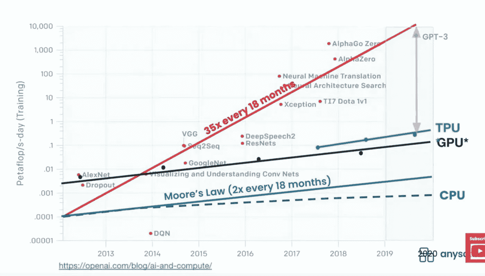

# 生成人工智能与未来

> 原文：<https://pub.towardsai.net/generative-ai-and-future-c3b1695876f2?source=collection_archive---------0----------------------->

## 甘，三号，达尔二号，接下来呢

[乔什·戈登](https://unsplash.com/@joshgordon?utm_source=unsplash&utm_medium=referral&utm_content=creditCopyText)在 [Unsplash](https://unsplash.com/s/photos/beautiful?utm_source=unsplash&utm_medium=referral&utm_content=creditCopyText) 上拍照

过去的十年是 AI 的黄金十年，但有意义的 AI 才刚刚开始: [CV](https://en.wikipedia.org/wiki/Computer_vision) 是目前业界领先的领域， [NLP](https://en.wikipedia.org/wiki/Natural_language_processing) 依然是 AI 皇冠上的明珠， [RL](https://en.wikipedia.org/wiki/Reinforcement_learning) 期待 [L4/L5](https://en.wikipedia.org/wiki/Self-driving_car) 在路上的验证，但 [AGI](https://en.wikipedia.org/wiki/Artificial_general_intelligence) (人工通用智能)才是未来。

生殖人工智能是一种新生但有创造性的方法。它是过去十年深度学习演进中最成功的 ML 框架之一。它是一种无监督或半监督的机器学习，用于创建新内容，包括但不限于数字图像、视频、音频、文本或代码。到目前为止，生成性人工智能有两个突出的框架:生成性对抗网络(**甘**)和生成性预训练转换器( **GPT** )。

## 生成对抗网络(**干**)

安使用两个神经网络相互竞争以获得更准确的预测，使一个与另一个竞争(因此是“对抗性的”)以产生新的合成数据实例，这些实例可以被视为真实数据。GANs 使用合作零和博弈框架来学习。它们广泛用于图像、视频和语音生成。

GAN 训练主要有三个步骤:
1。从训练集中选择几幅真实图像。
2。通过对随机噪声向量进行采样并使用发生器从它们创建图像来生成几个假图像。
3。使用假图像和真实图像训练鉴别器一个或多个时期。

## 创成式预训练变压器( **GPT** )

PT 是一种基于 transformer 架构的自回归语言模型，以生成式和无监督的方式进行预训练，在零/一/少量多任务设置中表现良好。

转换器是一种具有自关注机制的编码器-解码器架构。由于它可以访问每个输入单词的状态向量，与 [LSTM](https://en.wikipedia.org/wiki/Long_short-term_memory) 不同，它只使用来自较低层的其他表征的信息，并且可以并行计算所有表征，因此它表现出显著提高的准确性和训练性能。从[伯特](https://en.wikipedia.org/wiki/BERT_(language_model))(变形金刚的双向编码器表示)到罗伯塔、GPT-2、T5、[图林恩格](https://www.microsoft.com/en-us/research/blog/turing-nlg-a-17-billion-parameter-language-model-by-microsoft/)到 [GPT-3](https://en.wikipedia.org/wiki/GPT-3) 。BERT 开始时有大约 1.1 亿个参数，但最新的 GPT-3 有 1750 亿个参数和 96 个关注层，批量大小为 3.2 米，单词量为 4990 亿个。培训费用约为 460 万美元。然而，有许多关于 GPT-3 用例的激动人心的故事。

变压器应用包括但不限于:
1。文本生成
2。文本摘要
3。文本分类(即情感分析)
4。语言翻译
5。问题解答
6。搜索
7。命名实体识别

## 达尔第二季

DALL E 2 是一个出色的文本到图像生成人工智能系统。它主要采用两种技术:CLIP(对比语言图像预训练)和扩散模型。剪辑对于将文本描述与图像元素联系起来至关重要。扩散模型是基于变压器的生成模型。它使用一种经过修改的 GPT-3 来生成图像。它可以结合概念、属性和样式，以比 DALL E 更高的分辨率生成更真实的图像。

DALL E 的模型是 GPT-3 的多模态实现，有[120 亿个参数](https://en.wikipedia.org/wiki/DALL-E)，在来自互联网的文本-图像对上进行训练。DALL-E 2 使用了 35 亿个参数，比它的前身少。它被有效地优化。我们可以看到用更小的参数获得更好结果的机会。

## 变压器统一

深度学习的应用有很多，但语言和视觉是两个主要分支。它们是认知学习的基本领域，但是被两种不同的数字学习模型分开:RNN 和 CNN。由于它们复杂多变的体系结构，ML 科学家不得不独立研究和开发这两个相关的主题，然后很难共享和共同发展。

变形金刚改变游戏。transformer 不仅在语言建模方面取得了成功，而且在计算机视觉(CV)方面也展现出了前景。视觉变形金刚(ViT)在[py torch](https://pytorch.org)&[tensor flow](https://www.tensorflow.org)有售。此外，基于变压器的 GAN 和 GAN 类变压器已成功用于生成式视觉人工智能。

## 大型模型和下一步

我们对 GPT-3 和 transformer 的成功感到兴奋，但它们是非常大的模型，需要大数据和超级计算能力。[扬·斯托伊察](https://people.eecs.berkeley.edu/~istoica/)教授通过扩展 OpenAI 的研究说明了 ML 计算需求的增长，如下所示:

图片由[离子斯托伊察](https://youtu.be/tgB671SFS4w)在 anyscale 的射线的谈话

ML 计算需求的增长几乎是著名的摩尔定律的 17.5 倍。需求增加发生在处理和内存两方面。那么，在我们知道摩尔定律目前面临的挑战的情况下，我们如何应对这种爆炸性的需求呢？是否应该继续追求大模型？

从 ML 准确性和性能的角度来看，大模型本身不是问题，但是我们必须以一些实用的方式进行优化和创新:

1.  **以数据为中心或大数据**:除了大数据，以数据为中心的 ML 方法论还可以推动高质量的好数据。
2.  **硬件基础设施** : GPU、TPU、FPGA 等仍然是计算能力的核心发展，但他们的分布式云解决方案可以扩展计算和内存能力。
3.  **模型架构和算法** : GPT 期待 GPT-4 和 GPT-5，但优化模型架构和继续发明更好的模型至关重要。
4.  **框架设计**是优化 ML 培训和服务实施的关键。例如， [Ray](https://www.ray.io) 是一个开源框架，用于简单地生产和扩展 Python ML 工作负载。

## 简单地

生成式人工智能是一种新兴的创新技术，用于数字内容生成。甘和都是视觉和语言的两个成熟的 ML 框架。变形金刚正在改变游戏，以统一两个 DL 主题(CNN 和 RNN)，这也可以适用于生殖人工智能。自回归转换器可以为视觉和语言生成解决方案提供统一的架构。

对于数字图像、视频、音频、文本或代码，有许多有意义的生成应用。不久之后，生成式人工智能可以扩展到元宇宙和 web3，它们需要越来越多的自动生成数字内容。

## 参考

1.生成敌对网络:[https://arxiv.org/abs/1406.2661](https://arxiv.org/abs/1406.2661)
2。注意力是你所需要的:[https://arxiv.org/pdf/1706.03762.pdf](https://arxiv.org/abs/1706.03762)3。DALL E 2 详情:[https://openai.com/dall-e-2/](https://openai.com/dall-e-2/)
4 .伊恩·斯托伊察—雷:分布式系统的通用框架:[https://youtu.be/tgB671SFS4w](https://youtu.be/tgB671SFS4w)