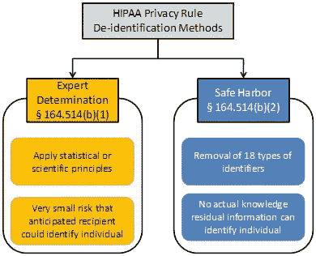

# 医疗保健隐私的生成人工智能

> 原文：<https://pub.towardsai.net/generative-ai-for-healthcare-privacy-22994a4ec8c4?source=collection_archive---------1----------------------->

演职员表:由 [DALLE 2](https://openai.com/dall-e-2/) 生成的 AI

## 什么是生成性人工智能

生成式人工智能是一种人工智能，涉及使用机器学习算法，根据一组输入数据生成新内容。这可以包括生成文本、图像或其他类型的媒体。

生成式人工智能通常涉及在现有内容的大型数据集上训练模型，如文本语料库或图像集。然后，模型使用这种训练来生成与输入数据相似但不是精确副本的新内容。

例如，在人脸图像数据集上训练的生成式人工智能模型可以用来生成新的、以前从未见过的人脸图像。这些生成的图像将具有与训练数据集中的图像相同的一般特征，例如面部的形状以及眼睛和鼻子等特征的位置，但是它们不会是数据集中任何图像的精确副本。这里有一些热门网站，你可以在那里尝试艺术生成人工智能 [nightcafe](https://nightcafe.studio/) 、 [DALL-E 2](https://openai.com/dall-e-2/) 、 [Deep Dream Generator](https://deepdreamgenerator.com/) 、[art breader](https://www.artbreeder.com/)、 [DeepAI](https://deepai.org/machine-learning-model/text2img) 。

生成式人工智能的一个关键优势是它能够在不需要人类输入的情况下创建新内容。这在各种应用中都很有用，例如为营销或广告创建新内容，为机器学习训练生成数据，甚至创建新的艺术作品。生成式人工智能是人工智能的一个重要而快速发展的领域，有可能给许多领域带来革命性的变化。

## 医疗保健中的隐私法规(HIPAA)

[1996 年健康保险便携性和责任法案(HIPAA)](https://www.cdc.gov/phlp/publications/topic/hipaa.html) 是一项联邦法律，它要求制定国家标准来保护敏感的患者健康信息，以免在未经患者同意或患者不知情的情况下被披露。美国卫生与公众服务部(HHS)发布了 HIPAA 隐私规则来实施 HIPAA 的要求。HIPAA 安全规则保护隐私规则涵盖的信息子集。

HIPAA 还通过为两种类型的患者身份取消设置[标准](https://www.hhs.gov/hipaa/for-professionals/privacy/special-topics/de-identification/index.html#standard)来提供关于保护患者隐私的[指导](https://www.hhs.gov/hipaa/for-professionals/privacy/special-topics/de-identification/index.html)。专家判定是一种方法，通过这种方法，专家确定患者身份的统计概率“非常小”。安全港从患者记录中删除了 18 种标识符。这些包括非常重要的信息，如日期和地点。

来源:HHS.gov

## 隐私有什么问题？

医疗保健领域以结构化和非结构化的形式存储数据。我们仍然使用患者记录作为以自由文本形式存储医疗保健信息的主要位置。这些说明包括 HIPAA 隐私规则下的所有类型的潜在可识别信息。这些信息很难轻易从文本中删除，这限制了医疗保健数据在研究中的效用。假设我们在医疗保健数据上训练了一个大型语言模型。GitHub CoPilot 开始从各种编码器生成逐字代码。GitHub 已经因为在训练数据上复制代码和知识产权而面临诉讼。现在，想象一下，如果医疗保健数据的大型语言模型开始使用真实的患者姓名和症状来完成提示！呀!

 [## GitHub CoPilot 遭遇第二起诉讼

### 第二次集体诉讼已于 11 月 10 日提交

ithinkbot.com](https://ithinkbot.com/github-copilot-hit-with-2nd-lawsuit-ed537c0b2c9a) 

## 解决方案:拯救生成模型

允许使用大规模医疗保健数据的理想解决方案是保持关于疾病的完整信息(研究需要)，而不是关于人的信息(可识别)。如果我们可以使用生成模型用虚假信息替换可识别信息，会怎么样？这和类似于[thispersondoesnotexist.com](http://thispersondoesnotexist.com)的网站替换真实身份信息的概念是一样的。理想情况下，它会保留进行分析所需的所有信息，但会模糊任何可识别特定患者的信息。这允许共享信息，而不用担心侵犯患者的隐私。

Syntegra 成立于 3 年多前，有着同样的愿景。根据 Syntegra 的说法，医疗保健尤其是一个垂直领域，生成式人工智能可以减少数据访问的摩擦，减少医生的疲劳，并帮助自动化手动和时间密集型任务。Syntegra 正在开发一种人工智能，它可以允许以一种保持所有统计模式和效用但保证患者隐私的方式共享个人层面的医疗数据。

对医疗保健数据的无摩擦、快速、低负担的访问为研究人员、生命科学公司、保险提供商和数字医疗公司带来了巨大的机遇。如果成功，它可能会推动精准医疗、分析和临床决策支持的创新，并最终加快患者护理的进步。

照片由[岩田良治](https://unsplash.com/@ryoji__iwata?utm_source=medium&utm_medium=referral)在 [Unsplash](https://unsplash.com?utm_source=medium&utm_medium=referral) 上拍摄

## Syntegra 发布医学思维 2.0

2022 年 11 月 30 日，Syntegra [宣布](https://www.syntegra.io/news/syntegra-pushes-the-boundaries-of-generative-ai-in-healthcare-with-recent-tech-updates)发布医疗思维 2.0。Syntegra 的训练数据集包括 2000 多万份病历。这种专有的人工智能能够生成不真实但真实、高保真、隐私有保障的合成医疗保健数据。

## 结束语

鉴于对人工智能的投资以及今年 ChatGPT，DALL-E 和其他大型人工智能模型的突破，医疗保健领域有可能从人工智能冬天中获得喘息之机！作为一名临床科学家，我当然很期待。

更多阅读:

Kasthurirathne SN，Dexter G，Grannis SJ。用于创建合成自由文本医学数据的生成性对抗网络:合作研究和机器学习模型再利用的建议。美国医学协会 Jt 峰会。2021 年 5 月 17 日；2021:335–344.PMID:[34457148](https://www.ncbi.nlm.nih.gov/pmc/articles/PMC8378601/)；PMCID: [PMC8378601](https://www.ncbi.nlm.nih.gov/pmc/articles/PMC8378601/) 。

支持我🔔 ***拍手*** | ***跟随|*** [***订阅***](https://ithinkbot.com/subscribe)***|***[***成为会员***](https://ithinkbot.com/membership) **🔔**

检查我的其他作品—

 [## 人工智能中的领导力:你的领导力适合数据科学吗？

### 可能已经转变为数据科学领导的非技术人员领导通常不熟悉…

pub.towardsai.net](/leadership-in-ai-is-your-leadership-fit-for-datascience-d0e9296be2d6)  [## 谈判的艺术:西塞罗·艾

### 西塞罗·艾在外交的游戏中比人类更能谈判。就像深蓝代表国际象棋，五号代表…

pub.towardsai.net](/the-art-of-negotiation-cicero-ai-6e04354fe990)  [## 什么是 GPT-4(什么时候？)

### GPT-4 是一个自然语言处理模型，由 openAI 作为 GPT-3 的继承者开发

pub.towardsai.net](/what-is-gpt-4-and-when-9f5073f25a6d)