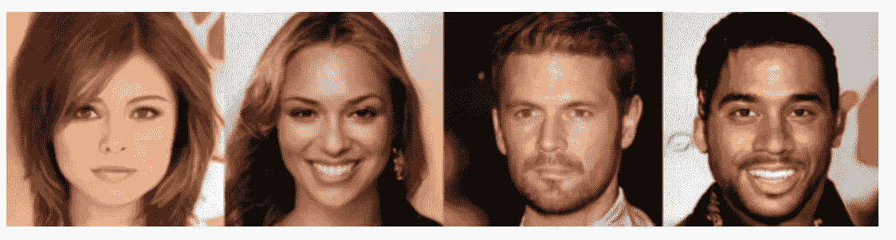
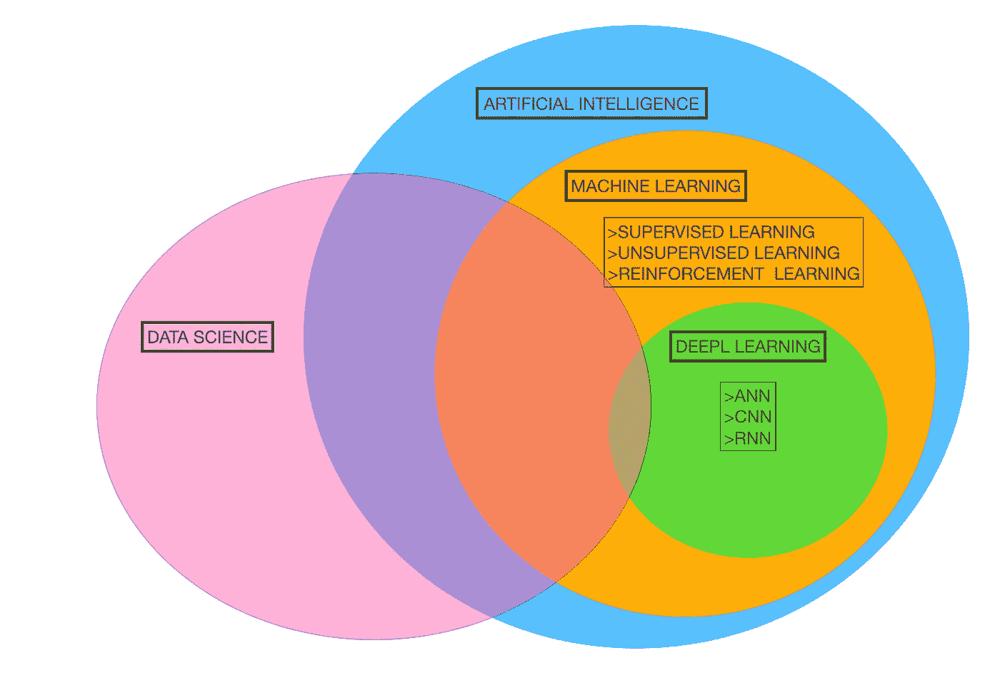
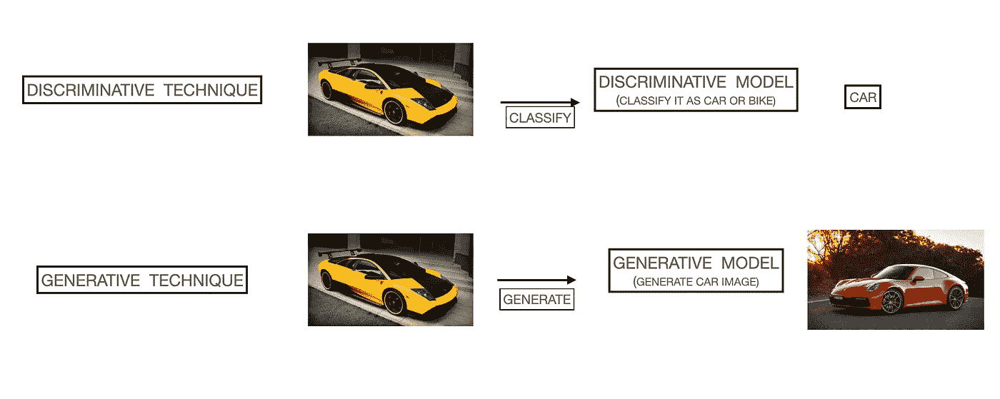
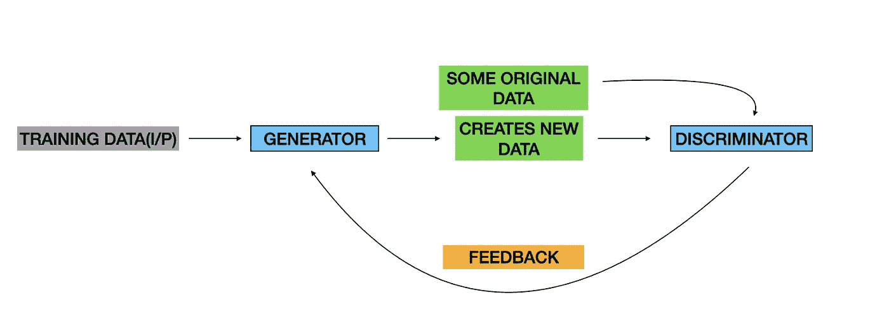

# 生成性人工智能&甘斯

> 原文：<https://pub.towardsai.net/generative-ai-gans-105b0014cb40?source=collection_archive---------3----------------------->

## [人工智能](https://towardsai.net/p/category/artificial-intelligence)

人工智能这个术语是约翰·麦卡锡在 1956 年首次提出的。但是我们用了将近 60 年的时间才在日常琐事中体验到 AI。生成式人工智能是人工智能的一个分支，它从训练的数据中创建新的数据实例，并给出现实生活中的数据实例。3d 头像或 Memojis 用于日常交流。用于创建它们的软件创建了如此逼真的图像和视频，以至于正常的眼睛会认为它是真实的图像。

NVIDIA 使用 GANs(【https://developers.google.com/machine-learning/gan】T2)生成的图像

生成性人工智能是人工智能的一个分支，它使用可用的文本，音频文件，图像，视频来创建一套全新的相同内容，这些内容在其自身意义上似乎是真实和完美的。这些算法理解输入给它的数据中的模式，并从中创建新的版本。生成式 AI 模型主要是无监督的 AI 模型。

人工智能的文氏图

模型理解输入给它的数据中的模式，并从中生成一个新的“项目”。到目前为止，大多数机器学习/深度学习模型都是基于做事的 ***判别模型*** 。判别技术/模型预测条件概率的下一步。这些模型了解数据集中类的边界以做出决定。与之不同的是， ***生成模型*** 致力于寻找数据集的实际分布。他们经常使用贝叶斯定理来预测联合概率。

由于生成模型创建新的数据实例，它们的计算成本很高。用外行人的语言来说，辨别模型辨别数据并回答它，例如，如果图像是汽车或自行车。而创成式模型生成新数据。例如，如果给定汽车的特征，它将生成汽车的图像。对于这些工作，他们工作的相关性和分布是复杂的。

判别模型与生成模型

生成式人工智能有三种著名的工作模式。它们是一般对抗网络(GANs)、自回归卷积神经网络(AR-CNN)和基于变压器的模型。

**一般敌对网络(GANs)**

gan 从训练数据集中发现的模式创建新的输出。在这个过程中，两个神经元相互对抗，产生一个新的输出。这两个神经元分别是**发生器**和**鉴别器**。为了进一步理解这个概念，我们将使用足球队和教练的类比。当球队的 11 名球员第一次相遇时。他们没有以正确的方式比赛，有很多错误，因为每个球员都有自己的比赛风格，自己的战术。所以教练训练球员，给他们一个战术，一个策略，然后球队就像魔术一样打球。对于所有的足球爱好者，请记住巴塞罗那足球俱乐部的 Tiki-Taka 风格！教练是做什么的，观察球队，标记球员的优缺点，游戏性的差距，给他们反馈，即兴发挥一个球队的游戏性？

GAN 工艺

现在将上述类比与 GANs 进行比较。玩游戏的团队是一个发电机。因为它创造了一种新的足球玩法，并发挥了作用。教练是一个鉴别者，因为他会发现长处和短处，并给出反馈以随机应变。鉴别器有两个重要的任务，在数据中鉴别并给出反馈。因此，生成器可以被定义为创建新数据的神经元，该新数据类似于它被训练的数据(在找到潜在的模式之后)。鉴别器可以被定义为在好和坏的数据之间进行鉴别并给出反馈的神经元。

生殖人工智能在亚马逊的一些产品中被广泛使用，其中一个著名的产品是亚马逊 DeepComposer。它是一种使用生成式人工智能来创作音乐的设备。一个没有一点音乐知识的人也能创作出优美的曲子。想要了解更多关于 DeepComposer 的信息，可以访问亚马逊[页面。](https://aws.amazon.com/deepcomposer/)

请随时与我联系:[https://www.linkedin.com/in/aarya-brahmane-4b6986128/](https://www.linkedin.com/in/aarya-brahmane-4b6986128/)

**参考文献:**

一个关于人工智能的必看系列，在 YouTube 上很容易访问。人们可以了解人工智能被用来让世界变得更美好的程度:[https://www.youtube.com/playlist?list = plj q 6 dwyksrzz _ fswippcf 6 V7 p 2 rnanekc](https://www.youtube.com/playlist?list=PLjq6DwYksrzz_fsWIpPcf6V7p2RNAneKc)

[https://developers.google.com/machine-learning/gan](https://developers.google.com/machine-learning/gan)

[https://www . unite . ai/generative-vs-discriminal-machine-learning-models/](https://www.unite.ai/generative-vs-discriminative-machine-learning-models/)