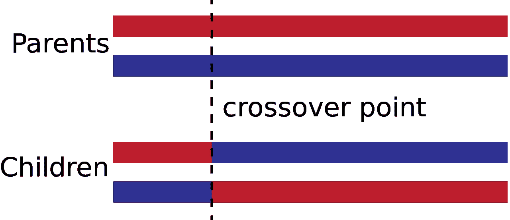
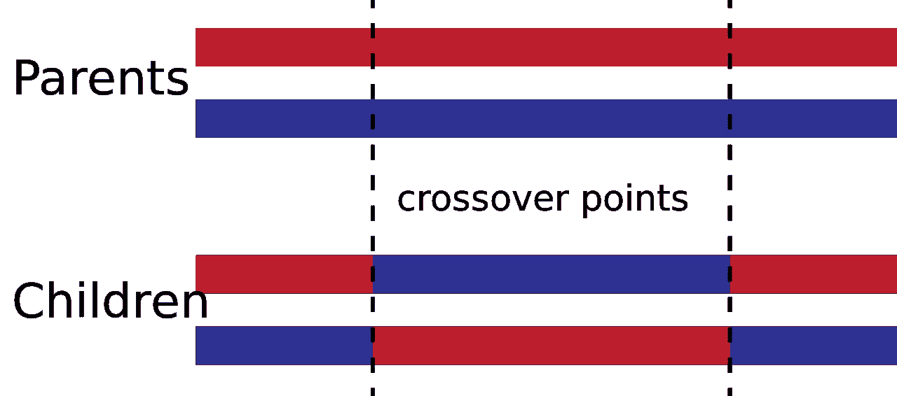
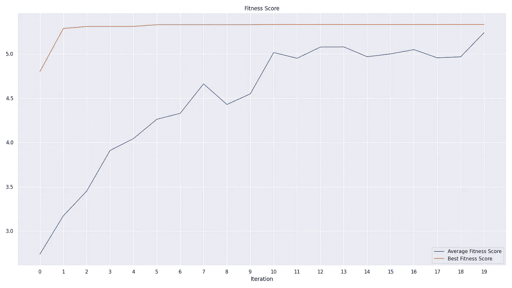
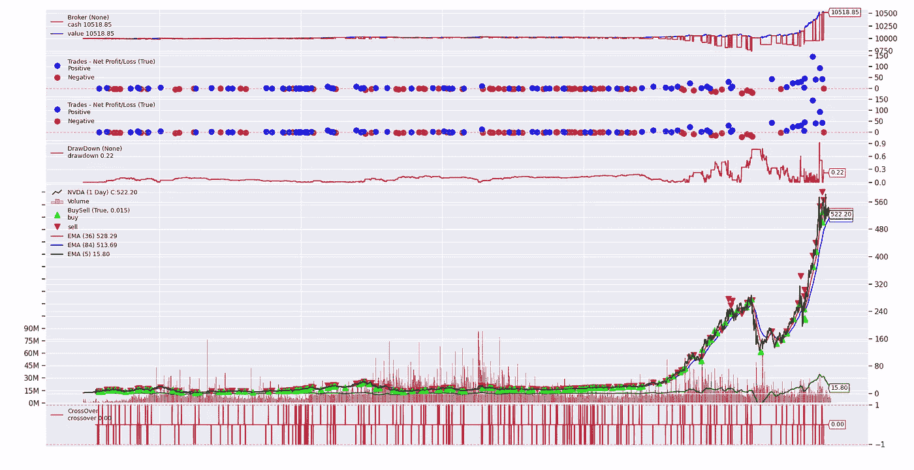

# Python 中交易策略优化的遗传算法

> 原文：<https://pub.towardsai.net/genetic-algorithm-for-trading-strategy-optimization-in-python-614eb660990d?source=collection_archive---------0----------------------->

## [数据科学](https://towardsai.net/p/category/data-mining)、[优化](https://towardsai.net/p/category/optimization)、[编程](https://towardsai.net/p/category/programming)

## 遗传算法如何帮助缩小问题空间并收敛到更好的解决方案？


双螺旋——照片由[丹尼尔·库切列夫](https://unsplash.com/@kuzelevdaniil?utm_source=medium&utm_medium=referral)在 [Unsplash](https://unsplash.com?utm_source=medium&utm_medium=referral) 上拍摄

如果你听说过系统交易或算法交易，那么你一定知道策略的优化是决定策略是否盈亏平衡的最重要因素之一。最糟糕的是:优化的计算量非常大。想象一个简单的 MACD 交叉策略，至少有 3 个参数:快速、慢速和信号移动平均周期，每个参数有几百个可能的值，有一百万种可能的组合。

收入遗传算法(GA):一种概率性和启发式搜索算法，受达尔文的自然选择理论启发，即适者生存。在这篇博客中，我们将使用遗传算法作为优化算法来确定最佳的参数集。我们将用 Nvidia 上的一个简单的 MACD 交叉来说明这一点。**请记住，这只是应用遗传算法优化交易策略的一个演示，不应复制或盲目跟随。**

> 注意:我们将一节一节地讨论代码。如果你觉得很难理解或者把它们粘在一起，不要担心，完整的脚本会在博客的末尾提供。

如果你想了解更多关于如何避免过度适应遗传算法的知识，这里是这篇博客的续篇，重点介绍一些更健壮的遗传算法的技术:

[](https://medium.com/towards-artificial-intelligence/genetic-algorithm-stop-overfitting-trading-strategies-5df671d5cde1) [## 遗传算法——停止过度适应交易策略

### 变异系数如何让遗传算法更稳健？

medium.com](https://medium.com/towards-artificial-intelligence/genetic-algorithm-stop-overfitting-trading-strategies-5df671d5cde1) 

## 什么是遗传算法？

受达尔文进化论的启发，遗传算法是一个迭代过程，用于搜索问题陈述的全局最优解，从获得最佳基因以在严酷的世界中生存，到确定最佳参数，再到本博客上下文中的交易策略。为了更好地理解遗传算法是如何工作的，这里有一个简短的关键概念速成班:

*   **基因:**这是指溶液的一个参数/变量。一个基因通常用一个位(即 0 或 1)来表示，但这可以根据潜在的问题陈述来改变。
*   **个体/染色体:**代表一个解决方案的一串基因。
*   **种群:**一代个体。
*   **适应度函数:**计算个人成功程度(**适应度得分**)的函数。根据潜在的问题陈述，我们可以搜索具有最高或最低适应性分数的个体。拥抱适者生存的概念，适应度得分越好，个体能够生存繁衍形成下一代的几率就越高。
*   **选择策略:**这定义了我们如何比较个体来为下一代选择种子。一些常见的例子有 [**锦标赛**](https://en.wikipedia.org/wiki/Tournament_selection) (随机抽样的个体面对面 1 对 1，获胜者赢得下一代中的一个名额) [**轮盘赌**](https://en.wikipedia.org/wiki/Fitness_proportionate_selection) (被选中的概率与适应度分数成正比)，或者**双重锦标赛**用于更复杂的场景
*   **交叉策略:**这本质上就是繁殖时亲代基因传递给后代的方式。杂交被认为是模仿有性繁殖，繁殖需要双亲。父母的基因将会重组形成后代。虽然不同的策略取决于场景和数据类型，但最常见的两种是 k 点交叉和均匀交叉。在 k 点交叉中，k 个*交叉点*将被随机选择，其中点右侧的基因被交换。统一交换相对来说更简单:每个基因都有相同的机会被交换，而不是交换部分基因。



1 分交叉——归功于[罗兰和](https://commons.wikimedia.org/wiki/File:OnePointCrossover.svg)



两点交叉——归功于[罗兰和](https://en.wikipedia.org/wiki/Crossover_(genetic_algorithm)#/media/File:TwoPointCrossover.svg)

*   **变异策略:**作为保持基因多样性和防止早熟收敛的一种方式，子代的基因会有随机变异的机会，意味着实际值会偏离父代的值。突变通常以[比特翻转](https://deap.readthedocs.io/en/master/api/tools.html#deap.tools.mutFlipBit)、[索引重排](https://deap.readthedocs.io/en/master/api/tools.html#deap.tools.mutShuffleIndexes)或[有界](https://deap.readthedocs.io/en/master/api/tools.html#deap.tools.mutShuffleIndexes)和[无界](https://deap.readthedocs.io/en/master/api/tools.html#deap.tools.mutShuffleIndexes)统计分布的形式出现。

然后将这些关键概念结合起来形成一个迭代算法:

1.  将问题陈述参数化
2.  定义适应度函数
3.  定义交叉、变异和选择策略
4.  生成初始群体
5.  评估群体中个体的适合度
6.  选择个体，交叉和变异，形成下一代种群
7.  重复步骤 5 和 6，直到收敛或满足结束条件

现在我们已经完成了速成课程，让我们看看如何将它应用于交易策略优化。

## 准备

在我们开始之前，让我们确保我们已经安装并准备好了所有的库。除了常用的熊猫、熊猫等，我们还会用到以下的:

*   **Alpha Vantage:** 一家免费的 mium 数据提供商。放心。一个免费的许可证就足够了。
*   **Backtrader:** 一个很棒的开源 python 框架，让你可以专注于编写可重用的交易策略、指标和分析工具，而不必花时间构建基础设施。它还支持回溯测试，让你评估自己想出的策略！
*   **DEAP:**Python 中的分布式进化算法，这是一种用于快速原型和思想测试的新型进化计算框架。

要安装它们，只需运行下面一行:

```
conda create -n myenvconda activate myenv && conda install -y python=3.8.5pip install alpha_vantage backtrader[plotting] deap
```

> 注意:在一个隔离的环境中开始一个新项目总是一个好主意，无论是虚拟环境、conda 环境还是 docker 容器。它有助于保持代码和环境的整洁、可复制性和可移植性。

## 数据采集

有了 Alpha Vantage 的密钥，我们就可以使用下面的代码片段来获取 Nvidia 股票的历史价格，代码为“NVDA”。处理金融股票数据时要记住的一件事是价格调整。例如，特斯拉在 8 月 31 日经历了五对一的分拆。所以拆分前的一股应该是拆分后的五倍左右。这就是为什么我们需要根据拆分和分红事件来调整价格。

幸运的是，Alpha Vantage 的每日调整端点，我们将根据[证券价格研究中心的公式](http://www.crsp.org/products/documentation/crsp-calculations)调整收盘价格。然后，我们可以使用从未调整的开盘价到未调整的收盘价的百分比变化来估计调整后的开盘价、最高价和最低价:如果当天价格的百分比变化为+10%，那么无论调整与否，收盘价都应该是开盘价的 110%。

一旦你运行完这个脚本，`read_alpha_vantage`应该会返回一个数据框，它的前 5 行和后 5 行类似于下面的内容，这取决于你何时查询 Alpha Vantage:

## 反向交易框架

在 Backtrader 中，一个策略需要遵循`backtrader.strategy`的接口。界面中最重要的组件是:

*   `params`:策略使用的参数
*   `__init__`:我们准备数据并定义指标
*   `next()`:这决定了下一步该怎么做

```
import backtrader as btclass CrossoverStrategy(bt.Strategy):
    params = dict()

    def __init__(self):
        # initialise strategy
        # do data prep
        # define indicators
        pass def next(self):
        # trading logic
        pass
```

一个[简单的 MACD 交叉策略](https://altfins.com/knowledge-base/macd-line-and-macd-signal-line/)由四行组成:

1.  收盘的快速(12 天)指数移动平均线
2.  收盘的慢速(26 天)指数移动平均线
3.  MACD 线，快速移动平均线和慢速移动平均线的区别
4.  信号线，MACD 线的 9 天移动平均线

我们还需要在`next()`下输入交易逻辑。简单来说，这种策略将只做多:

*   多头入场:当 MACD 线在信号线上方交叉时
*   多头出场:当 MACD 线穿过信号线下方时

该策略现在需要与我们的数据、策略的追踪器(`bt.observers`)和分析器(`bt.analyzers`)以及佣金和账户余额等其他经纪级别设置一起，被馈送到 Backtrader 的主引擎— `backtrader.cerebro`。

当你执行`run_backtest(plot=True, **STRATEGY_PARAMS)`时，你应该得到这样的结果:


来自反向交易者的结果—图片由作者提供

## 遗传算法参数优化

使用默认参数，Nvidia 的火箭仅制造 73.16 美元，这看起来一点也不乐观。让我们尝试优化参数，看看我们是否可以使它更可行。

基于前面的速成课程，让我们将算法定义如下:

*   **基因:**这应该是我们 MACD 战略的`params`。不幸的是，DEAP 不能很好地处理关键字参数，因为跨越需要索引切片。相反，我们将使用一个`list`来存储参数。
*   **初始群体:**我们的初始群体将有 100 个个体，每个个体的随机整数`fast_period`在`[1, 151)`范围内，`slow_period`在`[10, 251)`范围内，`signal_period`在`[1, 301)`范围内。这意味着总共有 150 x 240 x 300 = 10.8 万种可能的组合。
*   **适应度函数:**为了平衡回报和风险，我们将使用`Total Profit / Maximum Draw Down`作为我们适应度函数的唯一目标。由于 DEAP 是一个通用框架，它支持多目标的适应度函数。因此，该函数需要返回一个健康分数列表。
*   **选择策略:**我们将使用经典的[锦标赛](https://en.wikipedia.org/wiki/Selection_(genetic_algorithm)#Tournament_Selection)方法，每轮锦标赛的获胜者将被选为下一代的种子。
*   **交叉策略:**我们将使用均匀交叉，每个基因有 50%的机会交叉。
*   **突变策略:**我们将在`[1, 101)`范围内使用整数的均匀分布，每个基因的突变概率为 30%。
*   **结束条件:**算法将在完成 20 次迭代后停止。

下面的代码片段是我们的遗传算法在上述设置下的实现。我们还增加了一个名人堂，它将记录算法迭代过程中的最佳个体。

运行该代码片段后，我们得到了以下结果

```
HALL OF FAME:
    0: [36, 84, 5], Fitness: 5.331913978803928
    1: [36, 87, 5], Fitness: 5.329609884401389
    2: [5, 143, 44], Fitness: 5.309777394151804
```



适应性分数在 20 次迭代内收敛-图片由作者提供

从上面的图表中，我们可以看到性能如何在大约 10 次迭代中非常快地收敛到解决方案。这意味着，该算法不是尝试 1080 万个组合的全部，而是仅通过一千次回测运行为我们产生了最佳解决方案的候选，这不到问题空间的 0.1%。这已经是最坏的估计了，假设所有的个体在每一代人中都是不同的。

如果我们将`dict(fast_period=5, slow_period=82, signal_period=38)`的最优解插回到前面包含的回溯测试函数，我们可以看到利润现在是默认 MACD 交叉策略的 7 倍多一点:

```
OPTIMISED_STRATEGY_PARAMS = {
    k: v for k, v in zip(PARAM_NAMES, hall_of_fame[0])}
run_backtest(**OPTIMISED_STRATEGY_PARAMS)
```



遗传算法优化策略的性能—作者图片

## 结论

在这篇博客中，我们介绍了遗传算法的关键概念，并展示了我们如何用它们来优化交易策略。

从历史上看，参数优化对计算能力的要求非常高。在我们的例子中，只有三个参数的简单 MACD 交叉策略已经产生了数百万种可能的组合。即使每个回溯测试可以在 0.01 秒内完成，那也已经是总共 30 小时的计算时间了。随着参数数量的增加，这只会呈指数增长。

使用遗传算法，我们可以在大约 10 次迭代后收敛到全局最优的候选，这小于问题空间的 0.1%。优化的 MACD 策略的表现也比默认参数好得多，利润是原来的 7 倍多。

也就是说，请记住这篇博客仅仅是展示我们如何利用遗传算法作为优化工具，因此一直专注于底层概念和简单的代码结构(这里有)供我们大家尝试。

如果你想了解如何避免过度适应遗传算法，这里是这篇博文的续篇，重点是我们如何利用随机子集选择和变异系数来训练一个更健壮的遗传算法。

[](https://medium.com/towards-artificial-intelligence/genetic-algorithm-stop-overfitting-trading-strategies-5df671d5cde1) [## 遗传算法——停止过度适应交易策略

### 变异系数如何让遗传算法更稳健？

medium.com](https://medium.com/towards-artificial-intelligence/genetic-algorithm-stop-overfitting-trading-strategies-5df671d5cde1) 

这是这个博客的内容。希望你觉得博客或代码有用！如果我错过了什么，或者如果你有任何问题，请随时回复或 pm。如果你对成为更好的 Python 程序员的技巧感兴趣，我为你整理了一份简短博客的列表:

*   [Python 技巧:拉平列表](https://towardsdatascience.com/python-tricks-flattening-lists-75aeb1102337)
*   [Python 技巧:如何检查与熊猫的表格合并](https://towardsdatascience.com/python-tricks-how-to-check-table-merging-with-pandas-cae6b9b1d540)
*   [Python 技巧:简化 If 语句&布尔求值](https://towardsdatascience.com/python-tricks-simplifying-if-statements-boolean-evaluation-4e10cc7c1e71)
*   [Python 技巧:对照单个值检查多个变量](https://towardsdatascience.com/python-tricks-check-multiple-variables-against-single-value-18a4d98d79f4)

如果你想了解更多关于 Python、数据科学或机器学习的知识，你可能想看看这些帖子:

*   [改进数据科学工作流程的 7 种简单方法](https://towardsdatascience.com/7-easy-ways-for-improving-your-data-science-workflow-b2da81ea3b2)
*   [熊猫数据帧上的高效条件逻辑](https://towardsdatascience.com/efficient-implementation-of-conditional-logic-on-pandas-dataframes-4afa61eb7fce)
*   [常见 Python 数据结构的内存效率](https://towardsdatascience.com/memory-efficiency-of-common-python-data-structures-88f0f720421)
*   [与 Python 并行](https://towardsdatascience.com/parallelism-with-python-part-1-196f0458ca14)
*   [数据科学的基本 Jupyter 扩展设置](https://towardsdatascience.com/cookiecutter-plugin-for-jupyter-easily-organise-your-data-science-environment-a56f83140f72)
*   [Python 中高效的根搜索算法](https://towardsdatascience.com/mastering-root-searching-algorithms-in-python-7120c335a2a8)

如果你想了解更多关于如何将机器学习应用于交易和投资的信息，这里有一些你可能感兴趣的帖子:

*   [Python 中交易策略优化的遗传算法](/genetic-algorithm-for-trading-strategy-optimization-in-python-614eb660990d)
*   [遗传算法——停止过度拟合交易策略](https://medium.com/towards-artificial-intelligence/genetic-algorithm-stop-overfitting-trading-strategies-5df671d5cde1)
*   [人工神经网络选股推荐系统](/ann-recommendation-system-for-stock-selection-c9751a3a0520)

[](https://www.linkedin.com/in/louis-chan-b55b9287) [## Louis Chan-FTI Consulting | LinkedIn 数据科学总监

### 雄心勃勃的，好奇的和有创造力的个人，对分支知识和知识之间的相互联系有强烈的信念

www.linkedin.com](https://www.linkedin.com/in/louis-chan-b55b9287) [](https://www.buymeacoffee.com/louischan)