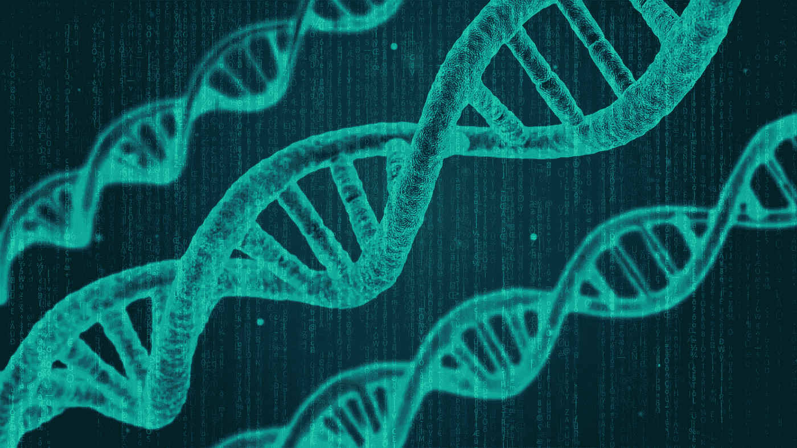
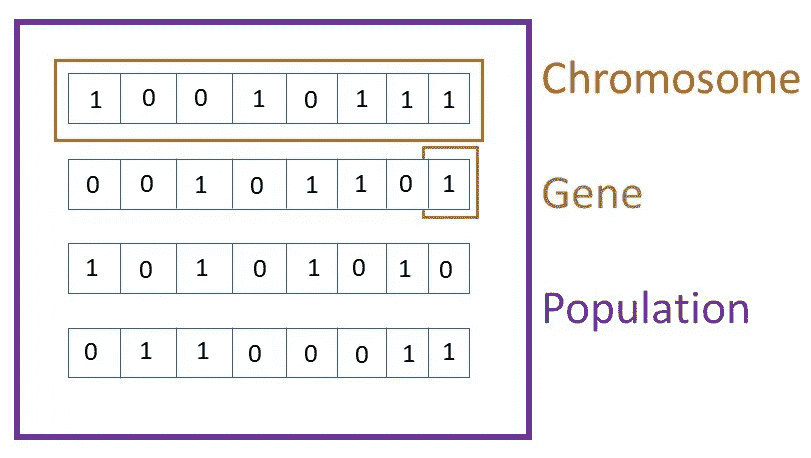
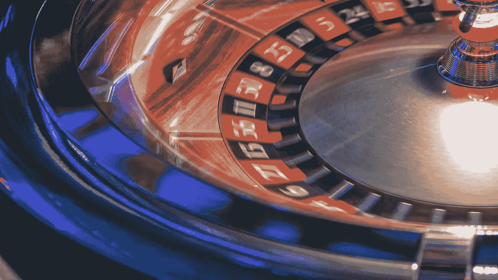
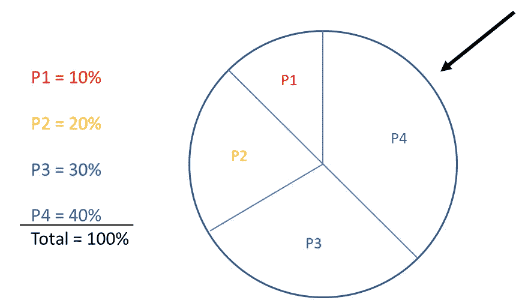
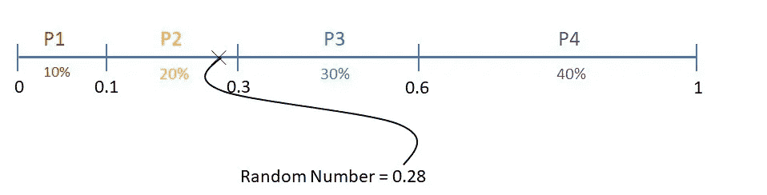
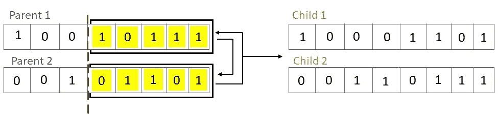
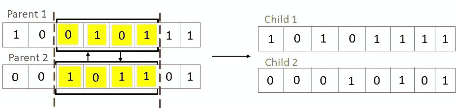
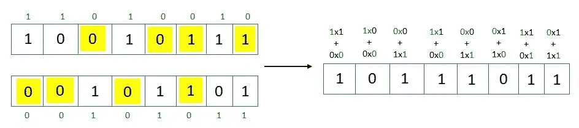
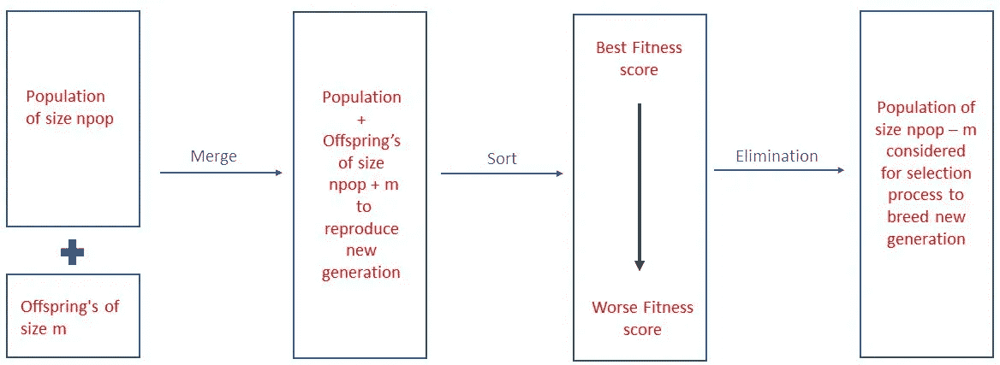

# 遗传算法介绍及示例代码

> 原文：<https://pub.towardsai.net/genetic-algorithm-ga-introduction-with-example-code-e59f9bc58eaf?source=collection_archive---------0----------------------->



来源:由 [Pixabay](https://pixabay.com/images/search/genetics/) 上的[奇摩诺](https://pixabay.com/illustrations/dna-string-biology-3d-1811955/)和[康弗里](https://pixabay.com/illustrations/matrix-code-computer-pc-data-356024/)衍生而来

## [计算机科学](https://towardsai.net/p/category/computer-science)、[编辑](https://towardsai.net/p/category/editorial)、[编程](https://towardsai.net/p/category/programming)

## 遗传算法、优化和 Python 代码示例实现的介绍

**作者:**苏扬·希罗，[罗伯托·伊里翁多](https://mktg.best/vguzs)

他的教程将详细探究遗传算法，并解释它们在 Python 中的实现。我们还将探索每一步所涉及的不同方法。像往常一样，我们包含代码是为了再现的目的。在探索实现过程中涉及的不同步骤时，我们根据需要对代码进行了拆分。

请务必在 [**Google Colab**](https://colab.research.google.com/drive/161ijkvn8wG_seVtQexm-p3fW3r5p8s_x?usp=sharing) 或 [**Github**](https://github.com/towardsai/tutorials/tree/master/genetic-algorithm-tutorial) 上查看本教程的完整实现。

[](https://towardsai.net/backers) [## 加入我们吧↓

### 走向人工智能是一个社区，讨论人工智能，数据科学，数据可视化，深度…

towardsai.net](https://towardsai.net/backers) 

# 什么是遗传算法？

遗传算法属于一类进化算法，它广泛地受到生物进化的启发。我们都知道生物进化——它是父母的选择、繁殖和后代的变异。进化的主要目的是繁殖在生物学上优于父母的后代。遗传算法主要基于达尔文的自然选择进化理论，并且它试图模拟同样的理论。

基本的直觉是从群体中选择最好的个体作为父母，要求他们通过繁殖来延长他们的一代，并在繁殖过程中生育他们的孩子，其中父母双方的交叉基因发生了称为突变的错误。这些孩子再次被要求繁殖他们的后代，这个过程继续下去，导致更健康的一代。这一理论启发了进化计算来解决优化问题、特征选择、经典背包问题等等。

让我们用一个背包问题来理解遗传算法的应用。假设我们正在寻宝，经过所有的努力和辛勤工作，我们终于在一个充满黄金和钻石饰品的洞穴深处找到了宝藏。我们想要做的第一件事就是在背包里装满尽可能多的装饰品。然而，在我们的问题中，有几个参数需要考虑，我们的背包空间有限。它不能承载超过 35 公斤的重量。

接下来，我们必须选择最佳的装饰品，这样背包就不会超载，我们选择的所有装饰品都必须具有很高的价值，并且一个装饰品不应该损坏背包中的另一个装饰品——这就是遗传算法发挥作用，通过照顾所有参数来优化我们的问题。

现在我们对遗传算法有了一个基本的概念。让我们看看涉及的步骤，并用 Python 编写实现代码。

# 遗传算法的步骤

1.  初始化群体
2.  通过评估父母的健康状况来选择他们
3.  杂交父母来繁殖
4.  变异后代
5.  评估后代
6.  将子代与主种群合并并排序

在遗传算法中，优化问题的候选解群体(称为个体、生物或表型)朝着更好的解进化。每个候选解都有一组可以变异和改变的特性(它的染色体或基因型);传统上，解以二进制表示为 0 和 1 的字符串，但其他编码也是可能的[ [2](https://en.wikipedia.org/wiki/Genetic_algorithm) ] [ [3](http://cobweb.cs.uga.edu/~potter/CompIntell/ga_tutorial.pdf) ]”。



图 1:染色体、基因和群体。

# 1.初始化

该算法通常从随机生成的群体开始。人口的多少取决于问题的性质。我们可以使用 0 和 1 编码。然而，在本教程中，我们将使用均匀分布的数字来表示每个基因。

```
# Placeholder for every individual
population = {}# population size
npop = 20
# lower bound
varmin = -10
# upper bound
varmax = 10
# cost function
costfunc = sphere# each inidivdual has position(chromosomes) and cost
for i in range(npop):
   population[i] = {'position': None, 'cost': None}for i in range(npop):
   population[i]['position'] = np.random.uniform(varmin, varmax,          num_var)
   population[i]['cost'] = costfunc(population[i]['position'])
```

我们创建一个字典来保存群体，每个个体都与染色体(*位置*)和一个成本相关联。*位置*用随机产生的均匀分布的数(基因)填充，下限-10，上限+10。*成本*是我们试图优化的成本函数。在本教程中，我们将优化 *x* 的平方和，其中 *x* 是每个染色体的单个基因。

```
# cost function
def sphere(x):
   return sum(x**2)
```

# 2.亲代选择

在每一个连续的世代中，现有种群的一部分被选择来繁殖新一代。通过基于适应度 *-* 的过程[ [2](https://en.wikipedia.org/wiki/Genetic_algorithm) ]选择个体解决方案。因为我们是第 0 代，所以我们没有后代。我们从随机产生的群体中选择父母。有三种主要方法来定义最适合的个体并选择用于育种。

*   **随机选择**:这是最简单也是最低效的选择亲本的方式。在这种方法中，我们通过执行排列来改组种群，并选择前两个个体作为育种的亲本。不推荐这种方法，因为它不符合“达尔文的自然选择进化理论”，即个体是根据其适应性而不是随机选择的。

```
q = np.random.permutation(npop)
p1 = population[q[0]]
p2 = population[q[1]]
```

*   **锦标赛选择**:这种方法基于每个个体的选择概率。我们在随机选择的一组个体中运行几个锦标赛，从每组中选择一个个体作为获胜者，并通过将第一次迭代中的获胜者分组来再次运行锦标赛，重复该过程，直到我们收敛到两个获胜者父母用于繁殖。每次迭代中每组的最佳成员具有最高的选择概率。
*   **轮盘赌轮盘选择**:这是一种广泛使用且最有效的选择父母的方法；因此，我们将在今天的算法中使用它。我们都知道赌场里的轮盘赌是如何运作的，丢球，旋转轮盘，然后等到轮盘停下来，看看球落入哪个锅里。让我们更深入地研究一下实现部分。

# 父母选择的轮盘赌方法



资料来源: [Unsplash](https://unsplash.com/photos/kQW7xY7ponQ)

赌场轮盘赌和用于父母选择的轮盘赌方法之间的唯一区别在于，在赌场轮盘赌中，当轮盘停止旋转时，每个罐具有相等的持球概率。然而，这里我们定义了每个底池(群体中的个体)的概率。每个个体的概率称为个体的适应度。



图 2:轮盘赌轮盘选择过程。

我们有四个亲本 P1、P2、P3 和 P4，被选择育种的概率分别为 0.1、0.2、0.3、0.4。箭头固定在一个地方，轮子旋转。当轮子停止转动时，箭头所指的亲本被选中进行繁殖——轮子上的区域越大，被选中的概率越大。

现在，我们如何编程实现轮盘赌？我们把轮子开成一条均匀的线，把这条线分成种群中的父母数，每个父母在这条线上占据的空间等于其被选中的概率，每个切割点就是概率的累积和。 [**生成一个 0 到 1 之间的随机数**](https://towardsai.net/p/data-science/random-number-generator-tutorial-with-python-3b35986132c7) 会像箭头一样选择要育种的亲本。这里，随机数是 0.28；因此，赢家是 P2。



图 3: [**生成伪随机数**](https://towardsai.net/p/data-science/random-number-generator-tutorial-with-python-3b35986132c7) 选择亲本进行配种。

为了更简单，我们计算每个父母的概率的累积和，用一个随机产生的数乘以它的和。然后得到累计值大于随机数的第一个父代的索引。例如，P1 的累积值为 0.1，P2 为 0.3，P3 为 0.6，P4 为 1。如果产生的随机数是 0.28，那么累积值大于 0.28 的第一个亲本是 P2，因此是育种的获胜亲本。函数 *argwhere* ()根据作为参数传递的表达式返回 Trues 和 Falses 数组。

```
def roulette_wheel_selection(p):
   c = np.cumsum(p)
   r = sum(p) * np.random.rand()
   ind = np.argwhere(r <= c)
   return ind[0][0]p1 = population[roulette_wheel_selection(**probs**)]
p2 = population[roulette_wheel_selection(**probs**)]
```

我们通过负 beta 乘以成本的指数来计算每个父母的概率，其中 beta 是预定义的整数，成本是每个父母的成本除以群体中所有父母的平均成本。

```
# Calculating probability for roulette wheel selection
beta = 1
for i in range(len(population)):
   # list of all the population cost
   costs.append(population[i]['cost'])costs = np.array(costs)
avg_cost = np.mean(costs)
if avg_cost != 0:
   costs = costs/avg_cost
**probs = np.exp(-beta*costs)**
```

# 3.交叉

既然我们已经得到了两个用于育种的亲本，下一步就是进行杂交/交配/育种。交叉是指来自双亲染色体的某些基因重叠、混合或交换以产生新后代的过程。由于后代是双亲染色体交叉的结果，它继承了双亲的特征。有三种方法来执行交叉。

*   **单点交叉**:在这种方法中，双亲染色体在同一个随机点被切割，剩下的部分被交换产生两个新的后代染色体。黄色基因代表染色体的截断部分。



图 4:单点交叉。

*   **两点交叉**:一种类似于单点交叉的方法，唯一不同的是在两个随机点切割亲代染色体。同样，黄色的染色体被切掉的部分被交换了。



图 5:两点交叉。

*   **均匀交叉**:我们首先随机选择哪些基因应该从双亲染色体中遗传，没有遗传的基因用黄色标出。然后，我们将它们建模为 0 和 1，用绿色书写。要遗传的基因编码为 1，不该遗传的基因编码为 0。这一系列的 0 和 1 从现在开始将被称为 alpha。将双亲的基因值与相应的α值相乘，然后将结果相加，生成后代染色体的单个基因。让我们考虑每个亲代染色体的第一个基因。对于 parent-1，基因值为 1，对应的 alpha 值也为 1；于是， **1x1=1** 。对于 parent-2，基因值为 0，相应的 alpha 值也为 0，因此， **0x0=0** 。后代染色体的第一个基因是 **1+0=1，**以此类推——这样，我们得到后代-1，为了繁殖后代-2，我们取α的恭维值并执行相同的过程。



图 6:均匀交叉。

通过编程，我们将两个父变量复制到子变量 c1，c2 中。随机生成 0 到 1 之间均匀分布的 alpha 值，这是父染色体的形状(*位置*)。过程的其余部分保持不变，除了在理论上，我们取 alpha 值的补码来产生后代-2，而在程序中，我们在与 alpha 相乘时交换父代，这与取 alpha 值的补码相同。

```
def crossover(p1, p2):
   c1 = copy.deepcopy(p1)
   c2 = copy.deepcopy(p2) alpha = np.random.uniform(0, 1, *(c1['position'].shape))
   c1['position'] = alpha***p1**['position'] + (1-alpha)***p2**['position']
   c2['position'] = alpha***p2**['position'] + (1-alpha)***p1**['position']   return c1, c2
```

# 4.变化

突变是由于基因的复制或拷贝错误而发生的自然过程。在进行杂交时，我们通过混合匹配双亲的基因来复制双亲染色体。不能保证亲本基因的复制是 100%准确的。总会出现一个错误，这导致了探索的范围。例如，如果你的父母都是棕色眼睛和蓝色眼睛，那很可能是因为在复制你父母的基因时发生了错误而导致的突变，而你的下一代可能会继承这一特征。

改变遗传算法中的染色体是必要的，因为它可能会产生革命性的结果，有助于更有效地解决我们的问题。所以，我们有三个参数:子染色体( *c* )、突变率( *mu* )和步长( *sigma* )。突变率( *mu* )决定了经历突变的子染色体的百分比。

为了定义哪些基因将发生突变，我们生成随机数并将它们与突变率进行比较，然后使用 *argwhere* ()函数找到值小于突变率的子染色体(*位置*)的索引。用通过将步长(*∑*)乘以随机生成的值并将其添加到原始基因而生成的新(突变)基因来替换那些指数。

```
def mutate(c, mu, sigma):
   # mu - mutation rate. % of gene to be modified
   # sigma - step size of mutation
   # mutation = original gene + (step size * random number)      y = copy.deepcopy(c)      # array of True and Flase, indicating the mutation position
   flag = np.random.rand(*(c['position'].shape)) <= mu
   ind = np.argwhere(flag)
   y['position'][ind] += sigma * np.random.randn(*ind.shape) return y
```

# 5.评估后代

一旦后代发生变异，我们需要用代价函数来评估它们，以确定它们的适应度。此外，在每一代/迭代中替换最佳解决方案。

```
# Evaluate first off spring
# calculate cost function of child 1
c1['cost'] = costfunc(c1['position'])if type(bestsol_cost) == float:
  # replacing best solution in every generation/iteration
  if c1['cost'] < bestsol_cost:
    bestsol_cost = copy.deepcopy(c1)else:
   # replacing best solution in every generation/iteration
   if c1['cost'] < bestsol_cost['cost']:
     bestsol_cost = copy.deepcopy(c1)# Evaluate second off spring
if c2['cost'] < bestsol_cost['cost']:
bestsol_cost = copy.deepcopy(c2)
```

# 6.将子代与主种群合并并排序

融合后代对于它们被认为是父母来繁衍下一代是至关重要的。在对新群体进行分类时，我们在顶部找到了更好的个体。由于群体大小与第一次迭代( *npop* )保持不变，与前一次迭代产生的新子代数量相等的排序群体底部的个体数量从选择过程中被淘汰，以繁殖新的子代，该过程继续——这就是淘汰过程的发生方式。



图 7:合并、排序和消除的过程。

# 结果

要运行的迭代次数取决于问题的性质。在本教程中，我们运行 500 次迭代。


图 8:生成遗传算法(GA)实现的结果。

我们可以看到在每次迭代中成本是如何降低的，在大约 490 次迭代中，成本降低到 0.134，并且在其余的 10 次迭代中保持不变。因此，给出了我们的最优解。

**免责声明:**本文表达的观点仅代表作者个人观点，不代表卡内基梅隆大学或其他(直接或间接)与作者相关的公司的观点。这些文章并不打算成为最终产品，而是当前思想的反映，同时也是讨论和改进的催化剂。

**所有图片均来自作者，除非另有说明。**

通过 [**向 AI**](https://towardsai.net/) 发布

# 资源

## 教程伙伴

[**Github 资源库**](https://github.com/towardsai/tutorials/tree/master/genetic-algorithm-tutorial) 。

[**Google Colab 实现**](https://colab.research.google.com/drive/161ijkvn8wG_seVtQexm-p3fW3r5p8s_x?usp=sharing) **。**

## 进一步学习

[**Youtube 上的 Yarpiz**](https://www.youtube.com/c/YarpizProjects/videos)

# 参考

[1]“进化”。2021.En.Wikipedia.Org。【https://en.wikipedia.org/wiki/Evolution. 

[2]“遗传算法”。2011.En.Wikipedia.Org。[https://en.wikipedia.org/wiki/Genetic_algorithm](https://en.wikipedia.org/wiki/Genetic_algorithm)。

[3]遗传算法教程，Darrel Whitley，2021。Cobweb.Cs.Uga.Edu。[http://cobweb . cs . uga . edu/~ Potter/compin tel/ga _ tutorial . pdf .](https://ibug.doc.ic.ac.uk/media/uploads/documents/courses/GeneticAlgorithm-tutorial.pdf)