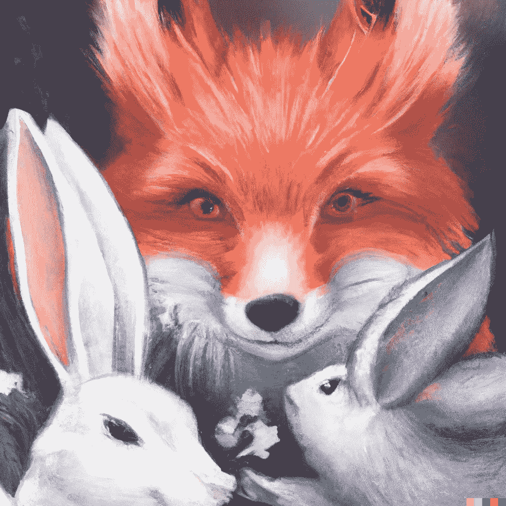
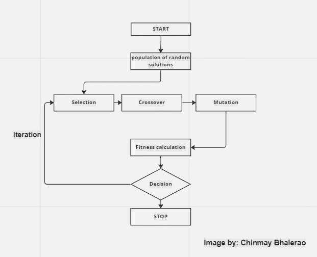
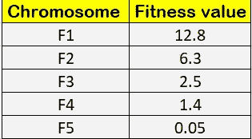
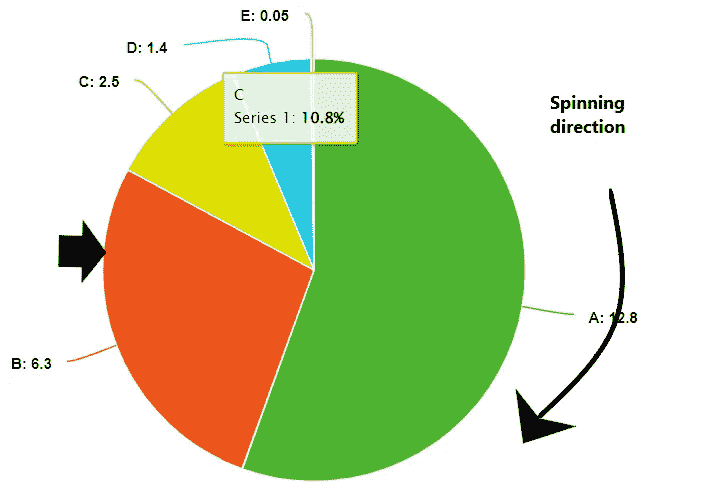
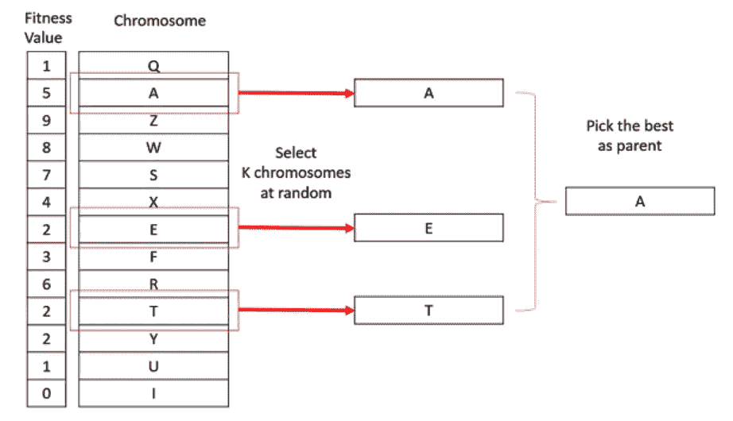
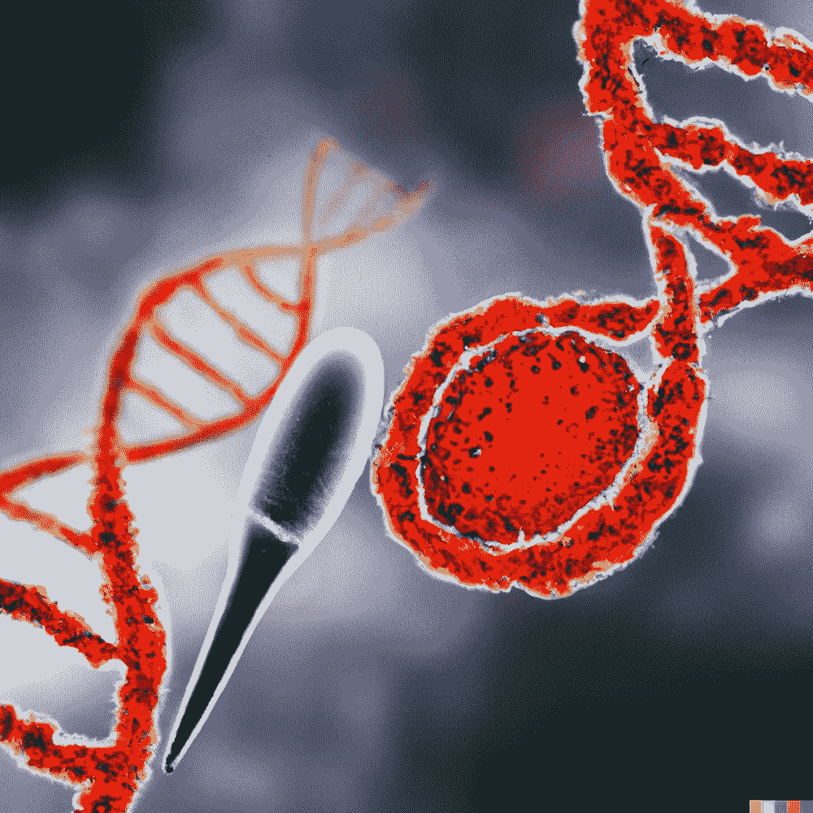
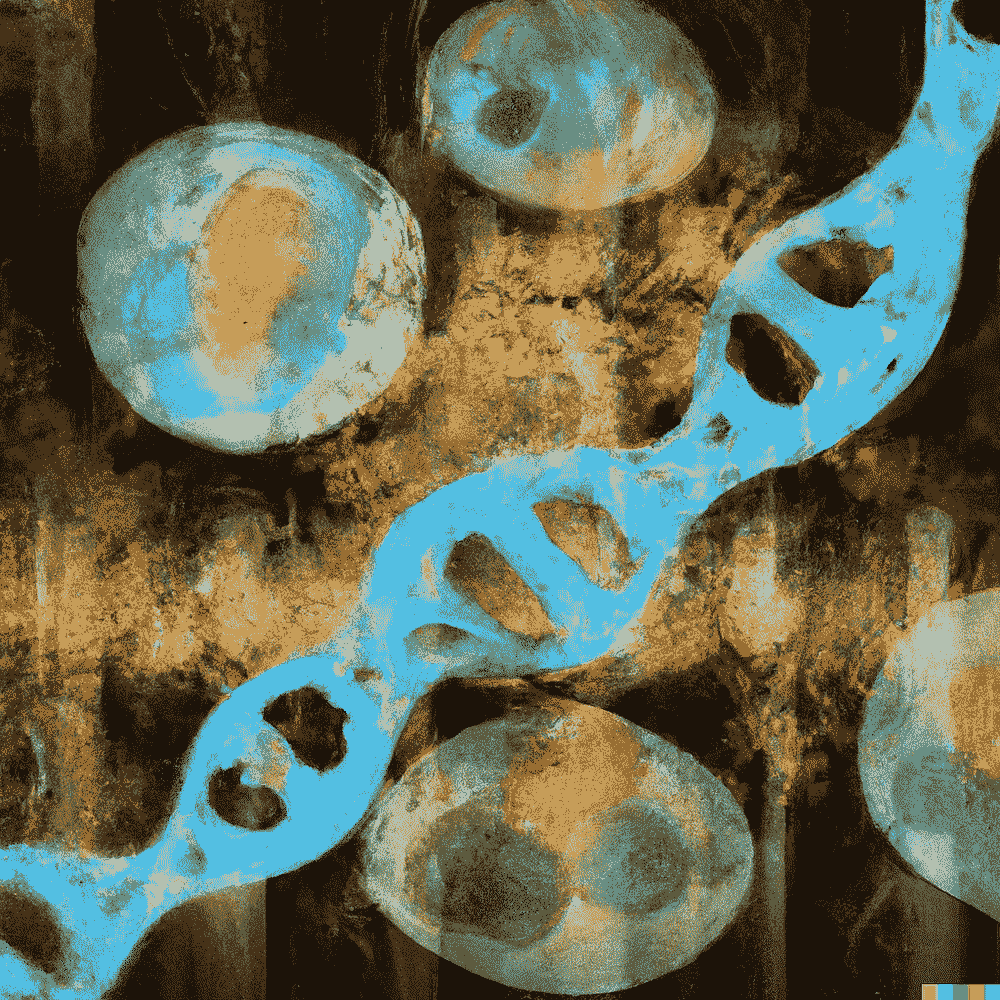
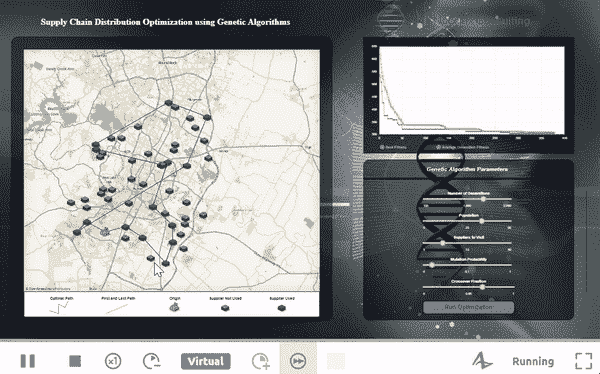

# 遗传算法优化

> 原文：<https://pub.towardsai.net/genetic-algorithm-optimization-8299856949d3?source=collection_archive---------1----------------------->

## 进化和自然启发优化算法的详细解释

在 [Unsplash](https://unsplash.com?utm_source=medium&utm_medium=referral) 上由 [Sangharsh Lohakare](https://unsplash.com/@sangharsh_l?utm_source=medium&utm_medium=referral) 拍摄的照片

> “环境选择了那些增强生存的少数突变，导致一种生命形式向另一种生命形式的一系列缓慢转变，这就是新物种的起源。”- **卡尔·萨根，1934–1996**

> 编辑:这篇文章被选为本周最佳文章，并被刊登在 TowardsAI 周刊上。"

# 演变

**自然选择**和**生物进化**的概念改变了思考进化论的视角。进化总是一个缓慢而渐进的过程，需要几个世纪的时间。今天地球上存在的数以百万计的物种都是由一个单一的原始生命形式通过一个叫做物种形成的分支过程而产生的。随着时间的推移，复杂的生物自然地从更简单的祖先进化而来。简而言之，当生物遗传密码中发生随机基因突变时，有益的突变会被保留下来，因为它们有助于生存——这一过程被称为**“自然选择”**

Johannes Plenio 在 [Unsplash](https://unsplash.com?utm_source=medium&utm_medium=referral) 上拍摄的照片

**DNA** 随时间变化有不同的突变和随机遗传的组合，是亲本 DNA 和突变行为的重组。这可以用**概率论**和**随机过程**中的工具方便地描述。

> **“进化是成千上万个半随机事件的聚合，以及繁衍或死亡的自然压力”——达尔文进化论**

“模拟自然选择”:Primer 的 youtube 视频

为了理解进化，有一个关于**猎物**和**捕食者**系统的很好的例子。狐狸吃兔子，跑得快的兔子会保住自己的性命，而跑得慢的兔子更有可能被抓住。给定一个种群，更聪明、更敏捷的个体不太可能被狐狸吃掉。因此，它们可以继续繁殖，这是兔子最擅长的。一些智力较低、行动较慢的兔子也偶然成功了。随着剩下的种群开始繁殖，产生了兔子遗传物质的良好组合。

狐狸和兔子随着时间进化。E

一些慢兔和快兔繁殖，一些快兔和快兔繁殖，除此之外，大自然通过突变兔子的一些遗传物质，每隔一段时间就扔进一只野兔子。因为更多更快更聪明的父母从狐狸那里幸存了下来，所以最终的兔子(平均来说)比原来那组更快更聪明。好消息是狐狸也在经历类似的过程。否则，兔子将会发展成为狐狸难以捕捉的又快又聪明的动物。

# **遗传算法优化**

气体最早是由[T5【霍兰德】T6](https://en.wikipedia.org/wiki/John_Henry_Holland)在 20 世纪 60 年代提出的。遗传算法结合了由自然选择过程提出并受其启发的方法。正如我在上面的例子中提到的，最适者生存的机会或概率更大。GA 也一样。在众多的解决方案中，适应度越高的人生存的机会就越大。让我们开始实际了解遗传算法。让我们了解基本术语。

## **遗传算法术语**

> **亲本** : *产生后代的亲本。当代的一员。*
> 
> **后代** : *又称孩子。后代是下一代的成员*
> 
> **群体** : *群体是展现相似基因结构的所有可能解或染色体的集合*
> 
> **健康** : *健康是分配给个人的一个数字，代表一种良好的度量。越健康，生存和繁殖的机会就越多。*
> 
> **染色体** : *染色体是由两个或多个版本的 DNA 序列(等位基因)之一构成的基因组成的一组可能解的编码形式。*
> 
> **交叉** : *交叉一般是两个父母通过基因交换产生两个后代的现象。*
> 
> **突变** : *突变是一个基因的值随机变化我们翻转一点，把 0 变 1，1 变 0。*
> 
> **世代** : *世代是一个连续产生的群体。在遗传算法中，它也被称为“迭代”。*

**遗传算法概述**

*   遗传算法首先定义一个适当的问题陈述，并创建一组初始的可能的解群体。
*   群体是随机产生的染色体。像进化过程一样，自然选择的过程开始了。
*   在连续的世代中，群体中的染色体被评定适合度或成为解决方案的机会。
*   现在，基于对它们的适应值的评估，使用选择操作，然后进行交叉和变异，形成新的染色体组。

遗传算法程序的基本流程[图片由作者提供]

# 选择

遗传算法操作的第一个重要步骤是选择。你可能有一个问题！我们选择什么？这个问题我来回答。最合适的解决方案或最合适的后代/孩子是我们的目标。为此，很明显，我们必须根据其适合度来选择亲本。如果我们有群体**“X”**，那么选择会创建一个中间群体**“X”****【X _ hash】**，带有 X 染色体的副本。更适合的染色体会有更多的副本！！！在此之后，选择机制开始。

选择操作以两种方式进行:

1.  **轮盘选择**

你从赌场或者赌博中知道 [**轮盘**](https://en.wikipedia.org/wiki/Roulette) 这个词吧？这是一个非常相似的概念。在赌博中，我们有轮子，我们预测数字。也就是说，骰子是否会落在预测的数字上！在 GA 轮盘选择中，轮盘是相同的。只是在固定点引入了一个停止点。染色体在饼图或轮盘上的值正好等于它的适应度。

染色体及其适应值[图片由作者提供]

很明显，身体更健康的人在轮子上有更大的馅饼，当轮子旋转时，在固定点前面着陆的机会更高。因此，**个体选择的可能性与他们的适应度直接相关**。

轮盘赌轮盘选择程序。具有最高适应值的染色体倾向于在饼图上占据更多的空间，并且更有可能被选中[图片由作者提供]

*   计算适合度的总和。
*   生成一个介于 0 和总和[S]之间的随机数。
*   计算 p 的部分和。
*   P 超过 S 的染色体是被选择的个体。

**总和** = F1 + F2 +F3+F4 + F5

**选择**=(F1+F2+F3+F4+F5)/求和**<P<**(F1+F2+F3+F4+F5)/求和

2.**锦标赛选拔**

在 **N** 路锦标赛中，我们从人群中随机选择 N 个人，我们选择其中最好的成为父母。使用与前面相同的过程选择下面的父代。由于它的功能，即使适应值为负，锦标赛选择是一个非常常见的文学装置。

比武选拔程序【图片来源 [**此处**](https://www.tutorialspoint.com/genetic_algorithms/genetic_algorithms_parent_selection.htm)

# 交叉

交叉是我们结合双亲性质的操作。两个亲代染色体的特征以这样一种方式混合在一起，可能会有好的染色体后代。

> 交叉算子在开发和探索之间有一个平衡的作用，这将允许从双亲中提取特征，并希望产生的后代拥有双亲的良好特征。

交叉通常应用于概率较高的遗传算法[***【PC】***]。根据交叉的位置，交叉分为多种类型:

*   [**一点交叉**](https://www.geeksforgeeks.org/crossover-in-genetic-algorithm/)
*   [**两点交叉**](https://www.geeksforgeeks.org/crossover-in-genetic-algorithm/)
*   [**均匀交叉**](https://www.geeksforgeeks.org/crossover-in-genetic-algorithm/)
*   [**算术交叉**](http://Arithmetic crossover)
*   [**启发式交叉**](http://www.tomaszgwiazda.com/heuristicX.htm)

而其他类型的跨界车，参考 [**这个。**](http://www.tomaszgwiazda.com/heuristicX.htm)

如果你有关于如何选择类型和交叉概率的问题，那么你可以参考 [**这个**](https://www.sciencedirect.com/topics/engineering/crossover-probability) 环节的关于交叉概率的综合论文。

# 变化

据***国家地理报道，突变是基因结构的变化，是遗传的单位。基因由脱氧核糖核酸(DNA)组成，DNA 是一种由称为核苷酸的建筑块组成的长分子。每一个核苷酸都是由四个不同的称为碱基的亚单位组成的。这些碱基被称为鸟嘌呤、胞嘧啶、腺嘌呤和胸腺嘧啶。基因在其核苷酸序列中携带信息，就像句子在其字母序列中携带信息一样。***

**在 GA 中，变异是我们确保**搜索空间** e 永远不会为零的步骤。我们知道，在传统的优化算法中，如[梯度下降](https://en.wikipedia.org/wiki/Gradient_descent)，总有一种概率会停留在**局部最大值/最小值**并将其作为最终解。为了克服这种情况，采取了这种额外的突变努力，这有助于避免粘在局部凸起上。**

********

**突变和变异的 DNA【图片由作者创建，由 [Dall。E](https://openai.com/dall-e-2/)**

**从本质上说，突变概率衡量的是不相关的随机染色体片段翻转并变成不同的东西的可能性。例如，如果你的染色体编码为长度为 100 的二进制字符串，并且你的突变风险为 1%，这表明，平均而言，随机选择的每 100 位中有 1 位会发生翻转。交叉通常以多种方式在 GAs 中进行，本质上类似于人类生殖中的有性遗传重组。**

# **结束**

**重复 GA 的迭代过程，直到达到终止条件，**

*   **达到用户定义的阈值标准**
*   **达到了固定的迭代次数**
*   **用尽了最大数量的可能解决方案**
*   **达到最大健康值**
*   **计算能力终止标准**

**这只是对遗传算法的理论概述，但我计划进行一个案例研究来实现遗传算法。如果你想通过遗传算法用代码解决一个简单的数学问题，那么请参考 [**这篇**](https://towardsdatascience.com/genetic-algorithm-explained-step-by-step-65358abe2bf) 关于遗传算法的内容丰富的博客，作者是 [**尼兰詹·普拉马尼克博士**](https://medium.com/@niranjanpramanik?source=user_profile-------------------------------------)**

**你可以在这里 模拟 [**以上的进化过程。**](https://labs.minutelabs.io/evolution-simulator/#/s/1/viewer?intro=)**

****Anylogic** 模拟了供应链配送路线问题【车辆路线问题】并使用遗传算法解决。**

****

**用遗传算法模拟供应链配送路线问题[车辆路线问题]的解决方案。【演职员表: [**此处**](https://cloud.anylogic.com/model/3437db48-cfb1-4fcd-8548-31ac5d15cfe2?mode=SETTINGS)**

**你可以在这里 得到这个模拟 [**。**](https://cloud.anylogic.com/model/3437db48-cfb1-4fcd-8548-31ac5d15cfe2?mode=SETTINGS)**

**[**any logic cloud**](https://cloud.anylogic.com/models)有很多基于现实生活场景的不同而有趣的模拟你可以在这里**查看。****

# ****如果你觉得这篇文章很有见地****

****如果你觉得这篇文章很有见地，请关注我的 [**Linkedin**](https://www.linkedin.com/in/chinmay-bhalerao-6b5284137/) 和 [**medium**](https://medium.com/@BH_Chinmay) 。你也可以 [**订阅**](https://medium.com/@BH_Chinmay) 在我发表文章的时候得到通知。让我们创建一个社区！感谢您的支持！****

# ****如果你想支持我:****

****作为你的关注和鼓掌是最重要的事情，但你也可以通过买咖啡来支持我。 [**咖啡**](https://www.buymeacoffee.com/chinmaybhalerao) **。******

# ****你也可以阅读我的博客****

**** [## 代码行数最少的聊天机器人

### 最简单的聊天机器人和自然语言处理

pub.towardsai.net](/a-chatbot-with-the-least-number-of-lines-of-code-a42e3ba9d974)  [## 联邦学习简介

### 通过联合学习实现数据隐私和安全

pub.towardsai.net](/an-introduction-to-federated-learning-7bed7dfa34bd)  [## “更好地理解人类”:认知科学与人工智能

### “更好地了解人类”…。

medium.com](https://medium.com/3-minute-thoughts/to-understand-humans-better-cognitive-science-and-ai-40a709d3f891)  [## 光学字符识别:机器令人难以置信的阅读能力

### 如果您有数以千计的纸质文档和表格，并且希望以数字方式存储，该怎么办！键入每个单词会有所帮助…

medium.com](https://medium.com/mlearning-ai/ocr-the-incredible-reading-capability-of-machine-1bc120280ea9) 

## 参考资料:

[**1】实数编码遗传算法**](https://engineering.purdue.edu/~sudhoff/ee630/Lecture04.pdf)

[**2】关于利用新的杂交算子增强遗传算法**](https://arxiv.org/ftp/arxiv/papers/1801/1801.02335.pdf#:~:text=The%20process%20of%20crossover%20ensures,be%20better%20than%20the%20parents.)

[**3】求解有容量限制的车辆路径问题的优化交叉遗传算法**](https://www.sciencedirect.com/science/article/pii/S0307904X11005105#b0145)

【图片作者由 [Dall 创作。E](https://openai.com/dall-e-2/)****