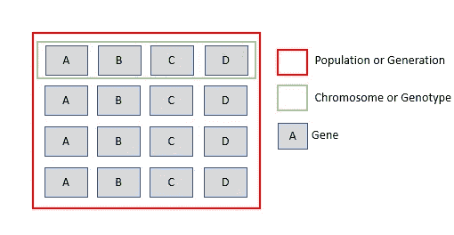
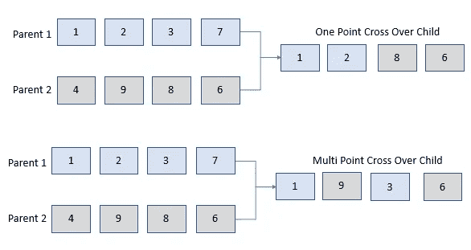
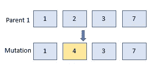
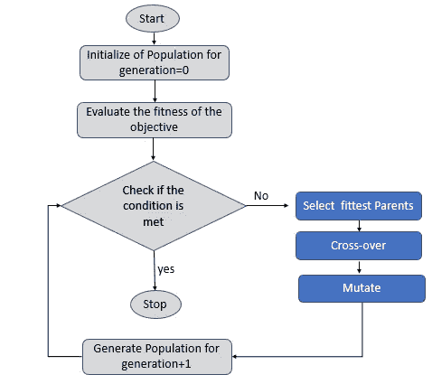
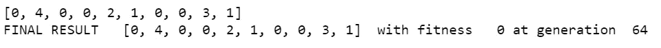

# 遗传算法优化算法

> 原文：<https://pub.towardsai.net/genetic-algorithm-optimization-algorithm-f22234015113?source=collection_archive---------0----------------------->

## [计算机科学](https://towardsai.net/p/category/computer-science)

## 一种受自然进化(如选择、变异和交叉)启发的优化算法

***了解遗传算法，它在人工智能中扮演什么角色，它是如何工作的，最后，看一个实现。***

> 遗传算法(GA)是一种进化算法(EA)，受查尔斯·达尔文的自然选择理论的启发，该理论支持适者生存。

根据自然选择理论，最适合的个体被选择来产生后代。然后，最适合的父母的特征通过交叉和变异传递给他们的后代，以确保更好的生存机会。

**遗传算法是一种随机搜索算法，通过模仿生物启发的自然选择过程，如选择、交叉和变异，生成高质量的优化解决方案。**

> 遗传算法的目标是从搜索空间中找到最佳的*解*

## 遗传算法术语

在我们深入研究遗传算法的工作原理之前，我们将简要了解遗传算法中使用的术语。



**世代或群体**包含随机搜索过程开始的一组可能的解决方案。遗传算法将迭代多代，直到找到一个可接受的和优化的解决方案。第一代是随机生成的。

**染色体**代表一代或群体中存在的一个候选解。染色体也被称为**基因型**。

一条染色体由包含最优变量值的**基因**组成。

**表现型**是由遗传算法处理的基因型的解码参数列表。将作图应用于基因型以转化为表型。

**适应度函数或目标函数**评估每一代的个体解或表型，以识别最适合的成员。

## 不同的遗传算子

**选择是从一个种群中选择最适解的过程，然后最适解作为下一代解的父代**。这使得下一代可以自然地继承强大的功能。可以使用基于适合度值的轮盘赌选择或等级选择来执行选择。

**当来自两个最适合的亲本的基因被随机交换以形成新的基因型或解决方案时，交换或重组就发生了**。基于交换的亲本基因片段，交换可以是单点交换或多点交换。



在通过选择和交叉产生一个新群体后，它通过变异被随机修改。突变**是使用随机过程修改基因型的过程，以促进群体的多样性，从而找到更好的优化解决方案。**



## 遗传算法的工作原理



遗传算法工作

**为第 0 代**初始化种群:GA 从为一个问题创建一个随机产生的可能候选解的初始种群开始。

**基于目标函数或适应度函数评估这一代中的每个解决方案。**

检查是否满足终止条件。终止条件可以是以下任何条件

1.  当算法已经生成预定义的世代时
2.  当我们的适应度函数达到预定的目标值时

如果不满足终止条件，则**为下一代生成群体:**

最适合的群体成员被识别、排序并被选择作为下一代的父母。下一代的基因型是通过交叉和变异等遗传操作产生的。

遗传算法传播成功的解决方案，并且应该产生越来越有能力的解决方案群体。

## 遗传算法在人工智能中的应用

遗传算法用于搜索和优化，使用迭代过程从多个解决方案中获得最佳解决方案。

*   在深度学习中，遗传算法可以有效地为深度学习模型找到一组好的超参数及其值，以提高其性能。
*   还可以使用遗传算法来选择最佳数量的特征，用于构建对预测目标变量很重要的机器学习模型。

## 遗传算法的优势

*   求解复杂优化问题的通用框架。
*   在相对较短的计算时间内探索搜索空间。
*   可以很容易地包括多个复杂的优化目标
*   对局部最小值和最大值具有鲁棒性，并且易于发现全局最优值
*   GA 可以很容易地并行化

## 遗传算法的实现

在这里，我们将找到一个最佳解决方案来生成一个数组，该数组的数字范围在 0 到 9 之间，其和小于或等于 11。

**导入所需的库并设置常量**

```
**import numpy as np
from random import randint, random, choice**
**TARGET=11
generations=1000
NO_OF_BEST_SOLUTIONS=5
NO_OF_SOLUTION_IN_A_GENERATION=10
SIZE_OF_A_SOLUTION=10
LOWER_RANGE=0
UPPER_RANGE=10**
```

**随机生成一个群体**

```
**def generate_population(no_of_solution, size, lower, upper):
    solution = []
    population=[]
    for i in range(no_of_solution):**
        #Create a chromosome or solution for the population.        
       ** solution=[randint(lower,upper) for x in range(size) ]       
        population.append(solution)
    return population**
```

**定义适应度函数**

适应度函数将返回单个解决方案和预定义目标之间的绝对差值。

```
**def fitness(individual):**
   """
   Determine the fitness of an individual. Lower is better.
   individual: the individual to evaluate
   """
   **total_list_sum = sum(individual)
   return np.abs(total_list_sum - TARGET)**
```

对群体进行排序，使具有最低绝对差异的单个解决方案位于列表顶部，因为它们是群体中的最佳解决方案

```
**def sort_population_by_fitness(population):
    return sorted(population, key=fitness, reverse=False)**
```

**用两个最合适的双亲的杂交创造一个孩子**

通过随机选择第一个亲本的一部分和第二个亲本的一部分来组合来自两个最适合的亲本的基因，从而产生交叉

```
#the most common technique is to pick a part of the bit string of A and a part of bit string of B
**def crossover(individual_a, individual_b):
    new_list=[]
    first=randint(2,8)
    new_list= individual_a[:first] + individual_b[first:]
    return new_list**
```

**通过突变创造一个孩子**

突变是通过随机翻转群体中最适合的双亲之一的选定位来实现的。

```
#you can simply flip randomly selected bits of the individual string
def mutate(individual):
    new_list=[]
    first=randint(0,9)
    second=randint(0,9)
    third=randint(0,9)
    individual[first]=randint(0,9)
    individual[second]=randint(0,9)
    individual[third]=randint(0,9)
    return individual
```

**创造新一代人口**

通过从上一代中选择最合适的亲本，应用交叉和变异来产生新一代。

```
**def make_next_generation(previous_population):
    next_generation = []
    sorted_by_fitness_population = sort_population_by_fitness(previous_population)
    population_size = len(previous_population)

    for i in range(population_size):
        # find the least loss in the fitness function among the population
        for j in range(0,NO_OF_BEST_SOLUTIONS):
            pick_best_parents= randint(0,NO_OF_BEST_SOLUTIONS-2)
            parent_1=sorted_by_fitness_population[pick_best_parents]
            parent_2=sorted_by_fitness_population[pick_best_parents+1]
            best_parent_1=sorted_by_fitness_population[0]
            best_parent_2=sorted_by_fitness_population[1]
        draw = choice(["crossover", "mutate_parent1", "mutate_parent2", "Parent 1", "Parent 2","best 1", "best 2" ])
        if draw=="crossover":
            individual = crossover(parent_1, parent_2)
        elif draw=="mutate_parent1":
            individual = mutate(parent_1)
        elif draw=="mutate_parent2":
             individual = mutate(parent_2)
        elif draw=="Parent 1":
             individual =parent_1
        elif draw=="Parent 2":
             individual =parent_2
        elif draw=="best 1":
             individual =best_parent_1
        elif draw=="best 2":
             individual =best_parent_2

        next_generation.append(individual)

    return next_generation**
```

**遗传算法**

首先，我们初始化第 0 代的解，然后基于适应度函数评估这一代中的每个解。

检查是否满足终止条件。如果不满足终止条件，则生成下一代解决方案。

```
# start with a population
**best_solution=[]
population_data=generate_population(NO_OF_SOLUTION_IN_A_GENERATION,SIZE_OF_A_SOLUTION,LOWER_RANGE, UPPER_RANGE)**# find the least loss in the fitness function among the population
**best_individual = sort_population_by_fitness(population_data)****if fitness(best_individual[0])<=1:
    best_solution=best_individual[0]
else:
    for gen in range(generations):**

        **population_data=make_next_generation(population_data)
        best_individual = sort_population_by_fitness(population_data)
        print(best_individual)
        if fitness(best_individual[0])<=1:
            best_solution=best_individual[0]
            print(best_solution)
            break****print("FINAL RESULT  ", best_solution,  " with fitness ", fitness(best_solution), "at generation ", gen)**
```



## 结论:

遗传算法是一种受生物启发的算法，用于解决优化和搜索问题。通过选择、交叉和变异，最适合的父母的特征被传递给下一代。

## 参考资料:

[使用可变长度遗传算法的深度学习中的高效超参数优化](https://arxiv.org/pdf/2006.12703.pdf)

[](https://www.sciencedirect.com/topics/engineering/genetic-algorithm) [## 遗传算法

### 遗传算法是一种随机搜索算法，被开发用来模仿…

www.sciencedirect.com](https://www.sciencedirect.com/topics/engineering/genetic-algorithm) 

[https://en.wikipedia.org/wiki/Genetic_algorithm](https://en.wikipedia.org/wiki/Genetic_algorithm)