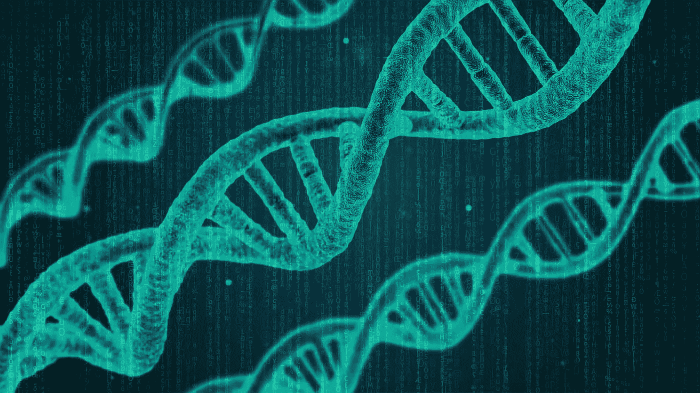
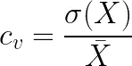
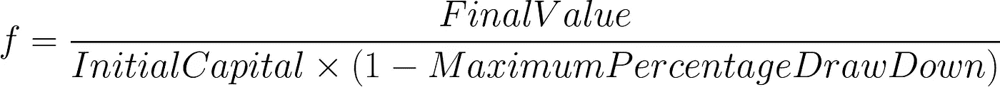
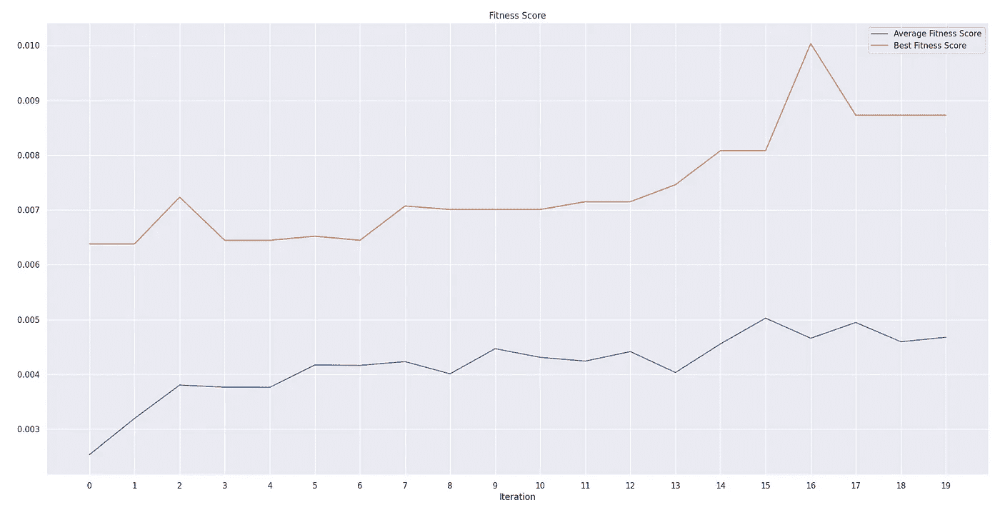
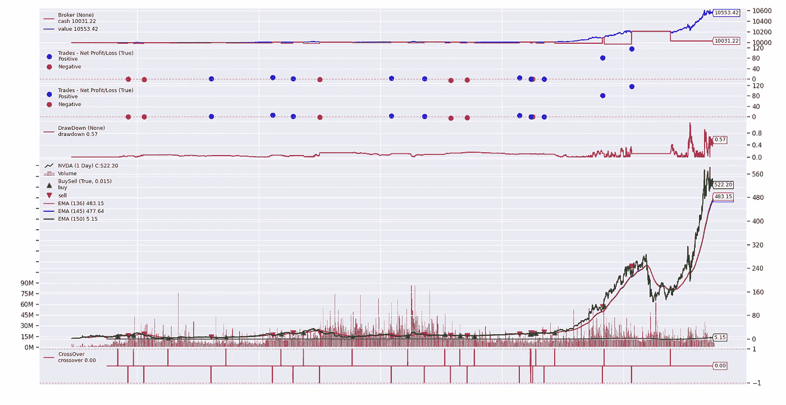

# 遗传算法——停止过度适应交易策略

> 原文：<https://pub.towardsai.net/genetic-algorithm-stop-overfitting-trading-strategies-5df671d5cde1?source=collection_archive---------0----------------------->



来源:由 [Pixabay](https://pixabay.com/images/search/genetics/) 上的[奇摩诺](https://pixabay.com/illustrations/dna-string-biology-3d-1811955/)和[康弗里](https://pixabay.com/illustrations/matrix-code-computer-pc-data-356024/)衍生而来

## [数据科学](https://towardsai.net/p/category/data-science)、[优化](https://towardsai.net/p/category/optimization)、[编程](https://towardsai.net/p/category/programming)

## 变异系数如何让遗传算法更稳健？

在之前的博客中，我们已经讨论了如何使用遗传算法来优化交易策略的参数，以及任何给定合适的适应度/成本函数的非线性函数的参数。可以说，我们还没有触及的最重要的部分是，我们如何确保 GA 是合适的，而不是过度合适的。

这一次，我们将以相同的 MACD 策略为例，来研究如何在应用于时间序列问题时确保稳健的遗传算法训练过程。如果你没有读过我的关于如何将遗传算法应用于交易策略优化的博客，我强烈建议你浏览一下教程或者浏览一下 GitHub 上的完整脚本[这里](https://gist.github.com/wululoo/a93983cbe1be92d12d8cdc036e2f89ab)，因为这个博客将从我们离开的地方继续。

[](https://medium.com/towards-artificial-intelligence/genetic-algorithm-for-trading-strategy-optimization-in-python-614eb660990d) [## Python 中交易策略优化的遗传算法

### 遗传算法如何帮助缩小问题空间并收敛到更好的解决方案？

medium.com](https://medium.com/towards-artificial-intelligence/genetic-algorithm-for-trading-strategy-optimization-in-python-614eb660990d) 

> 注意:我们将一节一节地讨论代码。如果你觉得很难跟上或者把它们粘在一起，不要担心！完整脚本的链接在博客的末尾。

> 另一个注意事项:这只是一个演示，说明如何在优化交易策略时避免过度适应 g a，并不打算盲目遵循。

## 遗传算法快速介绍

达尔文启发的迭代启发式搜索算法的全局最优解，也称为遗传算法。它将一个**候选解(个体)**表示为一个**参数(基因)**列表。**一个个体(适应值)**有多成功是由一个**适应函数**决定的。解决方案繁殖的概率一般遵循**“适者生存”(选择策略)**。最合适的解决方案然后**繁殖子代(交叉)**、孙代和曾孙代。解决方案参数中的一些慷慨的突变也加入了进去，这样鱼就可以最终进化成能够运行另一种遗传算法的人类。

进化人类 GIF —来源: [Giphy](https://giphy.com/gifs/o37e1VlwzOvFS)

所以这是一个非常浓缩的速成课程，关于遗传算法如何在类比中工作。如果你对每个概念都感兴趣，我已经写了一个更详细的关于每个组件的含义的速成课程。

## 遗传算法中的过拟合

请原谅我，这不是另一个过度适应的释义。相反，我们将简要讨论 GA 或神经架构搜索(NAS)的一种特定类型的过拟合:

**膨胀:**这是一种像 GA 这样的参数/超参数优化算法决定使用非常复杂的解决方案来实现适应度的边际收益的现象。由于遗传算法被赋予了在设定的迭代次数内与自身竞争的自由，最终解决方案的复杂性可能会不受控制地增长，并变得如此过度适应噪声，以至于它将只是一个不可理解的复杂而无用的黑盒。

近年来，一种称为随机子集选择(RSS)的技术已经被开发出来，用于加速遗传算法的训练过程，并减少其过拟合。背后的直觉很简单:

> 如果一个解决方案在群体的多个子集上表现一致，它可能更适用于看不见的数据。

RSS 的各种分支已经在几篇研究论文中进行了讨论，并应用于一些众所周知的开放数据集，如[](http://personal.disco.unimib.it/Vanneschi/toxicity.txt)*[*生物利用度*](http://personal.disco.unimib.it/Vanneschi/bioavailability.txt) 等，每个分支都略有改进，但有一个共同点使其不太适用于我们:*

1.  ***我们的问题陈述不是严格意义上的分类问题:**与它们的数据集不同，我们的问题陈述没有固定的标签/分类。事实上，我们潜在问题的结果是交易百分比回报的累积产物；一项交易是否有利可图完全取决于进场和出场策略。*
2.  ***我们的解决方案空间具有 3 个参数的一致复杂性:**尽管我们的潜在问题听起来比他们的复杂，但我们的解决方案实际上并不复杂。不同于试图提出一个可以破解新冠肺炎的蛋白质链，或建立一个多层森林模型来对化合物的毒性进行分类，我们的 MACD 策略解决方案有且只有 3 个参数:快、慢和信号周期。*

## *扩展 RSS:变异系数*

*RSS 的核心概念是找到数据集各个部分一致的解决方案，而不仅仅是整个数据集。如果我们把这句话分解开来，我们需要记住两件事:*

*   ***为训练分割大量集合**——当我们的 MACD 策略需要一两个月才能完成时，在一天内评估交易表现是没有意义的。*
*   ***低表现差异** —一个好的策略需要经受住牛市和熊市的考验。*

*为了结合这两个概念，我们可以利用一个称为 [**变异系数**](https://en.wikipedia.org/wiki/Coefficient_of_variation) (CV)的统计概念，我们可以简单地将其计算为来自训练集的一些随机切片的适应值的**标准差**和**均值**之间的比率。CV 在金融数学中也叫**偏差风险度量**，在精算学中也叫**单位化风险**。*

> *变异系数越高，交易策略的偏差和风险就越大*

**

*变异系数公式—作者图片*

> *注:计算 CV 时应使用比率尺度数据，而不是绝对值(如绝对利润)或区间尺度数据(如摄氏度)。这种数据应该有一个绝对零度，以便对比率进行有意义的测量(例如，20K 的温度是 10K 的两倍)*

*既然我们已经涵盖了这篇博文的所有核心概念，让我们直接进入代码吧！*

**

*来源: [Giphy](https://giphy.com/gifs/fail-meme-dive-KmlTchPoFQT84)*

## *1.快速回顾*

*在之前的博文中，我们已经用`alphavantage`、`backtrader`和`deap`开发了我们的 MACD 策略和遗传算法参数优化。我们从`alphavantage`下载的[底层数据集](https://medium.com/towards-artificial-intelligence/genetic-algorithm-for-trading-strategy-optimization-in-python-614eb660990d#687d)是 NVDA 的日用烛台。我们的遗传算法具有以下配置:*

*   ***基因:**我们的 MACD 策略的参数是`fast_period`、`slow_period`和`signal_period`*
*   ***初始群体:**我们的初始群体将有 100 个个体，每个个体的随机整数`fast_period`在`[1, 151)`的范围内，`slow_period`在`[10, 251)`的范围内，`signal_period`在`[1, 301)`的范围内*
*   ***适应度函数:**`Total Profit / Maximum Draw Down`MACD 策略*
*   ***选择策略:** [锦标赛](https://en.wikipedia.org/wiki/Selection_(genetic_algorithm)#Tournament_Selection)每轮锦标赛的获胜者将被选为下一代的种子*
*   *交叉策略:我们将使用均匀交叉，每个基因有 50%的机会交叉*
*   ***突变策略:**我们将在`[1, 101)`范围内使用整数的均匀分布，每个基因的突变概率为 30%*
*   ***结束条件:**一旦完成 20 次迭代，算法将停止*

*我们得到的最优解是`fast_period=36`、`slow_period=84`、`signal_period=5`，其中`Total Profit / Maximum Draw Down`为 5.33，总利润为 518.85 美元。*

**

*我们的基准来自之前的博文——作者图片*

## *2.独立的训练和测试设备*

*为了防止我们的遗传算法过于擅长处理训练集，以至于它获得的知识不能被归纳和应用到看不见的数据上，让我们首先改变数据加载脚本，并创建一个测试集，该算法将不会在其上进行训练。这套测试将作为我们的期末考试，以检查结果是否可以在未来应用:*

```
*# let's look at how many rows of data we have got
df = read_alpha_vantage(ticker=TICKER)
print(df.shape, df.index.min(), df.index.max())(5327, 5) 1999-11-01 2020-12-31# let's keep 4 years of testing data
TRAIN_TEST_SPLIT_DATE = datetime.datetime(2017, 1, 1)
df_train = df[df.index < TRAIN_TEST_SPLIT_DATE]
df_test = df[df.index >= TRAIN_TEST_SPLIT_DATE]
print(df_train.shape, df_train.index.min().date(), df_train.index.max().date())(4320, 5) 1999-11-01 2016-12-30print(df_test.shape, df_test.index.min().date(), df_test.index.max().date())(1007, 5) 2017-01-03 2020-12-31# this training set is all that the algorithm will use
data = bt.feeds.PandasData(dataname=df_train, name=TICKER)*
```

## *3.作为适应度函数的变异系数*

*新的标杆确立了，是时候换里面的肉了。要将 CV 纳入我们的适应度函数，我们需要首先向适应度函数添加 2 个超参数:*

*   ***n:** 训练数据的随机切片数*
*   ***l:** 随机切片的长度*

> *注意:与参数不同，在这种情况下，超参数不会增加我们的解决方案的复杂性。*

*我们还需要调整适应值的计算方式。回想一下，CV 只有在基础测量是基于比例的并且有一个有意义的 0 时才起作用。这意味着我们不能再使用我们原来的适应度函数`Total Profit / Maximum Draw Down`，因为它没有绝对零点。相反，我们会将其更新为`Final Value / (Initial Capital * (1 — Maximum Percentage Draw Down))`。由于`backtrader`不允许负资产，当适应值为零时，这实际上意味着我们已经失去了一切，不能再糟糕了，也就是说，这可以用作绝对零。*

*假设我们将 **n** 设置为 10，将 **l** 设置为 0.2。这意味着我们的适应度函数现在将抽取 10 个连续样本，每个样本占整个训练集的 20%。然后，它将计算新的适合度值，作为我们新度量的 CV，`f`，如下所示。*

**

*我们的新指标——作者图片*

*分割训练集时要注意的另一件事是，训练集需要至少与最大参数一样长。例如，如果我们的`fast_period`是 15 天，那么对于任何有效信号的发生，切片至少需要 16 天。为了避免训练集切片中的数据不足，让我们定义`slice_length = int(len(df_train) * l + max(parameters))`，使得每个切片现在的长度为`slice_length`。这样，我们将确保每个切片都有相同长度的交易窗口。我们的新`evaluate`现在看起来像这样:*

## *4.估价*

*有了新的 fitness 函数，我们可以将它插回到我们在上一篇博文中运行 GA 时使用的脚本中:*

*运行该代码片段后，我们得到了以下结果*

```
*HALL OF FAME:
    0: [136, 145, 150], Fitness: 0.010034400410587742
    1: [136, 145, 138], Fitness: 0.00872738799658447
    2: [135, 136, 138], Fitness: 0.008081687727270134*
```

**

*遗传算法的收敛——作者图像*

**

*最终性能比以前稍好—图片由作者提供*

*   ***使用较小的训练数据集的可比性能:**使用 90%的数据和随机样本子集进行训练，我们的新 GA 找到了一种更长期的策略，最终获得了比以前更好的利润。*
*   ***更少的黄牛，更少的交易成本:**与之前的`fast_period=36`、`slow_period=84`和`signal_period=5`相比，我们的`fast_period=136`、`slow_period=145`和`signal_period=150`新策略的进场信号更少。因此，我们支付的交易费用减少了。*
*   ***表现出色的霍德林:**这永远是令人欣慰的消息。经验法则:如果一个策略比买入并持有更糟糕，那么这根本不是一个可行的策略。*

## *5.结束语*

*在这篇博客中，我们研究了如何调整遗传算法，使其在变异系数和随机子集选择方面更加稳健。我们已经用整个数据集的 81%取得了更好的最终结果。然而，这绝不是用遗传算法进行参数优化的黄金入场券。这里有一些额外的想法，你可能想看看:*

*   ***理解数据偏差:**这会导致非常严重的过度拟合。例如，如果整体市场是看涨的，那么 GA 给你好的结果是有道理的，即使它只是 HODL。想象一下，如果你在市场看跌时也这么做。*
*   ***统计代表性:**如果测试集在统计上与训练集不同，你可能要做的就是添加一个验证集，它需要在统计上与测试集相似。然后，训练过程需要考虑训练集和测试集中的适应值。*
*   ***多目标:**我们可以将它们作为单独的健康值，并让`deap`对它们进行不同的加权，而不是像我们在这篇博客中所做的那样，将指标组合成比率。如果我们想为 GA 添加更多的度量来优化，这可能会使我们的 GA 更具可解释性。但是请记住，添加更多的度量标准可能会以过度拟合为代价。*
*   ***扩展我们的训练集:**这几乎是任何机器学习问题最常见的答案。但是要记住几件事— (1)虽然稍微混合一下训练集的统计分布以便算法暴露于不同的场景通常是一个好主意，但是我们仍然需要确保训练、验证和测试集仍然在某种程度上相关，以及(2)回到第一个结束想法，您不应该仅仅为了可以有一个更大的训练集而冒险过多地偏向您的训练集。*

*这篇博文就讲到这里吧！正如承诺的那样，[这里是完整的脚本](https://gist.github.com/wululoo/b690b527add16e6721c09d23ec6cfdae)。我希望你已经发现这是有用的。如果你想了解更多关于 Python、数据科学或机器学习的知识，你可能想看看这些帖子:*

*   *[改进数据科学工作流程的 7 种简单方法](https://towardsdatascience.com/7-easy-ways-for-improving-your-data-science-workflow-b2da81ea3b2)*
*   *[熊猫数据帧上的高效条件逻辑](https://towardsdatascience.com/efficient-implementation-of-conditional-logic-on-pandas-dataframes-4afa61eb7fce)*
*   *[常见 Python 数据结构的内存效率](https://towardsdatascience.com/memory-efficiency-of-common-python-data-structures-88f0f720421)*
*   *[与 Python 并行](https://towardsdatascience.com/parallelism-with-python-part-1-196f0458ca14)*
*   *[数据科学的基本 Jupyter 扩展设置](https://towardsdatascience.com/cookiecutter-plugin-for-jupyter-easily-organise-your-data-science-environment-a56f83140f72)*
*   *[Python 中高效的根搜索算法](https://towardsdatascience.com/mastering-root-searching-algorithms-in-python-7120c335a2a8)*

*[](https://www.linkedin.com/in/louis-chan-b55b9287/) [## Louis Chan-FTI Consulting | LinkedIn 数据科学总监

### 雄心勃勃的，好奇的和有创造力的个人，对分支知识和知识之间的相互联系有强烈的信念

www.linkedin.com](https://www.linkedin.com/in/louis-chan-b55b9287/) [](https://www.buymeacoffee.com/louischan)

## 参考资料:

*   伊沃·贡萨尔维斯和席尔瓦·萨拉。"遗传程序设计中控制过拟合的实验."第 15 届葡萄牙人工智能会议录:人工智能的进展，EPIA。第 84 卷。2011.
*   兰登，W. B 遗传规划中最小化测试〉。11.10 (2011 年):1。
*   《遗传规划中过拟合控制的随机抽样技术》基因编程。施普林格柏林海德堡，2012。218–229.
*   伊沃·贡萨尔维斯和席尔瓦·萨拉。用训练数据的交错采样平衡遗传编程中的学习和过拟合。施普林格柏林海德堡，2013。
*   伊沃·贡萨尔维斯和席尔瓦·萨拉。"遗传程序设计中控制过拟合的实验."第 15 届葡萄牙人工智能会议录:人工智能的进展，EPIA。第 84 卷。2011.
*   扬·埃格克利茨和彼得·波希奇。"遗传规划中的模型选择和过拟合:实证研究."GECCO Companion ' 15:2015 年遗传和进化计算年会的配套出版物会议录。计算机械协会，2015 年。1527–1528.*