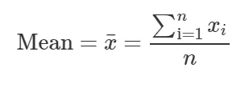
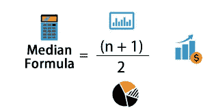
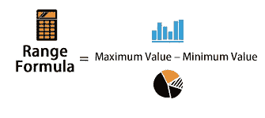
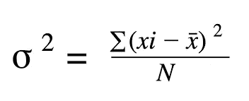
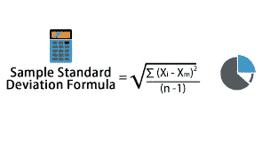
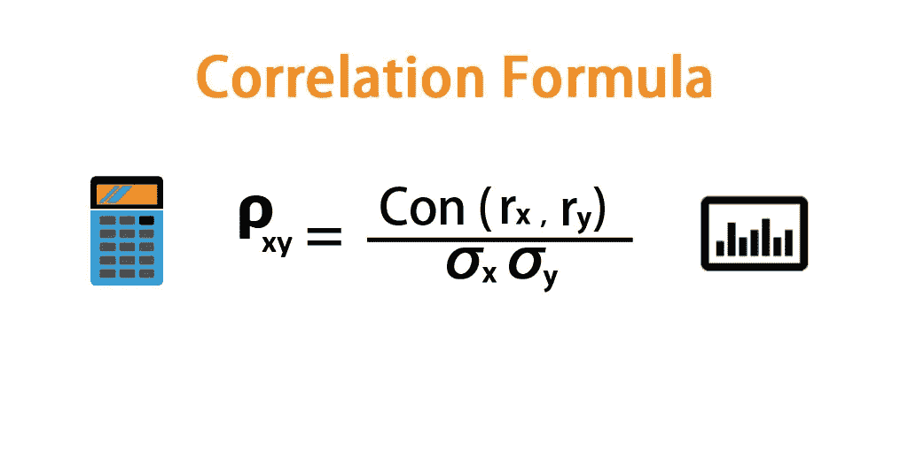

# 机器学习统计学简介

> 原文：<https://pub.towardsai.net/gentle-introduction-to-statistics-for-machine-learning-13356f2eb2bf?source=collection_archive---------1----------------------->

由 [Unsplash](https://unsplash.com?utm_source=medium&utm_medium=referral) 上的 [Edge2Edge 媒体](https://unsplash.com/@edge2edgemedia?utm_source=medium&utm_medium=referral)拍摄

# **什么是统计？**

统计学也可以定义为收集、分析和解释数据的科学。统计学是一个已经存在了很长时间的领域，也是每个数据科学家必须了解的领域。它涉及对数据的研究，以获得可操作的见解，用于决策。这是统计学最简单的定义。

在统计学中，有一些术语你必须熟悉，我将在这里定义其中的几个:

**1。** **构念:**构念是任何难以衡量的发生或事件。比如快乐的感觉，悲伤的感觉，还有你睡得有多好。所有这些事件都没有确定的测量方法。

**2。** **操作定义:**通常会引入操作定义，以便于定义构造。

**3。** **人口:**这是替角的人和事的总数

**4。** **样本:**样本是被研究人群的一部分

**5。** **变量:**这些是可能导致特定事件发生的因素。

6。 **假设:**这是描述变量之间关系的陈述

现在你已经知道了统计学领域的一些基本术语…

让我们回顾一下机器学习的定义。

机器学习是计算机从数据中学习模式并做出预测的能力。它使用数据科学技术来分析数据，统计学领域是数据科学的一个子集。机器学习中使用的许多技术都是通过统计领域实现的。

因此，统计学知识对于作为数据科学家的你来说非常重要，你要知道引擎盖下发生了什么。作为一名机器学习工程师，你可以在没有统计学知识的情况下建立模型，但对过程如何工作的良好理解对你的进步非常重要，对你的代码的可解释性也非常重要，因为公司不会雇用任何不能对他们的代码提供正确解释的人。他们更愿意雇用对他/她正在做的事情有正确理解的人。

# **分支机构统计**

统计主要分为:

1.描述统计学

2.推论统计

# **描述性统计**

由[卢克·切瑟](https://unsplash.com/@lukechesser?utm_source=medium&utm_medium=referral)在 [Unsplash](https://unsplash.com?utm_source=medium&utm_medium=referral) 上拍摄的照片

在描述性统计中，你主要是用数字和图表来组织和总结你的数据。例如，您可以将数据汇总成条形图、饼图、直方图等。

要使用图表描述数据，您可以利用以下内容:

*   条形图
*   线形图
*   柱状图
*   圆形分格统计图表

要使用数字描述您的数据，您主要使用以下内容:

1.中心的度量

2.离差的度量

## **中心测量**

集中趋势的度量是试图通过确定一组数据中的中心位置来对值进行分组的单个值。

中心有三种度量，它们是:

一.**的意思是**

特定数据的平均值是样本的总和除以样本总数。通常会受到异常值的影响。

平均值的公式为:

二。**中值**

中位数是数据的中间值。中位数的属性之一是，它通常不会像平均值那样受到异常值的影响

中位数的公式:

三。**模式**

该模式向我们展示了分布中出现次数最多的样本。

## 离差的度量

照片由[斯文·里德](https://unsplash.com/@starburst1977?utm_source=medium&utm_medium=referral)在 [Unsplash](https://unsplash.com?utm_source=medium&utm_medium=referral) 上拍摄

离差的度量有助于您确定数据点之间的距离。

我们有三种色散测量方法，即:

范围、方差、标准差

一、**范围**

这是分布中最大值和最小值之间的差值

该范围的公式为:

二。**方差**

这是样本平均值与总体平均值的所有方差之和。

方差公式:

三。**标准偏差**

这是方差的平方根

标准差的公式为:

## **经验法则**

在统计学中，我们遵循经验法则，即

> 68%的数据在分布平均值的一个标准偏差范围内
> 
> 95%的数据落在分布平均值的两个标准偏差内
> 
> 99.7%的数据落在分布平均值的三个标准偏差范围内。

经验法则在概率中有很多应用，但我不会深入这些应用，因为这些概念超出了本文的范围。

## **中心极限定理**

中心极限定理指出

> 随着试验次数的增加，观察概率的值接近理论概率。

**Z 得分**

z 得分在统计学中用于计算一个数字与平均值的标准差

# **推断统计**

照片由[斯科特·格雷厄姆](https://unsplash.com/@homajob?utm_source=medium&utm_medium=referral)在 [Unsplash](https://unsplash.com?utm_source=medium&utm_medium=referral) 上拍摄

统计学的这一分支对数据进行抽样以推断总体情况。在推断统计学中，你将学习估计以及如何从样本中获取总体信息。

在现实世界的问题中，对我们来说获取总人口可能有点困难，所以在大多数情况下我们利用样本。

# **相关性**

相关性帮助我们定义数据集中变量之间的关系。

作为一名数据科学家，了解自变量之间的相互关联程度非常重要，这样才能知道在特征工程过程中应该将哪些变量组合在一起，还必须知道自变量与因变量之间的关联方式。

正如我们在数学中有测量长度、质量、时间等的测量单位一样，我们在统计学中也有一个相关性的度量单位，叫做 ***【相关系数(r)***

它用于量化变量之间关系的强度

有一点你必须注意

> ***不相关并不意味着独立。相关性不等于因果关系。***

相关系数；

> *接近 1=大正相关*
> 
> *接近-1 =大负相关*
> 
> *接近 0=没有关系*

# 结论

我希望你已经能够很好地理解什么是统计，以及它对你这个数据科学家/机器学习工程师的重要性。

感谢所有激励我这样做的人。在 LinkedIn 和 Twitter 上与我联系，看看我们的关系有多好。