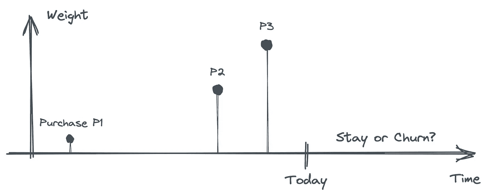
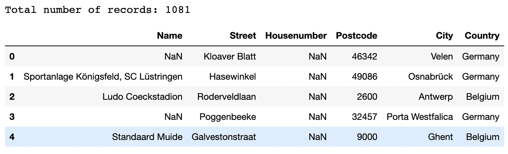
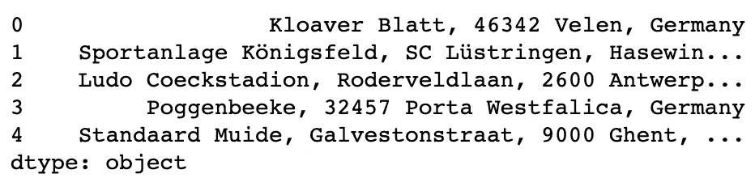
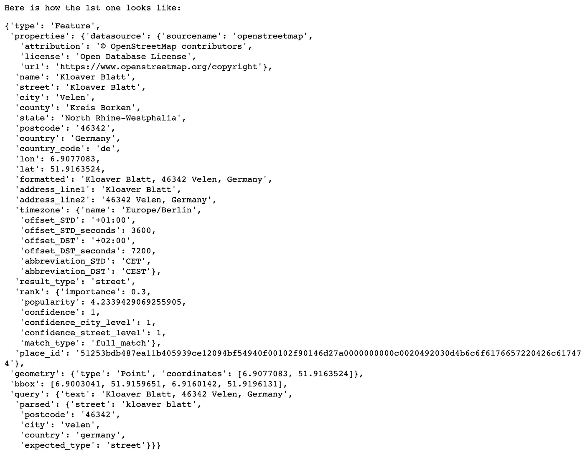
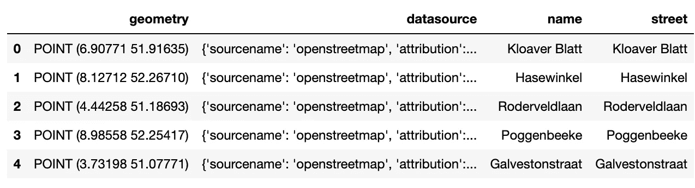
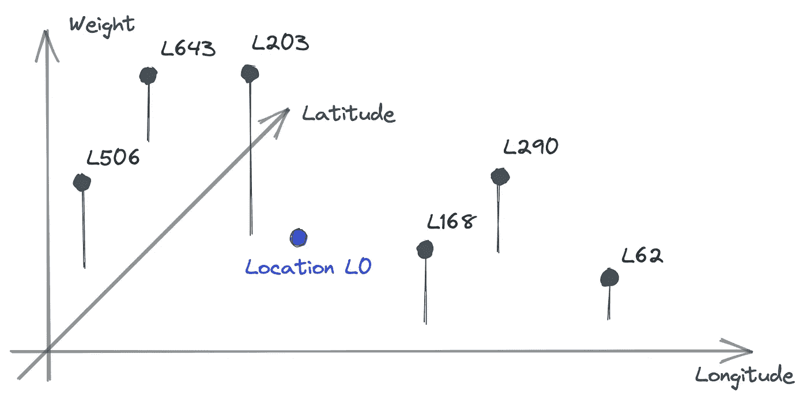
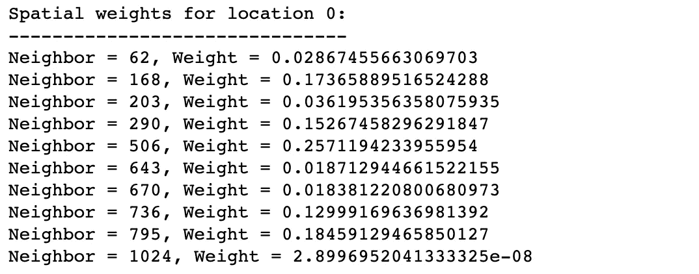
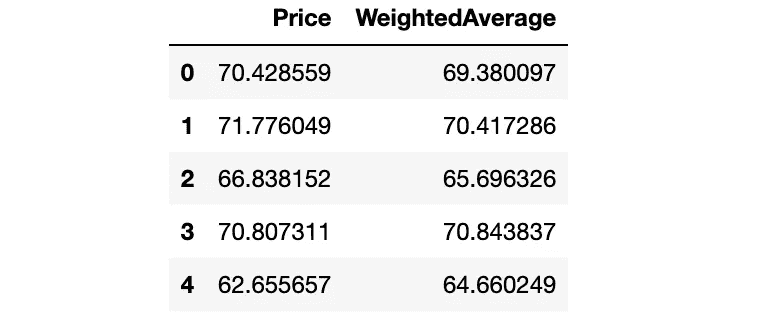
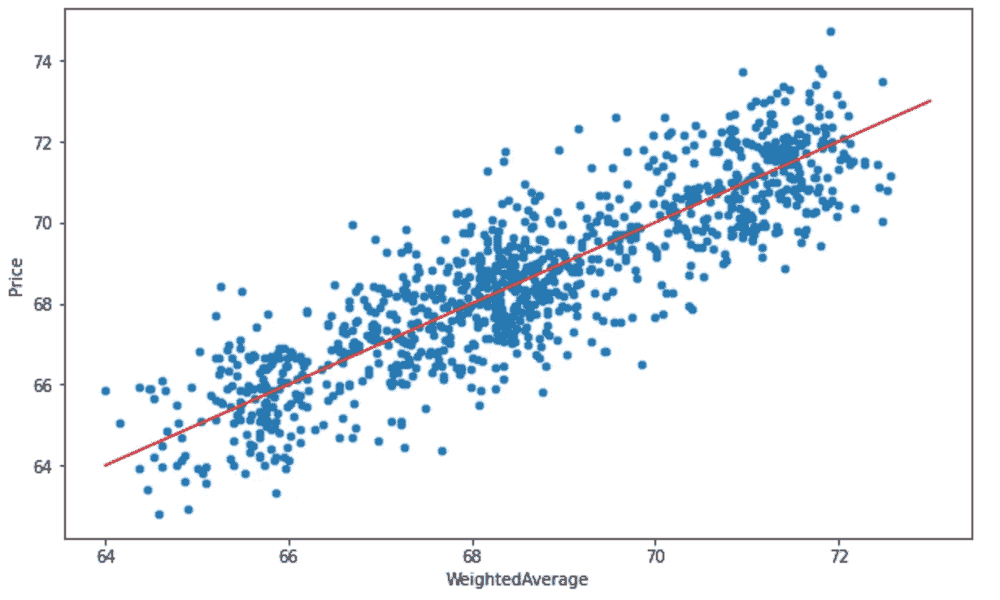

# 对数百万个位置进行地理编码而不会被起诉

> 原文：<https://pub.towardsai.net/geocode-millions-of-locations-without-being-sued-8a85e8cc8793?source=collection_archive---------0----------------------->

## 考虑到地理批处理和地理空间分析

指数时间平滑(ETS)是一种流行于时间序列预测社区的技术，它对来自越来越遥远的时间的信号进行加权处理。只要时间是问题的一部分，类似的方法在时间序列预测之外的预测模型中是标准的。你想预测客户流失吗？尝试使用过去购买金额的加权平均值。

来自越来越遥远的时代的信号的重要性逐渐减弱。这反映在使用过去购买量的加权平均值作为预测器的流失预测模型中。图片由作者使用 [Excalidraw](https://excalidraw.com/) 创建。

时间权重的地理空间等价物是空间权重矩阵。同样的想法也适用:计算加权平均值，权重取决于二维坐标系上的空间距离。但是，与时间不同，空间距离需要大量的前期工作。很可能，你从(结构化的)地址文本开始作为你的位置记录。那么，如何把它们放在一个坐标系上呢？

下面我们将使用经纬度坐标系。从文本到经纬度的转换称为地理编码。有几十个，如果不是几百个，地理编码服务提供商。但由于成本和法律原因，这一选择被证明是有风险的。

## 如果你不想被禁止或被起诉，请阅读许可证

选择地理服务提供商时最好要小心。Google Maps 和 Mapbox 是我们分析用例的两个突出而糟糕的选择，因为它们的限制性许可——不允许存储和重新分发结果。例如，Google 创建了检测滥用 API 的机制，在最好的情况下，会导致你的账户被封禁。因此，存储数百万地理编码供以后分析是不允许的。

幸运的是，一家名为 [Geoapify](https://geoapify.com/) 的初创公司填补了这个空白。这不仅仅是法律原因。它还与成本、使用舒适度(批处理)以及与开放数据和开源标准的良好集成有关。

## 为什么要为地理空间分析进行 Geoapify

简而言之，这就是我们选择 Geoapify 的原因:

*   我们需要在不破产的情况下对数百万条位置记录进行地理编码。Geoapify 以 50%的折扣提供批量地理编码。
*   Geoapify 通过友好的许可使用 OpenStreetMap 和其他开放数据源，以便我们可以存储分析结果。作为一个副作用，我们可以将我们的内部位置记录与像维基数据这样的开放数据源的丰富生态系统联系起来。
*   Geoapify 不仅仅是地理编码。它还提供地点详细信息、等值线、旅行距离等信息，其中大多数服务都以 50%的价格包含在它们的 Batch API 中。

从零成本开始使用 Geoapify 的服务，包括商业用途。他们的免费层允许每天批量地理编码 6k 个地址。在[geoapify.com](https://geoapify.com/)注册，立刻生成你的 API 密匙。

## 教程-用于批量地理编码的 GeoBatchPy 等

我们喜欢 Python 和命令行。当我们开始时，没有 Geoapify API 客户端满足我们的需求。所以，我们创建了 [GeoBatchPy](https://github.com/huels-originals/geobatchpy) 。

GeoBatchPy 是 Geoapify API 的 Python 客户端。它还附带了批处理 API 的命令行界面，当您需要处理大量位置时，该界面会大放异彩。你可以用`pip install geobatchpy`安装 PyPI 的最新版本。但是我们建议[创建一个新的 Conda 环境](https://geobatchpy.readthedocs.io/en/latest/install/)覆盖 [GeoPandas](https://geopandas.org/) 和 [PySAL](https://pysal.org/) 如果你想使用你的数据跟随下面的教程。

本教程介绍了如何将 GeoBatchPy 集成到地理空间分析工作流中，从简单的地址记录开始，然后进行批量地理编码，最后计算空间权重矩阵。我们以一个简单的分析用例结束。

## 第 1 部分—数据预处理

本教程的数据集由 1081 个体育场组成，主要分布在德国、比利时和荷兰。我们使用 Geoapify 的 Places API 生成数据。

作者创造的形象。

Geoapify 的地理编码服务接受自由文本搜索和结构化输入，后者只有在我们对数据质量非常有信心的情况下才有帮助。我在现实世界的结构化地址记录中看到过太多的数据质量问题。我的结论是去免费文本搜索。这里，我们将结构化数据解析为每行一个字符串。

作者创造的形象。

## 第 2 部分-地理编码

是时候对我们的地址进行地理编码了。您可以使用我们的 Python API 做到这一点，但是我们更喜欢命令行。首先，我们使用 Python 准备输入文件:

现在我们切换到 CLI。为了让下面两个命令工作，您需要设置您的`GEOAPIFY_KEY`环境变量或者在每个`geobatch`命令的末尾添加选项`--api-key <your-key>`。首先，我们通过以下方式向 Geoapify 服务器提交作业

`tutorial-geocode-urls.json`第一步的输出，是对下一步的输入:

处理我们的请求需要时间，这取决于请求大小、订阅计划以及 Geoapify 服务器的繁忙程度。

我们将结果转换成类似 Python 字典的 GeoJSON 的简化列表。

作者创造的形象。

GeoPandas 帮助我们将数据转换成表格格式。该方法将`geometry`解析成一个[形状优美的](https://github.com/shapely/shapely)几何对象，将所有的`properties`放入单独的列中，并忽略其余的。我们还将坐标参考系统(CRS)设置为“EPSG:4326”，这意味着几何图形的元组被解释为经度和纬度。

作者创造的形象。

## 第 3 部分—空间权重矩阵

我们将使用 PySAL 及其基于距离的方法来计算空间权重矩阵——py sal 提供了几种方法，每种方法都有自己的要求。基于距离的方法接受我们的地理编码数据框作为输入，并计算权重，默认情况下，权重随着距离的增加而线性衰减。

对于任何给定的位置 L0，我们识别其最近邻居的集合，并计算作为距离的函数的权重。空间权重矩阵由所有位置 L0 的所有权重组成，按行组织，目标位置 L0 的权重在对角线上。出于分析目的，我们将对角线权重设置为零，即作者使用 [Excalidraw](https://excalidraw.com/) 创建的图像。

我们对默认行为进行了三项更改:

*   参数`fixed=False`和`k=10`导致每个目标位置的衰减强度可变。这样，非零权重的数量在每个位置的邻域中都是`k=10`。
*   我们将对角线上的权重设为 0。这将每个目标位置从其具有非零权重的邻居集合中排除。这将与我们的用例相关。
*   设置属性`transform='R'`对任何给定目标位置的权重进行归一化，使得它们的总和等于 1。

位置 0 的邻居和相应权重的汇总，其中权重为正。通过构造，每组权重由 k=10 个邻居组成，并且每组权重之和等于 1—作者创建的图像。

## 第 4 部分—一个简单的分析用例

比方说，我们希望根据某个位置附近的房价来预测该位置每平方米的房价。我们重新使用上一节中的空间权重矩阵来计算加权平均值:

作者创造的形象。

下一幅图表明，加权平均值本身就是价格的无偏预测值。

已知位置价格及其邻域加权平均值的散点图。红线是对角线 Price = WeightedAverage —作者创建的图像。

现在，我们为什么将对角线权重设置为 0，将目标从其邻域权重中排除就变得很明显了。这样，我们可以用已知价格的邻居的加权平均值来预测任何新位置的价格。

在更现实的情况下，您可能希望在预测模型中考虑比邻近价格更多的因素，以反映邻近位置的显著变化。例如，如果一个位置直接暴露于来自交通的大量噪声，则两个相邻位置的定价可能非常不同。然后，加权平均值可以用作拟合我们数据的回归模型中的众多预测值之一。

## 结论和展望

大部分(还是全部？)企业出于日常运营目的处理地址数据。用于开发票、送货、拜访客户等。内部位置数据达到数千，如果不是数十万，位置记录非常快。利用相同的数据进行地理空间分析通常依赖于大量的准备工作，如地理编码。我们展示了如何使用 Geoapify 和我们的 Python 包来避免不必要的费用和法律风险——只需几行代码。几乎每个分析项目都有可能从地理空间维度中受益。

我们通过从时间等价开始来激励空间权重，这在分析空间中找到了广泛的适应性。这不仅仅是一个或另一个问题。模型可以结合时间和空间来解释这两者——首先，从时间距离上降低单个信号的权重。第二，在空间上组合那些暂时向下加权的信号。例如，当我们研究客户流失时，我们可以计算每个客户所在社区的平均忠诚度。我们识别过去每个搅拌器的日期和位置——这就是(二进制)信号。我们计算加权平均值时考虑了每个当前客户所在社区的活跃客户数量，并根据时间和空间距离进行了加权。例如，这表明客户是否生活在最近本地竞争加剧的地区——这是我们希望迅速采取行动的地方。