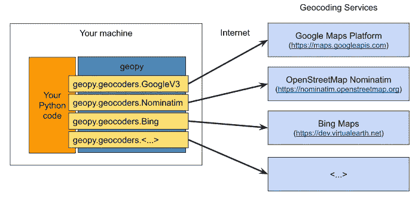

# Python 中的地理编码和反向地理编码

> 原文：<https://pub.towardsai.net/geocoding-and-reverse-geocoding-in-python-c0112b8679c2?source=collection_archive---------0----------------------->

## [编程](https://towardsai.net/p/category/programming)

## 如何从给定的地址获取纬度和经度，反之亦然

来源: [Unsplash](https://unsplash.com/photos/xv7DTjnx2YQ)

最近，我参加了一个预测房价的黑客马拉松。那是我第一次处理具有地理坐标- `latitude`和`longitude`的数据集。在这个黑客马拉松中，我了解了地理编码、反向地理编码和寻找两个坐标之间的距离。在本文中，您将学习这三种技术。

我们将在本文中使用`geopy`和`reverse_geocoder`库。让我们开始吧。

# **地理编码**

`Geocoding`是将地址转换成地理坐标(即经纬度)的过程。

地理编码由不同的服务提供商提供，如 nomim、Bing、Google 等。这些服务提供了可供任何人用于地理编码的 API。在这里，geopy 只是一个库，它在一个包中为许多不同的服务提供了这些实现。

来源: [GeoPy](https://geopy.readthedocs.io/en/stable/#geopy-is-not-a-service)

在下面的示例中，我们使用 namim 服务进行地理编码。结果存储在`location`变量中。然后，我们可以使用`location`获得所需的值，如纬度、经度等。`raw`方法返回一个包含所有返回值的字典，我们可以从`location.raw`访问所需的字段。

> 注意:不同的地理编码服务，如 nomim，Bing 都有自己的限制，定价，配额等。例如，Nominatim 是免费的，但是它可以处理的请求是有限制的。

# **反向地理编码**

`Reverse Geocoding`是将地理坐标(纬度&经度)转换为人类可读地址的过程。

注意，我们需要依次传递纬度和经度来反转函数。

另一个用于反向地理编码的备选库是`reverse_geocoder`。让我们看一个例子:

# 两个坐标之间的距离

假设您想要查找两个坐标之间的距离(即给定经纬度的两个位置之间的距离)，您可以使用 geopy 中的测地线函数来计算距离。

# 结论

我希望您已经很好地理解了在处理数据集中的纬度和经度时如何使用`geopy`、`reverse_geocoder`。

*阅读更多关于 Python 和数据科学的此类有趣文章，* [***订阅***](https://pythonsimplified.com/) *到我的博客*[***www.pythonsimplified.com***](http://www.pythonsimplified.com/)***。*** 你也可以通过 [**LinkedIn**](https://www.linkedin.com/in/chetanambi/) 联系我。

# 参考

 [## 欢迎来到 GeoPy 的文档！- GeoPy 2.0.0 文档

### geopy 是几种流行的地理编码 web 服务的 Python 客户端。geopy 使 Python 开发人员能够轻松…

geopy.readthedocs.io](https://geopy.readthedocs.io/en/stable/#)  [## 反向地理编码器

### 反向地理编码器获取纬度/经度坐标，并返回最近的城镇/城市。这个图书馆改进了一个…

pypi.org](https://pypi.org/project/reverse_geocoder/)